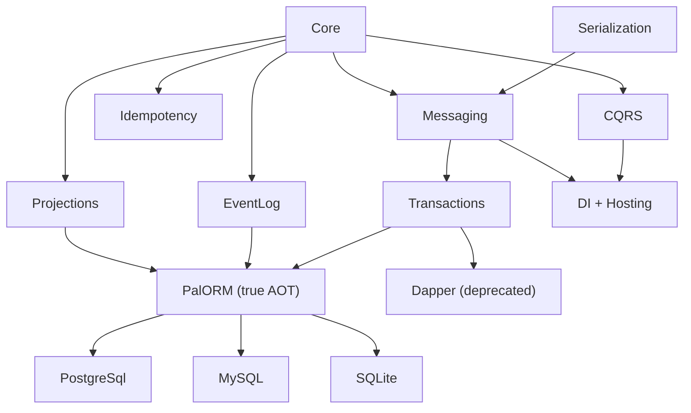

# Pal.DDD

**English** | [中文](README.md)

**A DDD/CQRS/Event Sourcing infrastructure framework for .NET 11 — zero runtime reflection, complete Native AOT pipeline, no over-abstraction.**

[](https://www.nuget.org/packages/PalDDD.Base)
[](https://dotnet.microsoft.com/)
[]()
[](docs/aot.md)
[](LICENSE)

---

Pal.DDD standardizes the equality semantics of Entity, allocation-free collection of domain events, lease-lock concurrency and dead-letter recovery of the Outbox, and compensation orchestration with timeout detection for Sagas — into 40 independent NuGet packages. It does not provide `IRepository<T>`, does not define `IIntegrationEvent`, and does not perform assembly scanning. Business code stays pure C#; the framework only delivers infrastructure.

Out of the box: **zero-reflection command dispatch · lease-lock concurrent Outbox · auto-compensating Sagas · immutable EventLog · resumable Projections · compile-time DDD compliance checks.**

---

## Core Values

### Complete Implementation of DDD Tactical Patterns

Full coverage of Entity / AggregateRoot / DomainEvent / ValueObject / SmartEnum / Specification / Saga / EventLog / Projection, with no over-abstraction — no `IRepository<T>`, no `IIntegrationEvent`, no assembly scanning.

DbContext *is* the Unit of Work + Repository. DomainEvent *is* the integration event. `AddPalCommandHandler<T>` replaces assembly scanning. The framework should not invent concepts to wrap existing ones — it should eliminate duplication, not add indirection.

### AOT as a First-Class Citizen

DIM bridging eliminates reflection, source generators register types, FrozenDictionary replaces dictionary lookups, and the three properties (`IsAotCompatible` / `IsTrimmable` / `VerifyReferenceAotCompatibility`) are made transparent for non-AOT projects.

`IsAotCompatible=true` is enforced across the core layer and the PalORM adapter layer. PalORM generates RowFactory/CommandFactory at compile time via source generators, achieving a fully Native AOT pipeline. Non-AOT-safe third-party dependencies (EF Core, Kafka, RabbitMQ) are isolated within adapter projects that explicitly declare `IsAotCompatible=false`. AOT is not an add-on — it is an architectural decision about startup latency, memory footprint, and deployment safety.

### Performance Contracts Engineered In

- **Zero-allocation fast path**: `ValueTask` + `IsCompletedSuccessfully` achieves zero heap allocation on synchronous completion
- **Zero-closure pipeline**: `PipelineStateMachine` replaces closure chains, only ~40B per request
- **Zero-copy reads**: `RehydrateFromBytes` assigns by reference, eliminating 2 `ToArray` calls
- **ref struct enumerator**: `DomainEventEnumerable` provides singly-linked-list O(1) append, zero-allocation foreach

### Architectural Constraints Enforced at Compile Time

38 compile-time diagnostics check domain model compliance: 15 strategic Roslyn analyzers (PDDD001-015) plus 23 source-generator diagnostics (PALID001-007 identity / PALMSG001-007 message registry / PALENUM001-009 smart enums). A DomainEvent not declared `sealed` → compile error. A ProcessManager missing `[BoundedContext]` → compile error. A message contract name that does not follow the lowercase-kebab convention → compile warning. Constraints no longer depend on documentation discipline or Code Review memory — the compiler replaces both.

---

## Comparison with Existing Solutions

| Solution | Positioning | Pal.DDD's Incremental Value |
|------|------|:---------------|
| **MediatR** | In-process command/query dispatch | Adds Outbox, Inbox, Saga, EventLog, Projection. Dispatch is the starting point, not the endpoint. |
| **MassTransit / NServiceBus** | Distributed message bus | Not bound to a specific transport. The Outbox adapts to any Broker via the `IMessageBroker` abstraction. Message ownership stays on the application side. |
| **EventStoreDB / Marten** | Event store | Provides the `IEventLog` abstraction; the storage layer can be swapped for Dapper or EF Core implementations. No vendor lock-in. |
| **Hand-written DDD** | Fully custom | Eliminates the repeated implementation of Entity, DomainEvent, Dispatcher, Outbox, and Saga in every project. Infrastructure should not be differentiating code. |

---

## Installation

### Option 1: Metapackage (recommended for a quick start)

```xml
<!-- L1 base metapackage: domain core + serialization + compression + source generation + compile-time analyzers -->
<PackageReference Include="PalDDD.Base" />

<!-- L2 full metapackage: CQRS + event log + idempotency + projections + messaging + transactions + DI -->
<PackageReference Include="PalDDD.Extension" />

<!-- Choose one persistence adapter as needed -->
<PackageReference Include="PalDDD.PalORM.Sqlite" />  <!-- or PostgreSql / MySql / Dapper -->
```

### Option 2: Reference packages on demand (precise dependency control)

```xml
<!-- Only the domain core -->
<PackageReference Include="PalDDD.Core" />

<!-- Add CQRS -->
<PackageReference Include="PalDDD.CQRS" />

<!-- Add Outbox/Saga transactions -->
<PackageReference Include="PalDDD.Transactions" />
<PackageReference Include="PalDDD.Transactions.EFCore" />

<!-- Add Kafka messaging -->
<PackageReference Include="PalDDD.Messaging.Kafka" />
```

### CLI Installation

```bash
# Metapackage approach
dotnet add package PalDDD.Base
dotnet add package PalDDD.Extension

# PalORM persistence — recommended, full-pipeline Native AOT (source generation + compile-time SQL, zero reflection)
dotnet add package PalDDD.PalORM.Sqlite          # or PostgreSql / MySql

# Dapper persistence — classic hand-written SQL (⚠️ no AOT support, being deprecated)
dotnet add package PalDDD.Dapper.PostgreSql

# Message brokers
dotnet add package PalDDD.Messaging.Kafka
dotnet add package PalDDD.Messaging.RabbitMQ
```

InMemory implementations cover all abstract interfaces, so unit tests and prototyping require no external dependencies.

### Scenario Recommendations

| Scenario | Recommended References |
|------|---------|
| Learning / Prototyping | Base + Extension + PalORM.Sqlite |
| Production microservice | Core + CQRS + Transactions + Transactions.EFCore + PalORM.PostgreSql + Messaging.Kafka |
| Domain model only | Core + Serialization |
| Simple CRUD API | Core + CQRS + Repository.EFCore + Hosting.AspNetCore |

---

## NuGet Package List (35 PalDDD packages + 5 third-party PalORM dependencies)

| Package | Version | Description |
|------|:--:|------|
| **PalDDD.Base** | 2.1.0 | L1 metapackage: Core + Serialization + Compression + SourceGen + Analyzers |
| **PalDDD.Extension** | 2.1.0 | L2 metapackage: CQRS + EventLog + Idempotency + Projections + Messaging + Transactions + DI |
| **PalDDD.Core** | 2.1.0 | Domain core: AggregateRoot / Entity / ValueObject / SmartEnum / DomainEvent / Specification |
| **PalDDD.Serialization** | 2.1.0 | Serialization abstractions: IMessageSerializer / MessageCatalog / MessageDescriptor |
| **PalDDD.Serialization.Evolution** | 2.1.0 | Message version evolution: Upcaster / Contract validation |
| **PalDDD.Serialization.MemoryPack** | 2.1.0 | MemoryPack binary serialization (zero reflection, AOT) |
| **PalDDD.Compression** | 2.1.0 | Compression abstractions: Brotli / GZip / Deflate (AOT-safe) |
| **PalDDD.Compression.Native** | 2.1.0 | Native compression: LZ4 / ZStandard (P/Invoke, not AOT-compatible) |
| **PalDDD.Core.SourceGen** | 2.1.0 | Source generators: IdentityGenerator / EnumGenerator / MessageRegistryGenerator |
| **PalDDD.Analyzers** | 2.1.0 | Roslyn analyzers: PDDD001-015 compile-time DDD governance diagnostics |
| **PalDDD.Analyzers.CodeFixes** | 2.1.0 | Code fixes: PDDD008/010/013/015 |
| **PalDDD.CQRS** | 2.1.0 | Command Query Responsibility Segregation: Dispatcher / Pipeline / Validation / Logging |
| **PalDDD.EventLog** | 2.1.0 | Event log abstractions: InMemoryEventLog + optimistic concurrency |
| **PalDDD.EventLog.EFCore** | 2.1.0 | EF Core event log: EventLogDbContext + global bit allocator |
| **PalDDD.Idempotency** | 2.1.0 | Idempotency abstractions: IdempotencyProcessor + InMemoryStore |
| **PalDDD.Idempotency.EFCore** | 2.1.0 | EF Core idempotency records: IdempotencyDbContext |
| **PalDDD.Projections** | 2.1.0 | Projection abstractions: ProjectionProcessor + Checkpoint + Replay |
| **PalDDD.Projections.EFCore** | 2.1.0 | EF Core projection checkpoint: ProjectionCheckpointDbContext |
| **PalDDD.Projections.EventLog** | 2.1.0 | EventLog replay source: rebuilds read models from event streams |
| **PalDDD.Messaging** | 2.1.0 | Message bus abstractions: MessageBrokerBase + DomainEventDispatcher |
| **PalDDD.Messaging.Kafka** | 2.1.0 | Kafka adapter: based on Confluent.Kafka 2.x |
| **PalDDD.Messaging.RabbitMQ** | 2.1.0 | RabbitMQ adapter: based on RabbitMQ.Client 7.x |
| **PalDDD.Transactions** | 2.1.0 | Transactions/Saga: Outbox/Inbox abstractions + InMemoryStore + background processors |
| **PalDDD.Transactions.EFCore** | 2.1.0 | EF Core transactions: Outbox/Inbox/SagaState DbContext |
| **PalDDD.DependencyInjection** | 2.1.0 | DI registration entry point: ServiceRegistration + unified AddPal extensions |
| **PalDDD.Repository.EFCore** | 2.1.0 | EF Core repository: UnitOfWork + DomainEvent interceptor |
| **PalDDD.Hosting.AspNetCore** | 2.1.0 | ASP.NET Core integration: exception middleware + health checks + Minimal API endpoints |
| **PalDDD.PalORM** | 2.1.0 | PalORM persistence core: 6 Store + UnitOfWork (true AOT + source generation) |
| **PalDDD.PalORM.PostgreSql** | 2.1.0 | PalORM PostgreSQL dialect: RETURNING / COPY |
| **PalDDD.PalORM.MySql** | 2.1.0 | PalORM MySQL dialect: BulkCopy / multi-value INSERT |
| **PalDDD.PalORM.Sqlite** | 2.1.0 | PalORM SQLite dialect: FTS5 / JSON1 |
| **PalDDD.Dapper** | 2.1.0 | Dapper persistence adapter (⚠️ AOT facade, being deprecated) |
| **PalDDD.Dapper.PostgreSql** | 2.1.0 | Dapper PostgreSQL enhancements: audit / JSONB / sharding / soft delete |
| **PalDDD.Dapper.MySql** | 2.1.0 | Dapper MySQL enhancements |
| **PalDDD.Dapper.Sqlite** | 2.1.0 | Dapper SQLite enhancements: TypeHandler / RowFactory / FTS5 |
| **PalORM.Core** | 5.4.0 | PalORM engine core: DataSession / Provider / RowFactory (underlying dependency of PalDDD.PalORM) |
| **PalORM.SourceGen** | 5.4.0 | PalORM source generator: compile-time RowFactory / CommandFactory generation (zero reflection) |
| **PalORM.PostgreSql** | 5.4.0 | PalORM PostgreSQL dialect Provider: RETURNING / COPY |
| **PalORM.MySql** | 5.4.0 | PalORM MySQL dialect Provider: BulkCopy / multi-value INSERT (5.4 adds resilience configureResilience callback) |
| **PalORM.Sqlite** | 5.4.0 | PalORM SQLite dialect Provider: FTS5 / JSON1 |

---

## Quick Start

### Domain Model

```csharp
using PalDDD.Core;
using ByteAether.Ulid;   // Framework source alias is PalUlid = ByteAether.Ulid.Ulid; examples use the real type

// Strongly-typed ID — generated at compile time, zero reflection
[GenerateId(typeof(Ulid))]
public readonly partial record struct OrderId;

// Aggregate root — singly-linked-list event storage, thread-safe
public sealed class Order : AggregateRoot<OrderId>
{
    public string CustomerName { get; private set; } = "";
    public decimal Amount { get; private set; }

    public static Order Create(string name, decimal amount)
    {
        var order = new Order(OrderId.New());   // AggregateRoot<TId> has only protected ctor(TId) — Id is read-only, fixed at construction
        order.RaiseEvent(new OrderCreated(order.Id, name, amount));
        return order;
    }

    public void Cancel(string reason)
        => RaiseEvent(new OrderCancelled(Id, reason));
}

// Domain event — sealed record + [GenerateMessage] source-generated registration
[GenerateMessage(Name = "ordering.order-created.v1")]
public sealed record OrderCreated(Ulid OrderId, string Name, decimal Amount)
    : DomainEvent, IDomainEvent
{
    static string IDomainEvent.EventName => "ordering.order-created.v1";
}

[GenerateMessage(Name = "ordering.order-cancelled.v1")]
public sealed record OrderCancelled(Ulid OrderId, string Reason)
    : DomainEvent, IDomainEvent
{
    static string IDomainEvent.EventName => "ordering.order-cancelled.v1";
}
```

### Command Handler

```csharp
using PalDDD.CQRS;

public sealed record CreateOrder(string Name, decimal Amount) : ICommand<OrderId>;

public sealed class CreateOrderHandler(IUnitOfWork uow) : ICommandHandler<CreateOrder, OrderId>
{
    public async ValueTask<OrderId> HandleAsync(CreateOrder cmd, CancellationToken ct)
    {
        var order = Order.Create(cmd.Name, cmd.Amount);
        await uow.SaveChangesAsync(ct);  // Transaction commit + atomic Outbox write
        return order.Id;
    }
}
```

### DI Registration and Dispatch

```csharp
// 1. Register the core stack (Dispatcher + Pipeline + Identity; serialization/analyzers still registered explicitly by their own packages)
services.AddPalCoreStack();

// 2. Register command handlers (compile-time type constants, no assembly scanning)
services.AddPalCommandHandler<CreateOrder, OrderId, CreateOrderHandler>();

// 3. Choose a persistence adapter (PalORM recommended for true AOT)
services.AddPalOrmSqlite(connectionString);    // or PostgreSql / MySql

// 4. Register the Outbox (atomic message row write within the transaction + background polling publisher)
services.AddPalOutbox();

// 5. Dispatch the command (⚠️ Handler registration is Host-driven — HandlerRegistrar scans and
//    registers handlers at Host startup; register via builder.Services and dispatch after app start.
//    Fetching the Dispatcher from a bare ServiceCollection and calling SendAsync throws
//    HandlerNotFound — see the Chinese tutorial §3 for a complete runnable example)
var orderId = await dispatcher.SendAsync(new CreateOrder("Alice", 99.9m));
```

---

## Best Practices

> The following practices highlight the core strengths of Pal.DDD: **zero-reflection AOT, compile-time governance, lease-lock concurrency, source-generator IDs**.

### 1. Strongly-Typed IDs: Compile-Time Generation, Zero Reflection, AOT-Safe

Pal.DDD uses a source generator to produce `From` / `New` / `Parse` / `JsonConverter` / `TypeConverter` at compile time — zero reflection at runtime.

```csharp
using ByteAether.Ulid;   // Framework source alias is PalUlid = ByteAether.Ulid.Ulid; examples use the real type

// ✅ [GenerateId] triggers the IdentityGenerator source generator
// Generates ISpanParsable + JsonConverter + TypeConverter at compile time
[GenerateId(typeof(Ulid))]         // Ulid (recommended, totally ordered)
public readonly partial record struct OrderId;

[GenerateId(typeof(Guid))]          // Guid
public readonly partial record struct CustomerId;

[GenerateId(typeof(int))]           // int (database auto-increment)
public readonly partial record struct OrderNumber;

// Usage: compile-time-generated methods are directly available
var id = OrderId.New();              // Ulid/Guid auto-generated
var parsed = OrderId.Parse("01HXY...", null);
var someUlid = Ulid.New();           // Underlying type matching [GenerateId(typeof(Ulid))]
var fromDb = OrderId.From(someUlid);
```

### 2. Compile-Time DDD Governance: 38 Diagnostics (15 Strategic Analyzers + 23 Source-Generator Diagnostics)

Pal.DDD does not rely on Code Review memory — **38 compile-time diagnostics** intercept non-compliant code: 15 strategic Roslyn analyzers (PDDD001-015) + 23 source-generator diagnostics (PALID001-007 identity / PALMSG001-007 message registry / PALENUM001-009 smart enums — v2.1.0 adds PALID007 accessibility chain and PALENUM009 containing-type partial).

```csharp
// ✅ DomainEvent must be sealed — PDDD012 compile error
public sealed record OrderCreated(...) : DomainEvent, IDomainEvent;

// ❌ Forgot sealed — direct compile error
public record OrderCreated(...) : DomainEvent, IDomainEvent;  // PDDD012

// ✅ Message name lowercase-kebab + .vN — PDDD009 compile warning
[GenerateMessage(Name = "ordering.order-created.v1")]

// ✅ ProcessManager must be annotated with [BoundedContext] — PDDD001 compile error (PDDD003 rejects non-compliant annotation shapes)
[BoundedContext("ordering")]
public sealed class OrderingProcessManager : Saga<OrderingState> { ... }

// ❌ [GenerateId] target missing partial — source generator fails directly
[GenerateId(typeof(Ulid))]
public readonly record struct OrderId;  // PALID002 (non-partial record struct; generated code cannot merge)
```

### 3. Lease-Lock Concurrent Outbox: Multi-Instance Without Duplicate Delivery

The Outbox uses database row-level lease locks to enable concurrent publishing across multiple instances — the `(LockedBy, LockedUntil)` pair acts as a fencing token (`LockedUntil` changes monotonically with each lease, no DDL column needed); once a lease expires, the stale worker's UPDATE is rejected on token mismatch. Zero message loss, zero duplication, no distributed lock required.

```csharp
// Registration: Outbox + background processor auto-polling
services.AddPalOrmPostgreSql(connectionString);
services.AddPalOutbox();

// Inside a command handler: SaveChangesAsync atomically writes the Outbox message row
// → DB transaction commits → OutboxProcessor acquires the lease in the background and publishes → IMessageBroker.PublishAsync
public async ValueTask<OrderId> HandleAsync(CreateOrder cmd, CancellationToken ct)
{
    var order = Order.Create(cmd.Name, cmd.Amount);
    await uow.SaveChangesAsync(ct);  // Transaction + atomic Outbox write
    return order.Id;                 // At-least-once delivery guaranteed for the message
}

// Publish-side token fencing (v2.1.0, unified across all three stacks): OutboxProcessor holds
// the lease snapshot (owner, lockedUntil) when calling MarkProcessed/MarkDead — the terminal-write
// SQL carries AND locked_by = @owner AND locked_until = @until as a dual guard: once the lease is
// re-acquired by another worker, the stale snapshot's UPDATE affects 0 rows (zero in-memory
// mutation) — a late marker from the old worker cannot override the new holder, closing both the
// duplicate-delivery and terminal-flip windows.

// Consumer-side idempotency: Inbox prevents duplicate processing
services.AddPalInbox();  // Composite unique constraint on (ConsumerName, MessageId)
```

### 4. Complete Native AOT Pipeline: PalORM Source-Generated SQL

PalORM generates RowFactory / CommandFactory at compile time — SQL is determined at compile time, with zero runtime reflection and zero `IL.Emit`. `PublishAot=true` verification passes.

```csharp
// ✅ PalORM — compile-time SQL generation, true AOT
services.AddPalOrmPostgreSql(connectionString);
// → INSERT ... ON CONFLICT DO NOTHING RETURNING id (PG single-statement atomic lease)
// → COPY bulk write
// → Source generator auto-generates Row DTO materialization code

// ⚠️ Dapper — AOT facade ([module:DapperAot] not enabled, runtime takes the classic reflection path; NoWarn IL3058 declaration-level)
// Use only to maintain existing Dapper code; new projects should use PalORM
```

### 5. Saga Compensation Orchestration: Explicit State Machine + Timeout Detection

Saga uses explicit state/event transition registration + FrozenDictionary lookup — no reflection dependency, AOT-safe. Supports three compensation strategies and automatic timeout detection.

```csharp
public sealed class OrderSaga : Saga<OrderSagaState>
{
    public OrderSaga()
    {
        // Register state transitions in the constructor via When (real API; there is no Configure method)
        When<PaymentCompleted>("Initial", new SagaStep(
            "CompletePayment",
            execute: (state, evt, ct) =>
            {
                state.CurrentState = "Paid";
                return ValueTask.FromResult(state);
            },
            compensate: (state, ct) =>
            {
                state.CurrentState = "Compensated_CompletePayment";
                return ValueTask.CompletedTask;
            },
            timeout: TimeSpan.FromMinutes(30)));    // Timeout auto-triggers compensation
    }
}

// DI registration (generic order: TState, TOrchestrator)
services.AddPalSaga<OrderSagaState, OrderSaga>();
// → SagaProcessor background polling + SagaTimeoutDetector timeout scanning
```

### 6. Zero-Allocation Hot Paths: Performance Contracts Engineered In

Zero allocation on the core path is not a comment claim — it is verified at runtime with `GC.GetAllocatedBytesForCurrentThread` assertions.

```csharp
using PalDDD.Core;

// ✅ DomainEvent foreach — ref struct enumerator, zero heap allocation
foreach (var e in aggregate.DomainEvents())  // DomainEventEnumerable: ref struct
    await handler(e, ct);

// ✅ FrozenDictionary lookup — O(1) zero reflection
[GenerateEnum]
public sealed partial class OrderStatus : SmartEnum<OrderStatus, string>
{
    public static readonly OrderStatus Pending = new("pending", "待处理");
    public static readonly OrderStatus Shipped = new("shipped", "已发货");
    public static readonly OrderStatus Delivered = new("delivered", "已送达");
    private OrderStatus(string value, string displayName) : base(value, displayName) { }
}

var status = OrderStatus.FromValue("pending");  // TValue=string, so FromValue's argument type is string

// Real AllocationContractTests assertion set (not claims):
// single event append ≤130B/iter (measured ~120B, budget with headroom) | foreach enumeration ≤100B
// | multiple appends without List reallocation | ClearDomainEvents zero-alloc | ValueObject Create zero-heap-alloc
```

### 7. InMemory Testing: Full-Pipeline Coverage With Zero External Dependencies

All abstract interfaces have InMemory implementations — unit tests require no database / Kafka / RabbitMQ.

```csharp
var services = new ServiceCollection();
services.AddPalCoreStack();
services.AddPalOutbox();     // InMemoryOutboxStore
services.AddPalInbox();      // InMemoryInboxStore
services.AddPalSaga<OrderSagaState, OrderSaga>();  // InMemorySagaStateStore

// ⚠️ Handler registration is driven by the Host (HandlerRegistrar scans and registers handlers at startup) —
// fetching the Dispatcher directly from a bare ServiceCollection and calling SendAsync will throw HandlerNotFound.
// For full examples including the Host bootstrap, see the Chinese README.md §7 (v65 correction).
```

### 8. Bounded Context Isolation: Compile-Time Annotation + Analyzer Enforcement

PalDDD uses `[BoundedContext]` to mark aggregate root ownership: PDDD001 (Error) enforces that ProcessManager/Saga must declare their context, and PDDD003 (Error) rejects non-compliant annotation shapes — preventing illegal references across domain boundaries.

```csharp
// ✅ Aggregate root annotated with BoundedContext — analyzer knows which domain it belongs to
[BoundedContext("ordering")]
public sealed class Order : AggregateRoot<OrderId> { ... }

[BoundedContext("inventory")]
public sealed class StockItem : AggregateRoot<StockItemId> { ... }

// ✅ ProcessManager must be annotated with BoundedContext — PDDD001 compile error
[BoundedContext("ordering")]
public sealed class OrderingSaga : Saga<OrderingState> { ... }

// ❌ Forgot annotation — direct compile error
public sealed class OrderingSaga : Saga<OrderingState> { ... }  // PDDD001
```

### 9. Multi-Tenancy: Session-Level Tenant Filter (PalORM `[TenantAware]`)

PalORM's `[TenantAware]` annotates the **entity class** (not a property) and pairs with `DataSession.WithTenant()` — regular queries on annotated entities automatically append `WHERE tenant_id = @value`: no interceptors, no hand-written conditions per SQL.

```csharp
using ByteAether.Ulid;
using PalORM;

// ✅ Class-level annotation on the Row DTO (real PalORM usage; DDL needs a tenant_id column —
//    the NOT NULL constraint requires it to be assigned before insert)
[TenantAware]
public sealed class OrderRow
{
    [Column("id")] public Ulid Id { get; init; }
    [Column("customer_name")] public string CustomerName { get; init; }
    [Column("tenant_id")] public string TenantId { get; init; }
}

// Set the tenant on the session → the query builder auto-appends the filter for annotated
// entities ([SoftDelete] soft-delete filtering uses the same mechanism)
await session.WithTenant("tenant-a");
var orders = await session.Query<OrderRow>()
    .Where(r => r.Status == "pending");   // generated SQL automatically contains AND tenant_id = @tenantFilter

// ⚠️ Exemption warning (PalORM contract): the raw-SQL entries QueryAsyncEnumerable /
// QueryMultipleAsync bypass automatic filtering — a tenant session can read all tenants' data
// through them. SQL must carry the tenant_id condition itself, or use the filter-protected
// query-builder entry.
```

### 10. Message Version Evolution: V1→V2 Auto-Upgrade (Framework Built-In)

Most DDD frameworks do not ship built-in message version evolution. PalDDD's `[GenerateMessage]` + Upcaster pipeline makes version migration a compile-time check + runtime automatic conversion.

```csharp
using ByteAether.Ulid;

// V1 message (legacy consumers still using it)
[GenerateMessage(Name = "ordering.order-created.v1")]
public sealed record OrderCreatedV1(Ulid OrderId, string Name, decimal Amount)
    : DomainEvent, IDomainEvent;

// V2 message (added ShippingAddress field)
[GenerateMessage(Name = "ordering.order-created.v2")]
public sealed record OrderCreatedV2(Ulid OrderId, string Name, decimal Amount, string ShippingAddress)
    : DomainEvent, IDomainEvent;

// Register Upcaster — V1 auto-upgrades to V2, consumers only handle V2
services.AddPalMessageContractVerification(builder => builder
    .Add<OrderCreatedV1, OrderCreatedV2>(
        OrderCreatedV1JsonTypeInfo, OrderCreatedV2JsonTypeInfo,
        v1 => new OrderCreatedV2(v1.OrderId, v1.Name, v1.Amount, "default-address"),
        sourceSchemaVersion: 1, targetSchemaVersion: 2));

// Contract integrity auto-validated on startup — missing upgrade path fails fast
```

### 11. EventLog Event Sourcing: Named Streams + Optimistic Concurrency + Global Monotonic Increase

EventLog provides the core storage for event sourcing — Named Streams + optimistic concurrency version control + a global position allocator guarantees event ordering.

```csharp
// Register EventLog
services.AddPalOrmPostgreSql(connectionString);
// EventLog is automatically available: PalOrmEventLog<PostgreSqlProvider>

// Append events (optimistic concurrency — throws EventStreamConcurrencyException on version conflict; expected version via factory, no int implicit conversion)
await eventLog.AppendAsync("order-01HXY...", ExpectedStreamVersion.Exact(3), new[]
{
    new EventData(OrderCreatedJsonTypeInfo, messageId, payload)
}, ct);

// Read a stream (IAsyncEnumerable — consume with await foreach)
await foreach (var e in eventLog.ReadStreamAsync("order-01HXY...", ct)) { ... }

// Global ordered read (IAsyncEnumerable — each event carries a globally increasing Position for Projection resumption)
await foreach (var e in eventLog.ReadAllAsync(checkpoint, ct)) { ... }
```

### 12. Projection Resumption: Rebuild Read Models via Full EventLog Replay

Projections consume events from EventLog and update read models; checkpoint persistence guarantees resumption from the interruption point after a restart — independent of the storage adapter.

```csharp
using PalDDD.Projections;

// Register the projection handler (IProjectionCheckpointStore is registered by the persistence adapter)
services.AddPalOrmPostgreSql(connectionString);
services.AddScoped<IProjectionHandler<OrderCreated>, OrderProjection>();

// Projection implementation — consumes events, updates read models (real API: IProjectionHandler<T>.ProjectAsync)
public sealed class OrderProjection : IProjectionHandler<OrderCreated>
{
    public string ProjectionName => "ordering.order-view";

    public ValueTask ProjectAsync(OrderCreated evt, ProjectionContext context, CancellationToken ct = default)
    {
        // Update the read model (materialized view / cache / search index)
        return _readStore.UpsertAsync(evt.OrderId, new OrderView(evt.Name, evt.Amount), ct);
    }
}

// Full replay — rebuild the read model from scratch (zero-downtime recovery)
await projectionRebuilder.RebuildAsync(ct);
// → Replays all events from Position=0 → Checkpoint auto-updates → Can resume from interruption
```

### 13. Idempotent Execution: Result Caching + Revision CAS Token (v2.1.0)

API/command idempotency: duplicate requests with the same `(OperationName, Key)` return the cached result instead of re-executing the handler. The **Revision CAS token** (v2.1.0) prevents side-effect re-execution after a Completed record is concurrently flipped; expired records are reclaimable (Retention = re-execution window).

```csharp
using PalDDD.Idempotency;

// Registration (no convenience extension — manual, mirroring the tutorial): IIdempotencyStore
// comes from the persistence adapter (EFCore IdempotencyDbContext / PalORM PalOrmIdempotencyStore /
// InMemory with zero dependencies)
services.AddScoped<IIdempotencyStore>(sp => sp.GetRequiredService<AppIdempotencyDbContext>());
services.AddScoped<IdempotencyProcessor>();   // ctor-injected store (+optional TimeProvider/IPalLogger)

// Real API: ExecuteAsync<TResult>(operationName, key, handler, serialize, deserialize)
var execution = await idempotency.ExecuteAsync(
    "order.create", orderKey,
    handler: async ct => await CreateOrderExpensivelyAsync(cmd, ct),   // runs only on first execution
    serializeResult: r => JsonSerializer.SerializeToUtf8Bytes(r, OrderJsonTypeInfo),
    deserializeResult: b => JsonSerializer.Deserialize<OrderResult>(b, OrderJsonTypeInfo)!,
    cancellationToken: ct);

// Three states (IdempotencyExecutionStatus):
switch (execution.Status)
{
    case IdempotencyExecutionStatus.Executed: // first real execution
        return execution.Result!;
    case IdempotencyExecutionStatus.Cached:   // duplicate request → cached payload (zero side effects)
        return execution.Result!;
    case IdempotencyExecutionStatus.Skipped:  // another request holds the lease → retry later
        return Results.Accepted();
}
```

### 14. Observability: Built-In OpenTelemetry, Zero Configuration

PalDDD ships `PalActivitySource` (11 Start methods) + `PalMetrics` (21 telemetry instruments) built into all critical paths — no manual instrumentation needed.

```csharp
// Framework auto-instrumentation (Activity names are semantic short names; Counters use the paldd. prefix):
// - Dispatcher.SendAsync → Activity "Command Dispatch"
// - OutboxProcessor → Activity "Outbox Process" + Counter "paldd.outbox.processed" / "paldd.outbox.failed"
// - SagaProcessor → Activity "Saga Transition"
// - IdempotencyProcessor → Activity "Idempotency Execute" + Counter "paldd.idempotency.executed" / "paldd.idempotency.cached"

// Your OpenTelemetry configuration only needs to reference the Activity Source:
services.AddOpenTelemetry()
    .WithTracing(t => t.AddSource("PalDDD"))      // Auto-captures all PalDDD Activities
    .WithMetrics(m => m.AddMeter("PalDDD"));       // Auto-captures all PalDDD Metrics

// Zero manual instrumentation — command dispatch latency, Outbox backlog, Saga compensation count all auto-reported
```

### 15. Incremental Migration: Phased Adoption From MediatR

Every NuGet package in PalDDD is independently installable — no need to rewrite the entire project at once.

```csharp
// Step 1: Introduce only domain primitives (replace hand-written Entity / ValueObject)
// dotnet add package PalDDD.Core
public sealed class Order : AggregateRoot<OrderId> { ... }  // Replaces hand-written Entity base class

// Step 2: Introduce CQRS dispatch (replace MediatR)
// dotnet add package PalDDD.CQRS
services.AddPalCommandHandler<CreateOrder, OrderId, CreateOrderHandler>();
// MediatR's IRequest → PalDDD's ICommand
// MediatR's IRequestHandler → PalDDD's ICommandHandler

// Step 3: Add Outbox / Saga / Projection as needed
// dotnet add package PalDDD.Transactions
services.AddPalOutbox();  // A capability MediatR lacks

// Incremental migration: legacy code keeps using MediatR, new features use PalDDD, both coexist without conflict
```

---

## Feature Matrix

### Domain Modeling
| Component | Implementation Strategy |
|------|---------|
| Entity / AggregateRoot | Singly-linked-list event storage, supports zero-allocation `foreach` enumeration, thread-safe event collection |
| DomainEvent | abstract base class + user-side `sealed` declarations (enforced by PDDD012), `static abstract EventName` compile-time contract (PDDD015 enforces consistency with `[GenerateMessage].Name`) |
| IValueObject / SmartEnum | Value-object abstraction (`IValueObject` structural equality, retained per ADR-003); `SmartEnum<TSelf,TValue>` FrozenDictionary O(1) FromValue (strongly-typed IDs go through the `[GenerateId]` source generator) |
| ISpecification | ExpressionVisitor parameter substitution composes And/Or/Not, fully compatible with EF Core LINQ |
| Diagnostics | Built-in `PalActivitySource` (11 Start methods) + `PalMetrics` (21 telemetry instruments) |

### Source Generators (compile-time, zero runtime reflection)
| Generator | Output | Companion diagnostics |
|-----------|--------|----------------------|
| IdentityGenerator | `New`/`From`/`Parse`/`TryParse` + JsonConverter/TypeConverter + ISpanParsable | PALID001-007 |
| EnumGenerator | SmartEnum registration code (FrozenDictionary O(1)) | PALENUM001-009 |
| MessageRegistryGenerator | MessageCatalog registration + GetTypeInfo bridge | PALMSG001-007 |

### CQRS
| Component | Implementation Strategy |
|------|---------|
| Dispatcher | FrozenDictionary routing table, `IHandler.HandleAsync` DIM bridging, zero MakeGenericType |
| PipelineBehavior | Open generic + closed generic dual registration (closed `AddPalPipelineBehaviors<TRequest, TResponse>()` keeps value-type pipelines Native AOT safe), built-in ValidationBehavior + LoggingBehavior |
| Handler Registration | `AddPalCommandHandler<T>` compile-time type constants, no assembly scanning |

### Messaging Infrastructure
| Component | Core Mechanism |
|------|---------|
| **Outbox** | Atomic message row write within the DB transaction, lease lock + token fencing ((LockedBy, LockedUntil) full-match rejects stale workers; LockedUntil monotonic, no DDL) for multi-instance concurrent publishing, exponential backoff retry, dead-letter queue + operation re-injection |
| **Inbox** | `(ConsumerName, MessageId)` composite unique constraint, four-state lifecycle (Pending → Processing → Processed/Failed), zombie record timeout reclaim |
| **Saga** | Explicit state/event transition registration → FrozenDictionary lookup, configurable retry+backoff, None/Backward/Forward compensation strategies (**compensation scope and order follow the execution sequence via ExecutedStepKeys, not registration order**), timeout detection background service (including AwaitingHumanDecision interrupted-state fallback scanning), manual approval interrupt+resume |
| **EventLog** | Named streams + optimistic concurrency (ExpectedStreamVersion), global monotonically increasing position, `RehydrateFromBytes` zero-copy read path |
| **Idempotency** | `(OperationName, Key)` idempotent execution + result payload caching (Executed/Cached/Skipped), **Revision CAS token** prevents side-effect re-execution after Completed flip (v2.1.0), expired records reclaimable |
| **Projection** | `IProjectionCheckpointStore` checkpoint persistence, `EventLogReplaySource<T>` full replay, independent of the storage adapter |

### Persistence Adapters
| Adapter | AOT | Database | Coverage |
|--------|:--:|:--:|------|
| **PalDDD.PalORM** | ✅ **True AOT** | PG / MySQL / SQLite | Outbox / Inbox / Saga / EventLog / Projection / **Idempotency** / UnitOfWork (source generation + compile-time SQL, [see adapter docs](docs/palorm-adapter.md)) |
| PalDDD.Dapper | ⚠️ Facade | PG / MySQL / SQLite | Outbox / Inbox / Saga / EventLog / Projection / UnitOfWork (`[module:DapperAot]` **not enabled** — runtime takes the classic reflection path; AOT compatibility is declaration-level only, see [aot.md](docs/aot.md); ADR-020 retirement roadmap) |
| ~~PalDDD.EntityFrameworkCore~~ | ❌ | ~~PG / MySQL / SQLite~~ | ~~Deprecated, source not committed (OBS-068), replaced by PalORM~~ |

### Database Dialect Extensions
| Dialect | Unique Capabilities |
|------|---------|
| PostgreSQL | **Multi-host failover** (Failover primary/standby merge) and **read/write splitting** (ReadWriteRouter dual data sources: writes to primary + load-balanced replica reads), COPY bulk write, Pipeline single-round-trip batching, LISTEN/NOTIFY event push, consistent-hashing sharding, JSONB operators, soft delete, audit log |
| MySQL | Multi-host failover (FailOver/RoundRobin/LeastConnections, explicit LoadBalance conflict fail-fast), InnoDB session tuning (lock timeout, isolation level, SQL mode), connection-pool session survival guidance (ConnectionReset=false) |
| SQLite | WAL mode + PRAGMA optimization (three-tier tuning), FTS5 full-text search, JSON1 functions |
| All three dialects | Connection-string fail-fast at registration time: IPv6 four-quadrant validation (bracketed/bare forms), embedded-port syntax interception, blank/duplicate host-list entry detection — config errors surface at registration, not at connection time (v2.1.0) |

---

## AOT Compatibility

| Layer | Status | Description |
|----|:--:|------|
| PalDDD.Core · Serialization · Compression | ✅ | `IsAotCompatible=true` globally inherited |
| PalDDD.CQRS · EventLog · Messaging · Projections · DI | ✅ | Same as above |
| **PalDDD.PalORM + Sqlite / PostgreSql / MySql** | ✅ **True AOT** | Source-generated RowFactory/CommandFactory, `PublishAot=true` verification passed ([PalOrmSample](samples/PalDDD.PalOrmSample/)) |
| PalDDD.Dapper + PostgreSql / MySql / Sqlite | ⚠️ Facade | Dapper.AOT `[module:DapperAot]` not enabled — runtime takes the classic reflection path; `<NoWarn>IL3058</NoWarn>` is declaration-level only (see [AOT guide](docs/aot.md) and [PalORM adapter docs](docs/palorm-adapter.md)) |
| PalDDD.Transactions | ❌ | Saga reflection exception (`IsAotCompatible=false`, see csproj) |
| ~~PalDDD.EntityFrameworkCore~~ | ❌ | ~~Deprecated~~ |
| PalDDD.Messaging.Kafka · RabbitMQ | ❌ | Confluent.Kafka / RabbitMQ.Client limitations |
| PalDDD.Hosting.AspNetCore | ❌ | FrameworkReference limitations |

See the [AOT guide](docs/aot.md) and [PalORM adapter docs](docs/palorm-adapter.md) for details.

---

## Performance

> ⚠️ The following are `--smoke` smoke-test data (Stopwatch + GC allocation, single run), not formal BenchmarkDotNet reports. BenchmarkDotNet has compatibility issues with the current .NET 11 Preview toolchain; the formal benchmark report will be added once BDN releases a compatible version. Smoke tests are for trend checking and cannot replace statistically rigorous benchmarking.

| Operation | Count | Elapsed | Allocation |
|------|:--:|------|:--:|
| PalValidationResult.Success | 1M | 15.06 ms | 88 B |
| SmartEnum.FromValue (FrozenDictionary) | 1M | 19.01 ms | 40 B |
| PalValidationResult.Failed | 1M | 43.41 ms | ~40 MB |
| Entity.RaiseEvent (singly-linked-list append) | 1M | 148.45 ms | ~128 MB |

Verification command:
```bash
dotnet run --configuration Release --project bench/PalDDD.Benchmarks -- --smoke
```

For full data and the BenchmarkDotNet historical baseline, see [Performance Records](docs/performance.md).

---

## Project Structure

```
src/                         36 source projects · Clean Architecture (folders match PalDDD.slnx)
├── Domain/                  Core · SourceGen · Analyzers · Analyzers.CodeFixes
├── App-Abstractions/        Serialization · Messaging · Compression · Compression.Native
├── App-Core/                CQRS · EventLog · Idempotency · Projections · Transactions
├── Infra-PalORM/            PalORM (true AOT) · PalORM.Sqlite · PalORM.PostgreSql · PalORM.MySql  ← recommended
├── Infra-Dapper/            Dapper · Dapper.PostgreSql · Dapper.MySql · Dapper.Sqlite (⚠️ being deprecated)
├── Infra-EFCore/            EventLog.EFCore · Idempotency.EFCore · Projections.EFCore · Repository.EFCore · Transactions.EFCore
├── Infra-Serialization/     Projections.EventLog · Serialization.Evolution · Serialization.MemoryPack
├── Infra-Messaging/         Messaging.Kafka · Messaging.RabbitMQ
├── Hosting/                 DependencyInjection · Hosting.AspNetCore
└── Metapackages/            Base · Extension · Prompts (Prompts is not a package, IsPackable=false)

test/                        16 test projects (TUnit) · 1202 measured tests (1153 local + 49 environment-dependent via CI Testcontainers — PalORM.Tests & Messaging.Integration.Tests need Docker)
bench/                       BenchmarkDotNet performance benchmarks
samples/                     PalOrmSample (AOT verification) · ECommerce · MinimalApi · AotSample
docs/                        Architecture · Usage guide · Tutorial · ADR
```

Dependency direction: Domain → App → Infra → Hosting. Each src/ project corresponds to an independent NuGet package (except Prompts, `IsPackable=false`).




---

## Documentation

| Document | Description |
|------|------|
| [Architecture](docs/architecture.md) | Layering, dependency direction, project responsibilities |
| [Usage Guide](docs/usage.md) | Complete code examples for each component |
| [Tutorial](docs/tutorial.md) | Build a DDD application from scratch |
| [PalORM Adapter](docs/palorm-adapter.md) | Six Stores / fixed classes / Row DTO mapping to PalORM |
| [Engineering Conventions](docs/conventions.md) | Naming, file organization, DI, AOT |
| [AOT Guide](docs/aot.md) | Native AOT rules and checklist |
| [Performance Records](docs/performance.md) | Benchmark data |
| [Testing](docs/testing.md) | Test pyramid, scenario matrix, BenchmarkDotNet config |
| [Release SOP](docs/release.md) | Versioning, package scope, CHANGELOG conventions & workflow |
| [Pitfalls](docs/pitfalls.md) | 82 real-world DDD/AOT/concurrency pitfalls |
| [Architecture Decisions](docs/decisions/) | 21 ADRs |
| [Changelog](CHANGELOG.md) | Version history (consumer-facing changes + engineering appendix) |

---

## FAQ

**What is the relationship with MediatR?**
MediatR is an in-process command dispatcher. Pal.DDD ships an equivalent Dispatcher + PipelineBehavior, and on top of that provides Outbox, Inbox, Saga, EventLog, and Projection. If you only need command dispatch, Pal.DDD's CQRS layer can replace MediatR. If you also need reliable message delivery and Saga orchestration, Pal.DDD provides the entire chain.

**What is the relationship with MassTransit?**
MassTransit is a distributed message bus bound to specific transports (RabbitMQ/Azure Service Bus/Amazon SQS). Pal.DDD's Outbox adapts to any Broker via the `IMessageBroker` abstraction — you can inject MassTransit, raw RabbitMQ, Kafka, or an InMemory implementation. The framework does not bind to a transport.

**What is the relationship with EF Core? Coexist or replace?**
Coexist. Pal.DDD does not replace EF Core — the two solve problems at different layers. EF Core handles object-relational mapping and queries; Pal.DDD handles DDD tactical patterns (Entity, DomainEvent, CQRS dispatch, Outbox delivery, Saga orchestration). Pal.DDD provides three sets of persistence adapters — PalORM (recommended, true AOT), Dapper (being deprecated), and EF Core — and the choice depends on your AOT requirements and query complexity.

**Can it be used in existing projects? Incremental adoption?**
Yes. Every NuGet package in Pal.DDD is independently installable. You can start with `PalDDD.Base` (domain primitives), gradually introduce the CQRS Dispatcher alongside your existing Service layer, and add Outbox or Saga as needed. There is no need to rewrite the entire project at once.

**Why target only net11.0?**
It relies on .NET 11 static features (JsonSerializerContext source-generation enhancements, Runtime Async state machine optimizations, new AOT analyzers); multi-targeting is technically infeasible. See [ADR-005](docs/decisions/005-net11-single-target.md) for details.

**How to choose between Dapper and PalORM?**
If you need Native AOT deployment (microservices, CLI tools, edge computing) → choose **PalORM** (recommended, source generation + compile-time SQL, true AOT). If you are maintaining existing hand-written Dapper SQL code → choose Dapper (⚠️ AOT facade, being deprecated). The EF Core adapter is for Repository/Outbox/Inbox/Saga DbContext scenarios. The three can be mixed in the same project — for example, PalORM for the write path (Outbox/Saga) and EF Core for the read path (Projection).

**What are the known limitations?**
Does not support .NET 8/9/10 (single target net11.0). Three AOT limitations (honestly declared via source `[RequiresDynamicCode]`): ① Saga ChildSaga child-flow dispatch (`MakeGenericMethod`/`MakeGenericType`, see `Saga.cs`) and ② dynamic event routing share the same root; ③ `ISpecification.Compile()` expression-tree compilation is unsupported under Native AOT — in AOT scenarios use `ToExpression()` and pass it to your query provider instead. No built-in EventStore snapshot mechanism — projects that need a snapshot strategy must implement it themselves.

**Who is using it in production?**
Pal.DDD is currently at version v2.1.0 (tag v2.1.0 published; CI green after 74 rounds of full-repo review clearance). The core layers (Entity, DomainEvent, CQRS Dispatcher, Outbox, Inbox) have been validated in the integration test suites of multiple internal projects, with test coverage of 1202 measured cases (16 projects: 1153 local + 49 environment-dependent executed by CI Testcontainers — v2.1.0 measured baseline). You are welcome to try it in non-production environments and provide feedback.

---

## License

[GNU Affero General Public License v3.0 or later](LICENSE)

Copyright (C) 2026 PalDDD

This project uses the AGPL-3.0-or-later license. AGPL v3 adds Section 13 (network interaction clause) on top of GPL v3 — when providing services over a network, you must make the complete source code of the modified version available to users. See the [LICENSE](LICENSE) file or <https://www.gnu.org/licenses/agpl-3.0.html> for details.
