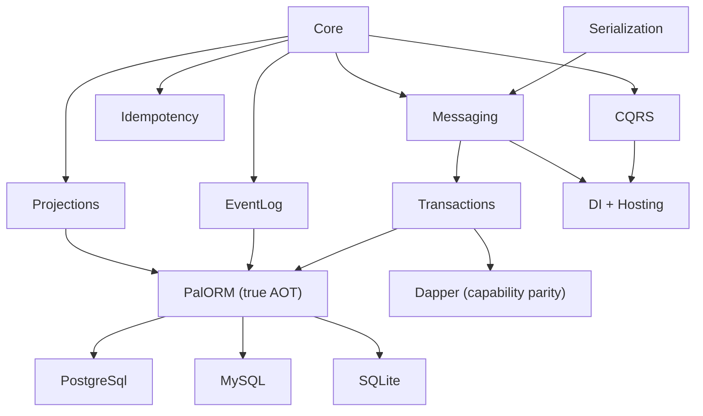

# Pal.DDD

**English** | [中文](README.md)

**A DDD/CQRS/Event Sourcing infrastructure framework for .NET 11: zero runtime reflection, complete Native AOT pipeline, no over-abstraction.**

[](https://www.nuget.org/packages/PalDDD.Base)
[](https://dotnet.microsoft.com/)
[](https://github.com/yuebo119/PalDDD/actions/workflows/ci.yml)
[](docs/aot.md)
[](LICENSE)

---

Pal.DDD standardizes the equality semantics of Entity, allocation-free collection of domain events, lease-lock concurrency and dead-letter recovery of the Outbox, and compensation orchestration with timeout detection for Sagas — into 35 independent NuGet packages (plus 5 third-party PalORM engine packages; see the [Package List](#package-list)). It does not provide `IRepository<T>`, does not define `IIntegrationEvent`, and does not perform assembly scanning: business code stays pure C#, and the framework only delivers infrastructure.

| NuGet packages | Compile-time diagnostics | Persistence stacks | Measured tests |
|:---:|:---:|:---:|:---:|
| **35** | **38** | **3** | **1502**¹ |

¹ 16 test projects, full-suite local measurement on 2026-09-25: 1434 passed + 68 skipped — 60 Docker-dependent (PalORM multi-dialect 46 + Integration 14, executed by CI Testcontainers) + 8 unreachable local broker prechecks; PalORM.Tests and Messaging.Integration.Tests require Docker.

---

## Contents

- [Features](#features)
- [Comparison with Existing Solutions](#comparison-with-existing-solutions)
- [Installation](#installation)
- [Quick Start](#quick-start)
- [Usage](#usage)
- [Performance](#performance)
- [AOT Compatibility](#aot-compatibility)
- [Feature Matrix](#feature-matrix)
- [Package List](#package-list)
- [Project Structure](#project-structure)
- [Documentation](#documentation)
- [FAQ](#faq)
- [Contributing](#contributing)
- [License](#license)

---

## Features

**Complete DDD tactical patterns, no over-abstraction**. Full coverage of Entity / AggregateRoot / DomainEvent / ValueObject / SmartEnum / Specification / Saga / EventLog / Projection. DbContext *is* the Unit of Work + Repository; DomainEvent *is* the integration event; `AddPalCommandHandler<T>` replaces assembly scanning. The framework eliminates duplication instead of adding indirection.

**AOT as a first-class citizen**. `IsAotCompatible=true` is enforced across the core layer; PalORM generates RowFactory/CommandFactory at compile time via source generators, achieving a fully Native AOT pipeline (`PublishAot=true` verified); non-AOT-safe third-party dependencies (EF Core, Kafka, RabbitMQ) are isolated within adapter projects that explicitly declare `IsAotCompatible=false` (see [AOT Compatibility](#aot-compatibility)). AOT is not an add-on — it is an architectural decision about startup latency, memory footprint, and deployment safety.

**Architectural constraints enforced at compile time**. 38 compile-time diagnostics check domain-model compliance: 15 strategic Roslyn analyzers (PDDD001-015) plus 23 source-generator diagnostics (PALID001-007 / PALMSG001-007 / PALENUM001-009). A DomainEvent not declared `sealed`, a ProcessManager missing `[BoundedContext]`, or a message contract name that violates the lowercase-kebab convention fails at compile time. Constraints do not depend on documentation discipline or Code Review memory.

**Lease-lock concurrent Outbox**. Message rows are written atomically within the database transaction; row-level leases on `(LockedBy, LockedUntil)` plus token fencing enable multi-instance concurrent publishing: once a lease expires, the stale worker's UPDATE is rejected on token mismatch — zero loss, zero duplication, no distributed lock. Dead-letter queue with operation re-injection and exponential-backoff retry.

**Zero-allocation hot paths**. ref struct singly-linked-list event enumerator (zero-allocation foreach), FrozenDictionary routing, ValueTask + `IsCompletedSuccessfully` zero-heap synchronous completion. Zero allocation is not a comment claim: AllocationContractTests assert budgets at runtime with `GC.GetAllocatedBytesForCurrentThread` (single event append ≤130B/iter, measured ~120B).

**Built-in observability**. `PalActivitySource` (11 Start methods) + `PalMetrics` (23 telemetry instruments) are pre-embedded on critical paths; your OpenTelemetry configuration only needs to reference the Source to capture everything (command dispatch / Saga transition Activities are reserved, not yet wired).

## Comparison with Existing Solutions

| Solution | Positioning | Pal.DDD's Incremental Value |
|------|------|:---------------|
| **MediatR** | In-process command/query dispatch | Adds Outbox, Inbox, Saga, EventLog, Projection. Dispatch is the starting point, not the endpoint. |
| **MassTransit / NServiceBus** | Distributed message bus | Not bound to a specific transport. The Outbox adapts to any Broker via the `IMessageBroker` abstraction. Message ownership stays on the application side. |
| **EventStoreDB / Marten** | Event store | Provides the `IEventLog` abstraction; the storage layer can be swapped for Dapper or EF Core implementations. No vendor lock-in. |
| **Hand-written DDD** | Fully custom | Eliminates the repeated implementation of Entity, DomainEvent, Dispatcher, Outbox, and Saga in every project. Infrastructure should not be differentiating code. |

## Installation

Requirement: .NET SDK 11.

```bash
# Metapackages (recommended for a quick start)
# L1 base metapackage: domain core + serialization + compression + source generation + compile-time analyzers
dotnet add package PalDDD.Base
# L2 full metapackage: CQRS + event log + idempotency + projections + messaging + transactions + DI
dotnet add package PalDDD.Extension

# Pick one persistence adapter
dotnet add package PalDDD.PalORM.Sqlite       # recommended, full-pipeline Native AOT (or PostgreSql / MySql)
dotnet add package PalDDD.Dapper.PostgreSql   # classic hand-written SQL (Dapper.AOT interceptors fully enabled)
# Message brokers (optional)
dotnet add package PalDDD.Messaging.Kafka
dotnet add package PalDDD.Messaging.RabbitMQ
```

Verify with `dotnet list package` — the PalDDD packages should be listed. All abstract interfaces have InMemory implementations, so unit tests and prototyping require no external dependencies.

| Scenario | Recommended References |
|------|---------|
| Learning / Prototyping | Base + Extension + PalORM.Sqlite |
| Production microservice | Core + CQRS + Transactions + Transactions.EFCore + PalORM.PostgreSql + Messaging.Kafka |
| Domain model only | Core + Serialization |
| Simple CRUD API | Core + CQRS + Repository.EFCore + Hosting.AspNetCore |

For precise dependency control, skip the metapackages and reference individual packages from the [Package List](#package-list) (XML form: `<PackageReference Include="PalDDD.Core" />`).

## Quick Start

### Domain Model

```csharp
using PalDDD.Core;
using ByteAether.Ulid;   // Framework source alias is PalUlid = ByteAether.Ulid.Ulid; examples use the real type

// Strongly-typed ID — generated at compile time, zero reflection
[GenerateId(typeof(Ulid))]
public readonly partial record struct OrderId;

// Aggregate root — singly-linked-list event storage, thread-safe
public sealed class Order : AggregateRoot<OrderId>
{
    public string CustomerName { get; private set; } = "";
    public decimal Amount { get; private set; }

    public static Order Create(string name, decimal amount)
    {
        var order = new Order(OrderId.New());   // AggregateRoot<TId> has only protected ctor(TId) — Id is read-only, fixed at construction
        order.RaiseEvent(new OrderCreated(order.Id, name, amount));
        return order;
    }

    public void Cancel(string reason)
        => RaiseEvent(new OrderCancelled(Id, reason));
}

// Domain event — sealed class + init properties + [GenerateMessage] source-generated registration
// ⚠️ The host must be a class: a record cannot inherit the non-record DomainEvent (CS8864 compile error),
//    and a class host must be annotated [BoundedContext] (PDDD001 Error)
[BoundedContext("ordering")]
[GenerateMessage(Name = "ordering.order-created.v1")]
public sealed class OrderCreated : DomainEvent, IDomainEvent
{
    public Ulid OrderId { get; init; }
    public string Name { get; init; } = "";
    public decimal Amount { get; init; }
    static string IDomainEvent.EventName => "ordering.order-created.v1";  // hand-written; must match Name (PDDD015)
}

[BoundedContext("ordering")]
[GenerateMessage(Name = "ordering.order-cancelled.v1")]
public sealed class OrderCancelled : DomainEvent, IDomainEvent
{
    public Ulid OrderId { get; init; }
    public string Reason { get; init; } = "";
    static string IDomainEvent.EventName => "ordering.order-cancelled.v1";
}
```

### Command Handler

```csharp
using PalDDD.CQRS;

public sealed record CreateOrder(string Name, decimal Amount) : ICommand<OrderId>;

public sealed class CreateOrderHandler(IUnitOfWork uow) : ICommandHandler<CreateOrder, OrderId>
{
    public async ValueTask<OrderId> HandleAsync(CreateOrder cmd, CancellationToken ct)
    {
        var order = Order.Create(cmd.Name, cmd.Amount);
        await uow.SaveChangesAsync(ct);  // Transaction commit + atomic Outbox write
        return order.Id;
    }
}
```

### DI Registration and Dispatch

```csharp
// 1. Register the core stack (Dispatcher + Pipeline + Identity; serialization/persistence/brokers are
//    NOT included — register them explicitly from their own packages, see AddPalCoreStack remarks)
services.AddPalCoreStack();

// 2. Register command handlers (compile-time type constants, no assembly scanning)
services.AddPalCommandHandler<CreateOrder, OrderId, CreateOrderHandler>();

// 3. Choose a persistence adapter (PalORM recommended for true AOT)
services.AddPalOrmSqlite(connectionString);    // or PostgreSql / MySql

// 4. Register the Outbox (atomic message row write within the transaction + background polling publisher)
services.AddPalOutbox();

// 5. Dispatch the command (⚠️ Handler registration is Host-driven — HandlerRegistrar scans and
//    registers handlers at Host startup; register via builder.Services and dispatch after app start.
//    Fetching the Dispatcher from a bare ServiceCollection and calling SendAsync throws
//    HandlerNotFound — see the tutorial §3 for a complete runnable example)
var orderId = await dispatcher.SendAsync(new CreateOrder("Alice", 99.9m));
```

For a step-by-step path from scratch, see the [Tutorial](docs/tutorial.md).

## Usage

The five most common scenarios follow. Complete code examples for every component are in the [Usage Guide](docs/usage.md).

### Outbox: Lease-Lock Concurrency, Multi-Instance Without Duplicate Delivery

```csharp
// Registration: Outbox + background processor auto-polling
services.AddPalOrmPostgreSql(connectionString);
services.AddPalOutbox();   // ⚠️ Registers processor/Options ONLY — Store/serializer/Catalog/Broker are
                           // registered by the caller (see usage.md "Use Outbox")

// Command handler: the interceptor atomically writes the Outbox message row on DB commit;
// OutboxProcessor acquires leases in the background and publishes
public sealed class CreateOrderHandler(IOrderRepository orders) : ICommandHandler<CreateOrder, OrderId>
{
    public async ValueTask<OrderId> HandleAsync(CreateOrder cmd, CancellationToken ct)
    {
        var order = Order.Create(cmd.Name, cmd.Amount);
        orders.Add(order);                          // ⚠️ explicit Add required — the interceptor only sees tracked entities
        await orders.SaveChangesAsync(ct).ConfigureAwait(false);
        return order.Id;                            // At-least-once delivery guaranteed
    }
}
// ⚠️ Stack semantics: interceptor Outbox writes are EF Core stack (Repository.EFCore) behavior; the
// PalORM stack's UnitOfWork.SaveChangesAsync has no ChangeTracker (no-op) — the PalORM path adds
// outbox messages explicitly on the business side or mixes stacks (ADR-020: EF Core write path +
// PalORM read path is the official combination).

// Publish-side token fencing (unified across all three stacks): OutboxProcessor holds the lease
// snapshot (owner, lockedUntil) when calling MarkProcessed/MarkDead — the terminal-write SQL carries
// AND locked_by = @owner AND locked_until = @until as a dual guard: once the lease is re-acquired by
// another worker, the stale snapshot's UPDATE affects 0 rows; a late marker cannot override the new holder.

// Consumer-side idempotency: Inbox prevents duplicate processing
services.AddPalInbox();  // Composite unique constraint on (ConsumerName, MessageId)
```

### Saga: Explicit State Machine + Compensation Orchestration + Timeout Detection

> ⚠️ **Dapper persistence snapshot is mandatory**: without a registered source-generated `JsonTypeInfo<TState>`, `DapperSagaStateStore<TState>`'s `SaveChangesAsync` fails fast with an exception (earlier versions silently wrote business fields as NULL; that data-loss defect is closed). Register via `services.AddPalDapperSagaSnapshot(jsonTypeInfo)`. See [usage.md](docs/usage.md).

```csharp
public sealed class OrderSaga : Saga<OrderSagaState>
{
    public OrderSaga()
    {
        // Policy configuration (template-mandated; defaults are Backward/3)
        CompensationPolicy = CompensationPolicy.Backward;   // reverse compensation — scope/order follow the execution sequence (ExecutedStepKeys)
        MaxRetries = 3;

        // Register state transitions in the constructor via When (real API; no Configure method)
        // Note: the execute lambda's state parameter is the base SagaState — cast to access subclass members
        When<PaymentCompleted>("Initial", new SagaStep(
            "CompletePayment",
            execute: (state, evt, ct) =>
            {
                state.CurrentState = "Paid";
                return ValueTask.FromResult(state);
            },
            compensate: (state, ct) =>
            {
                state.CurrentState = "Compensated_CompletePayment";
                return ValueTask.CompletedTask;
            },
            timeout: TimeSpan.FromMinutes(30)));    // Timeout auto-triggers compensation
    }
}

// DI registration (generic order: TState, TOrchestrator)
services.AddPalSaga<OrderSagaState, OrderSaga>();
// → SagaProcessor background polling + SagaTimeoutDetector timeout scanning
```

### EventLog and Projection: Event Sourcing with Resumable Checkpoints

EventLog provides named streams + optimistic concurrency + a global monotonically increasing position; Projections consume events from the EventLog to rebuild read models, with checkpoint persistence guaranteeing resumption after restart.

```csharp
// Append events (optimistic concurrency — throws EventStreamConcurrencyException on conflict)
// EventData has a 7-parameter ctor (audit is required non-null):
var result = await eventLog.AppendAsync("order-01HXY...", ExpectedStreamVersion.NoStream, new[]
{
    new EventData(
        PalUlid.New(),                                  // eventId
        "ordering.order-created.v1", 1, "application/json",
        payload, ReadOnlyMemory<byte>.Empty,
        EventAuditMetadata.Capture(actorId: "user-123", reason: "submit order", correlationId: corrId))
}, ct);
// First write uses NoStream; subsequent appends use ExpectedStreamVersion.Exact(result.LastStreamVersion)

// Read a stream (IAsyncEnumerable)
await foreach (var e in eventLog.ReadStreamAsync("order-01HXY...", ct)) { ... }

// Global ordered read (each event carries a globally increasing Position for Projection resumption)
await foreach (var e in eventLog.ReadAllAsync(checkpoint, ct)) { ... }
```

```csharp
using PalDDD.Projections;

// Projection implementation — must be [BoundedContext]-annotated (PDDD004 Error, IProjectionHandler implementations)
[BoundedContext("ordering")]
public sealed class OrderProjection : IProjectionHandler<OrderCreated>
{
    public string ProjectionName => "ordering.order-view";

    public ValueTask ProjectAsync(OrderCreated evt, ProjectionContext context, CancellationToken ct = default)
        => _readStore.UpsertAsync(evt.OrderId, new OrderView(evt.Name, evt.Amount), ct);
}
// Registration: plain DI for the handler + checkpoint store registered by the persistence adapter
// Checkpoint semantics: (ProjectionName, SourceName, Position) composite key + monotonic Revision token

// Two replay modes: ReplayAsync incremental (recommended safe mode — old data intact on failure)
// vs RebuildAsync full rebuild
await projectionRebuilder.ReplayAsync(ct);    // resume incremental events from the Checkpoint
await projectionRebuilder.RebuildAsync(ct);   // ⚠️ clears the read model first, then replays in full
```

### Compile-Time DDD Governance: Errors Stopped at Compile Time

```csharp
// ✅ Domain event host must be a sealed class (a record inheriting the non-record DomainEvent fails CS8864)
//    A class host must be [BoundedContext]-annotated (PDDD001 Error) and sealed (PDDD012 Error)
[BoundedContext("ordering")]
public sealed class OrderCreated : DomainEvent, IDomainEvent { ... }

// ❌ Forgot sealed — direct compile error
public class OrderCreated : DomainEvent, IDomainEvent { ... }  // PDDD012 + PDDD001 (missing BoundedContext)

// ✅ Message name lowercase-kebab + .vN — PDDD009/PDDD010 compile warnings
[GenerateMessage(Name = "ordering.order-created.v1")]

// ❌ [GenerateId] target missing partial — source generator fails directly
[GenerateId(typeof(Ulid))]
public readonly record struct OrderId;  // PALID002 (non-partial record struct; generated code cannot merge)
```

### Message Version Evolution: V1→V2 Auto-Upgrade

> **Serialization prerequisite**: `AddPalJsonSerialization(catalog => ...)` (default, AOT-safe) vs `AddPalMemoryPackSerialization` (faster but the adapter is non-AOT) — both register into the same `IMessageSerializer` singleton slot; the later registration overwrites the earlier one. Switching changes the ContentType; historical payload compatibility must be assessed.

```csharp
// Evolution messages are pure message contracts (plain records, no DomainEvent inheritance)
public sealed record OrderSubmittedV1(Guid OrderId, decimal Amount);
public sealed record OrderSubmittedV2(Guid OrderId, decimal Amount, string? CouponCode);

// ① Startup contract validation — incomplete adjacent-version paths refuse to start (PalPlatformVerificationException)
services.AddPalMessageContractVerification(b => b.Add<OrderSubmittedV1, OrderSubmittedV2>(
    AppJsonContext.Default.OrderSubmittedV1, AppJsonContext.Default.OrderSubmittedV2,
    old => new OrderSubmittedV2(old.OrderId, old.Amount, null)));

// ② Runtime upgrade pipeline — explicit consumer-side chain (adjacent versions only)
var pipeline = new MessageEvolutionBuilder()
    .Add<OrderSubmittedV1, OrderSubmittedV2>(oldDescriptor, currentDescriptor,
        old => new OrderSubmittedV2(old.OrderId, old.Amount, null))
    .Build();
var current = pipeline.Upgrade(payload.Span, oldDescriptor, currentDescriptor, serializer);  // v1 payload → v2 instance
```

More usage is in the [Usage Guide](docs/usage.md): idempotent execution (Revision CAS token), multi-tenant filtering (`[TenantAware]`, see the [PalORM adapter docs](docs/palorm-adapter.md)), InMemory full-pipeline testing (zero external dependencies), ASP.NET Core Minimal API endpoints, and Kafka / RabbitMQ integration.

## Performance

> ⚠️ The following are `--smoke` smoke-test data (Stopwatch + GC allocation, single run; 2026-06-28, Windows 10 x64, .NET SDK 11.0.100-preview.5, BenchmarkDotNet 0.15.8), not formal BenchmarkDotNet reports — the latest visible BDN 0.15.8 does not produce a formal report on this toolchain. Smoke tests are for trend checking and cannot replace statistically rigorous benchmarking.

| Operation | Count | Elapsed | Allocation |
|------|:---:|------|:--:|
| PalValidationResult.Success | 1M | 14.12 ms | 88 B |
| SmartEnum.FromValue (FrozenDictionary) | 1M | 18.78 ms | 40 B |
| PalValidationResult.Failed | 1M | 41.10 ms | 40,000,040 B |
| Entity.RaiseEvent (singly-linked-list append) | 1M | 124.80 ms | 128,000,256 B |

Verification command:

```bash
dotnet run --configuration Release --project bench/PalDDD.Benchmarks/PalDDD.Benchmarks.csproj -- --smoke
```

For full data and the BenchmarkDotNet historical baseline, see [Performance Records](docs/performance.md).

## AOT Compatibility

| Layer | Status | Description |
|----|:--:|------|
| PalDDD.Core · Serialization · Compression | ✅ | `IsAotCompatible=true` globally inherited |
| PalDDD.CQRS · EventLog · Messaging · Projections · DI | ✅ | Same as above |
| **PalDDD.PalORM + Sqlite / PostgreSql / MySql** | ✅ **True AOT** | Source-generated RowFactory/CommandFactory, `PublishAot=true` verification passed ([PalOrmSample](samples/PalDDD.PalOrmSample/)) |
| PalDDD.Dapper + PostgreSql / MySql / Sqlite | ✅ Measured | `[module:DapperAot]` enabled — 34 call-site interceptors, three-dialect NativeAOT measured 13/13; boundary: bypassing wrappers to raw Dapper API is not AOT-safe |
| PalDDD.Transactions | ❌ | Saga reflection exception (`IsAotCompatible=false`, see csproj) |
| **PalDDD.*.EFCore (5 projects)** | ❌ | EF Core client limitations + the Saga reflection exception — a design trade-off, not deprecation; normal use for the EF ecosystem (runtime JIT) |
| ~~PalDDD.EntityFrameworkCore~~ (old package) | ❌ | ~~Deprecated, source not committed (OBS-068) — distinct from the five current `*.EFCore` projects above~~ |
| PalDDD.Messaging.Kafka · RabbitMQ | ❌ | Confluent.Kafka / RabbitMQ.Client limitations |
| PalDDD.Hosting.AspNetCore | ❌ | FrameworkReference limitations |

`IsAotCompatible=true` + 0 warnings ≠ runtime safety: AOT compatibility claims require `PublishAot` plus running the published binary. See the [AOT guide](docs/aot.md), [persistence AOT status](docs/persistence-aot-status.md), and [PalORM adapter docs](docs/palorm-adapter.md).

## Feature Matrix

### Source Generators (compile time, zero runtime reflection)

| Generator | Output | Companion diagnostics |
|-----------|--------|----------------------|
| IdentityGenerator | `New`/`From`/`Parse`/`TryParse` + JsonConverter/TypeConverter + ISpanParsable | PALID001-007 |
| EnumGenerator | SmartEnum registration code (FrozenDictionary O(1)) | PALENUM001-009 |
| MessageRegistryGenerator | MessageCatalog registration + GetTypeInfo bridge | PALMSG001-007 |

### Messaging Infrastructure

| Component | Core Mechanism |
|------|---------|
| **Outbox** | Atomic write within the DB transaction + lease lock + token fencing for multi-instance concurrent publishing, exponential-backoff retry, dead-letter queue + operation re-injection (retry cap `MaxRetryCount` configurable; re-injection requires idempotent consumers — see the dead-letter ops section in [usage.md](docs/usage.md)) |
| **Inbox** | `(ConsumerName, MessageId)` composite unique constraint, four-state lifecycle (Pending → Processing → Processed/Failed), zombie record timeout reclaim |
| **Saga** | Explicit state/event transition registration → FrozenDictionary lookup, None/Backward/Forward compensation strategies (**compensation scope and order follow the execution sequence via ExecutedStepKeys, not registration order**), timeout detection background service (including AwaitingHumanDecision interrupted-state fallback scanning), manual approval interrupt+resume, FanOut parallel subtasks (⚠️ **whole-batch attempt-level retry — executors must be idempotent**; see the `FanOutStep` replay-semantics declaration) |
| **EventLog** | Named streams + optimistic concurrency (ExpectedStreamVersion), global monotonically increasing position, `RehydrateFromBytes` zero-copy read path |
| **Idempotency** | `(OperationName, Key)` idempotent execution + result payload caching (Executed/Cached/Skipped), Revision CAS token prevents side-effect re-execution after Completed flip, expired records reclaimable |
| **Projection** | `IProjectionCheckpointStore` checkpoint persistence, `EventLogReplaySource<T>` full replay, independent of the storage adapter |

### Persistence Adapters

> **Three-stack long-term coexistence declaration (2026-09-20 ruling)**: the PalORM / Dapper / EF Core adapters are **equally supported and coexist long-term** — no retirement plan. The choice is by scenario (AOT requirements / SQL control / ecosystem needs), not by which stack is retiring. Five Store capabilities (Outbox / Inbox / Saga / EventLog / Projection Checkpoint) are fully covered across all three stacks with consistent behavior (same lease/fencing/guard contracts, cross-stack behavior guarded by parity tests); explicit declarations of behavioral differences are in [ADR-024](docs/decisions/024-mysql-lease-mutex-divergence-accept.md) and each Store's remarks.

| Adapter | AOT | Database | Coverage |
|--------|:--:|:--:|------|
| **PalDDD.PalORM** | ✅ **True AOT** | PG / MySQL / SQLite | Outbox / Inbox / Saga / EventLog / Projection / **Idempotency** / UnitOfWork (source generation + compile-time SQL, [see adapter docs](docs/palorm-adapter.md)) |
| PalDDD.Dapper | ✅ Measured | PG / MySQL / SQLite | Same seven capabilities (`[module:DapperAot]` fully enabled; boundary see [AOT Compatibility](#aot-compatibility)) |
| **PalDDD.*.EFCore** (5 projects) | ❌ Design trade-off | PG / MySQL / SQLite (SqlServer experimental `[Obsolete]`) | Outbox / Inbox / Saga / EventLog / Idempotency / Projection Checkpoint / Repository+UnitOfWork (retained for users who need the **EF ecosystem**: Migration / LINQ queries / Interceptor / ChangeTracker) |
| ~~PalDDD.EntityFrameworkCore~~ (old package) | ❌ | — | ~~Deprecated, source not committed (OBS-068)~~ |

### Database Dialect Extensions

| Dialect | Unique Capabilities |
|------|---------|
| PostgreSQL | Multi-host failover (Failover primary/standby merge) and read/write splitting (ReadWriteRouter dual data sources: writes to primary + load-balanced replica reads), COPY bulk write, Pipeline single-round-trip batching, LISTEN/NOTIFY event push, consistent-hashing sharding, JSONB operators, soft delete, audit log |
| MySQL | Multi-host failover (FailOver/RoundRobin/LeastConnections, explicit LoadBalance conflict fail-fast), InnoDB session tuning (lock timeout, isolation level, SQL mode), connection-pool session survival guidance (ConnectionReset=false) |
| SQLite | WAL mode + PRAGMA optimization (three-tier tuning), FTS5 full-text search, JSON1 functions |
| All three dialects | Connection-string fail-fast at registration time: IPv6 four-quadrant validation (bracketed/bare forms), embedded-port syntax interception, blank/duplicate host-list entry detection — config errors surface at registration, not at connection time |

## Package List

PalDDD ships 35 packages of its own plus 5 third-party PalORM engine packages (`PalORM.Core` · `PalORM.SourceGen` · `PalORM.PostgreSql` · `PalORM.MySql` · `PalORM.Sqlite`, independent version line). The per-package release list and versions are in the [release package scope](docs/release.md); the current version is authoritative on the [NuGet](https://www.nuget.org/packages/PalDDD.Base) badge and in the [CHANGELOG](CHANGELOG.md).

| Layer | Packages |
|----|----|
| Domain (pure domain layer) | PalDDD.Core · PalDDD.Core.SourceGen · PalDDD.Analyzers · PalDDD.Analyzers.CodeFixes |
| App-Abstractions | PalDDD.Serialization · PalDDD.Serialization.Evolution · PalDDD.Serialization.MemoryPack · PalDDD.Messaging · PalDDD.Compression · PalDDD.Compression.Native |
| App-Core | PalDDD.CQRS · PalDDD.EventLog · PalDDD.Idempotency · PalDDD.Projections · PalDDD.Transactions |
| Infra-PalORM (recommended) | PalDDD.PalORM · PalDDD.PalORM.PostgreSql · PalDDD.PalORM.MySql · PalDDD.PalORM.Sqlite |
| Infra-Dapper | PalDDD.Dapper · PalDDD.Dapper.PostgreSql · PalDDD.Dapper.MySql · PalDDD.Dapper.Sqlite |
| Infra-EFCore | PalDDD.Transactions.EFCore · PalDDD.EventLog.EFCore · PalDDD.Idempotency.EFCore · PalDDD.Projections.EFCore · PalDDD.Repository.EFCore |
| Infra-Serialization | PalDDD.Projections.EventLog |
| Infra-Messaging | PalDDD.Messaging.Kafka · PalDDD.Messaging.RabbitMQ |
| Hosting | PalDDD.DependencyInjection · PalDDD.Hosting.AspNetCore |
| Metapackages | PalDDD.Base (L1) · PalDDD.Extension (L2) |

## Project Structure

```
src/                         36 source projects · Clean Architecture (folders match PalDDD.slnx)
├── Domain/                  Core · SourceGen · Analyzers · Analyzers.CodeFixes
├── App-Abstractions/        Serialization · Messaging · Compression · Compression.Native
├── App-Core/                CQRS · EventLog · Idempotency · Projections · Transactions
├── Infra-PalORM/            PalORM (true AOT) · PalORM.Sqlite · PalORM.PostgreSql · PalORM.MySql  ← recommended
├── Infra-Dapper/            Dapper · Dapper.PostgreSql · Dapper.MySql · Dapper.Sqlite (Dapper.AOT enabled)
├── Infra-EFCore/            EventLog.EFCore · Idempotency.EFCore · Projections.EFCore · Repository.EFCore · Transactions.EFCore
├── Infra-Serialization/     Projections.EventLog · Serialization.Evolution · Serialization.MemoryPack
├── Infra-Messaging/         Messaging.Kafka · Messaging.RabbitMQ
├── Hosting/                 DependencyInjection · Hosting.AspNetCore
└── Metapackages/            Base · Extension · Prompts (Prompts is not a package, IsPackable=false)

test/                        16 test projects (TUnit; measurement basis in footnote ¹ at the top)
bench/                       BenchmarkDotNet performance benchmarks
samples/                     PalOrmSample (AOT verification) · ECommerce · MinimalApi · AotSample · DapperAotProbe (experimental probe, not in slnx/CI)
docs/                        Architecture · Usage guide · Tutorial · ADR
```

Dependency direction: Domain → App → Infra → Hosting. Each src/ project corresponds to an independent NuGet package (except Prompts, `IsPackable=false`).


```mermaid
flowchart TB
    Core --> CQRS
    Core --> EventLog
    Core --> Idempotency
    Core --> Projections
    Serialization --> Messaging
    Core --> Messaging
    Messaging --> Transactions
    CQRS --> DI[DI + Hosting]
    Messaging --> DI
    Transactions --> PalORM["PalORM (true AOT)"]
    EventLog --> PalORM
    Projections --> PalORM
    Transactions --> Dapper["Dapper (capability parity)"]
    PalORM --> PG[PostgreSql]
    PalORM --> MySQL
    PalORM --> SQLite
```

## Documentation

| Document | Description |
|------|------|
| [Architecture](docs/architecture.md) | Layering, dependency direction, project responsibilities |
| [Usage Guide](docs/usage.md) | Complete code examples for each component |
| [Tutorial](docs/tutorial.md) | Build a DDD application from scratch |
| [Idempotency Rationale](docs/idempotency-rationale.md) | Why it is designed this way: trade-offs and boundaries |
| [PalORM Adapter](docs/palorm-adapter.md) | Six Stores / fixed classes / Row DTO mapping to PalORM |
| [Engineering Conventions](docs/conventions.md) | Naming, file organization, DI, AOT |
| [AOT Guide](docs/aot.md) | Native AOT rules and checklist |
| [Performance Records](docs/performance.md) | Benchmark data |
| [Testing](docs/testing.md) | Test pyramid, scenario matrix, BenchmarkDotNet config |
| [Release SOP](docs/release.md) | Versioning, package scope, CHANGELOG conventions & workflow |
| [Pitfalls](docs/pitfalls.md) | 83 real-world DDD/AOT/concurrency pitfalls |
| [Development](docs/development.md) | Dev environment, Git hooks, test running |
| [Architecture Decisions](docs/decisions/) | 24 ADRs |
| [Changelog](CHANGELOG.md) | Version history (consumer-facing changes + engineering appendix) |

## FAQ

**What is the relationship with MediatR?**
MediatR is an in-process command dispatcher. Pal.DDD ships an equivalent Dispatcher + PipelineBehavior, and on top of that provides Outbox, Inbox, Saga, EventLog, and Projection. If you only need command dispatch, the CQRS layer can replace MediatR; if you also need reliable message delivery and Saga orchestration, Pal.DDD provides the entire chain. For the relationship with MassTransit, see the [comparison table](#comparison-with-existing-solutions): the framework does not bind a transport — the Outbox adapts to any Broker via the `IMessageBroker` abstraction.

**What is the relationship with EF Core? How to choose between the three persistence stacks?**
Coexist, not replace. EF Core handles object-relational mapping and queries; Pal.DDD handles DDD tactical patterns. The three stacks are equally supported and coexist long-term (2026-09-20 ruling). Pick by primary need: AOT publishing + compile-time type safety → **PalORM** (source-generated SQL, true AOT); maximum SQL control or existing Dapper code → **Dapper** (call-site-level AOT, three-dialect measured); the **EF Core ecosystem** (Migration, LINQ, Interceptor, ChangeTracker) → the **EF Core** five projects. The three can be mixed in one project: PalORM for the write path (Outbox/Saga) + EF Core for the read path (Projection) is the official combination.

**Can it be adopted incrementally into an existing project?**
Yes. Every NuGet package is independently installable: start with `PalDDD.Base` (domain primitives), gradually introduce the CQRS Dispatcher alongside your existing Service layer, and add Outbox or Saga as needed — no one-shot rewrite. Legacy code keeps using MediatR, new features use Pal.DDD, and both coexist without conflict.

**Why target only net11.0?**
It relies on .NET 11 static features (JsonSerializerContext source-generation enhancements, Runtime Async state machine optimizations, new AOT analyzers); multi-targeting is technically infeasible. See [ADR-005](docs/decisions/005-net11-single-target.md) for details.

**What are the known limitations?**
Does not support .NET 8/9/10 (single target net11.0). Three AOT limitations (honestly declared via source `[RequiresDynamicCode]`): ① Saga ChildSaga child-flow dispatch (`MakeGenericMethod`/`MakeGenericType`, see `Saga.cs`) and ② dynamic event routing share the same root; ③ `ISpecification.Compile()` expression-tree compilation is unsupported under Native AOT — in AOT scenarios use `ToExpression()` and pass it to your query provider (the in-memory path `IsSatisfiedBy` uses `Expression.Compile`, unsupported under Native AOT). No built-in EventStore snapshot mechanism — projects that need a snapshot strategy must implement it themselves. CQRS pipeline note: the parameterless open-generic `AddPalPipelineBehaviors()` triggers `AotCannotCreateGenericValueType` for value-type responses under Native AOT; AOT apps use `AddPalCommandHandler<T...>` or the explicit `AddPalPipelineBehaviors<TRequest, TResponse>()` (the two registrations are first-wins and mutually exclusive).

**Who is using it in production?**
Current version v3.2.0 (tag v3.2.0 published; SemVer minor: three new backward-compatible public APIs — connection-pool prewarm entry, MySQL builder overload, read-replica annotations — plus a unified decompression exception type for corrupted frames, no breaking API changes; see the `[3.2.0]` section in CHANGELOG). The core layers (Entity, DomainEvent, CQRS Dispatcher, Outbox, Inbox) have been validated in the integration test suites of multiple internal projects; the test measurement basis is in footnote ¹ at the top. You are welcome to try it in non-production environments and provide feedback.

## Contributing

Issues and PRs are welcome. The first build after cloning automatically configures the pre-commit hooks (`core.hooksPath=.githooks`; 12 local guards take effect automatically; skip once with `git commit --no-verify`). Please run the relevant test suites before submitting; changes touching public APIs must synchronize the API snapshot and CHANGELOG within the same commit. For the dev environment and test commands, see [Development](docs/development.md).

## License

[GNU Affero General Public License v3.0 or later](LICENSE)

Copyright (C) 2026 PalDDD

This project uses the AGPL-3.0-or-later license. AGPL v3 adds Section 13 (network interaction clause) on top of GPL v3: when providing services over a network, you must make the complete source code of the modified version available to users. See the [LICENSE](LICENSE) file or <https://www.gnu.org/licenses/agpl-3.0.html> for details.
