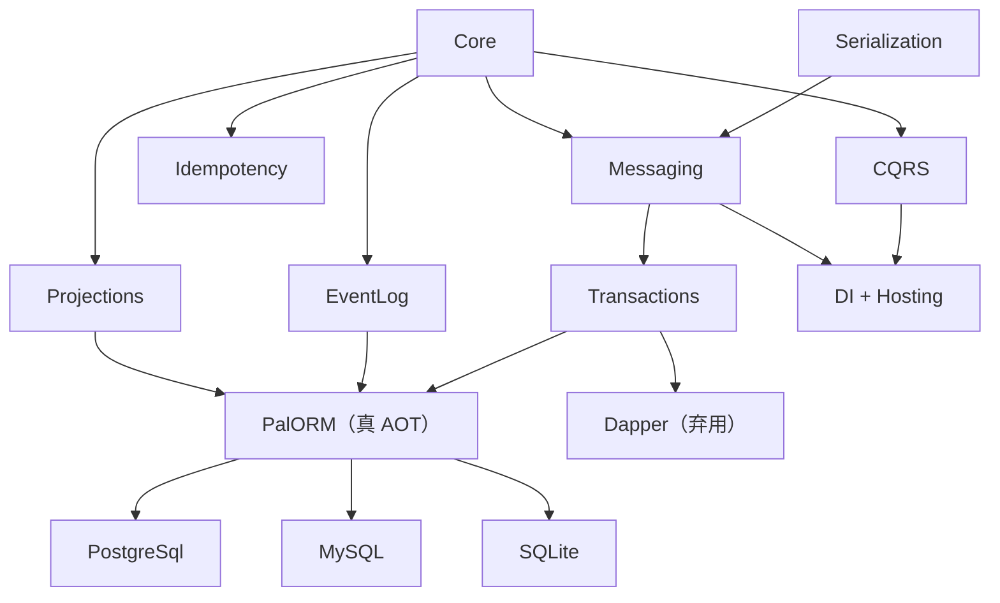

# Pal.DDD

**面向 .NET 11 的 DDD/CQRS/Event Sourcing 基础设施框架 —— 零运行时反射、Native AOT 链路完整、无过度抽象。**

[](https://www.nuget.org/packages/PalDDD.Base)
[](https://dotnet.microsoft.com/)
[]()
[](docs/aot.md)
[](LICENSE)

---

Pal.DDD 将 Entity 的 equality 语义、领域事件的零分配收集、Outbox 的租约锁并发与死信恢复、Saga 的补偿编排与超时检测——标准化为 40 个独立 NuGet 包。不做 `IRepository<T>`、不定义 `IIntegrationEvent`、不实施装配扫描。业务代码保持纯 C#，框架只提供基础设施。

开箱即用：**零反射命令分发 · 租约锁并发 Outbox · 自动补偿 Saga · 不可变 EventLog · 断点续传 Projection · 编译时 DDD 合规检查。**

---

---

## 核心价值

### DDD 战术模式完整落地

Entity / AggregateRoot / DomainEvent / ValueObject / SmartEnum / Specification / Saga / EventLog / Projection 全覆盖，且无过度抽象——不做 `IRepository<T>`、不定义 `IIntegrationEvent`、不实施装配扫描。

DbContext *是* 工作单元+仓储。DomainEvent *是* 集成事件。`AddPalCommandHandler<T>` 替代装配扫描。框架不应发明概念来包装已有概念——它应该消除重复，而非增加间接层。

### AOT 作为一等公民

DIM 桥接消除反射、源码生成器注册类型、FrozenDictionary 替代字典查找、非 AOT 项目三属性（`IsAotCompatible` / `IsTrimmable` / `VerifyReferenceAotCompatibility`）透明化。

`IsAotCompatible=true` 在核心层和 PalORM 适配层强制执行。PalORM 通过源生成器在编译期生成 RowFactory/CommandFactory，实现完整链路 Native AOT。非 AOT 安全的第三方依赖（EF Core、Kafka、RabbitMQ）被隔离在显式声明 `IsAotCompatible=false` 的适配器项目中。AOT 不是附加功能——它是启动延迟、内存占用和部署安全性的架构决策。

### 性能契约工程化

- **零分配快速路径**：`ValueTask` + `IsCompletedSuccessfully` 同步完成零堆分配
- **零闭包管道**：`PipelineStateMachine` 替代闭包链，每次请求仅 ~40B
- **零拷贝读取**：`RehydrateFromBytes` 引用赋值消除 2 次 `ToArray`
- **ref struct 枚举器**：`DomainEventEnumerable` 单链表 O(1) 追加，foreach 零分配

### 架构约束编译时执行

15 条 Roslyn 分析器规则（PDDD001-015）在编译阶段检查领域模型的合规性。DomainEvent 未声明 sealed → 编译错误。ProcessManager 缺少 `[BoundedContext]` → 编译错误。消息契约命名不符合 lowercase-kebab 规范 → 编译警告。约束不依赖文档纪律或 Code Review 记忆——编译器替代了这两者。

---

## 与现有方案的差异

| 方案 | 定位 | Pal.DDD 的增量 |
|------|------|:---------------|
| **MediatR** | 进程内命令/查询分发 | 增加 Outbox、Inbox、Saga、EventLog、Projection。分发是起点，不是终点。 |
| **MassTransit / NServiceBus** | 分布式消息总线 | 不绑定特定传输。Outbox 通过 `IMessageBroker` 抽象适配任意 Broker。消息所有权在应用侧。 |
| **EventStoreDB / Marten** | 事件存储 | 提供 `IEventLog` 抽象，存储层可替换为 Dapper 或 EF Core 实现。不锁定供应商。 |
| **手写 DDD** | 完全定制 | 消除每个项目中 Entity、DomainEvent、Dispatcher、Outbox、Saga 的重复实现。基础设施不应成为差异化代码。 |

---

## 安装

### 方式一：元包（推荐快速上手）

```xml
<!-- L1 基础元包：领域核心 + 序列化 + 压缩 + 源生成 + 编译期分析器 -->
<PackageReference Include="PalDDD.Base" />

<!-- L2 全量元包：CQRS + 事件日志 + 幂等 + 投影 + 消息 + 事务 + DI -->
<PackageReference Include="PalDDD.Extension" />

<!-- 按需选一个持久化适配器 -->
<PackageReference Include="PalDDD.PalORM.Sqlite" />  <!-- 或 PostgreSql / MySql / Dapper -->
```

### 方式二：按需引用（精确控制依赖）

```xml
<!-- 只要领域核心 -->
<PackageReference Include="PalDDD.Core" />

<!-- 加 CQRS -->
<PackageReference Include="PalDDD.CQRS" />

<!-- 加 Outbox/Saga 事务 -->
<PackageReference Include="PalDDD.Transactions" />
<PackageReference Include="PalDDD.Transactions.EFCore" />

<!-- 加 Kafka 消息 -->
<PackageReference Include="PalDDD.Messaging.Kafka" />
```

### CLI 安装

```bash
# 元包方式
dotnet add package PalDDD.Base
dotnet add package PalDDD.Extension

# PalORM 持久化 — 推荐，完整链路 Native AOT（源生成 + 编译期 SQL，零反射）
dotnet add package PalDDD.PalORM.Sqlite          # 或 PostgreSql / MySql

# Dapper 持久化 — 经典手写 SQL（⚠️ 不支持 AOT，逐步弃用）
dotnet add package PalDDD.Dapper.PostgreSql

# 消息代理
dotnet add package PalDDD.Messaging.Kafka
dotnet add package PalDDD.Messaging.RabbitMQ
```

InMemory 实现覆盖全部抽象接口，单元测试和原型开发无需外部依赖。

### 场景推荐

| 场景 | 推荐引用 |
|------|---------|
| 学习 / 原型 | Base + Extension + PalORM.Sqlite |
| 生产微服务 | Core + CQRS + Transactions + Transactions.EFCore + PalORM.PostgreSql + Messaging.Kafka |
| 只用领域模型 | Core + Serialization |
| 简单 CRUD API | Core + CQRS + Repository.EFCore + Hosting.AspNetCore |

---

## NuGet 包清单（40 个）

| 包 | 版本 | 说明 |
|------|:--:|------|
| **PalDDD.Base** | 1.1.0 | L1 元包：Core + Serialization + Compression + SourceGen + Analyzers |
| **PalDDD.Extension** | 1.1.0 | L2 元包：CQRS + EventLog + Idempotency + Projections + Messaging + Transactions + DI |
| **PalDDD.Core** | 1.1.0 | 领域核心：AggregateRoot / Entity / ValueObject / SmartEnum / DomainEvent / Specification |
| **PalDDD.Serialization** | 1.1.0 | 序列化抽象：IMessageSerializer / MessageCatalog / MessageDescriptor |
| **PalDDD.Serialization.Evolution** | 1.1.0 | 消息版本演化：Upcaster / Contract 验证 |
| **PalDDD.Serialization.MemoryPack** | 1.1.0 | MemoryPack 二进制序列化（零反射、AOT） |
| **PalDDD.Compression** | 1.1.0 | 压缩抽象：Brotli / GZip / Deflate（AOT 安全） |
| **PalDDD.Compression.Native** | 1.1.0 | 原生压缩：LZ4 / ZStandard（P/Invoke，不可 AOT） |
| **PalDDD.Core.SourceGen** | 1.1.0 | 源生成器：IdentityGenerator / EnumGenerator / MessageRegistryGenerator |
| **PalDDD.Analyzers** | 1.1.0 | Roslyn 分析器：PDDD001-015 编译期 DDD 治理诊断 |
| **PalDDD.Analyzers.CodeFixes** | 1.1.0 | 代码修复：PDDD008/010/013/015 |
| **PalDDD.CQRS** | 1.1.0 | 命令查询职责分离：Dispatcher / Pipeline / Validation / Logging |
| **PalDDD.EventLog** | 1.1.0 | 事件日志抽象：InMemoryEventLog + 乐观并发 |
| **PalDDD.EventLog.EFCore** | 1.1.0 | EF Core 事件日志：EventLogDbContext + 全局位分配器 |
| **PalDDD.Idempotency** | 1.1.0 | 幂等性抽象：IdempotencyProcessor + InMemoryStore |
| **PalDDD.Idempotency.EFCore** | 1.1.0 | EF Core 幂等记录：IdempotencyDbContext |
| **PalDDD.Projections** | 1.1.0 | 投影抽象：ProjectionProcessor + Checkpoint + Replay |
| **PalDDD.Projections.EFCore** | 1.1.0 | EF Core 投影检查点：ProjectionCheckpointDbContext |
| **PalDDD.Projections.EventLog** | 1.1.0 | EventLog 回放源：从事件流重建读模型 |
| **PalDDD.Messaging** | 1.1.0 | 消息总线抽象：MessageBrokerBase + DomainEventDispatcher |
| **PalDDD.Messaging.Kafka** | 1.1.0 | Kafka 适配：基于 Confluent.Kafka 2.x |
| **PalDDD.Messaging.RabbitMQ** | 1.1.0 | RabbitMQ 适配：基于 RabbitMQ.Client 7.x |
| **PalDDD.Transactions** | 1.1.0 | 事务/Saga：Outbox/Inbox 抽象 + InMemoryStore + 后台处理器 |
| **PalDDD.Transactions.EFCore** | 1.1.0 | EF Core 事务：Outbox/Inbox/SagaState DbContext |
| **PalDDD.DependencyInjection** | 1.1.0 | DI 注册入口：ServiceRegistration + AddPal 统一扩展 |
| **PalDDD.Repository.EFCore** | 1.1.0 | EF Core 仓储：UnitOfWork + DomainEvent 拦截器 |
| **PalDDD.Hosting.AspNetCore** | 1.1.0 | ASP.NET Core 集成：异常中间件 + 健康检查 + Minimal API 端点 |
| **PalDDD.PalORM** | 1.1.0 | PalORM 持久化核心：7 Store + UnitOfWork（真 AOT + 源生成） |
| **PalDDD.PalORM.PostgreSql** | 1.1.0 | PalORM PostgreSQL 方言：RETURNING / COPY |
| **PalDDD.PalORM.MySql** | 1.1.0 | PalORM MySQL 方言：BulkCopy / 多值 INSERT |
| **PalDDD.PalORM.Sqlite** | 1.1.0 | PalORM SQLite 方言：FTS5 / JSON1 |
| **PalDDD.Dapper** | 1.1.0 | Dapper 持久化适配器（⚠️ AOT 假象，逐步弃用） |
| **PalDDD.Dapper.PostgreSql** | 1.1.0 | Dapper PostgreSQL 增强：审计 / JSONB / 分片 / 软删除 |
| **PalDDD.Dapper.MySql** | 1.1.0 | Dapper MySQL 增强 |
| **PalDDD.Dapper.Sqlite** | 1.1.0 | Dapper SQLite 增强：TypeHandler / RowFactory / FTS5 |
| **PalORM.Core** | 5.1.0 | PalORM 引擎核心：DataSession / Provider / RowFactory（PalDDD.PalORM 的底层依赖） |
| **PalORM.SourceGen** | 5.1.0 | PalORM 源生成器：编译期生成 RowFactory / CommandFactory（零反射） |
| **PalORM.PostgreSql** | 5.1.0 | PalORM PostgreSQL 方言 Provider：RETURNING / COPY |
| **PalORM.MySql** | 5.1.0 | PalORM MySQL 方言 Provider：BulkCopy / 多值 INSERT |
| **PalORM.Sqlite** | 5.1.0 | PalORM SQLite 方言 Provider：FTS5 / JSON1 |

---

## 快速开始

### 领域模型

```csharp
using PalDDD.Core;

[GenerateId(typeof(PalUlid))] public readonly partial record struct OrderId;

public sealed class Order : AggregateRoot<OrderId>
{
    public void Submit(string name, decimal amount)
        => RaiseEvent(new OrderSubmitted(Id.Value, name, amount));
}

[GenerateMessage(Name = "ordering.order-submitted.v1")]
public sealed record OrderSubmitted(
    PalUlid OrderId, string Name, decimal Amount
) : DomainEvent, IDomainEvent
{
    static string IDomainEvent.EventName => "ordering.order-submitted.v1";
}
```

### 命令处理器

```csharp
using PalDDD.CQRS;

public sealed record SubmitOrder(OrderId Id, string Name, decimal Amount) : ICommand;

public sealed class SubmitOrderHandler : ICommandHandler<SubmitOrder, Unit>
{
    public async ValueTask<Unit> HandleAsync(SubmitOrder cmd, CancellationToken ct)
    {
        var order = new Order();
        order.Submit(cmd.Name, cmd.Amount);
        return Unit.Value;
    }
}
```

### 注册与分发

```csharp
services.AddPalCoreStack();
services.AddPalCommandHandler<SubmitOrder, Unit, SubmitOrderHandler>();
services.AddPalOrmSqlite(connectionString);  // PalORM（推荐，真 AOT）
services.AddPalOutbox();

var dispatcher = provider.GetRequiredService<Dispatcher>();
await dispatcher.SendAsync(new SubmitOrder(new OrderId(), "Customer", 100m));
```

---

## 功能矩阵

### 领域建模
| 组件 | 实现策略 |
|------|---------|
| Entity / AggregateRoot | 单链表事件存储，支持零分配 `foreach` 枚举，线程安全的事件收集 |
| DomainEvent | 不可变 sealed record，静态 `EventName` 契约，`[GenerateMessage]` 源生成注册 |
| ValueObject / SmartEnum | 强类型 ID（Ulid 推荐），FrozenDictionary O(1) 查找 |
| ISpecification | ExpressionVisitor 参数替换组合 And/Or/Not，与 EF Core LINQ 完全兼容 |
| 诊断 | 内建 `PalActivitySource`（11 个 Start 方法）+ `PalMetrics`（24 个计数器） |

### CQRS
| 组件 | 实现策略 |
|------|---------|
| Dispatcher | FrozenDictionary 路由表，`IHandler.HandleAsync` DIM 桥接，零 MakeGenericType |
| PipelineBehavior | 开放泛型注册，内建 ValidationBehavior + LoggingBehavior |
| Handler 注册 | `AddPalCommandHandler<T>` 编译时类型常量，无装配扫描 |

### 消息基础设施
| 组件 | 核心机制 |
|------|---------|
| **Outbox** | 数据库事务内原子写入消息行，租约锁（LockedBy + LockedUntil）多实例并发发布，指数退避重试，死信队列 + 操作重注入 |
| **Inbox** | `(ConsumerName, MessageId)` 复合唯一约束，四态生命周期（Pending → Processing → Processed/Failed），僵尸记录超时回收 |
| **Saga** | 显式状态/事件转换注册 → FrozenDictionary 查找，可配置重试+退避，Backward/Forward/None 三种补偿策略，超时检测后台服务，人工审批中断+恢复 |
| **EventLog** | 命名流 + 乐观并发（ExpectedStreamVersion），全局单调递增位置，`RehydrateFromBytes` 零拷贝读取路径 |
| **Projection** | `IProjectionCheckpointStore` 断点存储，`EventLogReplaySource<T>` 全量重放，独立于存储适配器 |

### 持久化适配器
| 适配器 | AOT | 数据库 | 覆盖范围 |
|--------|:--:|:--:|------|
| **PalDDD.PalORM** | ✅ **真 AOT** | PG / MySQL / SQLite | Outbox / Inbox / Saga / EventLog / Projection / **Idempotency** / UnitOfWork（源生成 + 编译期 SQL，[详见适配层文档](docs/palorm-adapter.md)） |
| PalDDD.Dapper | ⚠️ 假象 | PG / MySQL / SQLite | Outbox / Inbox / Saga / EventLog / Projection / UnitOfWork（`[module:DapperAot]` 实际禁用，靠 NoWarn IL3058 声明兼容） |
| ~~PalDDD.EntityFrameworkCore~~ | ❌ | ~~PG / MySQL / SQLite~~ | ~~已废弃，源码未入库（OBS-068），被 PalORM 替代~~ |

### 数据库方言扩展
| 方言 | 特有能力 |
|------|---------|
| PostgreSQL | COPY 批量写入、Pipeline 单往返批处理、LISTEN/NOTIFY 事件推送、一致性哈希分片、JSONB 操作符、软删除、审计日志 |
| MySQL | 多主机故障转移（FailOver/RoundRobin/LeastConnections）、InnoDB 会话调优（锁超时、隔离级别、SQL 模式） |
| SQLite | WAL 模式 + PRAGMA 优化（三级调优）、FTS5 全文搜索、JSON1 函数 |

---

## AOT 兼容性

| 层 | 状态 | 说明 |
|----|:--:|------|
| PalDDD.Core · Serialization · Compression | ✅ | `IsAotCompatible=true` 全局继承 |
| PalDDD.CQRS · EventLog · Messaging · Transactions · Projections · DI | ✅ | 同上 |
| **PalDDD.PalORM + Sqlite / PostgreSql / MySql** | ✅ **真 AOT** | 源生成 RowFactory/CommandFactory，`PublishAot=true` 验证通过（[PalOrmSample](samples/PalDDD.PalOrmSample/)） |
| PalDDD.Dapper + PostgreSql / MySql / Sqlite | ⚠️ 假象 | Dapper.AOT `[module:DapperAot]` 实际禁用，靠 `<NoWarn>IL3058</NoWarn>` 声明兼容（详见 [PalORM 适配层文档](docs/palorm-adapter.md)） |
| ~~PalDDD.EntityFrameworkCore~~ | ❌ | ~~已废弃~~ |
| PalDDD.Messaging.Kafka · RabbitMQ | ❌ | Confluent.Kafka / RabbitMQ.Client 限制 |
| PalDDD.Hosting.AspNetCore | ❌ | FrameworkReference 限制 |

详见 [AOT 指南](docs/aot.md) 和 [PalORM 适配层文档](docs/palorm-adapter.md)。

---

## 性能指标

> ⚠️ 以下为 `--smoke` 烟测数据（Stopwatch + GC 分配，单次运行），非正式 BenchmarkDotNet 报告。BenchmarkDotNet 在当前 .NET 11 Preview 工具链下存在兼容问题，正式基准报告待 BDN 发布兼容版本后补充。烟测用于趋势检查，不能替代统计严谨的基准测试。

| 操作 | 次数 | 耗时 | 分配 |
|------|:--:|------|:--:|
| PalValidationResult.Success | 1M | 15.06 ms | 88 B |
| SmartEnum.FromValue（FrozenDictionary） | 1M | 19.01 ms | 40 B |
| PalValidationResult.Failed | 1M | 43.41 ms | ~40 MB |
| Entity.RaiseEvent（单链表追加） | 1M | 148.45 ms | ~128 MB |

验证命令：
```bash
dotnet run --configuration Release --project bench/PalDDD.Benchmarks -- --smoke
```

完整数据及 BenchmarkDotNet 历史基线见 [性能记录](docs/performance.md)。

---

## 项目结构

```
src/                         36 源项目 · Clean Architecture
├── Domain/                  Core · SourceGen · Analyzers · Analyzers.CodeFixes
├── App-Abstractions/        Serialization · Serialization.Evolution · Messaging · Compression · Compression.Native
├── App-Core/                CQRS · EventLog · EventLog.EFCore · Idempotency · Idempotency.EFCore · Projections · Projections.EFCore · Projections.EventLog · Transactions · Transactions.EFCore
├── Infra-PalORM/            PalORM（真 AOT）· PalORM.Sqlite · PalORM.PostgreSql · PalORM.MySql  ← 推荐
├── Infra-Dapper/            Dapper · PostgreSql · MySql · Sqlite（⚠️ 逐步弃用）
├── Infra-Repository/        Repository.EFCore
├── Infra-Messaging/         Kafka · RabbitMQ
├── Hosting/                 DependencyInjection · AspNetCore
└── Metapackages/            Base · Extension（聚合元包，仅 PackageReference，无源码）

test/                        16 测试项目（TUnit）· 869 测试
bench/                       BenchmarkDotNet 性能基准
samples/                     PalOrmSample（AOT 验证）· ECommerce · MinimalApi
docs/                        架构 · 使用指南 · 教程 · ADR
```

依赖方向：Domain → App → Infra → Hosting。每个 src/ 项目对应一个独立 NuGet 包。


```mermaid
flowchart TB
    Core --> CQRS
    Core --> EventLog
    Core --> Idempotency
    Core --> Projections
    Serialization --> Messaging
    Core --> Messaging
    Messaging --> Transactions
    CQRS --> DI[DI + Hosting]
    Messaging --> DI
    Transactions --> PalORM["PalORM（真 AOT）"]
    EventLog --> PalORM
    Projections --> PalORM
    Transactions --> Dapper["Dapper（弃用）"]
    PalORM --> PG[PostgreSql]
    PalORM --> MySQL
    PalORM --> SQLite
```


---

## 文档

| 文档 | 说明 |
|------|------|
| [架构说明](docs/architecture.md) | 分层、依赖方向、项目职责 |
| [使用指南](docs/usage.md) | 各组件完整代码示例 |
| [教程](docs/tutorial.md) | 从零构建 DDD 应用 |
| [工程规范](docs/conventions.md) | 命名、文件组织、DI、AOT |
| [AOT 指南](docs/aot.md) | Native AOT 规则与检查清单 |
| [性能记录](docs/performance.md) | 基准测试数据 |
| [架构决策](docs/decisions/) | 16 份 ADR |

---

## FAQ

**和 MediatR 什么关系？**
MediatR 是进程内命令分发器。Pal.DDD 内置与之等价的 Dispatcher + PipelineBehavior，并在此基础上提供 Outbox、Inbox、Saga、EventLog、Projection。如果你只需要命令分发，Pal.DDD 的 CQRS 层可以替代 MediatR。如果你还需要可靠消息投递和 Saga 编排，Pal.DDD 提供整条链路。

**和 MassTransit 什么关系？**
MassTransit 是分布式消息总线，绑定特定传输（RabbitMQ/Azure Service Bus/Amazon SQS）。Pal.DDD 的 Outbox 通过 `IMessageBroker` 抽象适配任意 Broker——你可以注入 MassTransit、Raw RabbitMQ、Kafka 或 InMemory 实现。框架不绑定传输。

**和 EF Core 什么关系？共存还是替代？**
共存。Pal.DDD 不替代 EF Core——两者解决不同层次的问题。EF Core 负责对象-关系映射和查询；Pal.DDD 负责 DDD 战术模式（Entity、DomainEvent、CQRS 分发、Outbox 投递、Saga 编排）。Pal.DDD 提供 PalORM（推荐，真 AOT）、Dapper（逐步弃用）和 EF Core 三套持久化适配器，选型取决于你的 AOT 需求和查询复杂度。

**可以用在现有项目中吗？渐进式引入？**
可以。Pal.DDD 的每个 NuGet 包独立可安装。你可以从 `PalDDD.Base`（领域基元）开始，在现有的 Service 层旁边逐步引入 CQRS Dispatcher，再按需添加 Outbox 或 Saga。不需要一次性重写整个项目。

**为什么要单目标 net11.0？**
依赖 .NET 11 的静态特性（JsonSerializerContext 源生成增强、Runtime Async 状态机优化、新 AOT 分析器），多目标在技术上不可行。详见 [ADR-005](docs/decisions/005-net11-single-target.md)。

**Dapper 和 PalORM 怎么选？**
如果需要 Native AOT 部署（微服务、CLI 工具、边缘计算）→ 选 **PalORM**（推荐，源生成 + 编译期 SQL，真 AOT）。如果维护已有 Dapper 手写 SQL 代码 → 选 Dapper（⚠️ AOT 假象，逐步弃用）。EF Core 适配器用于 Repository/Outbox/Inbox/Saga 的 DbContext 场景。三者可以在同一个项目中混用——例如 PalORM 做写路径（Outbox/Saga），EF Core 做读路径（Projection）。

**有哪些已知限制？**
不支持 .NET 8/9/10（单目标 net11.0）。Saga 的 ChildSaga 和 DynamicStep 依赖 `MakeGenericType`，在 AOT 发布时不可用（标注了 `[RequiresDynamicCode]`）。不含内置的 EventStore 快照机制——需要快照策略的项目需要自行实现。

**生产环境有谁在用？**
Pal.DDD 当前版本 v1.1.0，已发布到 NuGet.org。核心层（Entity、DomainEvent、CQRS Dispatcher、Outbox、Inbox）在多个内部项目的集成测试套件中验证通过，测试覆盖 869 用例。欢迎在非生产环境中试用并反馈。

---

## 许可证

[GNU Affero General Public License v3.0 or later](LICENSE)

Copyright (C) 2026 PalDDD

本项目使用 AGPL-3.0-or-later 许可证。AGPL v3 在 GPL v3 基础上增加第 13 条网络交互条款——通过网络提供服务时，必须向用户提供修改后版本的完整源代码。详见 [LICENSE](LICENSE) 文件或 <https://www.gnu.org/licenses/agpl-3.0.html>。
