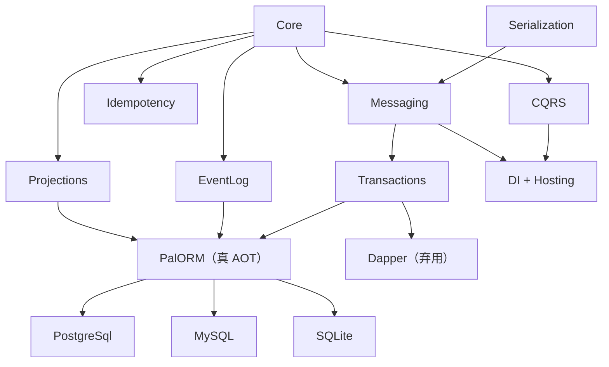

# Pal.DDD

[English](README.en.md) | **中文**

**面向 .NET 11 的 DDD/CQRS/Event Sourcing 基础设施框架 —— 零运行时反射、Native AOT 链路完整、无过度抽象。**

[](https://www.nuget.org/packages/PalDDD.Base)
[](https://dotnet.microsoft.com/)
[]()
[](docs/aot.md)
[](LICENSE)

---

Pal.DDD 将 Entity 的 equality 语义、领域事件的零分配收集、Outbox 的租约锁并发与死信恢复、Saga 的补偿编排与超时检测——标准化为 35 个独立 NuGet 包（另依赖 PalORM 引擎 5 个第三方包，见清单末段）。不做 `IRepository<T>`、不定义 `IIntegrationEvent`、不实施装配扫描。业务代码保持纯 C#，框架只提供基础设施。

开箱即用：**零反射命令分发 · 租约锁并发 Outbox · 自动补偿 Saga · 不可变 EventLog · 断点续传 Projection · 编译时 DDD 合规检查。**

---

## 核心价值

### DDD 战术模式完整落地

Entity / AggregateRoot / DomainEvent / ValueObject / SmartEnum / Specification / Saga / EventLog / Projection 全覆盖，且无过度抽象——不做 `IRepository<T>`、不定义 `IIntegrationEvent`、不实施装配扫描。

DbContext *是* 工作单元+仓储。DomainEvent *是* 集成事件。`AddPalCommandHandler<T>` 替代装配扫描。框架不应发明概念来包装已有概念——它应该消除重复，而非增加间接层。

### AOT 作为一等公民

DIM 桥接消除反射、源码生成器注册类型、FrozenDictionary 替代字典查找、非 AOT 项目三属性（`IsAotCompatible` / `IsTrimmable` / `VerifyReferenceAotCompatibility`）透明化。

`IsAotCompatible=true` 在核心层和 PalORM 适配层强制执行。PalORM 通过源生成器在编译期生成 RowFactory/CommandFactory，实现完整链路 Native AOT。非 AOT 安全的第三方依赖（EF Core、Kafka、RabbitMQ）被隔离在显式声明 `IsAotCompatible=false` 的适配器项目中。AOT 不是附加功能——它是启动延迟、内存占用和部署安全性的架构决策。

### 性能契约工程化

- **零分配快速路径**：`ValueTask` + `IsCompletedSuccessfully` 同步完成零堆分配
- **零闭包管道**：`PipelineStateMachine` 替代闭包链，每次请求仅 ~40B
- **零拷贝读取**：`RehydrateFromBytes` 引用赋值消除 2 次 `ToArray`
- **ref struct 枚举器**：`DomainEventEnumerable` 单链表 O(1) 追加，foreach 零分配

### 架构约束编译时执行

38 条编译期诊断检查领域模型的合规性：15 条战略 Roslyn 分析器（PDDD001-015）+ 23 条源生成器诊断（PALID001-007 / PALMSG001-007 / PALENUM001-009）。DomainEvent 未声明 sealed → 编译错误。ProcessManager 缺少 `[BoundedContext]` → 编译错误。消息契约命名不符合 lowercase-kebab 规范 → 编译警告。约束不依赖文档纪律或 Code Review 记忆——编译器替代了这两者。

---

## 与现有方案的差异

| 方案 | 定位 | Pal.DDD 的增量 |
|------|------|:---------------|
| **MediatR** | 进程内命令/查询分发 | 增加 Outbox、Inbox、Saga、EventLog、Projection。分发是起点，不是终点。 |
| **MassTransit / NServiceBus** | 分布式消息总线 | 不绑定特定传输。Outbox 通过 `IMessageBroker` 抽象适配任意 Broker。消息所有权在应用侧。 |
| **EventStoreDB / Marten** | 事件存储 | 提供 `IEventLog` 抽象，存储层可替换为 Dapper 或 EF Core 实现。不锁定供应商。 |
| **手写 DDD** | 完全定制 | 消除每个项目中 Entity、DomainEvent、Dispatcher、Outbox、Saga 的重复实现。基础设施不应成为差异化代码。 |

---

## 安装

### 方式一：元包（推荐快速上手）

```xml
<!-- L1 基础元包：领域核心 + 序列化 + 压缩 + 源生成 + 编译期分析器 -->
<PackageReference Include="PalDDD.Base" />

<!-- L2 全量元包：CQRS + 事件日志 + 幂等 + 投影 + 消息 + 事务 + DI -->
<PackageReference Include="PalDDD.Extension" />

<!-- 按需选一个持久化适配器 -->
<PackageReference Include="PalDDD.PalORM.Sqlite" />  <!-- 或 PostgreSql / MySql / Dapper -->
```

### 方式二：按需引用（精确控制依赖）

```xml
<!-- 只要领域核心 -->
<PackageReference Include="PalDDD.Core" />

<!-- 加 CQRS -->
<PackageReference Include="PalDDD.CQRS" />

<!-- 加 Outbox/Saga 事务 -->
<PackageReference Include="PalDDD.Transactions" />
<PackageReference Include="PalDDD.Transactions.EFCore" />

<!-- 加 Kafka 消息 -->
<PackageReference Include="PalDDD.Messaging.Kafka" />
```

### CLI 安装

```bash
# 元包方式
dotnet add package PalDDD.Base
dotnet add package PalDDD.Extension

# PalORM 持久化 — 推荐，完整链路 Native AOT（源生成 + 编译期 SQL，零反射）
dotnet add package PalDDD.PalORM.Sqlite          # 或 PostgreSql / MySql

# Dapper 持久化 — 经典手写 SQL（⚠️ 不支持 AOT，逐步弃用）
dotnet add package PalDDD.Dapper.PostgreSql

# 消息代理
dotnet add package PalDDD.Messaging.Kafka
dotnet add package PalDDD.Messaging.RabbitMQ
```

InMemory 实现覆盖全部抽象接口，单元测试和原型开发无需外部依赖。

### 场景推荐

| 场景 | 推荐引用 |
|------|---------|
| 学习 / 原型 | Base + Extension + PalORM.Sqlite |
| 生产微服务 | Core + CQRS + Transactions + Transactions.EFCore + PalORM.PostgreSql + Messaging.Kafka |
| 只用领域模型 | Core + Serialization |
| 简单 CRUD API | Core + CQRS + Repository.EFCore + Hosting.AspNetCore |

---

## NuGet 包清单（PalDDD 自有 35 个 + PalORM 引擎 5 个第三方包）

| 包 | 版本 | 说明 |
|------|:--:|------|
| **PalDDD.Base** | 2.1.0 | L1 元包：Core + Serialization + Compression + SourceGen + Analyzers |
| **PalDDD.Extension** | 2.1.0 | L2 元包：CQRS + EventLog + Idempotency + Projections + Messaging + Transactions + DI |
| **PalDDD.Core** | 2.1.0 | 领域核心：AggregateRoot / Entity / ValueObject / SmartEnum / DomainEvent / Specification |
| **PalDDD.Serialization** | 2.1.0 | 序列化抽象：IMessageSerializer / MessageCatalog / MessageDescriptor |
| **PalDDD.Serialization.Evolution** | 2.1.0 | 消息版本演化：Upcaster / Contract 验证 |
| **PalDDD.Serialization.MemoryPack** | 2.1.0 | MemoryPack 二进制序列化（零反射、AOT） |
| **PalDDD.Compression** | 2.1.0 | 压缩抽象：Brotli / GZip / Deflate（AOT 安全） |
| **PalDDD.Compression.Native** | 2.1.0 | 原生压缩：LZ4 / ZStandard（P/Invoke，不可 AOT） |
| **PalDDD.Core.SourceGen** | 2.1.0 | 源生成器：IdentityGenerator / EnumGenerator / MessageRegistryGenerator |
| **PalDDD.Analyzers** | 2.1.0 | Roslyn 分析器：PDDD001-015 编译期 DDD 治理诊断 |
| **PalDDD.Analyzers.CodeFixes** | 2.1.0 | 代码修复：PDDD008/010/013/015 |
| **PalDDD.CQRS** | 2.1.0 | 命令查询职责分离：Dispatcher / Pipeline / Validation / Logging |
| **PalDDD.EventLog** | 2.1.0 | 事件日志抽象：InMemoryEventLog + 乐观并发 |
| **PalDDD.EventLog.EFCore** | 2.1.0 | EF Core 事件日志：EventLogDbContext + 全局位分配器 |
| **PalDDD.Idempotency** | 2.1.0 | 幂等性抽象：IdempotencyProcessor + InMemoryStore |
| **PalDDD.Idempotency.EFCore** | 2.1.0 | EF Core 幂等记录：IdempotencyDbContext |
| **PalDDD.Projections** | 2.1.0 | 投影抽象：ProjectionProcessor + Checkpoint + Replay |
| **PalDDD.Projections.EFCore** | 2.1.0 | EF Core 投影检查点：ProjectionCheckpointDbContext |
| **PalDDD.Projections.EventLog** | 2.1.0 | EventLog 回放源：从事件流重建读模型 |
| **PalDDD.Messaging** | 2.1.0 | 消息总线抽象：MessageBrokerBase + DomainEventDispatcher |
| **PalDDD.Messaging.Kafka** | 2.1.0 | Kafka 适配：基于 Confluent.Kafka 2.x |
| **PalDDD.Messaging.RabbitMQ** | 2.1.0 | RabbitMQ 适配：基于 RabbitMQ.Client 7.x |
| **PalDDD.Transactions** | 2.1.0 | 事务/Saga：Outbox/Inbox 抽象 + InMemoryStore + 后台处理器 |
| **PalDDD.Transactions.EFCore** | 2.1.0 | EF Core 事务：Outbox/Inbox/SagaState DbContext |
| **PalDDD.DependencyInjection** | 2.1.0 | DI 注册入口：ServiceRegistration + AddPal 统一扩展 |
| **PalDDD.Repository.EFCore** | 2.1.0 | EF Core 仓储：UnitOfWork + DomainEvent 拦截器 |
| **PalDDD.Hosting.AspNetCore** | 2.1.0 | ASP.NET Core 集成：异常中间件 + 健康检查 + Minimal API 端点 |
| **PalDDD.PalORM** | 2.1.0 | PalORM 持久化核心：6 Store + UnitOfWork（真 AOT + 源生成） |
| **PalDDD.PalORM.PostgreSql** | 2.1.0 | PalORM PostgreSQL 方言：RETURNING / COPY |
| **PalDDD.PalORM.MySql** | 2.1.0 | PalORM MySQL 方言：BulkCopy / 多值 INSERT |
| **PalDDD.PalORM.Sqlite** | 2.1.0 | PalORM SQLite 方言：FTS5 / JSON1 |
| **PalDDD.Dapper** | 2.1.0 | Dapper 持久化适配器（⚠️ AOT 假象，逐步弃用） |
| **PalDDD.Dapper.PostgreSql** | 2.1.0 | Dapper PostgreSQL 增强：审计 / JSONB / 分片 / 软删除 |
| **PalDDD.Dapper.MySql** | 2.1.0 | Dapper MySQL 增强 |
| **PalDDD.Dapper.Sqlite** | 2.1.0 | Dapper SQLite 增强：TypeHandler / RowFactory / FTS5 |
| **PalORM.Core** | 5.4.0 | PalORM 引擎核心：DataSession / Provider / RowFactory（PalDDD.PalORM 的底层依赖） |
| **PalORM.SourceGen** | 5.4.0 | PalORM 源生成器：编译期生成 RowFactory / CommandFactory（零反射） |
| **PalORM.PostgreSql** | 5.4.0 | PalORM PostgreSQL 方言 Provider：RETURNING / COPY |
| **PalORM.MySql** | 5.4.0 | PalORM MySQL 方言 Provider：BulkCopy / 多值 INSERT（5.4 弹性层三 Provider 均支持 configureResilience 回调） |
| **PalORM.Sqlite** | 5.4.0 | PalORM SQLite 方言 Provider：FTS5 / JSON1 |

---

## 快速开始

### 领域模型

```csharp
using PalDDD.Core;
using ByteAether.Ulid;   // 框架源码内部别名 PalUlid = ByteAether.Ulid.Ulid，示例统一用真实类型

// 强类型 ID — 编译期生成，零反射
[GenerateId(typeof(Ulid))]
public readonly partial record struct OrderId;

// 聚合根 — 单链表事件存储，线程安全
public sealed class Order : AggregateRoot<OrderId>
{
    public string CustomerName { get; private set; } = "";
    public decimal Amount { get; private set; }

    public static Order Create(string name, decimal amount)
    {
        var order = new Order(OrderId.New());   // AggregateRoot<TId> 仅 protected ctor(TId)——Id 只读，构造期确定
        order.RaiseEvent(new OrderCreated(order.Id, name, amount));
        return order;
    }

    public void Cancel(string reason)
        => RaiseEvent(new OrderCancelled(Id, reason));
}

// 领域事件 — sealed record + [GenerateMessage] 源生成注册
[GenerateMessage(Name = "ordering.order-created.v1")]
public sealed record OrderCreated(Ulid OrderId, string Name, decimal Amount)
    : DomainEvent, IDomainEvent
{
    static string IDomainEvent.EventName => "ordering.order-created.v1";
}

[GenerateMessage(Name = "ordering.order-cancelled.v1")]
public sealed record OrderCancelled(Ulid OrderId, string Reason)
    : DomainEvent, IDomainEvent
{
    static string IDomainEvent.EventName => "ordering.order-cancelled.v1";
}
```

### 命令处理器

```csharp
using PalDDD.CQRS;

public sealed record CreateOrder(string Name, decimal Amount) : ICommand<OrderId>;

public sealed class CreateOrderHandler(IUnitOfWork uow) : ICommandHandler<CreateOrder, OrderId>
{
    public async ValueTask<OrderId> HandleAsync(CreateOrder cmd, CancellationToken ct)
    {
        var order = Order.Create(cmd.Name, cmd.Amount);
        await uow.SaveChangesAsync(ct);  // 事务提交 + Outbox 原子写入
        return order.Id;
    }
}
```

### DI 注册与分发

```csharp
// 1. 注册核心栈（Dispatcher + Pipeline + Ulid 身份；v62 勘正：不含序列化/分析器——仍需对应包显式注册，见 AddPalCoreStack remarks）
services.AddPalCoreStack();

// 2. 注册命令处理器（编译时类型常量，无装配扫描）
services.AddPalCommandHandler<CreateOrder, OrderId, CreateOrderHandler>();

// 3. 选持久化适配器（推荐 PalORM，真 AOT）
services.AddPalOrmSqlite(connectionString);    // 或 PostgreSql / MySql

// 4. 注册 Outbox（事务内原子写入消息行 + 后台轮询发布）
services.AddPalOutbox();

// 5. 分发命令（⚠️ Handler 注册由 Host 驱动——HandlerRegistrar 在 Host 启动时扫描注册；
//    宿主应用用 builder.Services 注册 + app 启动后正常分发。裸 ServiceCollection 直取
//    Dispatcher 调 SendAsync 会抛 HandlerNotFound——完整可运行示例见教程 §3）
var orderId = await dispatcher.SendAsync(new CreateOrder("Alice", 99.9m));
```

---

## 最佳实践

> 以下实践突出 Pal.DDD 的核心优势：**零反射 AOT、编译时治理、租约锁并发、源生成器 ID**。

### 1. 强类型 ID：编译期生成，零反射，AOT 安全

Pal.DDD 用源生成器在编译期生成 `From` / `New` / `Parse` / `JsonConverter` / `TypeConverter`——运行时零反射。

```csharp
using ByteAether.Ulid;   // 框架源码内部别名 PalUlid = ByteAether.Ulid.Ulid，示例统一用真实类型

// ✅ [GenerateId] 触发 IdentityGenerator 源生成器
// 编译期生成 ISpanParsable + JsonConverter + TypeConverter
[GenerateId(typeof(Ulid))]         // Ulid（推荐，全序性）
public readonly partial record struct OrderId;

[GenerateId(typeof(Guid))]          // Guid
public readonly partial record struct CustomerId;

[GenerateId(typeof(int))]           // int（数据库自增）
public readonly partial record struct OrderNumber;

// 使用：编译期生成的方法直接可用
var id = OrderId.New();              // Ulid/Guid 自动生成
var parsed = OrderId.Parse("01HXY...", null);
var someUlid = Ulid.New();           // 与 [GenerateId(typeof(Ulid))] 对应的底层类型
var fromDb = OrderId.From(someUlid);
```

### 2. 编译时 DDD 治理：38 条诊断（15 战略分析器 + 23 源生成器诊断）

Pal.DDD 不依赖 Code Review 记忆——**38 条编译期诊断**在编译阶段拦截不合规代码：15 条战略 Roslyn 分析器（PDDD001-015）+ 23 条源生成器诊断（PALID001-007 身份 / PALMSG001-007 消息注册 / PALENUM001-009 智能枚举——v2.1.0 新增 PALID007 可访问性链与 PALENUM009 包含类型 partial）。

```csharp
// ✅ DomainEvent 必须 sealed — PDDD012 编译错误
public sealed record OrderCreated(...) : DomainEvent, IDomainEvent;

// ❌ 忘记 sealed — 编译直接报错
public record OrderCreated(...) : DomainEvent, IDomainEvent;  // PDDD012

// ✅ 消息名 lowercase-kebab + .vN — PDDD009 编译警告
[GenerateMessage(Name = "ordering.order-created.v1")]

// ✅ ProcessManager 必须标注 [BoundedContext] — PDDD001 编译错误（PDDD003 拦截不合规标注形状）
[BoundedContext("ordering")]
public sealed class OrderingProcessManager : Saga<OrderingState> { ... }

// ❌ [GenerateId] 目标忘写 partial — 源生成器直接报错
[GenerateId(typeof(Ulid))]
public readonly record struct OrderId;  // PALID002（非 partial record struct，生成物无法合并）
```

### 3. 租约锁并发 Outbox：多实例无重复投递

Outbox 用数据库行级租约锁实现多实例并发发布——`(LockedBy, LockedUntil)` 对充当 fencing token（`LockedUntil` 随每次租约单调变化，免 DDL 加列），旧 worker 租约失效后其 UPDATE 因 token 不匹配被拒绝，消息零丢失零重复，无需分布式锁。

```csharp
// 注册：Outbox + 后台处理器自动轮询
services.AddPalOrmPostgreSql(connectionString);
services.AddPalOutbox();

// 命令处理器内：SaveChangesAsync 时原子写入 Outbox 消息行
// → DB 事务提交 → OutboxProcessor 后台抢租约发布 → IMessageBroker.PublishAsync
public async ValueTask<OrderId> HandleAsync(CreateOrder cmd, CancellationToken ct)
{
    var order = Order.Create(cmd.Name, cmd.Amount);
    await uow.SaveChangesAsync(ct);  // 事务 + Outbox 原子写入
    return order.Id;                 // 消息保证至少一次投递
}

// 发布侧 token fencing（v2.1.0 三栈统一）：OutboxProcessor 持租约快照 (owner, lockedUntil)
// 调 MarkProcessed/MarkDead —— 终态写 SQL 带 AND locked_by = @owner AND locked_until = @until
// 双守卫：租约被其他 worker 重租后旧快照 UPDATE 影响 0 行（affected=0 零内存变异），
// 旧 worker 的迟到标记无法覆盖新持有者——重复投递/终态翻转两个窗口同时关闭。

// 消费侧幂等：Inbox 防重复处理
services.AddPalInbox();  // (ConsumerName, MessageId) 复合唯一约束
```

### 4. Native AOT 完整链路：PalORM 源生成 SQL

PalORM 在编译期生成 RowFactory / CommandFactory——SQL 在编译时确定，运行时零反射、零 `IL.Emit`。`PublishAot=true` 验证通过。

```csharp
// ✅ PalORM — 编译期 SQL 生成，真 AOT
services.AddPalOrmPostgreSql(connectionString);
// → INSERT ... ON CONFLICT DO NOTHING RETURNING id（PG 单语句原子租约）
// → COPY 批量写入
// → 源生成器自动生成 Row DTO 物化代码

// ⚠️ Dapper — AOT 假象（[module:DapperAot] 未启用，运行时走经典反射路径；NoWarn IL3058 声明层面兼容）
// 仅用于维护已有 Dapper 代码，新项目用 PalORM
```

### 5. Saga 补偿编排：显式状态机 + 超时检测

Saga 用显式状态/事件转换注册 + FrozenDictionary 查找——不依赖反射，AOT 安全。支持三种补偿策略和超时自动检测。

```csharp
public sealed class OrderSaga : Saga<OrderSagaState>
{
    public OrderSaga()
    {
        // 构造器内 When 注册状态转换（真实 API；无 Configure 方法）
        When<PaymentCompleted>("Initial", new SagaStep(
            "CompletePayment",
            execute: (state, evt, ct) =>
            {
                state.CurrentState = "Paid";
                return ValueTask.FromResult(state);
            },
            compensate: (state, ct) =>
            {
                state.CurrentState = "Compensated_CompletePayment";
                return ValueTask.CompletedTask;
            },
            timeout: TimeSpan.FromMinutes(30)));    // 超时自动触发补偿
    }
}

// DI 注册（泛型顺序：TState, TOrchestrator）
services.AddPalSaga<OrderSagaState, OrderSaga>();
// → SagaProcessor 后台轮询 + SagaTimeoutDetector 超时扫描
```

### 6. 零分配热路径：性能契约工程化

核心路径的零分配不是注释声称——用 `GC.GetAllocatedBytesForCurrentThread` 运行时断言验证。

```csharp
using PalDDD.Core;

// ✅ DomainEvent foreach — ref struct 枚举器，零堆分配
foreach (var e in aggregate.DomainEvents())  // DomainEventEnumerable: ref struct
    await handler(e, ct);

// ✅ FrozenDictionary 查找 — O(1) 零反射
[GenerateEnum]
public sealed partial class OrderStatus : SmartEnum<OrderStatus, string>
{
    public static readonly OrderStatus Pending = new("pending", "待处理");
    public static readonly OrderStatus Shipped = new("shipped", "已发货");
    public static readonly OrderStatus Delivered = new("delivered", "已送达");
    private OrderStatus(string value, string displayName) : base(value, displayName) { }
}

var status = OrderStatus.FromValue("pending");  // TValue=string，FromValue 实参为 string

// AllocationContractTests 真实断言集（非声称）：
// 追加单事件 ≤130B/iter（实测 ~120B，预算含余量）| foreach 枚举 ≤100B
// | 多次追加无 List 重分配 | ClearDomainEvents 零分配 | ValueObject Create 零堆分配
```

### 7. InMemory 测试：零外部依赖覆盖全链路

所有抽象接口都有 InMemory 实现——单元测试不需要数据库 / Kafka / RabbitMQ。

```csharp
// v65 勘正样例：HandlerRegistrar 是 IHostedService——纯 BuildServiceProvider 不启动它
// （SendAsync 抛 HandlerNotFound）。用 Host 宿主：注册必须在 builder.Services（Build() 之后的
// host.Services 是 IServiceProvider，不可再 Add——v64 样例顺序有误）：
using Microsoft.Extensions.Hosting;

var builder = Host.CreateApplicationBuilder(args);
builder.Services.AddPalCoreStack();
builder.Services.AddPalCommandHandler<CreateOrder, Unit, CreateOrderHandler>();
builder.Services.AddPalOutbox();      // InMemoryOutboxStore
builder.Services.AddPalInbox();       // InMemoryInboxStore
builder.Services.AddPalSaga<OrderSagaState, OrderSaga>();  // InMemorySagaStateStore

var host = builder.Build();
await host.StartAsync();  // 启动 HandlerRegistrar（Marker 消费 + Dispatcher 冻结）

// 直接测：命令分发 → 事件 → Outbox → Saga 补偿，全程无外部依赖
var dispatcher = host.Services.GetRequiredService<Dispatcher>();
```

### 8. Bounded Context 隔离：编译期标记 + 分析器强制

PalDDD 用 `[BoundedContext]` 标记聚合根归属：PDDD001（Error）强制 ProcessManager/Saga 必须声明所属上下文，PDDD003（Error）拦截不合规的标注形状——防止跨领域边界的非法引用。

```csharp
// ✅ 聚合根标注 BoundedContext — 分析器知道它属于哪个领域
[BoundedContext("ordering")]
public sealed class Order : AggregateRoot<OrderId> { ... }

[BoundedContext("inventory")]
public sealed class StockItem : AggregateRoot<StockItemId> { ... }

// ✅ ProcessManager 必须标注 BoundedContext — PDDD001 编译错误
[BoundedContext("ordering")]
public sealed class OrderingSaga : Saga<OrderingState> { ... }

// ❌ 忘记标注 — 编译直接报错
public sealed class OrderingSaga : Saga<OrderingState> { ... }  // PDDD001
```

### 9. 多租户：会话级租户过滤（PalORM `[TenantAware]`）

PalORM 引擎的 `[TenantAware]` 标在**实体类**上（非属性），配合 `DataSession.WithTenant()` —— 标注实体的常规查询自动附加 `WHERE tenant_id = @value`，无需拦截器、无需每条 SQL 手写条件。

```csharp
using ByteAether.Ulid;
using PalORM;

// ✅ Row DTO 类级标注（PalORM 真实用法；DDL 需有 tenant_id 列——NOT NULL 约束要求插入前赋值）
[TenantAware]
public sealed class OrderRow
{
    [Column("id")] public Ulid Id { get; init; }
    [Column("customer_name")] public string CustomerName { get; init; }
    [Column("tenant_id")] public string TenantId { get; init; }
}

// 会话设置租户 → 标注实体的查询构建器自动附加过滤（[SoftDelete] 软删除过滤同机制）
await session.WithTenant("tenant-a");
var orders = await session.Query<OrderRow>()
    .Where(r => r.Status == "pending")   // 生成 SQL 自动含 AND tenant_id = @tenantFilter

// ⚠️ 豁免警告（PalORM 契约）：QueryAsyncEnumerable / QueryMultipleAsync 原生 SQL 入口
// 不走自动过滤——多租户会话经此入口可读到全部租户数据，SQL 必须自行携带 tenant_id 条件
// 或改用受过滤保护的查询构建器入口。
```

### 10. 消息版本演化：V1→V2 自动升级（框架内置）

大多数 DDD 框架不内置消息版本演化。PalDDD 的 `[GenerateMessage]` + Upcaster 管线让版本迁移成为编译期检查 + 运行时自动转换。

```csharp
using ByteAether.Ulid;

// V1 消息（旧版消费者仍在用）
[GenerateMessage(Name = "ordering.order-created.v1")]
public sealed record OrderCreatedV1(Ulid OrderId, string Name, decimal Amount)
    : DomainEvent, IDomainEvent;

// V2 消息（新增字段 ShippingAddress）
[GenerateMessage(Name = "ordering.order-created.v2")]
public sealed record OrderCreatedV2(Ulid OrderId, string Name, decimal Amount, string ShippingAddress)
    : DomainEvent, IDomainEvent;

// 注册 Upcaster — V1 自动升级为 V2，消费者只处理 V2
services.AddPalMessageContractVerification(builder => builder
    .Add<OrderCreatedV1, OrderCreatedV2>(
        OrderCreatedV1JsonTypeInfo, OrderCreatedV2JsonTypeInfo,
        v1 => new OrderCreatedV2(v1.OrderId, v1.Name, v1.Amount, "default-address"),
        sourceSchemaVersion: 1, targetSchemaVersion: 2));

// 启动时自动验证契约完整性 — 缺少升级路径直接报错（Fail Fast）
```

### 11. EventLog 事件溯源：命名流 + 乐观并发 + 全局单调递增

EventLog 提供事件溯源的核心存储——命名流（Named Stream）+ 乐观并发版本控制 + 全局位置分配器保证事件有序。

```csharp
// 注册 EventLog
services.AddPalOrmPostgreSql(connectionString);
// EventLog 自动可用：PalOrmEventLog<PostgreSqlProvider>

// 追加事件（乐观并发 — 版本冲突时抛 EventStreamConcurrencyException；期望版本经工厂构造，无 int 隐式转换）
await eventLog.AppendAsync("order-01HXY...", ExpectedStreamVersion.Exact(3), new[]
{
    new EventData(OrderCreatedJsonTypeInfo, messageId, payload)
}, ct);

// 读取事件流（IAsyncEnumerable — await foreach 消费）
await foreach (var e in eventLog.ReadStreamAsync("order-01HXY...", ct)) { ... }

// 全局顺序读取（IAsyncEnumerable — 每条事件携带全局递增 Position，Projection 记录最后处理位置即可断点续传）
await foreach (var e in eventLog.ReadAllAsync(checkpoint, ct)) { ... }
```

### 12. Projection 断点续传：从 EventLog 全量重放重建读模型

Projection 从 EventLog 消费事件、更新读模型，断点持久化保证重启后从中断处继续——独立于存储适配器。

```csharp
using PalDDD.Projections;

// 注册：handler 普通 DI 注册 + ProjectionProcessor<TMessage> 由你托管（构造注入
// handler 与 IProjectionCheckpointStore——checkpoint 存储由持久化适配器注册）
services.AddPalOrmPostgreSql(connectionString);
services.AddScoped<IProjectionHandler<OrderCreated>, OrderProjection>();

// Projection 实现 — 消费事件、更新读模型（真实 API：IProjectionHandler<T>.ProjectAsync）
public sealed class OrderProjection : IProjectionHandler<OrderCreated>
{
    public string ProjectionName => "ordering.order-view";

    public ValueTask ProjectAsync(OrderCreated evt, ProjectionContext context, CancellationToken ct = default)
    {
        // 更新读模型（物化视图 / 缓存 / 搜索索引）
        return _readStore.UpsertAsync(evt.OrderId, new OrderView(evt.Name, evt.Amount), ct);
    }
}

// 全量重放 — 从头重建读模型（不停机恢复）
await projectionRebuilder.RebuildAsync(ct);
// → 从 Position=0 开始重放全部事件 → Checkpoint 自动更新 → 中断后可断点续传
```

### 13. 幂等执行：结果缓存 + Revision CAS 令牌（v2.1.0）

API/命令幂等：同 `(OperationName, Key)` 的重复请求返回缓存结果而非重执行 handler。**Revision CAS 令牌**（v2.1.0）防止 Completed 记录被并发翻转后副作用重执行；过期记录可回收重建（Retention = 可重新执行窗口）。

```csharp
using PalDDD.Idempotency;

// 注册（无便捷扩展方法——手动注册，教程 §真实形态）：IIdempotencyStore 由持久化
// 适配器提供（EFCore 的 IdempotencyDbContext / PalORM 的 PalOrmIdempotencyStore / InMemory 版零依赖）
services.AddScoped<IIdempotencyStore>(sp => sp.GetRequiredService<AppIdempotencyDbContext>());
services.AddScoped<IdempotencyProcessor>();   // 构造注入 store（+可选 TimeProvider/IPalLogger）

// 真实 API：ExecuteAsync<TResult>(operationName, key, handler, serialize, deserialize)
var execution = await idempotency.ExecuteAsync(
    "order.create", orderKey,
    handler: async ct => await CreateOrderExpensivelyAsync(cmd, ct),   // 只在首次执行
    serializeResult: r => JsonSerializer.SerializeToUtf8Bytes(r, OrderJsonTypeInfo),
    deserializeResult: b => JsonSerializer.Deserialize<OrderResult>(b, OrderJsonTypeInfo)!,
    cancellationToken: ct);

// 三态（IdempotencyExecutionStatus）：
switch (execution.Status)
{
    case IdempotencyExecutionStatus.Executed: // 首次真实执行
        return execution.Result!;
    case IdempotencyExecutionStatus.Cached:   // 重复请求 → 直接返回缓存 payload（零副作用）
        return execution.Result!;
    case IdempotencyExecutionStatus.Skipped:  // 另一请求持有租约执行中 → 稍后重试
        return Results.Accepted();
}
```

### 14. 可观测性：内建 OpenTelemetry，零配置

PalDDD 在所有关键路径内置了 `PalActivitySource`（11 个 Start 方法）+ `PalMetrics`（21 个遥测 instrument，v72 勘正计数）——不需要手写埋点。

```csharp
// 框架自动埋点（Activity 名为语义短名；Counter 统一 paldd. 前缀——4 个字母 p-a-l-d-d）：
// - Dispatcher.SendAsync → Activity "Command Dispatch"
// - OutboxProcessor → Activity "Outbox Process" + Counter "paldd.outbox.processed" / "paldd.outbox.failed"
// - SagaProcessor → Activity "Saga Transition"
// - IdempotencyProcessor → Activity "Idempotency Execute" + Counter "paldd.idempotency.executed" / "paldd.idempotency.cached"

// 你的 OpenTelemetry 配置只需引用 Activity Source：
services.AddOpenTelemetry()
    .WithTracing(t => t.AddSource("PalDDD"))      // 自动捕获全部 PalDDD Activity
    .WithMetrics(m => m.AddMeter("PalDDD"));       // 自动捕获全部 PalDDD Metrics

// 零手写埋点 — 命令分发延迟、Outbox 积压量、Saga 补偿次数全部自动上报
```

### 15. 渐进式迁移：从 MediatR 逐步引入

PalDDD 的每个 NuGet 包独立可装——不需要一次性重写项目。

```csharp
// 第 1 步：只引入领域基元（替换手写 Entity / ValueObject）
// dotnet add package PalDDD.Core
public sealed class Order : AggregateRoot<OrderId> { ... }  // 替换手写 Entity 基类

// 第 2 步：引入 CQRS 分发（替换 MediatR）
// dotnet add package PalDDD.CQRS
services.AddPalCommandHandler<CreateOrder, OrderId, CreateOrderHandler>();
// MediatR 的 IRequest → PalDDD 的 ICommand
// MediatR 的 IRequestHandler → PalDDD 的 ICommandHandler

// 第 3 步：按需加 Outbox / Saga / Projection
// dotnet add package PalDDD.Transactions
services.AddPalOutbox();  // MediatR 没有的能力

// 逐步迁移：老代码继续用 MediatR，新功能用 PalDDD，两者共存无冲突
```

---

## 功能矩阵

### 领域建模
| 组件 | 实现策略 |
|------|---------|
| Entity / AggregateRoot | 单链表事件存储，支持零分配 `foreach` 枚举，线程安全的事件收集 |
| DomainEvent | abstract 基类 + 用户侧 `sealed` 声明（PDDD012 强制），`static abstract EventName` 编译期契约（PDDD015 强制与 `[GenerateMessage].Name` 一致） |
| IValueObject / SmartEnum | 值对象抽象（`IValueObject` 结构相等语义，ADR-003 保留）；`SmartEnum<TSelf,TValue>` FrozenDictionary O(1) FromValue（强类型 ID 走源生成器表 `[GenerateId]`） |
| ISpecification | ExpressionVisitor 参数替换组合 And/Or/Not，与 EF Core LINQ 完全兼容 |
| 诊断 | 内建 `PalActivitySource`（11 个 Start 方法）+ `PalMetrics`（21 个遥测 instrument，v72 勘正计数） |

### 源生成器（编译期，零运行时反射）
| 生成器 | 产出 | 配套诊断 |
|--------|------|---------|
| IdentityGenerator | `New`/`From`/`Parse`/`TryParse` + JsonConverter/TypeConverter + ISpanParsable | PALID001-007 |
| EnumGenerator | SmartEnum 注册代码（FrozenDictionary O(1)） | PALENUM001-009 |
| MessageRegistryGenerator | MessageCatalog 注册 + GetTypeInfo 桥接 | PALMSG001-007 |

### CQRS
| 组件 | 实现策略 |
|------|---------|
| Dispatcher | FrozenDictionary 路由表，`IHandler.HandleAsync` DIM 桥接，零 MakeGenericType |
| PipelineBehavior | 开放泛型 + 闭合泛型双注册（闭合版 `AddPalPipelineBehaviors<TRequest, TResponse>()` 保障 Native AOT 值类型管道），内建 ValidationBehavior + LoggingBehavior |
| Handler 注册 | `AddPalCommandHandler<T>` 编译时类型常量，无装配扫描 |

### 消息基础设施
| 组件 | 核心机制 |
|------|---------|
| **Outbox** | 数据库事务内原子写入消息行，租约锁 + token fencing（(LockedBy, LockedUntil) 完整匹配拒绝旧 worker，LockedUntil 单调变化免 DDL）多实例并发发布，指数退避重试，死信队列 + 操作重注入 |
| **Inbox** | `(ConsumerName, MessageId)` 复合唯一约束，四态生命周期（Pending → Processing → Processed/Failed），僵尸记录超时回收 |
| **Saga** | 显式状态/事件转换注册 → FrozenDictionary 查找，可配置重试+退避，None/Backward/Forward 三种补偿策略（**补偿范围与顺序以执行序 ExecutedStepKeys 为准，非注册序**），超时检测后台服务（含 AwaitingHumanDecision 中断态兜底扫描），人工审批中断+恢复 |
| **EventLog** | 命名流 + 乐观并发（ExpectedStreamVersion），全局单调递增位置，`RehydrateFromBytes` 零拷贝读取路径 |
| **Idempotency** | `(OperationName, Key)` 幂等执行 + 结果 payload 缓存（Executed/Cached/Skipped 三态），**Revision CAS 令牌**防 Completed 翻转后副作用重执行（v2.1.0），过期记录可回收重建 |
| **Projection** | `IProjectionCheckpointStore` 断点存储，`EventLogReplaySource<T>` 全量重放，独立于存储适配器 |

### 持久化适配器
| 适配器 | AOT | 数据库 | 覆盖范围 |
|--------|:--:|:--:|------|
| **PalDDD.PalORM** | ✅ **真 AOT** | PG / MySQL / SQLite | Outbox / Inbox / Saga / EventLog / Projection / **Idempotency** / UnitOfWork（源生成 + 编译期 SQL，[详见适配层文档](docs/palorm-adapter.md)） |
| PalDDD.Dapper | ⚠️ 假象 | PG / MySQL / SQLite | Outbox / Inbox / Saga / EventLog / Projection / UnitOfWork（`[module:DapperAot]` **未启用**——运行时走经典反射路径，AOT 兼容仅声明层面，见 [aot.md](docs/aot.md)；ADR-020 退役路线） |
| ~~PalDDD.EntityFrameworkCore~~ | ❌ | ~~PG / MySQL / SQLite~~ | ~~已废弃，源码未入库（OBS-068），被 PalORM 替代~~ |

### 数据库方言扩展
| 方言 | 特有能力 |
|------|---------|
| PostgreSQL | **多主机故障转移**（Failover 主备合并）与**读写分离**（ReadWriteRouter 双数据源：写主库 + 读副本负载均衡）、COPY 批量写入、Pipeline 单往返批处理、LISTEN/NOTIFY 事件推送、一致性哈希分片、JSONB 操作符、软删除、审计日志 |
| MySQL | 多主机故障转移（FailOver/RoundRobin/LeastConnections，显式 LoadBalance 冲突 fail-fast）、InnoDB 会话调优（锁超时、隔离级别、SQL 模式）、连接池会话保活取舍（ConnectionReset=false） |
| SQLite | WAL 模式 + PRAGMA 优化（三级调优）、FTS5 全文搜索、JSON1 函数 |
| 三方言共同 | 连接串配置期 fail-fast：IPv6 四象限校验（方括号/裸形态）、内嵌端口语法拦截、主机列表空条目/重复条目检测——配置错误在注册期暴露，不延迟到建连（v2.1.0） |

---

## AOT 兼容性

| 层 | 状态 | 说明 |
|----|:--:|------|
| PalDDD.Core · Serialization · Compression | ✅ | `IsAotCompatible=true` 全局继承 |
| PalDDD.CQRS · EventLog · Messaging · Projections · DI | ✅ | 同上 |
| **PalDDD.PalORM + Sqlite / PostgreSql / MySql** | ✅ **真 AOT** | 源生成 RowFactory/CommandFactory，`PublishAot=true` 验证通过（[PalOrmSample](samples/PalDDD.PalOrmSample/)） |
| PalDDD.Dapper + PostgreSql / MySql / Sqlite | ⚠️ 假象 | Dapper.AOT `[module:DapperAot]` 未启用——运行时走经典反射路径，`<NoWarn>IL3058</NoWarn>` 仅声明层面（详见 [AOT 指南](docs/aot.md) 与 [PalORM 适配层文档](docs/palorm-adapter.md)） |
| PalDDD.Transactions | ❌ | Saga 反射特例（`IsAotCompatible=false`，见 csproj） |
| ~~PalDDD.EntityFrameworkCore~~ | ❌ | ~~已废弃~~ |
| PalDDD.Messaging.Kafka · RabbitMQ | ❌ | Confluent.Kafka / RabbitMQ.Client 限制 |
| PalDDD.Hosting.AspNetCore | ❌ | FrameworkReference 限制 |

详见 [AOT 指南](docs/aot.md) 和 [PalORM 适配层文档](docs/palorm-adapter.md)。

---

## 性能指标

> ⚠️ 以下为 `--smoke` 烟测数据（Stopwatch + GC 分配，单次运行），非正式 BenchmarkDotNet 报告。BenchmarkDotNet 在当前 .NET 11 Preview 工具链下存在兼容问题，正式基准报告待 BDN 发布兼容版本后补充。烟测用于趋势检查，不能替代统计严谨的基准测试。

| 操作 | 次数 | 耗时 | 分配 |
|------|:--:|------|:--:|
| PalValidationResult.Success | 1M | 15.06 ms | 88 B |
| SmartEnum.FromValue（FrozenDictionary） | 1M | 19.01 ms | 40 B |
| PalValidationResult.Failed | 1M | 43.41 ms | ~40 MB |
| Entity.RaiseEvent（单链表追加） | 1M | 148.45 ms | ~128 MB |

验证命令：
```bash
dotnet run --configuration Release --project bench/PalDDD.Benchmarks -- --smoke
```

完整数据及 BenchmarkDotNet 历史基线见 [性能记录](docs/performance.md)。

---

## 项目结构

```
src/                         36 源项目 · Clean Architecture（Folder 与 PalDDD.slnx 一致）
├── Domain/                  Core · SourceGen · Analyzers · Analyzers.CodeFixes
├── App-Abstractions/        Serialization · Messaging · Compression · Compression.Native
├── App-Core/                CQRS · EventLog · Idempotency · Projections · Transactions
├── Infra-PalORM/            PalORM（真 AOT）· PalORM.Sqlite · PalORM.PostgreSql · PalORM.MySql  ← 推荐
├── Infra-Dapper/            Dapper · Dapper.PostgreSql · Dapper.MySql · Dapper.Sqlite（⚠️ 逐步弃用）
├── Infra-EFCore/            EventLog.EFCore · Idempotency.EFCore · Projections.EFCore · Repository.EFCore · Transactions.EFCore
├── Infra-Serialization/     Projections.EventLog · Serialization.Evolution · Serialization.MemoryPack
├── Infra-Messaging/         Messaging.Kafka · Messaging.RabbitMQ
├── Hosting/                 DependencyInjection · Hosting.AspNetCore
└── Metapackages/            Base · Extension · Prompts（Prompts 非包，IsPackable=false）

test/                        16 测试项目（TUnit）· 1202 项实测（本机 1153 + 49 环境依赖项 CI Testcontainers——PalORM.Tests 与 Messaging.Integration.Tests 需 Docker）
bench/                       BenchmarkDotNet 性能基准
samples/                     PalOrmSample（AOT 验证）· ECommerce · MinimalApi · AotSample
docs/                        架构 · 使用指南 · 教程 · ADR
```

依赖方向：Domain → App → Infra → Hosting。每个 src/ 项目对应一个独立 NuGet 包（Prompts 除外，`IsPackable=false`）。


```mermaid
flowchart TB
    Core --> CQRS
    Core --> EventLog
    Core --> Idempotency
    Core --> Projections
    Serialization --> Messaging
    Core --> Messaging
    Messaging --> Transactions
    CQRS --> DI[DI + Hosting]
    Messaging --> DI
    Transactions --> PalORM["PalORM（真 AOT）"]
    EventLog --> PalORM
    Projections --> PalORM
    Transactions --> Dapper["Dapper（弃用）"]
    PalORM --> PG[PostgreSql]
    PalORM --> MySQL
    PalORM --> SQLite
```

## 文档

| 文档 | 说明 |
|------|------|
| [架构说明](docs/architecture.md) | 分层、依赖方向、项目职责 |
| [使用指南](docs/usage.md) | 各组件完整代码示例 |
| [教程](docs/tutorial.md) | 从零构建 DDD 应用 |
| [PalORM 适配层](docs/palorm-adapter.md) | 六 Store/固化类/Row DTO 与 PalORM 的映射 |
| [工程规范](docs/conventions.md) | 命名、文件组织、DI、AOT |
| [AOT 指南](docs/aot.md) | Native AOT 规则与检查清单 |
| [性能记录](docs/performance.md) | 基准测试数据 |
| [测试体系](docs/testing.md) | 测试金字塔、场景矩阵、BenchmarkDotNet 配置 |
| [发布规范](docs/release.md) | 版本管理、包范围、CHANGELOG 规范与生成流程 |
| [踩坑目录](docs/pitfalls.md) | 82 条 DDD/AOT/并发实战踩坑 |
| [架构决策](docs/decisions/) | 21 份 ADR |
| [变更日志](CHANGELOG.md) | 版本历史（消费者变更 + 工程过程附录） |

---

## FAQ

**和 MediatR 什么关系？**
MediatR 是进程内命令分发器。Pal.DDD 内置与之等价的 Dispatcher + PipelineBehavior，并在此基础上提供 Outbox、Inbox、Saga、EventLog、Projection。如果你只需要命令分发，Pal.DDD 的 CQRS 层可以替代 MediatR。如果你还需要可靠消息投递和 Saga 编排，Pal.DDD 提供整条链路。

**和 MassTransit 什么关系？**
MassTransit 是分布式消息总线，绑定特定传输（RabbitMQ/Azure Service Bus/Amazon SQS）。Pal.DDD 的 Outbox 通过 `IMessageBroker` 抽象适配任意 Broker——你可以注入 MassTransit、Raw RabbitMQ、Kafka 或 InMemory 实现。框架不绑定传输。

**和 EF Core 什么关系？共存还是替代？**
共存。Pal.DDD 不替代 EF Core——两者解决不同层次的问题。EF Core 负责对象-关系映射和查询；Pal.DDD 负责 DDD 战术模式（Entity、DomainEvent、CQRS 分发、Outbox 投递、Saga 编排）。Pal.DDD 提供 PalORM（推荐，真 AOT）、Dapper（逐步弃用）和 EF Core 三套持久化适配器，选型取决于你的 AOT 需求和查询复杂度。

**可以用在现有项目中吗？渐进式引入？**
可以。Pal.DDD 的每个 NuGet 包独立可安装。你可以从 `PalDDD.Base`（领域基元）开始，在现有的 Service 层旁边逐步引入 CQRS Dispatcher，再按需添加 Outbox 或 Saga。不需要一次性重写整个项目。

**为什么要单目标 net11.0？**
依赖 .NET 11 的静态特性（JsonSerializerContext 源生成增强、Runtime Async 状态机优化、新 AOT 分析器），多目标在技术上不可行。详见 [ADR-005](docs/decisions/005-net11-single-target.md)。

**Dapper 和 PalORM 怎么选？**
如果需要 Native AOT 部署（微服务、CLI 工具、边缘计算）→ 选 **PalORM**（推荐，源生成 + 编译期 SQL，真 AOT）。如果维护已有 Dapper 手写 SQL 代码 → 选 Dapper（⚠️ AOT 假象，逐步弃用）。EF Core 适配器用于 Repository/Outbox/Inbox/Saga 的 DbContext 场景。三者可以在同一个项目中混用——例如 PalORM 做写路径（Outbox/Saga），EF Core 做读路径（Projection）。

**有哪些已知限制？**
不支持 .NET 8/9/10（单目标 net11.0）。AOT 场景三处限制（源码 `[RequiresDynamicCode]` 诚实声明）：① Saga 的 ChildSaga 子流程分发（`MakeGenericMethod`/`MakeGenericType`，见 `Saga.cs`）与②动态事件路由同源；③ `ISpecification.Compile()` 表达式树编译在 Native AOT 下不受支持——AOT 场景请改用 `ToExpression()` 传给查询提供者。不含内置的 EventStore 快照机制——需要快照策略的项目需要自行实现。

**生产环境有谁在用？**
Pal.DDD 当前版本 v2.1.0（tag v2.1.0 发布；七十四轮全仓评审清偿后 CI 全绿）。核心层（Entity、DomainEvent、CQRS Dispatcher、Outbox、Inbox）在多个内部项目的集成测试套件中验证通过，测试覆盖 1202 项实测用例（16 项目：本机 1153 通过 + 49 环境依赖项由 CI Testcontainers 权威执行——v2.1.0 实测口径）。欢迎在非生产环境中试用并反馈。

---

## 许可证

[GNU Affero General Public License v3.0 or later](LICENSE)

Copyright (C) 2026 PalDDD

本项目使用 AGPL-3.0-or-later 许可证。AGPL v3 在 GPL v3 基础上增加第 13 条网络交互条款——通过网络提供服务时，必须向用户提供修改后版本的完整源代码。详见 [LICENSE](LICENSE) 文件或 <https://www.gnu.org/licenses/agpl-3.0.html>。
