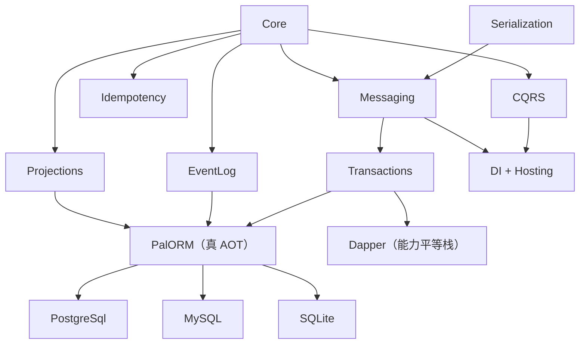
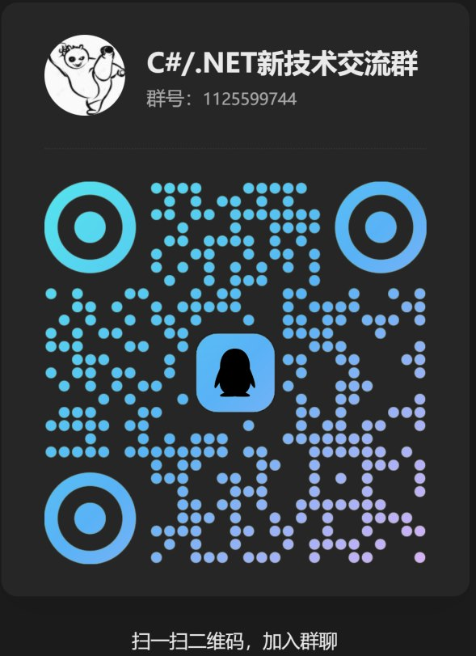

# Pal.DDD

[English](README.en.md) | **中文**

**面向 .NET 11 的 DDD/CQRS/Event Sourcing 基础设施框架：零运行时反射、Native AOT 链路完整、无过度抽象。**

[](https://www.nuget.org/packages/PalDDD.Base)
[](https://dotnet.microsoft.com/)
[](https://github.com/yuebo119/PalDDD/actions/workflows/ci.yml)
[](docs/aot.md)
[](LICENSE)

---

Pal.DDD 将 Entity 的 equality 语义、领域事件的零分配收集、Outbox 的租约锁并发与死信恢复、Saga 的补偿编排与超时检测，标准化为 35 个独立 NuGet 包（另依赖 PalORM 引擎 5 个第三方包，见[包清单](#包清单)）。不做 `IRepository<T>`、不定义 `IIntegrationEvent`、不实施装配扫描：业务代码保持纯 C#，框架只提供基础设施。

| NuGet 包 | 编译期诊断 | 持久化栈 | 实测用例 |
|:---:|:---:|:---:|:---:|
| **35** 个 | **38** 条 | **3** 套 | **1502** 项¹ |

¹ 16 个测试项目，2026-10-08 本机全量实测：1434 通过 + 68 跳过——60 项 Docker 依赖（PalORM 多方言 46 + Integration 14，由 CI Testcontainers 执行）+ 8 项本机 broker 预检不可达；PalORM.Tests 与 Messaging.Integration.Tests 需 Docker。

---

## 目录

- [特性](#特性)
- [与现有方案的差异](#与现有方案的差异)
- [安装](#安装)
- [快速开始](#快速开始)
- [使用](#使用)
- [性能](#性能)
- [AOT 兼容性](#aot-兼容性)
- [功能矩阵](#功能矩阵)
- [包清单](#包清单)
- [项目结构](#项目结构)
- [文档](#文档)
- [FAQ](#faq)
- [贡献](#贡献)
- [许可证](#许可证)

---

## 特性

**DDD 战术模式完整落地**。Entity / AggregateRoot / DomainEvent / ValueObject / SmartEnum / Specification / Saga / EventLog / Projection 全覆盖，且无过度抽象。DbContext *是* 工作单元+仓储，DomainEvent *是* 集成事件，`AddPalCommandHandler<T>` 替代装配扫描：框架消除重复，不增加间接层。

**AOT 是一等公民**。核心层 `IsAotCompatible=true` 强制执行；PalORM 通过源生成器在编译期生成 RowFactory/CommandFactory，实现完整链路 Native AOT（`PublishAot=true` 验证通过）；EF Core、Kafka、RabbitMQ 等非 AOT 安全依赖隔离在显式声明 `IsAotCompatible=false` 的适配器项目中（见 [AOT 兼容性](#aot-兼容性)）。AOT 不是附加功能，它是启动延迟、内存占用和部署安全性的架构决策。

**架构约束编译时执行**。38 条编译期诊断检查领域模型合规性：15 条战略 Roslyn 分析器（PDDD001-015）+ 23 条源生成器诊断（PALID001-007 / PALMSG001-007 / PALENUM001-009）。DomainEvent 未声明 sealed、ProcessManager 缺 `[BoundedContext]`、消息契约命名不符 lowercase-kebab 规范，编译期直接报错。约束不依赖文档纪律或 Code Review 记忆。

**租约锁并发 Outbox**。消息行在数据库事务内原子写入，`(LockedBy, LockedUntil)` 行级租约 + token fencing 支撑多实例并发发布：旧 worker 租约失效后其 UPDATE 因 token 不匹配被拒绝，零丢失零重复，无需分布式锁。死信队列 + 操作重注入，指数退避重试。

**零分配热路径**。ref struct 单链表事件枚举器（foreach 零分配）、FrozenDictionary 路由查找、ValueTask + `IsCompletedSuccessfully` 同步完成零堆分配。零分配不是注释声称：AllocationContractTests 用 `GC.GetAllocatedBytesForCurrentThread` 在运行时断言预算（追加单事件 ≤130B/iter，实测 ~120B）。

**内建可观测性**。`PalActivitySource`（11 个 Start 方法）+ `PalMetrics`（23 个遥测 instrument）预埋在关键路径，OpenTelemetry 配置只需引用 Source 即得全量遥测（命令分发/Saga 转换 Activity 为预留，尚未接线）。

## 与现有方案的差异

| 方案 | 定位 | Pal.DDD 的增量 |
|------|------|:---------------|
| **MediatR** | 进程内命令/查询分发 | 增加 Outbox、Inbox、Saga、EventLog、Projection。分发是起点，不是终点。 |
| **MassTransit / NServiceBus** | 分布式消息总线 | 不绑定特定传输。Outbox 通过 `IMessageBroker` 抽象适配任意 Broker。消息所有权在应用侧。 |
| **EventStoreDB / Marten** | 事件存储 | 提供 `IEventLog` 抽象，存储层可替换为 Dapper 或 EF Core 实现。不锁定供应商。 |
| **手写 DDD** | 完全定制 | 消除每个项目中 Entity、DomainEvent、Dispatcher、Outbox、Saga 的重复实现。基础设施不应成为差异化代码。 |

## 安装

环境要求：.NET SDK 11。

```bash
# 元包方式（推荐快速上手）
# L1 基础元包：领域核心 + 序列化 + 压缩 + 源生成 + 编译期分析器
dotnet add package PalDDD.Base
# L2 全量元包：CQRS + 事件日志 + 幂等 + 投影 + 消息 + 事务 + DI
dotnet add package PalDDD.Extension

# 按需选一个持久化适配器
dotnet add package PalDDD.PalORM.Sqlite       # 推荐，完整链路 Native AOT（或 PostgreSql / MySql）
dotnet add package PalDDD.Dapper.PostgreSql   # 经典手写 SQL（Dapper.AOT 拦截器全量启用）
# 消息代理（可选）
dotnet add package PalDDD.Messaging.Kafka
dotnet add package PalDDD.Messaging.RabbitMQ
```

验证：`dotnet list package` 能列出所装 PalDDD 包即引入成功。所有抽象接口都有 InMemory 实现，单元测试和原型开发无需外部依赖。

| 场景 | 推荐引用 |
|------|---------|
| 学习 / 原型 | Base + Extension + PalORM.Sqlite |
| 生产微服务 | Core + CQRS + Transactions + Transactions.EFCore + PalORM.PostgreSql + Messaging.Kafka |
| 只用领域模型 | Core + Serialization |
| 简单 CRUD API | Core + CQRS + Repository.EFCore + Hosting.AspNetCore |

按需精确控制依赖时，可跳过元包直接引用 [包清单](#包清单) 中的单个包（XML 形态：`<PackageReference Include="PalDDD.Core" />`）。

## 快速开始

### 领域模型

```csharp
using PalDDD.Core;
using ByteAether.Ulid;   // 框架源码内部别名 PalUlid = ByteAether.Ulid.Ulid，示例统一用真实类型

// 强类型 ID — 编译期生成，零反射
[GenerateId(typeof(Ulid))]
public readonly partial record struct OrderId;

// 聚合根 — 单链表事件存储，线程安全
public sealed class Order : AggregateRoot<OrderId>
{
    public string CustomerName { get; private set; } = "";
    public decimal Amount { get; private set; }

    public static Order Create(string name, decimal amount)
    {
        var order = new Order(OrderId.New());   // AggregateRoot<TId> 仅 protected ctor(TId)——Id 只读，构造期确定
        order.RaiseEvent(new OrderCreated(order.Id, name, amount));
        return order;
    }

    public void Cancel(string reason)
        => RaiseEvent(new OrderCancelled(Id, reason));
}

// 领域事件 — sealed class + init 属性 + [GenerateMessage] 源生成注册
// ⚠️ 宿主必须是 class：record 不能继承非 record 的 DomainEvent（CS8864 编译错），
//    且 class 宿主必须标 [BoundedContext]（PDDD001 Error）
[BoundedContext("ordering")]
[GenerateMessage(Name = "ordering.order-created.v1")]
public sealed class OrderCreated : DomainEvent, IDomainEvent
{
    public Ulid OrderId { get; init; }
    public string Name { get; init; } = "";
    public decimal Amount { get; init; }
    static string IDomainEvent.EventName => "ordering.order-created.v1";  // 手写；值须与 Name 一致（PDDD015）
}

[BoundedContext("ordering")]
[GenerateMessage(Name = "ordering.order-cancelled.v1")]
public sealed class OrderCancelled : DomainEvent, IDomainEvent
{
    public Ulid OrderId { get; init; }
    public string Reason { get; init; } = "";
    static string IDomainEvent.EventName => "ordering.order-cancelled.v1";
}
```

### 命令处理器

```csharp
using PalDDD.CQRS;

public sealed record CreateOrder(string Name, decimal Amount) : ICommand<OrderId>;

public sealed class CreateOrderHandler(IUnitOfWork uow) : ICommandHandler<CreateOrder, OrderId>
{
    public async ValueTask<OrderId> HandleAsync(CreateOrder cmd, CancellationToken ct)
    {
        var order = Order.Create(cmd.Name, cmd.Amount);
        await uow.SaveChangesAsync(ct);  // 事务提交 + Outbox 原子写入
        return order.Id;
    }
}
```

### DI 注册与分发

```csharp
// 1. 注册核心栈（Dispatcher + Pipeline + Ulid 身份；不含序列化/持久化/Broker——由对应包显式注册，见 AddPalCoreStack remarks）
services.AddPalCoreStack();

// 2. 注册命令处理器（编译时类型常量，无装配扫描）
services.AddPalCommandHandler<CreateOrder, OrderId, CreateOrderHandler>();

// 3. 选持久化适配器（推荐 PalORM，真 AOT）
services.AddPalOrmSqlite(connectionString);    // 或 PostgreSql / MySql

// 4. 注册 Outbox（事务内原子写入消息行 + 后台轮询发布）
services.AddPalOutbox();

// 5. 分发命令（⚠️ Handler 注册由 Host 驱动——HandlerRegistrar 在 Host 启动时扫描注册；
//    宿主应用用 builder.Services 注册 + app 启动后正常分发。裸 ServiceCollection 直取
//    Dispatcher 调 SendAsync 会抛 HandlerNotFound——完整可运行示例见教程 §3）
var orderId = await dispatcher.SendAsync(new CreateOrder("Alice", 99.9m));
```

从零构建完整应用的分步路径见[教程](docs/tutorial.md)。

## 使用

以下是最常用的五个场景。各组件完整代码示例见[使用指南](docs/usage.md)。

### Outbox：租约锁并发，多实例无重复投递

```csharp
// 注册：Outbox + 后台处理器自动轮询
services.AddPalOrmPostgreSql(connectionString);
services.AddPalOutbox();   // ⚠️ 只注册处理器/Options——Store/序列化器/Catalog/Broker 四件套由调用方注册（见 usage.md「使用 Outbox」）

// 命令处理器：拦截器在 DB 事务提交时原子写入 Outbox 消息行，OutboxProcessor 后台抢租约发布
public sealed class CreateOrderHandler(IOrderRepository orders) : ICommandHandler<CreateOrder, OrderId>
{
    public async ValueTask<OrderId> HandleAsync(CreateOrder cmd, CancellationToken ct)
    {
        var order = Order.Create(cmd.Name, cmd.Amount);
        orders.Add(order);                          // ⚠️ 必须显式 Add——拦截器只处理已跟踪实体
        await orders.SaveChangesAsync(ct).ConfigureAwait(false);
        return order.Id;                            // 消息保证至少一次投递
    }
}
// ⚠️ 栈语义：拦截器写 Outbox 是 EF Core 栈（Repository.EFCore）行为；PalORM 栈的
// UnitOfWork.SaveChangesAsync 无 ChangeTracker（no-op）——PalORM 路径在业务侧显式
// AddMessage(outboxMessage) 或混用 EF Core 仓储（ADR-020 三栈可混用，写路径 EF Core +
// 查路径 PalORM 是官方组合）。

// 发布侧 token fencing（三栈统一）：OutboxProcessor 持租约快照 (owner, lockedUntil)
// 调 MarkProcessed/MarkDead——终态写 SQL 带 AND locked_by = @owner AND locked_until = @until
// 双守卫：租约被其他 worker 重租后旧快照 UPDATE 影响 0 行，迟到标记无法覆盖新持有者。

// 消费侧幂等：Inbox 防重复处理
services.AddPalInbox();  // (ConsumerName, MessageId) 复合唯一约束
```

### Saga：显式状态机 + 补偿编排 + 超时检测

> ⚠️ **Dapper 持久化快照必传**：`DapperSagaStateStore<TState>` 未注册 source-generated `JsonTypeInfo<TState>` 时 `SaveChangesAsync` 会 fail-fast 抛异常（此前版本静默把业务字段写 NULL，数据丢失缺陷已收口）。注册：`services.AddPalDapperSagaSnapshot(jsonTypeInfo)`。详见 [usage.md](docs/usage.md)。

```csharp
public sealed class OrderSaga : Saga<OrderSagaState>
{
    public OrderSaga()
    {
        // 策略配置（模板必配项；默认 Backward/3）
        CompensationPolicy = CompensationPolicy.Backward;   // 逆序补偿——范围/顺序以执行序（ExecutedStepKeys）为准
        MaxRetries = 3;

        // 构造器内 When 注册状态转换（真实 API；无 Configure 方法）
        // 注意：execute 的 state 参数是基类 SagaState——访问子类属性须转型 ((OrderSagaState)state)
        When<PaymentCompleted>("Initial", new SagaStep(
            "CompletePayment",
            execute: (state, evt, ct) =>
            {
                state.CurrentState = "Paid";
                return ValueTask.FromResult(state);
            },
            compensate: (state, ct) =>
            {
                state.CurrentState = "Compensated_CompletePayment";
                return ValueTask.CompletedTask;
            },
            timeout: TimeSpan.FromMinutes(30)));    // 超时自动触发补偿
    }
}

// DI 注册（泛型顺序：TState, TOrchestrator）
services.AddPalSaga<OrderSagaState, OrderSaga>();
// → SagaProcessor 后台轮询 + SagaTimeoutDetector 超时扫描
```

### EventLog 与 Projection：事件溯源，断点续传

EventLog 提供命名流 + 乐观并发 + 全局单调递增位置；Projection 从 EventLog 消费事件重建读模型，断点持久化保证重启后从中断处继续。

```csharp
// 追加事件（乐观并发——版本冲突抛 EventStreamConcurrencyException）
// EventData 七参构造（audit 必填非空——审计元数据是强制语义）：
var result = await eventLog.AppendAsync("order-01HXY...", ExpectedStreamVersion.NoStream, new[]
{
    new EventData(
        PalUlid.New(),                                  // eventId
        "ordering.order-created.v1", 1, "application/json",
        payload, ReadOnlyMemory<byte>.Empty,
        EventAuditMetadata.Capture(actorId: "user-123", reason: "submit order", correlationId: corrId))
}, ct);
// 首写用 NoStream；后续追加用 ExpectedStreamVersion.Exact(result.LastStreamVersion)——照抄 Exact(3) 首写即抛并发异常

// 读取事件流（IAsyncEnumerable）
await foreach (var e in eventLog.ReadStreamAsync("order-01HXY...", ct)) { ... }

// 全局顺序读取（每条事件携带全局递增 Position，Projection 记录最后处理位置即可断点续传）
await foreach (var e in eventLog.ReadAllAsync(checkpoint, ct)) { ... }
```

```csharp
using PalDDD.Projections;

// 投影实现——必须标 [BoundedContext]（PDDD004 Error，IProjectionHandler 实现类强制）
[BoundedContext("ordering")]
public sealed class OrderProjection : IProjectionHandler<OrderCreated>
{
    public string ProjectionName => "ordering.order-view";

    public ValueTask ProjectAsync(OrderCreated evt, ProjectionContext context, CancellationToken ct = default)
        => _readStore.UpsertAsync(evt.OrderId, new OrderView(evt.Name, evt.Amount), ct);
}
// 注册：handler 普通 DI 注册 + checkpoint 存储由持久化适配器注册
// 断点语义：(ProjectionName, SourceName, Position) 复合键 + Revision 单调令牌（EFCore 适配器并发令牌）

// 回放两种模式：ReplayAsync 增量（推荐安全模式——失败旧数据完整）vs RebuildAsync 全量重建
await projectionRebuilder.ReplayAsync(ct);    // 从 Checkpoint 续传增量事件
await projectionRebuilder.RebuildAsync(ct);   // ⚠️ 先清空读模型再全量重放（重建场景专用，非"不停机恢复"）
```

### 编译期 DDD 治理：错误挡在编译期

```csharp
// ✅ 领域事件宿主必须是 sealed class（record 继承非 record 的 DomainEvent 报 CS8864 编译错）
//    class 宿主必须标 [BoundedContext]（PDDD001 Error）且必须 sealed（PDDD012 Error）
[BoundedContext("ordering")]
public sealed class OrderCreated : DomainEvent, IDomainEvent { ... }

// ❌ 忘记 sealed — 编译直接报错
public class OrderCreated : DomainEvent, IDomainEvent { ... }  // PDDD012 + PDDD001（缺 BoundedContext）

// ✅ 消息名 lowercase-kebab + .vN — PDDD009/PDDD010 编译警告
[GenerateMessage(Name = "ordering.order-created.v1")]

// ❌ [GenerateId] 目标忘写 partial — 源生成器直接报错
[GenerateId(typeof(Ulid))]
public readonly record struct OrderId;  // PALID002（非 partial record struct，生成物无法合并）
```

### 消息版本演化：V1→V2 自动升级

> **序列化选型前置**：`AddPalJsonSerialization(catalog => ...)`（默认，AOT 安全）vs `AddPalMemoryPackSerialization`（更快但适配层非 AOT）——两者注册同一 `IMessageSerializer` 单例位，后注册覆盖先注册；从 JSON 切 MemoryPack 会改变 ContentType，历史 payload 兼容性需自行评估。

```csharp
// 演化消息是纯消息契约（纯 record，不继承 DomainEvent）
public sealed record OrderSubmittedV1(Guid OrderId, decimal Amount);
public sealed record OrderSubmittedV2(Guid OrderId, decimal Amount, string? CouponCode);

// ① 启动期契约验证——相邻版本升级路径不完整直接拒绝启动（PalPlatformVerificationException）
services.AddPalMessageContractVerification(b => b.Add<OrderSubmittedV1, OrderSubmittedV2>(
    AppJsonContext.Default.OrderSubmittedV1, AppJsonContext.Default.OrderSubmittedV2,
    old => new OrderSubmittedV2(old.OrderId, old.Amount, null)));

// ② 运行时升级管线——消费侧显式执行链（只支持相邻版本逐步升级）
var pipeline = new MessageEvolutionBuilder()
    .Add<OrderSubmittedV1, OrderSubmittedV2>(oldDescriptor, currentDescriptor,
        old => new OrderSubmittedV2(old.OrderId, old.Amount, null))
    .Build();
var current = pipeline.Upgrade(payload.Span, oldDescriptor, currentDescriptor, serializer);  // v1 payload → v2 实例
```

更多用法见[使用指南](docs/usage.md)：幂等执行（Revision CAS 令牌）、多租户过滤（`[TenantAware]`，见 [PalORM 适配层](docs/palorm-adapter.md)）、InMemory 全链路测试（零外部依赖）、ASP.NET Core Minimal API 端点、Kafka / RabbitMQ 接入。

## 性能

> ⚠️ 以下为 `--smoke` 烟测数据（Stopwatch + GC 分配，单次运行；2026-06-28，Windows 10 x64，.NET SDK 11.0.100-preview.5，BenchmarkDotNet 0.15.8），非正式 BenchmarkDotNet 报告——当前可见最新 BDN 0.15.8 在该工具链下未生成正式报告。烟测只用于趋势检查，不能替代统计严谨的基准测试。

| 操作 | 次数 | 耗时 | 分配 |
|------|:--:|------|:--:|
| PalValidationResult.Success | 1M | 14.12 ms | 88 B |
| SmartEnum.FromValue（FrozenDictionary） | 1M | 18.78 ms | 40 B |
| PalValidationResult.Failed | 1M | 41.10 ms | 40,000,040 B |
| Entity.RaiseEvent（单链表追加） | 1M | 124.80 ms | 128,000,256 B |

验证命令：

```bash
dotnet run --configuration Release --project bench/PalDDD.Benchmarks/PalDDD.Benchmarks.csproj -- --smoke
```

完整数据及 BenchmarkDotNet 历史基线见[性能记录](docs/performance.md)。

## AOT 兼容性

| 层 | 状态 | 说明 |
|----|:--:|------|
| PalDDD.Core · Serialization · Compression | ✅ | `IsAotCompatible=true` 全局继承 |
| PalDDD.CQRS · EventLog · Messaging · Projections · DI | ✅ | 同上 |
| **PalDDD.PalORM + Sqlite / PostgreSql / MySql** | ✅ **真 AOT** | 源生成 RowFactory/CommandFactory，`PublishAot=true` 验证通过（[PalOrmSample](samples/PalDDD.PalOrmSample/)） |
| PalDDD.Dapper + PostgreSql / MySql / Sqlite | ✅ 实测 | `[module:DapperAot]` 已启用——34 调用点全量拦截器接管，三方言 NativeAOT 二进制实测 13/13；边界：绕过封装直用 Dapper 原生 API 不受 AOT 支持 |
| PalDDD.Transactions | ❌ | Saga 反射特例（`IsAotCompatible=false`，见 csproj） |
| **PalDDD.\*.EFCore（5 项目）** | ❌ | EF Core 客户端限制 + Saga 反射特例传导——设计取舍非废弃，EF 生态用户正常使用（运行时 JIT 编译） |
| ~~PalDDD.EntityFrameworkCore~~（旧包） | ❌ | ~~已废弃，源码未入库（OBS-068）——注意区别于上行的五个现行 `*.EFCore` 项目~~ |
| PalDDD.Messaging.Kafka · RabbitMQ | ❌ | Confluent.Kafka / RabbitMQ.Client 限制 |
| PalDDD.Hosting.AspNetCore | ❌ | FrameworkReference 限制 |

`IsAotCompatible=true` + 0 警告 ≠ 运行时安全：声称 AOT 兼容前必须有 `PublishAot` + 运行实测。详见 [AOT 指南](docs/aot.md)、[持久化 AOT 状态](docs/persistence-aot-status.md) 和 [PalORM 适配层文档](docs/palorm-adapter.md)。

## 功能矩阵

### 源生成器（编译期，零运行时反射）

| 生成器 | 产出 | 配套诊断 |
|--------|------|---------|
| IdentityGenerator | `New`/`From`/`Parse`/`TryParse` + JsonConverter/TypeConverter + ISpanParsable | PALID001-007 |
| EnumGenerator | SmartEnum 注册代码（FrozenDictionary O(1)） | PALENUM001-009 |
| MessageRegistryGenerator | MessageCatalog 注册 + GetTypeInfo 桥接 | PALMSG001-007 |

### 消息基础设施

| 组件 | 核心机制 |
|------|---------|
| **Outbox** | 事务内原子写入 + 租约锁 + token fencing 多实例并发发布，指数退避重试，死信队列 + 操作重注入（重试上限 `MaxRetryCount` 可配，重投须幂等消费——运维入口见 [usage.md](docs/usage.md) 死信语义段） |
| **Inbox** | `(ConsumerName, MessageId)` 复合唯一约束，四态生命周期（Pending → Processing → Processed/Failed），僵尸记录超时回收 |
| **Saga** | 显式状态/事件转换注册 → FrozenDictionary 查找，None/Backward/Forward 三种补偿策略（**补偿范围与顺序以执行序 ExecutedStepKeys 为准，非注册序**），超时检测后台服务（含 AwaitingHumanDecision 中断态兜底扫描），人工审批中断+恢复，FanOut 并行子任务（⚠️ **整批 attempt 级重试——executor 必须幂等**，见 `FanOutStep` 重放语义声明） |
| **EventLog** | 命名流 + 乐观并发（ExpectedStreamVersion），全局单调递增位置，`RehydrateFromBytes` 零拷贝读取路径 |
| **Idempotency** | `(OperationName, Key)` 幂等执行 + 结果 payload 缓存（Executed/Cached/Skipped 三态），Revision CAS 令牌防 Completed 翻转后副作用重执行，过期记录可回收重建 |
| **Projection** | `IProjectionCheckpointStore` 断点存储，`EventLogReplaySource<T>` 全量重放，独立于存储适配器 |

### 持久化适配器

> **三栈长期共存声明（2026-09-20 裁决）**：PalORM / Dapper / EF Core 三套适配器**平等支持、长期共存**，无废弃计划。选择依据是场景（AOT 要求 / SQL 控制力 / 生态需求），而非某栈即将退役。五组 Store 能力（Outbox / Inbox / Saga / EventLog / Projection Checkpoint）三栈全量覆盖且行为一致（租约/fencing/守卫同契约，跨栈行为由对照测试守护）；行为差异的显式声明见 [ADR-024](docs/decisions/024-mysql-lease-mutex-divergence-accept.md) 与各 Store remarks。

| 适配器 | AOT | 数据库 | 覆盖范围 |
|--------|:--:|:--:|------|
| **PalDDD.PalORM** | ✅ **真 AOT** | PG / MySQL / SQLite | Outbox / Inbox / Saga / EventLog / Projection / **Idempotency** / UnitOfWork（源生成 + 编译期 SQL，[详见适配层文档](docs/palorm-adapter.md)） |
| PalDDD.Dapper | ✅ 实测 | PG / MySQL / SQLite | 同上七组能力（`[module:DapperAot]` 全量启用，边界见 [AOT 兼容性](#aot-兼容性)） |
| **PalDDD.\*.EFCore**（5 项目） | ❌ 设计取舍 | PG / MySQL / SQLite（SqlServer 实验性 `[Obsolete]`） | Outbox / Inbox / Saga / EventLog / Idempotency / Projection Checkpoint / Repository+UnitOfWork（为需要 **EF 生态**的用户保留：Migration / LINQ 查询 / Interceptor / ChangeTracker） |
| ~~PalDDD.EntityFrameworkCore~~（旧包） | ❌ | — | ~~已废弃，源码未入库（OBS-068）~~ |

### 数据库方言扩展

| 方言 | 特有能力 |
|------|---------|
| PostgreSQL | 多主机故障转移（Failover 主备合并）与读写分离（ReadWriteRouter 双数据源：写主库 + 读副本负载均衡）、COPY 批量写入、Pipeline 单往返批处理、LISTEN/NOTIFY 事件推送、一致性哈希分片、JSONB 操作符、软删除、审计日志 |
| MySQL | 多主机故障转移（FailOver/RoundRobin/LeastConnections，显式 LoadBalance 冲突 fail-fast）、InnoDB 会话调优（锁超时、隔离级别、SQL 模式）、连接池会话保活取舍（ConnectionReset=false） |
| SQLite | WAL 模式 + PRAGMA 优化（三级调优）、FTS5 全文搜索、JSON1 函数 |
| 三方言共同 | 连接串配置期 fail-fast：IPv6 四象限校验（方括号/裸形态）、内嵌端口语法拦截、主机列表空条目/重复条目检测——配置错误在注册期暴露，不延迟到建连 |

## 包清单

PalDDD 自有 35 个包 + PalORM 引擎 5 个第三方包（`PalORM.Core` · `PalORM.SourceGen` · `PalORM.PostgreSql` · `PalORM.MySql` · `PalORM.Sqlite`，独立版本线）。逐包发布清单与版本见[发布包范围](docs/release.md)；当前版本以 [NuGet](https://www.nuget.org/packages/PalDDD.Base) 徽章与 [CHANGELOG](CHANGELOG.md) 为准。

| 层 | 包 |
|----|----|
| Domain（领域纯净层） | PalDDD.Core · PalDDD.Core.SourceGen · PalDDD.Analyzers · PalDDD.Analyzers.CodeFixes |
| App-Abstractions | PalDDD.Serialization · PalDDD.Serialization.Evolution · PalDDD.Serialization.MemoryPack · PalDDD.Messaging · PalDDD.Compression · PalDDD.Compression.Native |
| App-Core | PalDDD.CQRS · PalDDD.EventLog · PalDDD.Idempotency · PalDDD.Projections · PalDDD.Transactions |
| Infra-PalORM（推荐） | PalDDD.PalORM · PalDDD.PalORM.PostgreSql · PalDDD.PalORM.MySql · PalDDD.PalORM.Sqlite |
| Infra-Dapper | PalDDD.Dapper · PalDDD.Dapper.PostgreSql · PalDDD.Dapper.MySql · PalDDD.Dapper.Sqlite |
| Infra-EFCore | PalDDD.Transactions.EFCore · PalDDD.EventLog.EFCore · PalDDD.Idempotency.EFCore · PalDDD.Projections.EFCore · PalDDD.Repository.EFCore |
| Infra-Serialization | PalDDD.Projections.EventLog |
| Infra-Messaging | PalDDD.Messaging.Kafka · PalDDD.Messaging.RabbitMQ |
| Hosting | PalDDD.DependencyInjection · PalDDD.Hosting.AspNetCore |
| 元包 | PalDDD.Base（L1）· PalDDD.Extension（L2） |

## 项目结构

```
src/                         36 源项目 · Clean Architecture（Folder 与 PalDDD.slnx 一致）
├── Domain/                  Core · SourceGen · Analyzers · Analyzers.CodeFixes
├── App-Abstractions/        Serialization · Messaging · Compression · Compression.Native
├── App-Core/                CQRS · EventLog · Idempotency · Projections · Transactions
├── Infra-PalORM/            PalORM（真 AOT）· PalORM.Sqlite · PalORM.PostgreSql · PalORM.MySql  ← 推荐
├── Infra-Dapper/            Dapper · Dapper.PostgreSql · Dapper.MySql · Dapper.Sqlite（Dapper.AOT 已启用）
├── Infra-EFCore/            EventLog.EFCore · Idempotency.EFCore · Projections.EFCore · Repository.EFCore · Transactions.EFCore
├── Infra-Serialization/     Projections.EventLog · Serialization.Evolution · Serialization.MemoryPack
├── Infra-Messaging/         Messaging.Kafka · Messaging.RabbitMQ
├── Hosting/                 DependencyInjection · Hosting.AspNetCore
└── Metapackages/            Base · Extension · Prompts（Prompts 非包，IsPackable=false）

test/                        16 测试项目（TUnit，口径见文首速览表脚注¹）
bench/                       BenchmarkDotNet 性能基准
samples/                     PalOrmSample（AOT 验证）· ECommerce · MinimalApi · AotSample · DapperAotProbe（实验探针，不在 slnx/CI）
docs/                        架构 · 使用指南 · 教程 · ADR
```

依赖方向：Domain → App → Infra → Hosting。每个 src/ 项目对应一个独立 NuGet 包（Prompts 除外，`IsPackable=false`）。


```mermaid
flowchart TB
    Core --> CQRS
    Core --> EventLog
    Core --> Idempotency
    Core --> Projections
    Serialization --> Messaging
    Core --> Messaging
    Messaging --> Transactions
    CQRS --> DI[DI + Hosting]
    Messaging --> DI
    Transactions --> PalORM["PalORM（真 AOT）"]
    EventLog --> PalORM
    Projections --> PalORM
    Transactions --> Dapper["Dapper（能力平等栈）"]
    PalORM --> PG[PostgreSql]
    PalORM --> MySQL
    PalORM --> SQLite
```

## 文档

| 文档 | 说明 |
|------|------|
| [架构说明](docs/architecture.md) | 分层、依赖方向、项目职责 |
| [使用指南](docs/usage.md) | 各组件完整代码示例 |
| [教程](docs/tutorial.md) | 从零构建 DDD 应用 |
| [幂等设计说明](docs/idempotency-rationale.md) | 为什么这样设计：幂等执行的取舍与边界 |
| [PalORM 适配层](docs/palorm-adapter.md) | 六 Store/固化类/Row DTO 与 PalORM 的映射 |
| [工程规范](docs/conventions.md) | 命名、文件组织、DI、AOT |
| [AOT 指南](docs/aot.md) | Native AOT 规则与检查清单 |
| [性能记录](docs/performance.md) | 基准测试数据 |
| [测试体系](docs/testing.md) | 测试金字塔、场景矩阵、BenchmarkDotNet 配置 |
| [发布规范](docs/release.md) | 版本管理、包范围、CHANGELOG 规范与生成流程 |
| [踩坑目录](docs/pitfalls.md) | 83 条 DDD/AOT/并发实战踩坑 |
| [开发流程](docs/development.md) | 开发环境、Git 钩子、测试运行 |
| [架构决策](docs/decisions/) | 24 份 ADR |
| [变更日志](CHANGELOG.md) | 版本历史（消费者变更 + 工程过程附录） |

## FAQ

**和 MediatR 什么关系？**
MediatR 是进程内命令分发器。Pal.DDD 内置与之等价的 Dispatcher + PipelineBehavior，并在此基础上提供 Outbox、Inbox、Saga、EventLog、Projection。只需要命令分发时，CQRS 层可以替代 MediatR；还需要可靠消息投递和 Saga 编排时，Pal.DDD 提供整条链路。与 MassTransit 的关系见[对比表](#与现有方案的差异)：框架不绑定传输，Outbox 经 `IMessageBroker` 抽象适配任意 Broker。

**和 EF Core 什么关系？三套持久化栈怎么选？**
共存，不替代。EF Core 负责对象-关系映射和查询；Pal.DDD 负责 DDD 战术模式。三栈平等支持、长期共存（2026-09-20 裁决），按主诉求选：AOT 发布 + 编译期类型安全选 **PalORM**（源生成 SQL，真 AOT）；极致 SQL 控制力或已有 Dapper 存量代码选 **Dapper**（调用点级 AOT，三方言实测）；需要 EF 生态（Migration、LINQ、Interceptor、ChangeTracker）选 **EF Core** 五项目。三栈可混用：PalORM 做写路径（Outbox/Saga）+ EF Core 做读路径（Projection）是官方组合。

**可以渐进式引入现有项目吗？**
可以。每个 NuGet 包独立可安装：从 `PalDDD.Base`（领域基元）开始，在现有 Service 层旁边逐步引入 CQRS Dispatcher，再按需加 Outbox 或 Saga，不需要一次性重写。老代码继续用 MediatR、新功能用 Pal.DDD，两者共存无冲突。

**为什么单目标 net11.0？**
依赖 .NET 11 的静态特性（JsonSerializerContext 源生成增强、Runtime Async 状态机优化、新 AOT 分析器），多目标在技术上不可行。详见 [ADR-005](docs/decisions/005-net11-single-target.md)。

**有哪些已知限制？**
不支持 .NET 8/9/10（单目标 net11.0）。AOT 场景三处限制（源码 `[RequiresDynamicCode]` 诚实声明）：① Saga 的 ChildSaga 子流程分发（`MakeGenericMethod`/`MakeGenericType`，见 `Saga.cs`）与②动态事件路由同源；③ `ISpecification.Compile()` 表达式树编译在 Native AOT 下不受支持，AOT 场景改用 `ToExpression()` 传给查询提供者（内存路径 `IsSatisfiedBy` 走 `Expression.Compile`，Native AOT 下不支持）。不含内置 EventStore 快照机制，需要快照策略的项目自行实现。CQRS 管道注意：无参开放泛型 `AddPalPipelineBehaviors()` 在 Native AOT 下对值类型响应触发 `AotCannotCreateGenericValueType`，AOT 应用改用 `AddPalCommandHandler<T...>` 或显式 `AddPalPipelineBehaviors<TRequest, TResponse>()`（两种注册先到先得互斥）。

**生产环境有谁在用？**
当前版本 v3.3.0（tag v3.3.0 发布，SemVer Minor：零公共 API 变更、无破坏性行为变更——变更面为依赖消费者可见上移（PalORM 6.3.1 / Confluent.Kafka 2.16.0 / NativeCompressions 1.0.1）与 Kafka broker 后台可观测增强，见 CHANGELOG `[3.3.0]` 段）。核心层（Entity、DomainEvent、CQRS Dispatcher、Outbox、Inbox）在多个内部项目的集成测试套件中验证通过，测试口径见文首速览表脚注¹。欢迎在非生产环境中试用并反馈。

## 贡献

欢迎 issue 与 PR。本项目 clone 后首次构建会自动配置 pre-commit 钩子（`core.hooksPath=.githooks`，12 道本地守卫自动生效，跳过单次提交用 `git commit --no-verify`）；提交前请跑通相关测试套件；涉及公共 API 的改动须同一提交内同步 API 快照与 CHANGELOG。开发环境与测试命令见[开发流程](docs/development.md)。

QQ 交流群 **1125599744**（C#/.NET 新技术交流群）：使用问题、特性建议与版本反馈欢迎进群。

<p align="center">
  
</p>

## 许可证

[GNU Affero General Public License v3.0 or later](LICENSE)

Copyright (C) 2026 PalDDD

本项目使用 AGPL-3.0-or-later 许可证。AGPL v3 在 GPL v3 基础上增加第 13 条网络交互条款：通过网络提供服务时，必须向用户提供修改后版本的完整源代码。详见 [LICENSE](LICENSE) 文件或 <https://www.gnu.org/licenses/agpl-3.0.html>。
