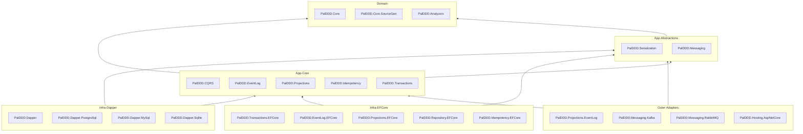
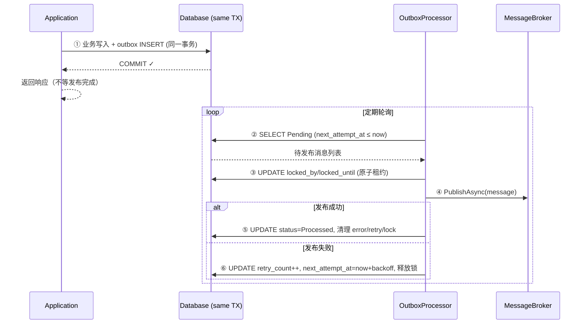
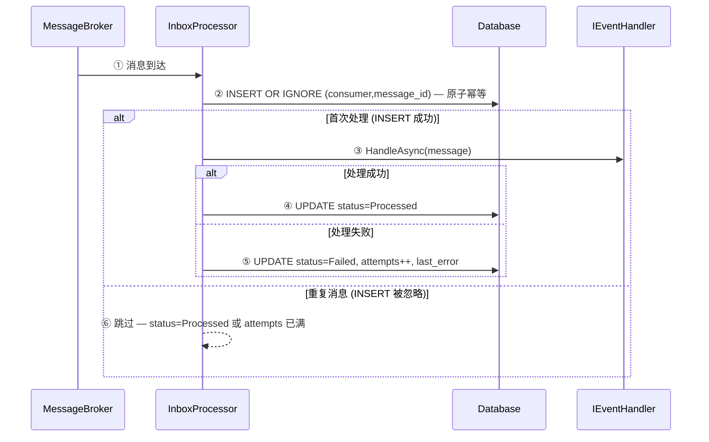
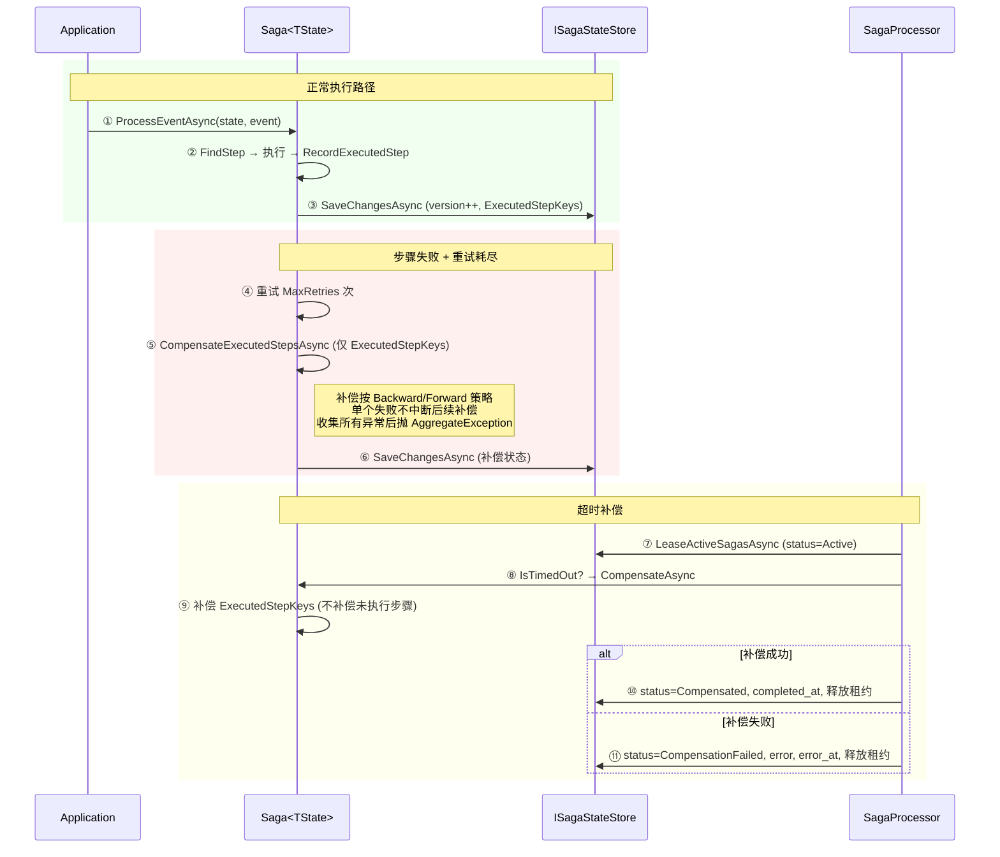

# 架构说明

Pal.DDD 采用小型、显式、AOT 友好的 Clean Architecture 分层架构。30 个源项目按依赖方向从 Core 到 Infrastructure/Adapters 逐层排列。项目不是应用框架，而是一组可组合的 DDD/CQRS/消息/事务基础设施库。

## 分层边界

```text
Infrastructure / Adapters
  PalDDD.Repository.EFCore          -- UnitOfWork + OutboxDomainEventInterceptor
  PalDDD.Transactions.EFCore        -- OutboxDbContext/InboxDbContext/SagaStateDbContext
  PalDDD.EventLog.EFCore            -- EventLogDbContext + Hi/Lo EventLogPositionReserver
  PalDDD.Projections.EFCore         -- ProjectionCheckpointDbContext
  PalDDD.Idempotency.EFCore         -- IdempotencyDbContext
  PalDDD.Dapper                    -- Dapper 统一持久化（Outbox/Inbox/Saga/EventLog/Projection/UnitOfWork + SqlTemplates/DapperBulkCopy）
  PalDDD.Dapper.MySql              -- MySqlDataSource DI + InnoDB 性能优化 + 多主机
  PalDDD.Dapper.PostgreSql         -- NpgsqlDataSource + COPY/JSONB/NOTIFY/Sharding/读写分离
  PalDDD.Dapper.Sqlite             -- SQLite FTS/JSON 扩展 + WAL 优化
  -> PalDDD.Messaging
  -> PalDDD.EventLog
  -> PalDDD.Transactions
  -> PalDDD.Projections
  -> PalDDD.Idempotency
  -> PalDDD.Serialization.Evolution
  -> PalDDD.Serialization
  -> Optional adapters

Core
  PalDDD.Core
  PalDDD.Analyzers
  PalDDD.Core.SourceGen

App-Abstractions
  PalDDD.Serialization          — 消息描述符、不可变消息目录、序列化接口（IUnitOfWork 已合并入 PalDDD.Core / PalDDD.Core.Repository 命名空间）
  PalDDD.Messaging              — 领域事件派发 + Broker 抽象

Adapters
  PalDDD.Repository.EFCore       — UnitOfWork + OutboxDomainEventInterceptor
  PalDDD.Transactions.EFCore     — OutboxDbContext/InboxDbContext/SagaStateDbContext
  PalDDD.EventLog.EFCore         — EventLogDbContext + Hi/Lo EventLogPositionReserver
  PalDDD.Projections.EFCore      — ProjectionCheckpointDbContext
  PalDDD.Dapper      — DapperProjectionCheckpointStore
  PalDDD.Projections.EventLog    — EventLogReplaySource
  PalDDD.Idempotency.EFCore      — IdempotencyDbContext
  PalDDD.Hosting.AspNetCore      — ExceptionMiddleware + HealthChecks
  PalDDD.Messaging.Kafka         — KafkaBroker（Confluent.Kafka 2.x）
  PalDDD.Messaging.RabbitMQ      — RabbitMqBroker（RabbitMQ.Client 7.x，全异步）
```

核心包只依赖稳定抽象。EF Core、ASP.NET Core、Kafka、RabbitMQ 均是外圈适配层，避免把基础设施约束扩散到领域和 CQRS 层。



## 新增组件（v0.1.0）

| 组件 | 层 | 说明 |
|------|:--:|------|
| `InMemoryInboxStore` | Transactions | IInboxStore 内存实现 —— 单元测试开箱即用 |
| `InMemoryOutboxStore` | Transactions | IPalOutboxStore 内存实现 —— 租约模式 |
| `InMemorySagaStateStore<T>` | Transactions | ISagaStateStore 内存实现 —— Saga 测试 |
| `PalDDD.Testing` | test/ | 共享测试基础设施 —— RecordingActivity/MeterListener |
| `SagaStatus` 枚举 | Transactions | 替代 IsCompleted/IsDeadLettered/CompensationError |
| `PALENUM001` 警告 | SourceGen | EnumGenerator 空字段诊断 |
| `WithTrackingName` | SourceGen | 3 个生成器管线命名（Roslyn 调试可见性） |

## 项目职责

| Project | 职责 |
| --- | --- |
| `PalDDD.Core` | 实体、聚合根、领域事件、值对象、智能枚举、源码生成器标记。 |
| `PalDDD.Analyzers` | bounded context、领域模型、process manager、projection handler 和领域事件消息契约的编译期治理规则。 |
| `PalDDD.Analyzers.CodeFixes` | 上述 PDDD001-015 规则的代码自动修复。 |
| `PalDDD.Core.SourceGen` | 生成强类型 ID、智能枚举注册、消息目录辅助代码。 |
| `PalDDD.CQRS` | 请求模型、handler、dispatcher、验证/日志 pipeline behaviors。 |
| `PalDDD.DependencyInjection` | AOT-safe 显式 DI 注册 API（`AddPalDDD`、`AddPalCommandHandler<T,...>` 等）。 |
| `PalDDD.Prompts` | 元包 + AI 提示模板（`.pal/prompts/` 9 份）。 |
| `PalDDD.EventLog` | append-only 事件日志、审计元数据、乐观并发和有序回放抽象。 |
| `PalDDD.EventLog.EFCore` | EF Core durable event log base context。 |
| `PalDDD.Messaging` | 领域事件派发、broker 抽象（进程内 EventBus 已移除，统一 Outbox 模式）。 |
| `PalDDD.Projections` | Read Model 投影处理、checkpoint store 抽象和内存实现。 |
| `PalDDD.Projections.EventLog` | 把 append-only EventLog stream 转换为 projection replay source。 |
| `PalDDD.Dapper` | Dapper projection checkpoint store 实现。 |
| `PalDDD.Idempotency` | 命令/API 幂等处理、idempotency store 抽象和内存实现。 |
| `PalDDD.Serialization` | 消息描述符、不可变消息目录、序列化接口，含 JSON 序列化器（`PalDDD.Serialization.Json` 命名空间，无独立项目）。 |
| `PalDDD.Serialization.Evolution` | 显式消息 schema version 升级执行链。 |
| `PalDDD.Serialization.MemoryPack` | MemoryPack 二进制序列化器适配（AOT 安全，零反射）。 |
| `PalDDD.Repository.EFCore` | EF Core UnitOfWork、领域事件 interceptor。 |
| `PalDDD.Transactions` | Outbox/Inbox/Saga 处理器、store 抽象和 options。 |
| `PalDDD.Transactions.EFCore` | EF Core Outbox/Inbox/Saga store base contexts。 |
| `PalDDD.Dapper` | Dapper Outbox/Inbox/Saga store 基础实现 + SqlTemplates。 |
| `PalDDD.Dapper.PostgreSql` | PostgreSQL 扩展（COPY/Pipelining/NOTIFY/JSONB/多主机/分片/软删除）。 |
| `PalDDD.Dapper.MySql` | MySQL 扩展。 |
| `PalDDD.Dapper.Sqlite` | SQLite 扩展。 |
| `PalDDD.Hosting.AspNetCore` | Web hosting helpers、异常处理中间件、健康检查。 |
| `PalDDD.Messaging.Kafka` | Kafka broker adapter。 |
| `PalDDD.Messaging.RabbitMQ` | RabbitMQ broker adapter。 |
| `PalDDD.Dapper` | Dapper durable event log 实现。 |
| `PalDDD.Dapper` | Dapper UnitOfWork 实现。 |

## 依赖方向

核心依赖方向只允许从外层指向内层：

- `Core` 不依赖任何基础设施包。
- `Analyzers` 只在编译期运行，通过元数据名识别 Pal.DDD API，不参与运行时执行链。
- `CQRS` 只依赖 `Core` 和 Microsoft.Extensions 抽象；不引用 messaging、repository 或 transaction 包。
- `Repository` 不依赖 `Core`；它只表达事务提交边界。
- `EventLog` 不依赖 EF Core、broker 或具体 serializer，只保存 bytes + metadata。
- `Messaging` 依赖 `Core` 和 `Serialization`。
- `Projections` 和 `Idempotency` 不依赖 EF Core 或 broker，只表达应用层幂等执行边界。
- `Projections.EventLog` 是外圈 adapter，只依赖 `EventLog`、`Projections` 和 `Serialization`。
- `PalDDD.Dapper` 统一持久化，只依赖 `Projections` 和 Dapper transaction 方言枚举。
- `Serialization.Evolution` 只依赖 serialization 抽象，不依赖具体 JSON serializer。
- `Transactions` 依赖抽象和 messaging，不依赖 EF Core。
- EF Core 只存在于 `Repository.EFCore`、`Transactions.EFCore`、`EventLog.EFCore`、`Projections.EFCore` 和 `Idempotency.EFCore` 等外圈 adapter。
- broker adapter 不依赖 `Serialization.Json`，只依赖 serialization 抽象。

`test/PalDDD.DependencyInjection.Tests/ArchitectureBoundaryTests.cs` 中有边界测试防止核心包重新耦合到基础设施实现。

## CQRS 执行模型

1. 用户通过 `AddPalCommandHandler<TCommand,TResponse,THandler>()` 或 `AddPalQueryHandler<TQuery,TResponse,THandler>()` 显式注册 handler。
2. 注册 API 创建 `HandlerMarker`，记录 request type、handler type、response type 和静态 executor。
3. `HandlerRegistrar` 作为 hosted service 在启动时把 marker 注册进 `Dispatcher`。
4. `Dispatcher.Freeze()` 将注册表转换为 `FrozenDictionary`，之后不再允许注册。
5. 每次请求创建 scope，解析 handler 和 pipeline behavior，执行验证和日志行为。

这条路径避免 runtime assembly scanning 和 `MakeGenericType` 动态构造。

CQRS 层不提供 `[Transaction]` attribute 或隐式事务 pipeline。最优边界是让命令 handler 显式编排事务，或由外层 UnitOfWork、EF Core transaction、Outbox 适配层承接一致性需求。这样 CQRS 不需要依赖 repository 抽象，也不会通过 attribute 反射把事务策略隐藏在请求类型上。

## 后台处理器与 Broker 适配

`PeriodicBackgroundProcessor` 是 OutboxProcessor 和 SagaProcessor 的共享基类，封装 PeriodicTimer 生命周期 + 循环 + 异常隔离。子类只需实现 `ExecuteTickAsync`（每轮逻辑）和 `OnTickFailed`（错误日志），基类保证循环不因单轮异常中断。

`MessageBrokerBase` 是 KafkaBroker 和 RabbitMqBroker 的共享基类，封装泛型 Publish 转发 + 消息目录查找契约（Find-or-throw）。子类只需实现传输相关的 `PublishAsync`（带 context）和 `SubscribeAsync`，新增 Broker 适配器（如 Azure Service Bus）只需继承基类并实现传输核心。

## 领域事件和持久化

`Entity` 使用单链表保存领域事件，避免常规集合在无事件场景下的分配。EF Core 适配层通过 `SaveChangesInterceptor` 收集并清理事件：

- `OutboxDomainEventInterceptor`（唯一推荐）：保存前把领域事件写入 Outbox，让事件和业务数据在同一事务提交。
- ~~`DispatchingDomainEventInterceptor`~~（已在 v0.2.0 移除）：保存成功后派发领域事件——AT-MOST-ONCE 语义不可靠，broker 不可达时事件永久丢失。

使用 Outbox 时，事件类型必须是 `sealed`，声明 `[GenerateMessage]` 并已在 `IMessageCatalog` 中注册；未 sealed 会由 `PDDD012` 在编译期失败，缺少 `[GenerateMessage]` 会由 `PDDD005` 在编译期失败，未注册 descriptor 会在运行时快速失败。领域事件的 wire name 必须是稳定小写名称、`SchemaVersion` 必须大于等于 1、wire name 必须包含匹配版本的 `.v{n}` 后缀，并属于同一个 bounded context，例如 `[BoundedContext("ordering")]` 对应 `ordering.*`，由 `PDDD009`、`PDDD011`、`PDDD010` 和 `PDDD008` 防止事件契约命名漂移、非法版本、版本漂移和跨上下文漂移。`IDomainEvent.EventName` 还必须与 `[GenerateMessage(Name = "...")]` 完全一致，由 `PDDD015` 防止同一事件在 dispatcher、trace、EventLog 和 broker 中出现两套名称。

消息层只保留已接入运行时执行链的抽象：domain event dispatcher、event handler 和 broker。

`IterativeDomainEventDispatcher` 派发单个领域事件时会通过 `PalActivitySource` 创建 `Event Dispatch` activity，并写入 `pal.event` tag。handler 成功调用后会记录 `paldd.event_handlers.handled`，handler 抛出异常时会记录 `paldd.event_handlers.failed`，activity 会标记为 `Error`，同时保持异常向调用方传播，便于跨上下文 trace 将领域事件处理失败与上游命令、Outbox/Inbox 或投影链路关联。

**进程内事件总线（`EventBus`）已被移除**——统一使用 Outbox 模式进行可靠事件发布。事件发布吞吐可通过 `paldd.eventlog.appended`（EventLog 写入）和 `paldd.outbox.processed`（Outbox 发布）metric 观测。

Repository 层不再提供 `IRepository<TAggregate,TKey>` 或 `RepositoryBase`。EF Core 的 `DbContext` 已经实现 Unit of Work 和 Repository 模式；Pal.DDD 只保留跨 handler/适配器需要共享的事务提交抽象，查询与聚合持久化由应用层直接使用 `DbContext` 或显式业务仓储表达。

## 跨进程消息模型

跨进程消息 payload 是普通 CLR 类型，不需要实现 `IIntegrationEvent` marker。稳定 wire name、schema version、content type 由 `MessageDescriptor` / `IMessageCatalog` 提供；message id 由 Outbox 或 broker 调用方显式传入。这样 payload 不被基础设施接口污染，也避免 broker adapter 通过类型判断偷读业务属性。

Outbox 发布时使用 `OutboxMessage.Id` 作为 broker message id，并通过 `MessagePublishContext` 传播 correlation、causation、`traceparent` 和 `tracestate`。直接调用 `IMessageBroker.PublishAsync<TMessage>()` 时 broker 生成新的 message id；需要幂等、分区或跨上下文追踪语义的生产路径应优先经过 Outbox。

事件 schema 演进不通过孤立的 `IUpcaster<TFrom,TTo>` 占位接口表达。`PalDDD.Serialization.Evolution` 提供完整执行链：旧 wire descriptor -> source-generated deserializer -> explicit converter -> current message descriptor。它不要求 payload 实现 marker interface，也不暴露未接入运行时路径的 upcaster 占位。

## 面向未来的 DDD 基础设施

Pal.DDD 已经覆盖 DDD 基础设施的最小闭环：领域模型、领域事件、CQRS dispatch、显式 DI、AOT-safe serialization、schema evolution、Outbox/Inbox/Saga、Projection、Command Idempotency、EF Core persistence adapter、broker adapter 和 ASP.NET Core hosting。

下一阶段最值得建设的是应用层模板和外圈 adapter，而不是把更多策略塞进核心包：

- **Bounded Context 模板**：按业务上下文组织 command/query/handler/DbContext/projection，核心包只提供注册和约束。
- **生产 store adapter**：继续完善 EventLog、Projection、Idempotency、Outbox/Inbox/Saga 的数据库 provider 差异和迁移模板。
- **Schema Evolution catalog helper**：从消息目录自动选择当前 descriptor 和旧版本升级链。
- **Aspire / OpenTelemetry Service Defaults**：把运行时观测、健康检查、OTLP exporter 和本地编排放到应用模板。
- **Event Sourcing Adapter**：作为可选外圈 adapter，而不是替代当前状态存储 + Outbox 默认路径。

不建议加入核心包的能力：通用 repository、隐式事务 attribute、运行时程序集扫描、全局 service locator、未接入执行链的 middleware/filter/upcaster 占位、跨 bounded context 的分布式事务。

## EventLog

`PalDDD.EventLog` 提供 append-only 事件日志的核心抽象：

1. `AppendAsync` 接收 stream name、`ExpectedStreamVersion` 和一组 `EventData`。
2. `ExpectedStreamVersion.NoStream`、`Exact(version)`、`StreamExists` 和 `Any` 表达乐观并发控制。
3. 成功写入后返回 stream version 和 global position，二者均从 `0` 开始递增。
4. `ReadStreamAsync` 按 stream version 回放单流事件；`ReadAllAsync` 按 global position 回放全局事件。
5. `EventAuditMetadata` 保存 actor、reason、correlation/causation 和 W3C trace context。

该包只提供执行模型和内存实现。生产环境应使用外圈持久化 adapter，把 expected version 检查映射为数据库唯一约束、事务隔离或事件存储的 expected revision。

生产事件日志持久化通过可选 `PalDDD.EventLog.EFCore` 包提供 `EventLogDbContext`。它把 `StoredEvent.GlobalPosition` 作为由事件日志分配的稳定主键，关系型 provider 下使用 serializable transaction 保护 `Max + 1` 的 position 分配，并配置 `(StreamName, StreamVersion)` 唯一索引和 `EventId` 唯一索引，持久化 payload、metadata、actor、reason、correlation/causation 和 W3C trace context。核心 `PalDDD.EventLog` 包不依赖 EF Core，durable store 只位于外圈 adapter。

EventLog append 通过 `PalActivitySource` 发出 `EventLog Append` activity，包含 stream、event count、stream version range 和 global position range 标签。这些标签用于把命令处理、Outbox 发布、投影重建和事件日志写入串成可追踪链路。

EventLog append 还会通过 `PalMetrics` 记录 `paldd.eventlog.appended`，用于统计事件日志写入吞吐和审计事件增长趋势。

EventLog read/replay 通过 `EventLog ReadStream` 和 `EventLog ReadAll` activity 覆盖单流回放和全局回放边界，包含起始 stream version / global position 和 read count 标签。投影重建、审计回放和跨上下文诊断可以用这些 span 观察历史事件读取范围。

EventLog read/replay 还会通过 `PalMetrics` 记录 `paldd.eventlog.read`，用于统计审计回放、投影修复和跨上下文诊断读取吞吐。

## Projections

`PalDDD.Projections` 用 checkpoint 表达 Read Model 重放边界：

1. `ProjectionProcessor<TMessage>` 先用 `IProjectionCheckpointStore.TryStartAsync` 获取 `(ProjectionName, SourceName, Position)` 的处理权。
2. 已完成或仍在处理中时返回 `false`，调用方可以安全跳过重复消息。
3. handler 成功后标记 `Completed`；失败时标记 `Failed` 并重新抛出原异常。

Projection handler 必须声明稳定小写 `ProjectionName` 字面量，并属于声明的 bounded context，例如 `[BoundedContext("ordering")]` 对应 `ordering.*`。`PDDD007` 和 `PDDD013` 在编译期治理 projection name 的稳定性和上下文归属。该名称进入 checkpoint key、重建任务、追踪标签和治理报表，不能由运行时状态或 CLR 类型名推断。

该包只提供执行模型和内存 store。生产环境应使用外圈持久化 adapter，用数据库唯一约束保证 checkpoint 幂等。

`PalDDD.Projections.EventLog` 提供 `EventLogReplaySource<TMessage>`，把 `IEventLog.ReadStreamAsync` 的 `RecordedEvent` 转换为 `ReplayEvent<TMessage>`：

1. 使用 `MessageDescriptor` 校验 wire name、schema version 和 content type。
2. 使用 `IMessageSerializer` 反序列化 payload，保持 source-generated / AOT-safe 路径。
3. 使用 stream version 作为 projection checkpoint position。
4. 契约不匹配时快速失败，避免静默丢失事件或污染 read model。

Projection rebuild 通过 `PalActivitySource` 发出 `Projection Rebuild` activity，包含 projection name、source 和 replayed 计数标签。这个 span 用于重建窗口、事件回放范围和 read model 修复任务的跨上下文追踪。

Projection rebuild 还会通过 `PalMetrics` 记录 `paldd.projection.replayed`，用于统计 read model 修复、重建窗口和事件回放吞吐。

生产 checkpoint 持久化通过可选 `PalDDD.Projections.EFCore` 包提供 `ProjectionCheckpointDbContext`，也可通过 `PalDDD.Dapper` 包使用 `DapperProjectionCheckpointStore`。二者都使用 `(ProjectionName, SourceName, Position)` 复合主键防止重复投影处理；EF Core 使用 `Revision` concurrency token，Dapper 使用 `revision` 条件更新保护失败重试和状态写入。核心 `PalDDD.Projections` 包不依赖 EF Core 或 Dapper。

## Idempotency

`PalDDD.Idempotency` 面向 API/command idempotency key，不替代 Inbox：

- Inbox 解决 broker consumer 的 `ConsumerName + MessageId` 幂等。
- Idempotency 解决 HTTP/API command retry 的 `OperationName + Key` 幂等。

`IdempotencyProcessor` 会缓存成功结果 payload，重复请求返回 `Cached`，未完成或已锁定请求返回 `Skipped`。结果序列化由调用方显式提供，避免强绑定某个 serializer。

Command/API idempotency 通过 `PalActivitySource` 发出 `Idempotency Execute` activity，包含 operation name、idempotency key 和 executed / cached / skipped / failed 结果标签。API retry、command dispatch 和最终 Outbox publish 可以在同一个 tracing source 中串联。

Command/API idempotency 还会通过 `PalMetrics` 记录 `paldd.idempotency.executed`、`paldd.idempotency.cached`、`paldd.idempotency.skipped` 和 `paldd.idempotency.failed`，用于区分真实执行、缓存命中、活动 lease 跳过和 handler 失败。

生产持久化通过可选 `PalDDD.Idempotency.EFCore` 包提供 `IdempotencyDbContext`。它使用 `(OperationName, Key)` 复合主键保证幂等键唯一，使用 `UpdatedAt` optimistic concurrency token 保护过期 lease 复用和完成状态写入；核心 `PalDDD.Idempotency` 包不依赖 EF Core，保持 AOT-first 边界。

## Transactions

### Outbox

`OutboxProcessor` 是 singleton hosted service，按官方推荐通过 `IServiceScopeFactory` 创建 scope，再解析 scoped `OutboxBatchProcessor`。store 必须实现原子租约获取，避免多实例重复发布。`OutboxBatchProcessor` 发布时会把 `OutboxMessage` 上的 correlation、causation 和 W3C trace context 转换成 broker publish context；Kafka/RabbitMQ adapter 会写入传输 headers/properties。

Outbox 批处理同时通过 `PalActivitySource` 发出 `Outbox Process` activity，包含实际 batch size、processed、dead 和 retried 计数标签。库只产生 `ActivitySource` telemetry，不绑定 OpenTelemetry exporter；应用层通过 Aspire Service Defaults 或 OpenTelemetry `AddSource(PalActivitySource.Name)` 负责采集。

Outbox 批处理还会通过 `PalMetrics` 记录 `paldd.outbox.processed` 与 `paldd.outbox.failed`，使发布吞吐、重试和死信路径可以在不解析日志的情况下被告警和看板聚合。

生产持久化通过可选 `PalDDD.Transactions.EFCore` 包提供 `OutboxDbContext` 和 SQL Server 专用 `SqlServerOutboxDbContext`。通用 base context 负责状态映射、pending 查询过滤、成功/死亡/重试状态转换；SQL Server base context 使用 `UPDLOCK` / `READPAST` 在数据库内原子获取 lease，避免多实例重复发布。核心 `PalDDD.Transactions` 包只依赖 `IPalOutboxStore` 抽象。

### Inbox

`InboxProcessor` 使用 `IInboxStore` 记录 `ConsumerName + MessageId`，通过存储唯一约束提供幂等消费。处理失败后记录 `Failed` 和错误原因，由消息 broker 重投递或 DLQ 策略决定后续处理。

Inbox 幂等消费通过 `PalActivitySource` 发出 `Inbox Process` activity，包含 consumer、message id 和 processed / skipped / failed 结果标签。重复消息、僵尸 processing 超时重入和 handler 失败都可以在同一 tracing source 中与 broker delivery、Outbox publish 和 projection 更新关联。

Inbox 幂等消费还会通过 `PalMetrics` 记录 `paldd.inbox.processed`、`paldd.inbox.skipped` 和 `paldd.inbox.failed`，用于区分真实消费吞吐、重复投递去重效果和 handler 失败率。

生产持久化通过可选 `PalDDD.Transactions.EFCore` 包提供 `InboxDbContext`。它使用 `(ConsumerName, MessageId)` 唯一索引保证每个 consumer 的消息只进入一个 durable processing 记录，未超时 `Processing` 和已 `Processed` 记录会跳过，`Failed` 或超时 lease 会重入 `Processing` 并递增 attempts；核心 `PalDDD.Transactions` 包不依赖 EF Core，保持 AOT-first 边界。

### Saga

`Saga<TState>` 提供状态机、步骤执行、补偿、重试和超时检测。`SagaTimeoutProcessor<TState>` 通过 `SagaProcessorOptions.TimeoutScanBatchSize` 有界租约扫描活跃 saga，`LeaseOwner` + `LeaseDuration` 避免多实例重复补偿同一状态。

Saga 完成时会通过 `PalMetrics` 记录 `paldd.saga.completed`，超时补偿成功后会记录 `paldd.saga.compensated`，用于统计流程管理完成量、补偿吞吐和超时恢复趋势。

生产持久化通过可选 `PalDDD.Transactions.EFCore` 包提供 `SagaStateDbContext<TState>`。它使用 `SagaId` 主键、active/lease 查询索引和 `Version` 乐观并发令牌，并通过 source-generated JSON converter 持久化 `StepStartedAt` 与 `ExecutedStepKeys`，使超时补偿和已执行步骤回放不依赖反射序列化。Dapper 适配器可通过 `JsonTypeInfo<TState>` 将完整 Saga 状态快照写入 `saga_data`，并通过 `leased_by` / `leased_until` 做多实例租约扫描。

## 为什么 EF Core 在适配层

EF Core 的 Native AOT / precompiled query 支持仍有明显限制，且 provider 差异较大。Pal.DDD 的最优边界是：

- 核心事务、消息和序列化抽象保持 AOT-safe。
- EF Core 作为可替换适配层隔离。
- 需要数据库能力的应用在外层选择 EF Core、MongoDB、Redis、DynamoDB 或自定义 store。

## 事务一致性流程

### Outbox 发布流程

Outbox 确保"事件持久化 → 消息发布"的 at-least-once 语义。消息保存与业务数据在同一事务中，异步发布。



### Inbox 幂等消费

Inbox 防止重复消息导致业务逻辑重复执行。同一 `(consumer_name, message_id)` 只处理一次。



### Saga 补偿流程

Saga 在步骤失败时补偿已执行步骤，超时时补偿全部已执行步骤。



## 稳定性约束

- 不做 runtime assembly scanning。
- 不依赖默认反射 JSON 序列化。
- 不在核心层引用 EF Core 或具体 broker。
- 不把跨进程消息元数据放进 payload marker interface。
- 不维护自定义 ambient context carrier 或 HTTP tracing middleware；应用层使用 OpenTelemetry/Aspire Service Defaults。
- 新增 public API 必须可被 analyzer 验证。
- 后台服务不能直接构造 scoped 依赖，必须按 scope 解析。
