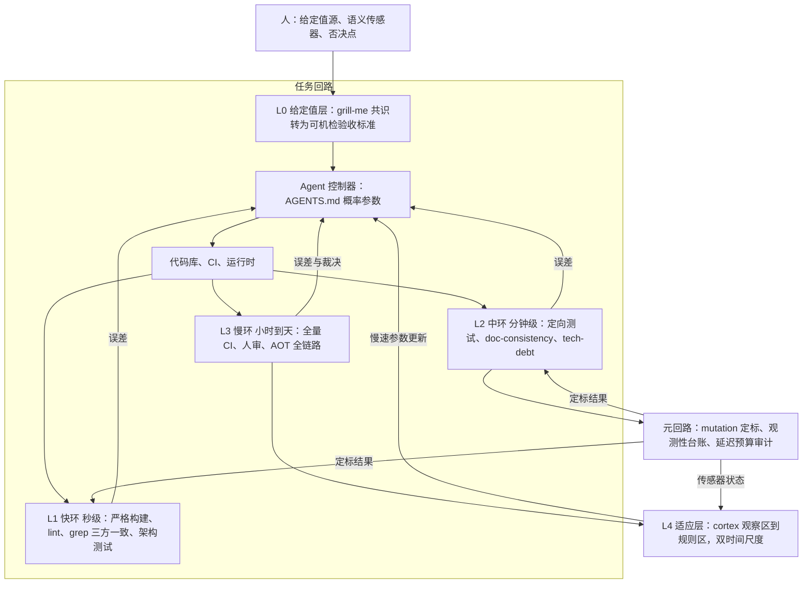

# 工程控制论质量系统设计方案

- 状态：提案，待裁决（裁决点见第 9 节）
- 日期：2026-08-20
- 范围：AI 编码质量体系（AGENTS.md、`.ai/` 脚本门禁、cortex 记忆）的控制论化改造
- 一句话结论：新增组件四个（观测性台账、翻转检测器、任务路由器、适应分层），改造两个（定标调度、规则下沉管道），其余复用现有件；总量约 9 到 12 个工作日加试点观察期；每条新增规则绑定可证伪预测，用试点而非信仰采纳

## 1. 背景与定位

现状判断：本仓质量系统在多轮事故驱动的迭代中已收敛为一组回路（严格构建门、test-gate、doc-consistency、tech-debt 扫描、mutation 实验、跨会话三核实等），约八成规则具备控制论结构。缺口在于：回路参数（延迟、频率、增益、限幅）停留在隐性状态；传感器定标无调度、无台账；修复回路无发散检测；规则与记忆的单事件更新无时间尺度约束。

本方案做什么：用工程控制论把隐性回路显式化为可审计架构，补全四个缺失组件，并把验证投资从经验分配改为按风险分配。

本方案不做什么：不改动业务代码；不替换 AGENTS.md 既有准则。Karpathy 准则、辩证决策流程、诊断三步骤继续有效，本方案与其正交互补：辩证法管决策生成（想得对不对），控制论管决策执行的误差收敛（做得对不对）。

## 2. 论证结论摘要

### 2.1 三个形式模型

**Model A 采样律。** 设每步改动以概率 p 引入缺陷并独立存留；每 n 步做一次验证，成本 v；单缺陷修复成本为 c0 + c1·d^α，d 为从引入到检出的步数，耦合代码库 α ≥ 1。对 d 取区间均值 n/2，α = 1 时最优验证间隔：

```
n* = sqrt( 2v / (p · c1) )
```

推论：n* 随 p 递减（agent 的缺陷率高于人类一个量级，故最优步长显著更小）；随 v 递减（传感器越便宜越该密集用）；随 c1 正相关（高耦合代码更该小步）。缺陷相关性与传感器不完美均不改变单调性。

**Model B 反馈价值条件。** 开环输出质量由控制器（模型）内部保真度 m 封顶；闭环收益条件为 p × 逃逸代价 > v。边界情形 m = 1（任务完全在模型可靠区内）时开环最优，任何验证都是纯税。推论：验证投入与任务新颖度成正比，这是分档路由的理论依据。

**Model C 修复回路收敛条件。** 设传感器检出率为 s，修复动作注入新缺陷率为 p'（修 A 坏 B），误差动力学 e(k+1) = (1-s)·e(k) + p'·a(k)，收敛充要条件：

```
s > p'
```

推论：test-gate 的 0 FAIL 门禁是在保 s；修复尝试 ≤ 3 次是在 s 无法提高时切断发散；修前先写复现测试是把 s 从 0 提到 1。操作含义：接到修复任务先估 s（有无测试能看见此错误）与 p'（改动是否外溢），s ≤ p' 时先补传感器再动手。

### 2.2 五条可证伪预测

| # | 预测 | 证伪条件 | 检验方式 |
|---|---|---|---|
| 1 | 固定 p 与 c1 时，验证间隔减半使单缺陷平均修复成本约减半 | 实测无相关或反向 | 试点记录 |
| 2 | 无定期定标的门禁，假绿率随代码与文档格式演化单调上升 | 回测格式变更点后假绿率不升 | git 历史 + 定标实验 |
| 3 | 失败任务中"同点翻转加新增失败"占比显著高于成功任务 | 任务日志统计无差异 | 翻转检测器数据 |
| 4 | 小步提交批次的变更失败率不高于大批次（与 DORA 研究共识一致） | 本仓 commit 粒度与 hotfix 率回测为正相 | git 历史回测 |
| 5 | 规则以单事件频率更新的系统，条目来回增删率高 | 记忆与规则修订历史无此模式 | cortex / AGENTS.md 历史 |

预测 2 与 3 是控制论特有主张的直接检验，与"反馈有用"这一平凡结论无关。

### 2.3 证据分级与诚实声明

| 级别 | 内容 | 性质 |
|---|---|---|
| L1 本仓实证 | mutation 实验 WARN 2 而 exit 0 事故（未定标传感器放行坏输入）；Kafka 探测死区 900 秒削至 5 秒 | 直接但样本少，数字来自会话记忆，引用前需复核 |
| L2 外部研究 | 库幻觉率 8.1%~40%、静态分析检出 16%~70%（arXiv 2604.07755）；多视角去相关 ρ=0.05~0.25（arXiv 2511.16708）；规格纪律最强杠杆（arXiv 2605.01160）；brief 上下文 +49%（arXiv 2605.08112） | 支持回路有用，不直接支持控制论特有主张；编号与数字来自调研记忆，需复核 |
| L3 定性理论 | 反馈降低模型敏感度、双时间尺度分离等结构结论 | 结构性，无实验 |

诚实声明：不存在"控制论框架 vs 无框架"的直接对照实验。本方案的可信度靠三级证据三角互证；控制论特有主张仅由 L1 案例加 L3 支撑，其最终裁决权在 2.2 节预测的实测结果。框架综合评分 7/10，定位为先验推导器加病理词汇，不是被证明的定律。

### 2.4 边界（控制论说不出话的地方）

语义真值（什么是对的）、Goodhart 传感器腐蚀（解药是测量论加定标，控制论只有警告）、需求发现、人因混合主动治理。本架构抬质量下限，上限仍由人与模型决定。

## 3. 架构

三根支柱：确定性下沉（可机械表达的规则沉到脚本与 CI，概率层只留判断）；带宽分层（秒级快环到人类慢环，级联门控）；参数实测化（架构先定，参数运行中辨识，先辨识后控制，禁止跳过辨识的盲调参）。



### 3.1 组件对位

| 层 | 现有件（复用） | 新增件 |
|---|---|---|
| L0 给定值 | grill-me、验收标准 | 可机检断言门（CT-08） |
| L1 快环 | 严格构建门、lint、grep 三方一致、ArchitectureBoundaryTests | 无 |
| L2 中环 | test-gate、doc-consistency-check、tech-debt-scan、review-scope | 翻转检测器（CT-06） |
| L3 慢环 | 全量 CI、人审、三 Provider AOT publish + run | 无 |
| L4 适应层 | cortex、自我退火循环 | 观察区/规则区分层（CT-10）、规则出生层（CT-11） |
| 元回路 | probe-template.sh、verify-ai-system | 观测性台账与定标调度（CT-02~05） |
| 任务级 | S1/S2/S3、修复上限 | 进件分档路由器（CT-07）、修复门协议（CT-09） |

### 3.2 七条设计决策

| 决策 | 来源 | 内容 |
|---|---|---|
| D1 级联排序 | Model A | 传感器按单位覆盖成本从低到高排，内环不过不进外环 |
| D2 回路深度分级 | Model A/B | 任务按风险分零/中/全回路三档，验证税与风险成比例 |
| D3 确定性下沉 | 执行器位置原理 | 凡可机械表达的规则必须从 AGENTS.md 沉到 hook 或 CI；概率层规则是增益未知的执行器 |
| D4 修复门 | Model C | 修前检查 s > p'，不满足先补传感器 |
| D5 适应分层 | 双时间尺度 | 单事件只进观察区，同类二次升格规则区；P0 安全教训豁免 |
| D6 定标调度 | 传感器腐化律 | 定标周期与被识别对象的漂移率匹配 |
| D7 人环优化 | 外环带宽受人限制 | 一切给人的汇报以每样本信息量最大化为目标 |

## 4. 新增组件规格

### 4.1 观测性台账

- 路径：`.ai/gate/sensor-ledger.md`
- 列：关切、传感器、延迟档（秒/分/时/天）、定标状态（OK / STALE / UNKNOWN）、上次定标日期、覆盖故障类
- 状态机：UNKNOWN 必须触发一次定标；定标超期（默认 90 天，可按漂移率调整）转 STALE 并由校验告警
- 自反监控：台账自身被 verify-ai-system（或 gate-check）校验，超期未定标即 WARN，防止表格腐化为可信假象
- 提问方式转变：测试策略的提问从"覆盖率够不够"换成"每类错误由哪个传感器负责看见、几秒出读数、上次定标何时"

### 4.2 任务路由器（进件分档）

| 档位 | 判据（新颖度 × 耦合度） | 回路配置 | 步长 |
|---|---|---|---|
| 零回路 | 格式、注释、文档错字 | 仅 L1 | 自由 |
| 中回路 | 常规业务代码、单文件为主 | L1 + L2 定向 | 小批，批批验证 |
| 全回路 | AOT、安全、跨文件核心、共享函数、公共 API 签名 | 全级联 + S3 归因 | 单变量，步步验证 |

- 兜底：误分档默认升中回路，宁多验不漏验，直至实测误分率低于阈值
- 给定值编码门：中回路以上任务的验收标准必须含可执行断言（测试或脚本），写不出说明给定值不干净，回 grill-me

### 4.3 修复门协议

修任何缺陷前过两问：

1. 这个故障类有传感器吗：复现测试存在吗？不存在先写（把 s 从 0 提到 1）。
2. 这个改动外溢吗：共享函数或多调用方先 grep 调用方评估 p'。

运行规则：s ≤ p' 时先补传感器再修；同一测试或文件状态翻转两次判定打摆，换方案不加力度；累计三次失败上报人类，由外层控制器接管。

### 4.4 适应分层与下沉管道

- cortex 分层：单事件只进观察区（quick_store 带 obs 标注），同类事件第二次出现升格规则区；P0 级安全教训豁免，立即入规
- 双时间尺度原则：规则与记忆的更新频率必须低于代码回路频率；单事件更新等价于用单样本估计梯度
- 规则生命周期：规则标注出生层（概率/确定）；季度审查下沉候选；确定层长期不触发者按代码价值判定五步（性质区分、文档交叉、roadmap、git 演进、测试覆盖）审查，不直接删
- 下沉管道：规则生于概率层（快、便宜、可试错），证明重要后下沉为脚本/CI 检查（慢、可靠）

### 4.5 反过度条款（方案组成部分，非附注）

1. 不建实时守护进程，全部回路事件驱动
2. 不给 agent 参数上自动自适应调参（p' 未辨识时盲调即开环自适应）
3. 零回路任务免税，不为格式与错字跑级联
4. 不追求全传感器仪表盘，仪表只服务人的每样本信息量

## 5. 实施任务清单（CT-01 ~ CT-16）

编号用 CT 前缀，与既有 ITM 序列隔离。每项带验收标准。Phase 权重：P0 10%、P1 20%、P2 30%、P3 25%、P4 15%，进度按 CT 完成数折算。当前进度：0%（待裁决后启动）。

### Phase 0 基线与辨识（约 0.5~1 天）

| 编号 | 状态 | 任务 | 产出 | 验收标准 |
|---|---|---|---|---|
| CT-01 | 待启动 | 指标基线采集：同点翻转率、修复尝试分布、commit 粒度与后续修复关联、门禁运行延迟、假绿史 | `.ai/review/baseline-cybernetics.md` | 每指标有数值与采集口径 |
| CT-02 | 待启动 | 台账初建：盘点 `.ai/scripts/` 全部脚本 + 严格构建 + AOT publish | `.ai/gate/sensor-ledger.md` | 每行非空，未知显式标 UNKNOWN |

### Phase 1 元回路补缺（约 1~2 天）

| 编号 | 状态 | 任务 | 产出 | 验收标准 |
|---|---|---|---|---|
| CT-03 | 待启动 | 对 UNKNOWN 门禁（至少 tech-debt-scan、doc-consistency-check、assertion-strength-check）用 probe-template.sh 各做一次 mutation 定标 | 定标记录 | 已知坏输入必须令门禁失败；发现假绿即修复 |
| CT-04 | 待启动 | 台账 CI 化：定标日期列 + 超期校验 | verify-ai-system 或 gate-check 增校验 | 人为改老某行日期，WARN 必须触发 |
| CT-05 | 待启动 | 定标归档 | `.ai/gate/calibration/` 目录 | 历次定标输入输出可追溯 |

### Phase 2 任务级回路控制器（约 2~3 天）

| 编号 | 状态 | 任务 | 产出 | 验收标准 |
|---|---|---|---|---|
| CT-06 | 待启动 | 翻转检测器入 test-gate.sh | OSCILLATION 警告与非零退出 | 构造翻转序列的测试用例通过 |
| CT-07 | 待启动 | 进件分档规则入系统模板与 AGENTS.md | 三档判据文本 | 回放最近 10 个已完成任务，人工复核误分档 |
| CT-08 | 待启动 | 给定值编码门入任务模板 | 必填断言字段与拒绝路径 | 无断言的中回路任务被模板拒绝 |
| CT-09 | 待启动 | 修复门两问与发散上报入修复协议 | AGENTS.md 协议段落 | verify-ai-system 引用该段落做存在性检查 |

### Phase 3 适应层与下沉管道（约 3~5 天）

| 编号 | 状态 | 任务 | 产出 | 验收标准 |
|---|---|---|---|---|
| CT-10 | 待启动 | cortex 观察区/规则区约定 | AGENTS.md 会话协议修订 | 抽查 20 条记忆，无单事件直接成规 |
| CT-11 | 待启动 | 规则出生层标注与季度审查机制 | AGENTS.md 条目格式 | 抽样规则可追溯出生层 |
| CT-12 | 待启动 | 下沉试点：挑 2~3 条高频被忽略的规则实现为脚本检查 | 新增 gate 检查 | 注入违规样例必须被拦截 |

### Phase 4 验证与校准（约 2~3 天 + 观察期）

| 编号 | 状态 | 任务 | 产出 | 验收标准 |
|---|---|---|---|---|
| CT-13 | 待启动 | 试点 A：定标与台账对照 CT-01 基线 | 效果报告 | 支持或证伪预测 2，结论落盘 |
| CT-14 | 待启动 | 试点 B：路由器档位边界校准 | 误分率与回路税数据 | 误分率低于阈值或边界已调整 |
| CT-15 | 待启动 | 预测 1/3/4/5 的 git 历史回测 | `.ai/review/cybernetics-predictions.md` | 每条预测明确支持、证伪或无法判定 |
| CT-16 | 待启动 | 架构文档同步（本文件入 docs 索引与 conventions 引用） | docs 章节更新 | doc-consistency-check 通过，三方一致 |

## 6. 实施风险对照

| 风险 | 缓解 | 挂钩任务 |
|---|---|---|
| 台账腐化为可信假象 | CI 超期校验（台账自身是被监控传感器） | CT-04 |
| 翻转检测误判 flaky | 先隔离 flaky（死区）再判振荡 | CT-06 |
| 路由器误分档 | 兜底升中回路 | CT-07、CT-14 |
| 适应分层导致学习延迟 | P0 安全豁免条款 | CT-10 |
| 验证税上升侵蚀速度 | 零回路免税 + 定期回路税审计 | CT-01、CT-14 |
| 单条规则试点无正向 | 按 S3 反向验证后移除并记录，不硬撑 | CT-13~15 |

## 7. 成功标准与退役条件

成败不由"是否实施完"判定，由四条可证伪指标判定：

1. 假绿检出相对基线改善（对应预测 2）
2. 失败任务中翻转加新增失败占比与成功任务出现显著差异（预测 3）
3. 路由误分率低于约定阈值
4. 规则条目来回增删率下降（预测 5）

四条全部相反则整体按 S3 退役，仍有效的单件保留并记录退役原因。

## 8. 质量因果链（组件到质量问题的映射）

| 质量问题 | 对症组件 | 证据级 |
|---|---|---|
| 需求失真（最大浪费源） | L0 给定值编码 | L2（规格纪律最强杠杆） |
| 假绿（最阴险） | 元回路定标 + 台账 | L1（mutation exit 0 事故） |
| 越修越坏（agent 最典型） | 修复门 + 发散检测 | L3（Model C 推导，预测 3 待验） |
| 大 diff 埋雷 | 路由器档位与步长 | L2（DORA 共识）+ L3 |
| 规则腐化与记忆漂移 | 适应分层 | L3 |
| 上限（方向对不对） | 人环 + 语义审查 | 不可替代 |

## 9. 裁决点（待用户决定）

1. 方案与任务清单整体是否采纳
2. 启动深度：建议最小启动集 CT-01~05（约 2~3 天，产出第一份台账与首批定标结果）
3. 台账落点（建议 `.ai/gate/sensor-ledger.md`）与协议文本落点（AGENTS.md）是否认可
4. cortex 分层（CT-10）会改变记忆使用习惯，是否启用单独确认

## 10. 附录

### A. 术语表

| 术语 | 含义 |
|---|---|
| 给定值 r | 需求、spec、验收标准 |
| 被控对象 P | 代码库、依赖、CI、运行时 |
| 传感器 S | 编译器、测试、lint、grep、审查、运行时探针 |
| 误差信号 e | 失败输出、diff、审查意见 |
| 定标 | 用已知坏输入验证门禁能失败（mutation probe） |
| 打摆 | 同一测试或文件状态来回翻转的修复振荡 |
| 死区 | 改进量小于噪声底视为无信号（S3 反向验证的本质） |
| 积分饱和 | 连续失败下努力累积、改动越改越大 |
| 双时间尺度 | 适应层更新必须慢于基环，否则参数漂移 |
| 下沉 | 规则从概率层（AGENTS.md）迁移到确定层（hook/CI） |

### B. 数字引用待复核清单

以下数字来自会话记忆或调研笔记，写入正式结论或对外引用前必须复核原始来源：

1. mutation 实验 WARN 2 / exit 0 事故细节（本仓 git 历史可查）
2. Kafka 探测死区 900 秒到 5 秒（本仓提交记录可查）
3. arXiv 2604.07755、2511.16708、2605.01160、2605.08112 的编号、数字与结论（重查原文）
4. DORA 结论的具体数字（以原研究为准）

### C. 与既有体系的关系

- AGENTS.md：概率控制器参数，继续有效；新增第 4 节协议条目（CT-07/09/10/11 落点）
- `.ai/scripts/`：确定执行器与传感器，全部复用；test-gate、verify-ai-system 各增一项检查
- Karpathy 准则 / 辩证决策流程 / 诊断三步骤：正交互补，不替换；本方案的实施本身用 S1/S2/S3 自举（先基线、单变量引入、反向验证归因）
