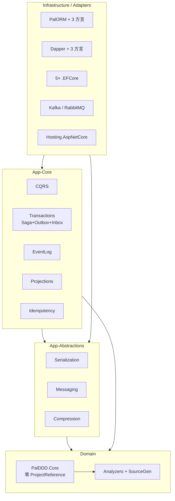

# Pal.DDD 独立审计报告（2026-09-17）

> 审计基线：`dev` @ `53ef606`（v2.2.0 后续修复期）
> 审计方式：只读分析，零代码改动。独立复核 + 三路并行子审计（架构/安全/测试-DX）。
> 前序审计：[`docs/review/audit-2026-09-15-full.md`](audit-2026-09-15-full.md)（c908f40 基线，本报告已交叉验证其 Critical/High 项在 HEAD 仍成立）
> 口径：`[事实]` = 代码/文件直接验证；`[判断]` = 基于事实的推论。严重性：严重 / 高 / 中 / 低。

---

## 一、执行摘要

**整体健康等级：B+**（工程纪律前 5%，但存在一类纪律覆盖不到的「事实一致性」与「运行时画像」盲区）

这是一套生产级 .NET 11 DDD/CQRS/Event Sourcing 基础设施库（35 个 NuGet 包，37 源项目，src ~39k LOC / test ~37k LOC），AOT 一等公民、零反射红线、22+ 道自验证门禁、22 份 ADR。`TreatWarningsAsErrors` + `AnalysisLevel=latest-all` 条件下构建干净；测试代码量接近生产代码量；安全面核心路径参数化 SQL 与源生成 JSON 干净。

扣分不在纪律强度，而在两类盲区：**(1) 同一事实值在代码/csproj/README/docs 五处互相矛盾**（Dapper AOT 状态、测试计数、InMemory Broker）；**(2) 门禁不跑基准与查询计划**，导致 Outbox 租约 N+1、索引缺口、毒消息死信零覆盖等在「0 代码级缺陷」自评下不可见。

**前三风险**

1. **对外事实矛盾（严重）**：Dapper AOT 状态在代码已启用（`DapperAotInitializer.cs:33`）、README 功能表称「已启用」（`:770`）、README AOT 表称「假象/未启用」（`:790`）、NuGet `Description` 写「AOT 假象」（`PalDDD.Dapper.csproj:7`）——三方一致红线被违反，消费者选型依据是错的。
2. **关键路径测试空洞（高）**：`OutboxBatchProcessor` 毒消息死信四条分支零测试覆盖；处理器层回归后消息永久重投且套件保持全绿。
3. **Outbox 轮询路径性能与索引缺口（高）**：EF Core SQLite 租约逐行 UPDATE 实测约 5 倍于 Dapper；租约回读 `WHERE locked_by=? AND locked_until=?` 无可用索引（DDL 仅有 status/next_attempt/locked_until 与 created_at）。

**前三机会**

1. **把「事实一致性」机械化**：csproj `Description` 与 README 代码块可 grep/可编译检查；补一道门禁即可把红线从人工纪律变成机械强制。
2. **补死信安全网后再动 Saga 重构**：先测处理器级 MarkDead，再抽四条重试车道——顺序错了会引入无网重构风险。
3. **收紧 CI 权限 + 补齐入门入口**：`permissions: contents: read` + README 文档表收录 `docs/development.md`，各约 S 级工作量，收益直接。

---

## 二、仓库地图

### 目的与用户

| 项 | 值 |
|---|---|
| 定位 | 面向 .NET 11 的 DDD/CQRS/ES 基础设施框架（库，非应用框架） |
| 卖点 | 零运行时反射 · Native AOT 完整链路 · 不做 `IRepository<T>` / 装配扫描 |
| 用户 | 构建 DDD 应用的 .NET 团队 |
| 成熟度 | **生产级库**（v2.2.0 已发 NuGet；ADR×22；历届评审×30+；门禁自验证） |
| 许可 | AGPL-3.0-or-later |

### 技术栈

| 维度 | 取值 |
|---|---|
| 语言/运行时 | C# latest · `net11.0` 单目标 · Nullable + ImplicitUsings |
| SDK | `11.0.100-rc.1.26425.128`（`global.json` 精确钉版 + allowPrerelease + rollForward latestMajor） |
| 构建 | `TreatWarningsAsErrors` · `AnalysisLevel=latest-all` · 22 条有理由的 NoWarn |
| AOT | 三属性全局 true；非兼容项目显式 false |
| 测试 | TUnit 1.66 + FsCheck + Verify + Testcontainers 4.15 |
| 持久化三栈 | PalORM（源生成真 AOT）· Dapper（Dapper.AOT 调用点）· EF Core（非 AOT） |
| 消息 | Kafka (Confluent 2.15) · RabbitMQ.Client 7.2 |

### 架构草图

依赖方向正确：Core 零引用，适配器一律向内，未发现环（`ArchitectureBoundaryTests` 断言 + csproj 交叉验证）。

### 关键目录

| 目录 | 一行描述 |
|---|---|
| `src/PalDDD.Core/` | Entity / AggregateRoot / DomainEvent 链表 / ValueObject / SmartEnum |
| `src/PalDDD.Transactions/` | 最大项目：Saga 状态机 + Outbox + Inbox + 后台处理器 |
| `src/PalDDD.Dapper*` / `PalDDD.PalORM*` / `*.EFCore` | 三套平行持久化栈 |
| `src/PalDDD.Analyzers/` + `Core.SourceGen/` | 15 条 PDDD + 23 条生成器诊断 |
| `test/` | 16 测试项目 + Testing 基建，~1286 个 `[Test]` |
| `scripts/` | 32 个 C# file-based 门禁/工具（0 Python） |
| `docs/` | architecture / conventions / aot / 22 ADR / 30+ 历轮评审 |
| `.githooks/` | 7 道 pre-commit，首次构建自动配置 `core.hooksPath` |

### 惊讶之处

1. **门禁会验证自己**：`gate-audit.cs` 对脚本做隔离式变异探针；CI 注释记录了 `set -o pipefail` 位置错误导致 secret-scan 假绿的事故与修复。
2. **`.ai/` 是独立嵌套 git 仓库**：主仓 `git ls-files .ai/` 为 0，但架构文档把它当仓内目录引用。
3. **README 在同一文档内自相矛盾**：测试数 1202 vs 1379；AOT 表与功能表对 Dapper 结论相反。
4. **工程文化强于多数商业库**：NoWarn 逐条写理由；测试 LOC ≈ 生产 LOC；ADR 记录被否决方案。

---

## 三、审计报告

### 3.0 总览：最高优先级「丑陋部分」

以下 8 项建议作为 P0/P1 立即处理（均已独立验证）：

| # | 发现 | 严重性 | 位置 |
|---|------|:---:|------|
| U1 | Dapper AOT 三方矛盾（代码启用 vs NuGet/README AOT 表「假象」） | **严重** | `DapperAotInitializer.cs:33` · `PalDDD.Dapper.csproj:7` · `README.md:770` vs `:790` |
| U2 | README 快速开始引用不存在的 `MessageBroker` | **高** | `README.md:464` · 源码仅有 `MessageBrokerBase` / `NullMessageBroker` |
| U3 | Outbox 死信路径零处理器级测试 | **高** | `OutboxBatchProcessor.cs:100-116,160-182` |
| U4 | 租约回读无索引 + EF SQLite 租约 N+1 | **高** | `docs/sql/*/000_schema.sql` · `SqliteOutboxDbContext.cs:111-128` |
| U5 | 历史凭据泄漏未轮换（ITM-108 记录在案） | **高** | `.ai/lessons.md` 相关条目 · 需人工确认轮换状态 |
| U6 | `ci.yml` 无顶层 `permissions:` | **中** | `.github/workflows/ci.yml:1-21` |
| U7 | README 测试计数 1202/1379 同文冲突 | **高** | `README.md:835` vs `:907` |
| U8 | `Saga<TState>` 1006 行神类，四条重试车道复制 | **高** | `Saga.cs:396-463,469-547,555-648,784-902` |

---

### 3.1 架构与设计

**A-1　Transactions 整包被 ChildSaga 反射拖成非 AOT　高　[事实]**
`PalDDD.Transactions.csproj:9-11` 将 `IsAotCompatible`/`IsTrimmable` 设为 `false`。反射点在 `Saga.cs:663`（`MakeGenericMethod`）与 `:674`（`Activator.CreateInstance`），并已正确标注 `RequiresUnreferencedCode`/`RequiresDynamicCode`（`:553-554,651-652`）。Outbox/Inbox/`PeriodicBackgroundProcessor` 自述零反射。**后果**：只用 Outbox/Inbox 的消费者拿不到可裁剪程序集。

**A-2　`Saga<TState>` 神类 + 四车道复制　高　[事实]**
1006 行。四条近乎同构的重试/补偿控制流：Normal `:396-463`、FanOut `:469-547`、ChildSaga `:555-648`、Dynamic `:784-902`。注释自承需四遍同步（`:528-529,629-630,883-884`）。**后果**：每次修复落四遍；第五种 step 即第五份克隆。

**A-3　三栈 SPI 平行实现，不变量靠人工同步且已不对称　高　[事实+判断]**
同一组 6 SPI 每栈各实现一遍。唯一约束冲突分类器存在多份私有副本（Dapper + EFCore），PalORM 已有单一 `SqlErrorClassifier`。Dapper DI 只注册 4 个 store（`DapperServiceCollectionExtensions.cs:106-112`）：Outbox/Inbox/Idempotency/SagaState；`DapperEventLog`、`DapperProjectionCheckpointStore`、`DapperUnitOfWork` 存在但无 DI 注册路径。PalORM 方言扩展注册更完整。**判断**：ADR-020 的「能力平等栈」承诺目前靠人工支付，已出现功能面漂移。

**A-4　栈中立驱动能力被锁在 Dapper 包　中　[事实]**
`PostgreSqlMultiHost.cs`（625 行）、Sharding、ReadWriteRouter、FTS 等仅依赖 ADO.NET 驱动，却只在 `PalDDD.Dapper.*` 包内；EF/PalORM 用户不可用。

**A-5　Dapper 核心耦合三个 ADO.NET 驱动　中　[事实]**
`PalDDD.Dapper.csproj:28-30` 同时引用 Npgsql / MySqlConnector / Microsoft.Data.Sqlite。用 SQLite 的消费者被迫引入全部三驱动。PalORM 相反：核心零驱动引用。

**A-6　复杂度热点　中　[事实]**
| 方法 | 位置 |
|---|---|
| `ProcessBatchAsync` ~151 行 / 嵌套 6 | `OutboxBatchProcessor.cs:58` |
| `CheckTimeoutsAsync` 嵌套 5 层 try/foreach | `SagaProcessor.cs:110+` |
| `Saga` 四车道 | 见 A-2 |

**A-7　新发现：Saga 状态浅拷贝共享可变容器　中　[事实]**
`SagaState.CloneForLease` 用 `MemberwiseClone`；`StepStartedAt` / `ExecutedStepKeys` 为引用共享（`SagaState.cs:109` 及容器字段）。多实例并发 re-lease 时僵尸 worker 与新持有者可同时写同一集合。XML 文档已声明（`:100-108`），属已知脚枪。

**A-8　新发现：`_invalidated` 单调增长无上限　中　[事实]**
`DefaultSagaManager.cs:36,148` 只增不减（注释自述有意）。长生命周期 HITL 场景慢泄漏。

**分层结论**：Core → AppAbs → AppCore → Infra 无环，边界干净。结构性债务集中在 Transactions 的 AOT 污染（A-1）与三栈人工同步（A-3）。

---

### 3.2 代码质量

**C-1　Dapper AOT 三方矛盾　严重　[事实]**

| 事实源 | 声称 | 位置 |
|---|---|---|
| 代码 | **已启用** | `DapperAotInitializer.cs:33` `[module: DapperAot]` |
| 头注释 | 启用是未来动作 / 未启用为现状 | 同文件 `:16-22` vs `:31-33` |
| README 功能矩阵 | **已启用** | `README.md:770` |
| README AOT 表 | **假象 / 未启用** | `README.md:790` |
| NuGet Description | **AOT 假象** | `PalDDD.Dapper.csproj:7` + 三个方言 csproj `:7` |

违反本仓最高红线「三方一致」。现有 `doc-consistency.cs` 不覆盖 csproj `Description`。

**C-2　注释中大量变更史考古　中　[事实+判断]**
`Saga.cs` / `DapperOutboxStore.cs` / `PalOrmOutboxStore.cs` 注释占比 31%–45%。相当比例是叙事型「vNN P3（ITM-xxx）」，同一解释跨姊妹文件复制，且存在与代码状态不符者（C-1）。**后果**：A-2 类机制性重构成本被显著抬高。

**C-3　新发现：`SmartEnum.RegisterValues` 静默丢弃第二批注册　中　[事实]**
`SmartEnum.cs:156` `Interlocked.CompareExchange` 先写胜出；第二批值静默不可达，无异常无指标。

**C-4　新发现：`ComputeRetryDelaySafely` 吞异常零可观测　中　[事实]**
`Saga.cs:143-153` 策略抛异常时静默降级 1s；姊妹路径 `OutboxBatchProcessor.cs:146-150` 至少有 Warning。Saga 无 logger 注入。

**C-5　新发现：`GetFrozen()` 缺少仓内标准的 Interlocked/Volatile 纪律　中　[事实]**
`Saga.cs:1004-1005` 纯 `??=`；与 `SmartEnum.cs:89-96`、`Dispatcher.cs:55-78` 的 CAS 模式不一致。`When()` 写 `_frozen = null`（`:211,226`）无同步。

**C-6　新发现：`ISpecification.IsSatisfiedBy` 对 AOT 调用方隐藏地雷　中　[事实]**
公共 API 无 `RequiresDynamicCode`（为过 AotContractTests），私有 `Compile` 有标注。NativeAOT 下运行时调用 → `PlatformNotSupportedException`，编译期无警告（`ISpecification.cs:253-271`）。

**代码质量优势**：`FailureReason.Normalize` 跨 5 表单一实现；`Entity` Id get-only（ITM-224）；零分配领域事件链表 + `ref struct` 枚举器；懒初始化 CAS 模式一致。

---

### 3.3 安全

**S-1　工作树存在真实内网凭据（未跟踪）　高　[事实]**
`appsettings.test.local.json` 含 `<INTERNAL_TEST_HOST>` 的 PG/MySQL/RabbitMQ 口令，`UseTestcontainers=false`。文件被 `.gitignore:94` 忽略且未跟踪——当前卫生正确，但距泄漏仅一次 `git add -f`。`secret-scan` 按设计不看未跟踪文件。样本代码会自动加载该文件（`DapperAotProbe/Program.cs` 相关路径）。

**S-2　历史凭据泄漏未确认轮换　高　[事实+待人工确认]**
ITM-108/AUD-001：历史提交曾含 `<INTERNAL_TEST_HOST_LEGACY>` 真实口令，处置为「仅记录」，未重写历史、未记录轮换。任何持有 clone 者可从历史恢复。**需所有者确认口令是否已轮换**。

**S-3　NU1900–1904 全局 NoWarn　中　[事实]**
`Directory.Build.props:41,45`。本地 build 零 CVE 信号；依赖 CI `vuln-scan.cs`（该脚本曾有过 exit-0 假绿事故，已修复）。属「有意双路径」，但开发者侧静默。

**S-4　稳定包依赖 RC 框架线 + NU5104 抑制　中　[事实]**
`Directory.Packages.props:18-27,54` 全系 `11.0.0-rc.1`；`Directory.Build.props:42,45` 抑制「稳定包含预发布依赖」。RC 线无安全服务 SLA。

**S-5　标识符注入脚枪（SQLite bulk + 受信 SQL 片段）　中　[事实]**
`DapperBulkCopy.cs:349-355` 表/列名裸插值；`PostgreSqlSoftDelete.Delete/Restore` 接受调用方 SQL 片段（已文档化为受信模板）。值参数化干净；标识符路径未统一 Escape。全局 CA2100 NoWarn 使分析器不报。

**S-6　MapCommand/MapQuery 默认匿名无鉴权　中　[事实+判断]**
`EndpointExtensions.cs` 明确默认无限流/无体积极限；样例端点开放。库委托宿主是正确设计，但 README/样例未展示 `.RequireAuthorization()` 路径，照抄即开放写 API。

**S-7　ci.yml 无顶层 permissions　中　[事实]**
无 `permissions:` 块；`release.yml:20-21` 有 `contents: write`。建议 CI 默认 `contents: read`。无 CodeQL / dependency-review-action / Dependabot。

**S-8　secret-scan 盲区　低　[事实]**
扩展名白名单不含 `.pem/.key/.pfx`；连接串要求 Host+Password 同行；无 JWT/Azure SAS/熵启发式。设计上高精度 + fail-closed + 自测，但唯一凭据防线覆盖面偏窄。

**安全优势（本仓最强一维）**
- 核心路径全部参数化 SQL（`SqlTemplates` const + Dapper 参数；PalORM `FormattableString`）
- 全 JSON 走源生成，`JsonSerializerIsReflectionEnabledByDefault=false`
- 无 `TrustServerCertificate` / `SslMode=None` / 证书校验绕过
- `ExceptionMiddleware` 固定 ProblemDetails，连接串不进异常消息且有测试锁定
- `secret-scan` / `vuln-scan` fail-closed、带自测、不回显明文
- 无 `TypeNameHandling` / `BinaryFormatter` / 线上传类型名反序列化

---

### 3.4 测试

**T-1　毒消息死信路径零处理器级覆盖　高　[事实]**
`OutboxBatchProcessor.cs`：
- `:100-108` 类型未注册 → MarkDead
- `:110-116` 反序列化 null → MarkDead
- `:160-168` / `:174-182` Mark* 自身失败 → `ex.Data["MarkError"]`
- `:142-150` backoff 失败 → 1s 兜底

store 层 MarkDead 有测试；处理器层死信转换无。**后果**：回归后消息永久重投，套件全绿。

**T-2　挂钟延迟测试未用仓内 FakeTimeProvider　高　[事实]**
`OutboxProcessorTests.cs:38+` 与 `SagaProcessorTests.cs:53+` 用 `Task.Delay(150-400ms)` 后断言 `LeaseCallCount >= 2`，注释承认 CI 假红历史（ITM-278）。仓内已有 `FakeTimeProvider.AdvanceNowAndTriggerTimers` 且其他测试在用。**后果**：负载下间歇红。

**T-3　覆盖率基线弱且缺 PalORM　高　[事实]**
阈值 0.70 已接入 CI。`coverage-baseline.json` **无 PalORM 键**；多项基线极低：`Core.Abstractions.Tests 0.013`、`Repository.EFCore.Tests 0.081`、`Messaging.Tests 0.218`、`Core.Tests 0.309`。全局 70% 可掩盖 8–30% 模块；PalORM（最依赖 Docker）无降幅保护。

**T-4　Kafka 错误路径远薄于 RabbitMQ　中　[事实]**
Kafka 仅往返/取消/多消息；无毒消息/死信/重试。RabbitMQ 有死信与不可路由失败测试。Docker 不可用时显式 Skip（设计正确）。

**T-5　Messaging 集成测试仍有 200–500ms 挂钟假设　中　[事实]**
`BrokerIntegrationTests.cs:439,573,628-632`。

**测试优势**
- ~1286 `[Test]`，测试 LOC ≈ 生产 LOC；断言文化强（246 个 `Throws*`）
- 元门禁自验证：`DiagnosticCoverageGateTests`、`PublicApiSnapshotTests`（CI 拒绝重写基线）
- 确定性并发：双 Context 乐观锁、outbox fencing、10-worker 租约竞争
- Testcontainers + 显式 Skip；架构/源码守卫用 Roslyn 测生产策略
- 属性测试用 FsCheck（`QuickCheckThrowOnFailure` 即断言）

---

### 3.5 性能

**P-1　EF SQLite Outbox 租约 N+1　高　[事实+存档基准]**
`SqliteOutboxDbContext.cs:111-128` 对候选页**逐行** `ExecuteUpdateAsync`。仓存 BDN：`Outbox_Lease_Batch100` EF **24,043 μs** vs Dapper 2,655 μs vs PalORM 3,546 μs（约 5×）。代码注释说明逐条 CAS 是正确性修复，批量化未尝试。

**P-2　租约回读无索引　高　[事实]**
`SqlTemplates` 中 `WHERE locked_by=@owner AND locked_until=@until`。三方言 DDL 仅有 `idx_outbox_status (status, next_attempt_at, locked_until)` 与 `idx_outbox_created`。该谓词无覆盖索引；框架无 Processed 行清理，代价线性增长。PG 的 `UPDATE...RETURNING` 路径不受影响。

**P-3　EventLog / Projection 逐事件持久化　中　[事实]**
Dapper/PalORM EventLog 每事件一条 INSERT/QuerySingle；Projection 每事件 2 次 checkpoint 操作。EF EventLog 已批量。设计约束（GlobalPosition 返回）可接受，但重建百万事件流代价真实。

**P-4　PalORM store sync-over-async　中　[事实]**
`PalOrmOutboxStore.cs` 多处 `GetAwaiter().GetResult()`；根因是 `IPalOutboxStore.Mark*` 同步签名。已登记 open-items B2（v3.0 窗口）。

**P-5　EF 模型索引与手写 DDL 漂移　中　[事实]**
EF outbox 模型 `(Status, NextAttemptAt, CreatedAt)` vs DDL `(status, next_attempt_at, locked_until)`。两套用户拿到不同索引集。

**性能优势**：PG `FOR UPDATE SKIP LOCKED` + RETURNING；三方言 BulkCopy；序列化 ThreadStatic 池化；`PeriodicTimer` 无忙等；无 `async void` / 裸 `.Result`。

---

### 3.6 依赖

**D-1　无 lock file　中　[事实]**
全仓无 `packages.lock.json`；未开 `RestorePackagesWithLockFile`。叠加 RC 浮动 + `rollForward: latestMajor` → 还原不可复现。

**D-2　AGPL-or-later 与 PalORM 的 AGPL-only 组合　中　[事实+判断]**
主包 `AGPL-3.0-or-later`（`Directory.Build.props:63`）；PalORM 依赖声明 `AGPL-3.0-only`。合并作品不能按 or-later 传递，包元数据承诺过宽。

**D-3　死条目与陈旧钉扎　中/低　[事实]**
`Microsoft.Data.SqlClient 7.0.2` 全仓零引用；`Microsoft.NETCore.Platforms 8.0.0-preview.7`（2023）；`nupkgs/` 内容混杂陈旧。

**D-4　`PalDDD.Transactions` 欠声明 Microsoft.Extensions.*　中　[事实]**
代码用 `IOptionsMonitor`/`BackgroundService`，csproj 无对应 PackageReference；打包 nuspec 亦缺。

**D-5　`PalDDD.Base` 分析器承诺未兑现　中　[事实]**
`PalDDD.Base.csproj:9-11,28-31` 故意 `PrivateAssets="build;analyzers"`——元包**不**向消费方传递分析器/源生成器。而 Description（`:17`）写「含源生成 + 编译时分析器」，README 主推「38 条编译期诊断」。**交付缺口 vs 营销文案**。

**依赖优势**：第三方多为最新稳定（Dapper 2.1.79 / PalORM 5.5.1 / MemoryPack 1.21.4 / Npgsql 10.0.3 …）；`nuget.config` 仅 nuget.org；CPM + 传递钉扎；CHANGELOG 记录过 NU1903 清偿。

---

### 3.7 开发体验与运维

**X-1　新人入门路径断裂　高　[事实]**
无 `CONTRIBUTING.md`。README 无 clone/build/SDK 前置说明（只有 NuGet 消费段）。唯一开发文档 `docs/development.md` **未出现在 README 文档表**。`global.json` 钉精确 RC SDK，装错版本错误信息不会指向 RC。全量测试需 Docker + 理解 MTP 逐项目 `dotnet test`。**Time-to-first-green 对外部贡献者以小时计。**

**X-2　文档仍引用已删除的 .sh 脚本　中　[事实]**
`docs/conventions.md:825` 引 `ci-coverage.sh`；`docs/release.md` 多处引 `.sh`。实际已 C# 化。V9 守卫对反引号/表格形态是已知盲区。

**X-3　`.ai/` 独立仓库被文档当仓内目录　中　[事实]**
`docs/architecture.md:5`；fresh clone 不可解析；CI 有降级分支故构建不坏。

**X-4　32 脚本 / ~8.8k LOC，约 16 个未接线　中　[事实+判断]**
质量高（自测+退出码），但形成「第二产品」。未接线脚本依赖 `gate-audit` 清单保持诚实。

**X-5　仓库垃圾与 ignore 缺口　中　[事实]**
`job_logs.txt` / TestResults / BenchmarkDotNet.Artifacts / nupkgs 已 ignore 且未跟踪。**但 `mydatabase.db` 未被 `*.db` 规则覆盖**，`git add -A` 可误提交。

**X-6　CI/发布缺口　中　[事实]**
coverage job 不上传 cobertura/HTML；release.yml 不跑 coverage；无 CodeQL/Dependabot/SBOM。

**DX 优势**：钩子首次构建自动安装；CI 失败自诊断 `::error` 注解；无 `.ai` 时降级 gate-lite；`docs/development.md` 本身质量高；`docs/testing.md` / `tutorial.md` / 22 ADR 远超同类。

---

### 3.8 文档

**DOC-1　Dapper AOT 内部矛盾　严重** — 见 C-1。

**DOC-2　快速开始样例不可编译　高　[事实]**
`README.md:464`：`new MessageBroker()`——类不存在。全源码仅有 `MessageBrokerBase`（`MessageBrokerBase.cs:21`）与 `NullMessageBroker`。`README.md:109`「InMemory 实现覆盖全部抽象接口」对 `IMessageBroker` 不成立。

**DOC-3　测试计数同文冲突　高　[事实]**
`README.md:835` = 1202；`:907` = 1379。`grep [Test]` 实测约 1286 方法（参数化展开后更多）。`docs/test-coverage-baseline.md` / `performance.md` / `tutorial.md` 仍停 1202。

**DOC-4　ADR-020 与 README 弃用表述冲突　高　[事实]**
ADR-020 已裁决 Dapper 转「能力平等栈」；`README.md:857` mermaid 仍写「Dapper（弃用）」；英文 README 多处 “being deprecated / no AOT support”。

**DOC-5　其他　中/低　[事实]**
`docs/aot.md` 称 aot-verify 仅覆盖 PalOrmSample，实际双 sample；README samples 清单缺 `DapperAotProbe`；性能段落仍称 BDN 在 Preview 不可用，而仓内已有 BDN 基线报告。

**文档优势**：相对链接零断链；多数计数经得起机械验证；CHANGELOG 维护良好；`docs/pitfalls.md` 口径可验证。

---

## 四、改进策略

### 主题一：把「事实一致性」从人工纪律变成机械门禁

**解释的发现**：C-1、DOC-1~5、D-5、X-2、T-3 部分。

仓库门禁强在**同质事实比对**（DDL vs 文档、API 快照 vs 代码）。缺两类证据：
1. **跨载体事实**：AOT 状态、测试计数、InMemory 类型同时活在代码 / csproj Description / README / docs / 注释。
2. **README 代码可编译性**：快速开始抽不出可编译工程。

**目标状态**：事实值单点定义 + 引用检查；README 关键代码块有编译探针；`doc-consistency` 覆盖 csproj Description。

**原则**：门禁的证据种类决定它能发现的问题种类。

### 主题二：先补安全网，再收敛三栈与 Saga

**解释的发现**：A-1~3、A-7、T-1、T-2、P-4、P-5。

三栈是产品决策（保留）；重复与不对称是工程缺陷。Saga 四车道是最大维护性债务，但**无死信安全网的重构是最高风险动作**。

**目标状态**：
1. 处理器级死信测试齐全（翻转分支必须变红）。
2. 共享不变量（冲突分类、租约守卫、截断）下沉到内部助手，副本数 → 1。
3. Saga 重试车道抽公共 helper（分步，每步绿）。
4. Dapper DI 注册缺口补齐或显式登记豁免。

**原则**：多栈是架构决策，重复是实现缺陷；测试安全网优先于美化重构。

### 主题三：运维与安全的「低成本高杠杆」收口

**解释的发现**：S-1~8、X-5~6、D-1、T-3。

**目标状态**：CI `permissions: contents: read`；`.gitignore` 补 `*.db`；确认并轮换历史凭据；coverage 报告上传 + PalORM 入基线；Dependabot；入门文档进 README。

**原则**：安全与 DX 问题大多不需要大重构，需要的是「接线」和「确认」。

### 建议不修 / 推迟

| 不修或推迟 | 理由 |
|---|---|
| 立刻合并三栈为双栈 | ADR-020 已裁决能力平等栈；EF 生态线有真实用户。先收敛不变量。 |
| 立刻完整重构 Saga 四车道 | 无死信/无 FakeTime 安全网的 1000 行重构风险最高。M1 完成后再做。 |
| 提高全局覆盖率阈值 0.70 | 覆盖率是滞后指标；真问题是关键路径清单，不是总百分比。 |
| 撤销 22 条 NoWarn | 每条有框架库语境下的正确理由；撤销产生噪声零正确性。 |
| 清理 System.* polyfill | 无运行时风险，改动面广收益低。 |
| 为 `.ai/` 建仓内镜像 | 独立演化的质量系统；改文档措辞即可。 |
| AGPL → MIT | 产品/商业决策，非工程修复。 |

### 「完成」的可衡量信号

1. `grep -rn "AOT 假象" src/ README*.md` → 0；且注入矛盾 Description 时新门禁变红。
2. `grep -n "new MessageBroker()" README*.md` → 0；或 README 代码块编译探针存在且绿。
3. README 内测试计数唯一，或全部带时点前缀。
4. `OutboxBatchProcessor` 死信分支有测试；翻转 `descriptor is null` → 套件红。
5. 租约回读 `EXPLAIN` 含 INDEX、不含全表 SCAN。
6. `Outbox_Lease_Batch100` EF/Dapper 比值进入 2× 内（当前 ~5×）。
7. 冲突分类器私有副本 → 1；Dapper DI 注册数 4→7 或有登记豁免测试。
8. `ci.yml` 有 `permissions: contents: read`；coverage artifact 可下载。
9. 新贡献者从 README 一步到达 clone/build/test/hooks。
10. 历史凭据轮换得到所有者书面确认（或已轮换的证据）。

---

## 五、任务计划

### 里程碑 0 — 安全网（重构前必须）

| ID | 任务 | 影响区域 | 验收标准 | 工作量 | 风险 | 依赖 |
|----|------|---------|---------|:---:|:---:|------|
| M0-1 | 补 Outbox 处理器死信测试 | `test/PalDDD.Transactions.Tests` | 四条分支均有断言；翻转分支套件红 | M | 低 | — |
| M0-2 | 挂钟测试改 FakeTimeProvider | Outbox/Saga Processor 测试 | 无 150ms+ Task.Delay 依赖；本地连续 20 次绿 | M | 低 | — |
| M0-3 | coverage 基线纳入 PalORM + CI 校准 | `coverage-baseline.json` / `ci-coverage.cs` | PalORM 有键；CI 完整矩阵基线 | M | 低 | CI Docker |
| M0-4 | 事实一致性门禁原型 | `scripts/doc-consistency.cs` 或新脚本 | 能红：注入假 Description / 矛盾计数 | M | 低 | — |

### 里程碑 1 — 关键修复（安全与正确性）

| ID | 任务 | 影响区域 | 验收标准 | 工作量 | 风险 | 依赖 |
|----|------|---------|---------|:---:|:---:|------|
| M1-1 | 统一 Dapper AOT 事实源 | Dapper* csproj · README · DapperAotInitializer 注释 · docs | 五处一致；门禁绿 | S–M | 低 | M0-4 |
| M1-2 | 修 README 快速开始 InMemory Broker | README*.md · 可能需公开测试用 InMemoryBroker | 样例可编译；或改用 Null/真实 broker | S | 低 | — |
| M1-3 | 统一 README/文档测试计数 | README*.md · 多处 docs | 同文无冲突；优先机器生成 | S | 低 | — |
| M1-4 | 凭据轮换确认 + 本地文件卫生 | 人工 · `.gitignore` | 历史口令已轮换书面确认；`*.db` 入 ignore | S | 低 | 所有者 |
| M1-5 | CI 权限收紧 | `ci.yml` | 顶层 `permissions: contents: read` | S | 低 | — |
| M1-6 | 出站索引补丁（locked_by, locked_until） | `docs/sql/*` · 可选 migration 文档 | EXPLAIN 不再全表 SCAN | S | 中 | 需评估已有库迁移 |

### 里程碑 2 — 高杠杆（让后续工作更容易）

| ID | 任务 | 影响区域 | 验收标准 | 工作量 | 风险 | 依赖 |
|----|------|---------|---------|:---:|:---:|------|
| M2-1 | README 入门路径 + 收录 development.md | README · docs | 新人一步 clone→build→test | S | 低 | — |
| M2-2 | Dapper DI 补齐 EventLog/Projection/UoW 或显式豁免 | DapperServiceCollectionExtensions | 注册 7 或有测试登记缺口 | M | 中 | — |
| M2-3 | 冲突分类器/租约守卫下沉共享助手 | Dapper/EFCore/PalORM stores | 私有副本 →1；三栈测试绿 | L | 中 | M0-1 |
| M2-4 | EF SQLite 租约批量化探索 | SqliteOutboxDbContext | 比值进入 2× 或记录否定结论 | L | 高 | 基准 |
| M2-5 | coverage 报告上传 + release 带 coverage | ci.yml · release.yml | artifact 可下载；release 挡 0.70 | S | 低 | — |
| M2-6 | Dependabot + 可选 CodeQL | `.github/` | PR 自动化依赖更新 | S | 低 | — |
| M2-7 | packages.lock.json（可选锁定模式） | props · CI | `--locked-mode` 通过 | M | 中 | RC GA 更合适 |

### 里程碑 3 — 质量与润色

| ID | 任务 | 影响区域 | 验收标准 | 工作量 | 风险 | 依赖 |
|----|------|---------|---------|:---:|:---:|------|
| M3-1 | Saga 重试车道抽公共 helper | Saga.cs | 四车道共用；行为测试全绿 | XL→拆 | 高 | M0-* |
| M3-2 | Transactions 拆分 AOT / ChildSaga 工厂委托 | 新项目或 Saga API | Outbox/Inbox 可 IsAotCompatible=true | L | 高 | M3-1 |
| M3-3 | SagaState 深拷贝容器 | SagaState.cs | CloneForLease 后集合独立 | S | 低 | — |
| M3-4 | _invalidated 指标 + TTL | DefaultSagaManager | 有 size metric；可配置 TTL | S | 低 | — |
| M3-5 | ComputeRetryDelaySafely 可观测 | Saga.cs | 有 log/metric | S | 低 | — |
| M3-6 | Kafka 错误路径测试补齐 | Messaging.Integration | 毒消息/重试有测 | M | 低 | Docker |
| M3-7 | 注释考古收缩（只在改到的文件） | 按重构触及面 | 新代码不新增叙事注释 | 持续 | 低 | — |
| M3-8 | SmartEnum 双注册可观测 | SmartEnum.cs | 第二批注册有诊断信号 | S | 低 | — |
| M3-9 | 文档清理：.sh 引用 / AOT 描述 / .ai 措辞 | docs · README | grep 旧表述为 0 | S | 低 | M1-1 |
| M3-10 | MapCommand 安全示例 | samples · README | 样例展示 RequireAuthorization | S | 低 | — |

### 快速获胜（高影响 · S）

1. **M1-5** CI `permissions: contents: read` — 一行 YAML。
2. **M1-3** 删/统一 README 1202 vs 1379 — 数十分钟。
3. **M1-2** 修 `new MessageBroker()` — 改文档或加 20 行公开 InMemoryBroker。
4. **X-5** `.gitignore` 加 `*.db` — 一行。
5. **M2-1** README 文档表加 development.md 链接 — 一行。
6. **M1-6** 三方言 DDL 加 `(locked_by, locked_until)` 索引 — 小 DDL + 文档。

### 前 3 个任务实现草图

#### M0-1 Outbox 死信测试

**方法**：用现有 InMemory/Recording store + stub broker/serializer/catalog，针对 `OutboxBatchProcessor` 直接调用 `ProcessBatchAsync`。

**关键步骤**：
1. 注入「类型不在 catalog」的消息 → 断言 store 收到 MarkDead 且 reason 含 not registered。
2. 注入「Deserialize 返回 null」→ 断言 MarkDead + reason。
3. 构造 MarkDead 自身抛异常的 store 装饰器 → 断言不中断整批、Warning 路径、`Data["MarkError"]`。
4. 构造 `IRetryBackoffPolicy` 抛异常 → 断言 delay=1s 且 ReleaseForRetry 仍被调用。

**陷阱**：不要只测 store.MarkDead（已有）；必须测处理器状态机。InMemory store 的 RetryCount 就地递增会与 EF 栈不一致（仓内注释已提醒 v35），断言用快照前的值。

#### M1-1 统一 Dapper AOT 事实源

**方法**：以 `docs/persistence-aot-status.md` + 代码 `[module: DapperAot]` + 实测 13/13 为权威，反向修正错误陈述。

**关键步骤**：
1. `grep -rn "AOT 假象\|未启用" src/PalDDD.Dapper* README*.md docs/aot.md docs/persistence-aot-status.md`。
2. 改 4 个 csproj Description、README `:790`、`DapperAotInitializer` 头注释与 `:33` 自洽（头注释写「当前已启用；历史障碍为 ct/CommandDefinition」）。
3. 同步英文 README 弃用表述（DOC-4）。
4. 扩展 doc-consistency：csproj Description 与权威状态表交叉检查。

**陷阱**：不要只改 README 两张表——csproj Description 是 nuget.org 原文。历史评审文档（docs/review/*）可保留当时口径，但需加「时点」前缀，避免被当成现状。

#### M0-2 挂钟测试 → FakeTimeProvider

**方法**：注入仓内 `FakeTimeProvider`，`AdvanceNowAndTriggerTimers` 驱动 `PeriodicBackgroundProcessor` tick。

**关键步骤**：
1. 对齐 `InMemoryStoreTests` 已有写法。
2. 把 `LeaseCallCount >= 2` 改为「Advance 两次 tick 后精确计数」。
3. FanOut 超时测试：用 Advance 模拟 200ms 超时，而非 500ms 真任务 vs 200ms 超时。

**陷阱**：`PeriodicTimer` 与 FakeTime 的 dueTime=0/无限 dueTime 行为——注意近期 `abfd3b2` 已修过 FakeTimeProvider 三处失真，复用最新 Testing 基建而非重写时钟。

---

## 六、开放问题（需所有者裁决）

1. **历史凭据是否已轮换？**（ITM-108 / <INTERNAL_TEST_HOST_LEGACY>；工作树 <INTERNAL_TEST_HOST> 是否共用口令？）
2. **产品意图：外部采用 vs 内部工具？** 若外部，AGPL-or-later 与 RC SDK 钉版会系统性限制采用；是否考虑 dual-license 或多 TFM？
3. **Dapper AOT 的最终口径？** 当前代码已启用但多处文案未启用——是「保持启用并改文案」，还是「实验分支回滚」？（影响 M1-1 方向）
4. **EF Core 栈的产品地位？** ADR-020 推荐 PalORM；EF 栈是长期一等公民还是过渡？影响 M2-4（EF 租约优化）优先级。
5. **v3.0 窗口范围？** open-items B1–B3（EF pooling、Outbox 异步化、Obsolete 移除）是否与本计划 M3-2 合并？
6. **性能目标？** Outbox 租约是否要设 SLA（如批 100 < 5ms），还是接受 EF 栈「功能优先」？
7. **`PalDDD.Base` 分析器交付策略？** 保持 PrivateAssets（诚实改 Description）还是改为传递 Analyzers 资产？
8. **`.ai/` 与主仓关系？** 是否接受「文档改为引用外部质量系统仓库」，避免 fresh clone 假引用？

---

## 七、审查深度声明

**已深入**：Core / Transactions / Outbox 批处理器 / Dapper DI 与 AOT 初始化 / 架构分层 / CI 与覆盖率 / 安全门禁与凭据面 / README 与关键文档一致性 / 覆盖率基线 / 三方言 DDL 索引。

**抽样或依赖前序/存档**：
- 未执行完整测试套件（~1286 `[Test]`）；测试结论基于静态阅读与 grep。
- 本机无 Docker：多方言与 broker 集成矩阵未本地复跑。
- P-1 等性能数值引自仓存 BDN（`docs/review/bench-baseline-2026-09-13.md`）；P-2 索引结论基于 DDL 静态分析（前序审计含 EXPLAIN 复现）。
- 未逐条审计 15 条分析器 + 23 条生成器诊断的判定逻辑。
- 未逐行读 32 个门禁脚本；深读 secret-scan / vuln-scan / gate-audit 机制与 CI 接线。
- 未审计 `samples/`、`bench/` 实现质量；未审计 `.ai/` 内部（独立仓库）。
- 与 `audit-2026-09-15-full.md` 交叉验证：其 Critical/High 项在 `53ef606` 仍成立；本报告新增 F4–F10（SagaState 浅拷贝、_invalidated、SmartEnum 双注册、ISpecification AOT 地雷、GetFrozen 纪律等）及 CI permissions / Base 分析器交付 / 历史凭据轮换确认等项。

---

*报告生成：2026-09-17 · 只读审计 · 未修改任何生产代码*
