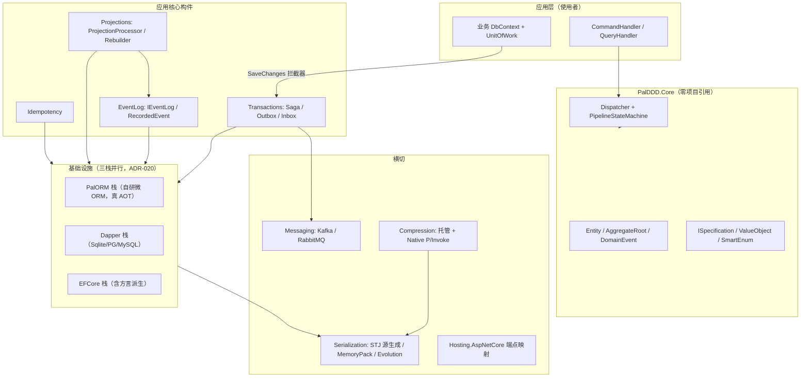

# Pal.DDD 全面审计报告（2026-09-20）

> 方法：三路并行深审（架构与代码质量 / 安全与依赖 / 测试与 DX 运维与文档）+ 主审人对最高严重性条目逐条打开文件复核。
> 标注约定：`[事实]` = 已打开 file:line 核实；`[判断]` = 逻辑推导，未实测。每条含 (a) 发现 (b) 位置 (c) 后果 (d) 严重性。
> 严重性口径：严重 = 数据丢失/安全漏洞/发布错误；高 = 核心功能失效或采用面阻断；中 = 真实缺陷但有缓解或需特定条件；低 = 卫生与一致性。
> 审计期间未修改任何代码、未提交。行号对应 HEAD（`bfcc181`）。

---

## 一、执行摘要

整体健康等级 **B+**。这个仓库的机械防线（依赖图守卫、源码扫描、门禁变异自证、AOT 实测、CHANGELOG 工程纪律）是我在框架库里见过最完整的之一：37 个 src 项目零循环引用、Release 构建 0 警告、308 处 catch 无一处裸吞、async 方法 ct 传导 100%、24 份 ADR 全部带被否决方案。失分不在防守体系，而在三处：**发布卫生**（3.0.0 已打 tag 但 CHANGELOG 未转正、README 版本口径自相矛盾、35 个包无签名且用长期 API key）、**并发与序列化关键代码零测试网**（`PostgreSqlOutboxNotifier` 全仓 0 引用、Dapper 三方言固化层 15.8%–53%、`EventStreamJsonLines` 0%）、以及两个战略级采用面问题（AGPL-3.0-or-later 全仓许可 + 关键路径押在低采用度外部包 PalORM.Core 上）。另有一处代码级缺陷值得单列：`Saga.cs:827` 的 Dynamic 车道在执行前记录步骤键，路由目标重试耗尽失败时会补偿一个从未执行的步骤，这正是 ITM-775 只想修掉一半的那类失败模式。

前三大风险：① 发布链缺陷随已发布的 3.0.0 流出（升级用户拿到的 release notes 写着"最新发布 2.2.0"）；② 三个零覆盖组件是 Dapper PG 栈低延迟卖点与投影重建入口，方言 SQL 分叉会在无回归网处静默复发；③ 许可与 TFM 双重采用面阻断（net11.0 单目标 + RC SDK，.NET 11 GA 前外部项目装不上）。

前三大机会：① 补 DI 注册入口（`EventLogPositionReserver` Singleton + 4 个 EFCore 适配器包），小改动即可解锁已被文档化却无 API 可达的 Hi/Lo 优化；② 修 Dynamic 补偿缺陷并补失败路径表征测试；③ 发布链加固（CHANGELOG 转正门禁接线 + 包签名/OIDC + 锁文件 + dependabot），把"tag 即验证"变成机械事实。

---

## 二、仓库地图

### 2.1 定位

| 项 | 结论 |
|---|---|
| 用途 | DDD + 事件溯源 + CQRS 的应用框架库（35 个 NuGet 包），提供 Saga 编排、Outbox/Inbox、EventLog、投影、幂等等分布式一致性构件 |
| 预期用户 | .NET 后端开发者，在自建应用中引用框架包；非终端产品 |
| 成熟度 | 生产级框架库。3.0.0 已 tag 并发布，24 份 ADR，38+ 轮评审-修复循环，CHANGELOG 逐轮记录 |
| 语言/运行时 | C# `latest`，单目标 `net11.0`，SDK 钉 `11.0.100-rc.1.26425.128`（go-live），Runtime Async 开启 |
| 硬约束 | AOT 全链路（`IsAotCompatible` + `PublishAot` 真跑二进制）、生产代码零反射、`TreatWarningsAsErrors` + `AnalysisLevel=latest-all` |

### 2.2 架构草图

### 2.3 关键目录

| 目录 | 一行描述 |
|---|---|
| `src/PalDDD.Core` | 零项目引用的领域内核：Entity/DomainEvent/CQRS/规约/SmartEnum，唯一包依赖 ByteAether.Ulid |
| `src/PalDDD.Transactions` | Saga 四车道编排 + Outbox/Inbox 处理器与三栈 Store 契约；整体 `IsAotCompatible=false` |
| `src/PalDDD.EventLog(.EFCore)` | 事件溯源追加/读取契约 + EF 栈 Hi/Lo 位置分配器 |
| `src/PalDDD.PalORM` | 自研微 ORM 适配栈（外部包 PalORM.Core 5.5.1），三方言 |
| `src/PalDDD.Dapper(.*)` | Dapper 适配栈，母包含三 Provider，方言分包含多主机/分片/报表/软删 |
| `src/PalDDD.*.EFCore` | 5 个 EF 适配器包，**均无 DI 注册扩展**（见 A7） |
| `src/PalDDD.Messaging.*` | Kafka/RabbitMQ 适配器 + 消息目录/演进管线 |
| `src/PalDDD.Core.SourceGen`、`Analyzers` | 编译期源码生成器与 38 条诊断（PDDD/PALID/PALMSG/PALENUM） |
| `.githooks/` + `scripts/` | 7 道 pre-commit 守卫 + 17 个接线门禁脚本（gate-audit 矩阵全部 OK） |
| `test/`（16 项目） | TUnit + MTP，287 个测试文件，含 Testcontainers 方言探针与 FsCheck/Verify |
| `bench/` | BenchmarkDotNet 6 个基准文件（.NET 11 预览下仅 smoke 可跑） |
| `docs/`（15 篇 + 24 ADR） | conventions（1040 行规范）、architecture、usage、testing、release、pitfalls（82 条） |
| `samples/`（5 个） | AotSample / DapperAotProbe / ECommerce / MinimalApi / PalOrmSample |

### 2.4 令人惊讶的地方

1. **防线密度高于产品密度**：`scripts/` 17 个接线门禁 + 守卫测试带红绿样本自证（`SourceCodeGuardTests` 用内联坏样本证明正则能红），`gate-audit.cs` 矩阵五态全部 OK、REVIEW 桶为空。维护防线的工程量可能超过某些产品模块。
2. **诚实声明替代修复的模式系统性存在**：`SagaState.cs:100-114`（浅拷贝已实施深拷贝又回滚）、`SagaStep.cs:38-48`（补偿幂等外包）、`NativeCompressors.cs:12-18`（上限受外部 API 约束）、`RabbitMqBroker.cs:342-370`（at-most-once 定案）。注释极诚实，但诚实成为豁免的理由（见主题一）。
3. **同一 Store 契约三栈三套语义**：`SaveChangesAsync` 在 EF 是批量提交、在 Dapper/PalORM 是 no-op 返回 0（`OutboxStore.cs:82-92`），而相邻的 `ISagaStateStore` 却把"0 行 = 乐观锁冲突"做成了跨栈统一协议。
4. **外部包押注**：主推"真 AOT"的 PalORM 栈底座是下载量数百级、单一维护面的 PalORM.Core（AGPL-3.0-only），仓内无 fork 预案。

---

## 三、审计报告

> 每条格式：**(a) 发现 (b) 位置 (c) 后果 (d) 严重性 (e) 类型**。按维度分组、严重性降序。

### 3.1 架构与设计

**A1 [高] Hi/Lo 分配器的文档化标准用法使其核心优化完全归零，且无任何 API 能让用户做成文档推荐的状态**
(a) `EventLogPositionReserver` 的价值完全依赖"进程内 chunk 缓存被所有 DbContext 共享"。但 `PalDDD.EventLog.EFCore` 包内 4 个 .cs 文件没有任何 DI 注册扩展，全仓 `EventLogPositionReserver` 的引用只出现在本包内与注释中；`EventLogDbContext` 构造器第二参数默认 `null` → `?? new EventLogPositionReserver()`。
(b) `src/PalDDD.EventLog.EFCore/EventLogDbContext.cs:25,28`（注释自写"生产推荐 Singleton"）；文档用法 `docs/usage.md:367-374`、`docs/tutorial.md:664-674`（只教 `AddDbContext` 默认 Scoped）。
(c) 每次 append 都触发 allocator 行 SELECT + CAS UPDATE + SaveChanges，比直接取数据库序列更慢；每次 append 消耗 100 个 GlobalPosition，位置密度按 100 倍稀疏化，假设近似连续的下游逻辑失真；注释推荐 Singleton 但用户必须自己发明注册方式，而文档从未提及这个要求。
(d) 高　(e) `[事实]`（包内容、零注册、文档模式均可复现）；`[判断]`（EF Core 对默认值参数的 ActivatorUtilities 回退导致每实例新建，未跑运行时探针）。

**A2 [中] Dynamic 车道失败路径的 dynKey 补偿：已声明的刻意设计，但 API 面文档缺失**
(a) `ExecuteDynamicStepAsync` 在 ITM-069 校验之后、执行之前调用 `RecordExecutedStep(current, current, stepKey, startedAt)` 把 Dynamic 注册键写入 `ExecutedStepKeys`；真实执行体的 `matchedKey` 只在 attempt 委托成功后写入 `result`。路由目标重试耗尽失败时，补偿会连带调用 `DynamicStep` 自身的 `compensate` 委托。
(b) `src/PalDDD.Transactions/Saga/Saga.cs:827`（提前记录）+ `:842`（matchedKey 仅在成功路径）；补偿查找 `src/PalDDD.Transactions/Saga/SagaCompensation.cs:59-61,87`；**声明与锁定证据**：`test/PalDDD.Transactions.Tests/SagaLaneCharacterizationTests.cs:332-356`（`Exhausted_CompensatesTarget_ObserverSeesDynamicKey`）断言 `CompensationLog` 含 `target-compensated` 与 `dyn-compensated` 两项，注释称其为"P3-SRC-603 完整形态"。
(c) **本项经 2026-09-20 实施轮复核后由"高"降为"中"且不改变行为**：初审判为"补偿未执行步骤"缺陷，但命中代码内声明注释后按 AGENTS.md §3 审计陷阱规则核查，发现该行为有表征测试锁定且带设计理由（`DynamicStep` 不执行业务动作，其 compensate 语义是回滚 `router` 路由决策的副作用）。真实缺口是**该契约只存在于测试注释中，公共 API 面无任何说明**——注册了 compensate 委托的使用者无法从 XML 文档得知它会在路由目标失败时被调用。
(d) 中　(e) `[事实]`（代码路径、补偿键查找、表征测试断言均已核实）。

> **实施结论（M0-3/M1-1）**：不修改行为（翻转已锁定的契约须先出决策文档，属 v3.0 窗口），改为把契约上浮到公共文档面：`DynamicStep` 构造器 `compensate` 参数的 XML doc 补两种调用时机与语义说明，`Saga.cs:827` 注释补失败路径轨迹语义的显式声明与"若要改须先出决策文档"的路径指引。

**A3 [中] `IPalOutboxStore` 同步 void 签名是抽象泄漏，且守卫为它开了永续白名单**
(a) 接口四个变更方法是同步 `void`（`AddMessage`/`MarkProcessed`/`MarkDead`/`ReleaseForRetry`），把 InMemory 栈的需求提升为跨栈契约；PalORM 栈被迫 7 处 sync-over-async；`SourceCodeGuardTests` 为 `PalDDD.PalORM*` 路径专门开 `.Wait()/.GetAwaiter().GetResult()` 白名单。
(b) 接口 `src/PalDDD.Transactions/Outbox/OutboxStore.cs:42,57,61,65`；后果 `src/PalDDD.PalORM/Stores/PalOrmOutboxStore.cs:160,196,203,239,244,307,310`；白名单 `test/PalDDD.Core.Tests/SourceCodeGuardTests.cs:259-263,283-289`（注释直言"接口强制同步签名"）；ADR-020 已记 v3.0。
(c) 线程池饥饿风险 + 接口无法演化 + 白名单范围只增不减，v3.0 之前每轮评审看到"已知 ADR"就放过。
(d) 中　(e) `[事实]`。

**A4 [中] 三栈 fencing 语义分叉：对未租约消息的 `MarkProcessed` 三栈三种强度**
(a) PalORM/Dapper 放行（owner-null SQL 分支命中即 UPDATE），InMemory 拒绝（`IsCurrentLeaseHolder` 守卫静默 return，零变异零报错）；Dapper 版还不消费 `affected` 返回值， fencing 弱于 PalORM 的 affected 门控。
(b) 声明 `src/PalDDD.Transactions/Outbox/OutboxStore.cs:50-55`；实现 `src/PalDDD.Dapper/DapperOutboxStore.cs:248-264`、`src/PalDDD.Transactions/Outbox/InMemoryOutboxStore.cs:152-163`。
(c) 声明用"调用方不读该状态故无实害"论证安全性，属负向声明；任何新调用方（健康检查、ops 工具）踩到就是静默状态不一致。
(d) 中　(e) `[事实]`（分叉存在且注释自认）；`[判断]`（未来调用方风险）。

**A5 [中] `SaveChangesAsync` 三栈三套语义，使"0 行 = 乐观锁冲突"协议在 Outbox 侧不可用**
(a) 同一方法：EF = 批量提交 ChangeTracker；Dapper/PalORM = no-op 返回 0（各 `Mark*` 已即时执行 SQL）；InMemory = no-op。返回值 `int` 在 2/3 栈恒为 0。
(b) `src/PalDDD.Transactions/Outbox/OutboxStore.cs:82-92`；对照 `src/PalDDD.Dapper/DapperOutboxStore.cs:339`、`src/PalDDD.PalORM/Stores/PalOrmOutboxStore.cs:343-348`。
(c) 调用方无法依赖方法语义做正确性推理；相邻 `ISagaStateStore.cs:44-47` 却把 0 行语义做成跨栈统一协议，两个相邻 Store 契约不一致。
(d) 中　(e) `[事实]`。

**A6 [中] 四个 EFCore 适配器包无 DI 注册入口，与 Dapper/PalORM 不对称**
(a) `EventLog.EFCore`/`Idempotency.EFCore`/`Projections.EFCore`/`Transactions.EFCore` 均无 `*ServiceCollectionExtensions.cs`；对照组 Dapper 三方言、PalORM 三方言、Compression/Serialization 共 11 处有 `AddPal*`。
(b) 四个包的目录清单；对照组 `src/PalDDD.Dapper/DapperServiceCollectionExtensions.cs` 等；`docs/usage.md:232-237` 只说"还必须注册"无一行示例。
(c) 与 A1 叠加：框架无法强制或默认任何生命周期决策，而 EF 栈多个正确性依赖（PositionReserver 单例、`OutboxDomainEventInterceptor` 必须 Scoped）全靠用户自觉；`ArchitectureBoundaryTests` 的 DI 守卫只扫描已存在的扩展文件，对缺失入口无感知。
(d) 中　(e) `[事实]`。

**A7 [中] ChildSaga 结构性 AOT 死路：反射建状态无 seam**
(a) `CreateChildState(Type)` 用 `Activator.CreateInstance` 且是 `private static`（不可重写、不可注入、无 factory 参数）；`ResolveChildSagaByType` 反射调 `protected virtual ResolveChildSaga<T>()`，基类默认返回 null。`[RequiresUnreferencedCode]` 消息写着"provide a factory for AOT"，但框架没提供这个 seam。
(b) `src/PalDDD.Transactions/Saga/Saga.cs:651-657`、`:631-646`。
(c) ChildSaga 在 NativeAOT 下必然失败且用户无法绕开；`PalDDD.Transactions` 整体 `IsAotCompatible=false` 意味着引用它的整个应用都无法 AOT，即使不用 ChildSaga，AOT 能力与特性是包级耦合。
(d) 中　(e) `[事实]`。

**A8 [低] 同一程序集两套独立 ThreadStatic Writer 池**：`JsonMessageSerializer.cs:40-44` 与 `JsonLinesEventStream.cs:66-69` 字段名相同、职责相同、无共享抽象，等价的重入限制声明维护两份。`[事实]`。

**A9 [低] `AddPalFullStack` 名不副实**：实现是 `return services.AddPalCoreStack();`，测试 `AddPalFullStack_EqualsCoreStackWithoutInfrastructureAdapters` 锁定了这个误导性名字。`src/PalDDD.DependencyInjection/ServiceRegistration.cs:61-65`。`[事实]`。

**A10 [低] PG/MySQL 多主机校验助手近乎平行复制且能力面已漂移**：两文件合计 1118 行，`EnsureNoBlankHostEntries`/`NormalizeHostEntry(s)` 等助手一一对应；PG 有 `IsIpV6Literal` 而 MySQL 无，MySQL 有 `EnsureNoEmbeddedPort` 而 PG 无。`src/PalDDD.Dapper.PostgreSql/PostgreSqlMultiHost.cs:352,368,432,470,542,574,616` 对比 `src/PalDDD.Dapper.MySql/MySqlMultiHost.cs:348,372,386,432,452,481`。`[事实]`。

### 3.2 代码质量

**Q1 [高] Dynamic 步骤补偿缺陷**：同 A2，列此因它是代码质量维度最严重的单点缺陷，且被只覆盖拒绝路径的测试制造假象。`[事实]`/`[判断]`。

**Q2 [中] `Saga.cs` 954 行神类**：单类承载步骤注册（4 重载）、四车道执行、共享重试骨架、补偿分发、超时检测、反射子 Saga 解析、指标、观测者隔离；`ExecuteDynamicStepAsync` 单方法 92 行。`RecordExecutedStep` 时机的任何调整同时影响 4 条车道，正是 Q1 缺陷的结构性温床。`src/PalDDD.Transactions/Saga/Saga.cs`（27 个成员）。`[事实]`。

**Q3 [中] `SagaState` 浅拷贝租约契约：新旧实例共享可变容器**：`MemberwiseClone` 后 `StepStartedAt`（Dictionary）与 `ExecutedStepKeys`（Collection）共享引用。v26 P3 声明 + 2026-09-19 M3-3 回滚明确"并发写安全未保障"，但声明只论证了"Version fencing 保证不落库"，**抛异常本身**会使僵尸协程崩溃或落死信，代价未在契约中明示。`src/PalDDD.Transactions/Saga/SagaState.cs:96-117`。`[事实]`（契约）/`[判断]`（崩溃频率）。

**Q4 [低] `SqlServerOutboxDbContext` 废弃但仍是公共 API 且零测试；EF 栈关系型覆盖有缺口**：`[Obsolete(error: false)]` 让用户可派生而编译器只警告；同一 `s_knownRelationalCoverageGaps` 名单里还有 `MySqlOutboxDbContext` 与 `PostgreSqlOutboxDbContext`，即 EF 栈 PG/MySQL 方言的租约获取与终态写均无自动化回归（Dapper/PalORM 栈有 CI dialect-probe 覆盖）。`src/PalDDD.Transactions.EFCore/SqlServerOutboxDbContext.cs:11-12`；账本 `test/PalDDD.DependencyInjection.Tests/TechDebtGuardTests.cs:659-664`。`[事实]`。

**Q5 [低] `ExpressionSpecification.IsSatisfiedBy` 并发首调双倍 IL 发射**：`Interlocked.CompareExchange(ref _compiled, Compile(_expression), null)` 中 `Compile()` 在检查之前无条件求值，并发首调时两个线程各编译一份、丢弃一份。触发窗口窄但 `Compile` 是该方法最贵操作。`src/PalDDD.Core/ISpecification.cs:259-264`。`[事实]`。

**Q6 [低] 公共事件入口 `object @event` 无编译期保证，查不到匹配时静默返回**：`ProcessEventAsync`/`HandleEventAsync` 的 `@event` 是 `object`，`FindStep` 未命中静默返回 `current`（P3-SRC-101 宽容语义）。拼错事件类型的 bug 表现为"saga 卡住不动"而非报错。`src/PalDDD.Transactions/Saga/Saga.cs:266,867`。`[事实]`。

### 3.3 安全

**S1 [中] secret-scan 门禁的扩展名与时机缺口**
(a) 凭据扫描只覆盖 14 类扩展名且只扫 git 跟踪文件；`.slnx`/`.targets`/`.cake`/`.http`/`.psm1`/`.jsonc` 等配置载体不入扫描面。
(b) `scripts/secret-scan.cs:58`（扩展名白名单正则）、`:20-24`（`git ls-files` 设计）、`:37-38`（注释自承"白名单写松一点就会静默放过真实凭据"）。
(c) 真实凭据写进 `.http` 请求文件的 Authorization 头或 `.cake` 构建脚本连接串时，门禁输出与"确实没有凭据"完全一致，属静默漏报。
(d) 中　(e) `[事实]`（有 `--selftest` 变异自证，但只覆盖已纳入形态）。

**S2 [中] 跟踪的测试源码注释含真实内网地址与端口**
(a) 某内网测试主机的 AMQP 端口地址（形如 `<INTERNAL_TEST_HOST>:5672`），是对一次"TCP 通但 AMQP 死"故障的实测记录。
(b) `test/PalDDD.Messaging.Integration.Tests/BrokerIntegrationTests.cs:138`。
(c) 仓库公开（GitHub yuebo119/PalDDD），该注释向外部暴露内网拓扑与故障面；secret-scan 的模式集（云密钥前缀、连接串密码、私钥头）不含 IP 形态，无任何门禁覆盖。
(d) 中　(e) `[事实]`。

**S3 [中] `/health` 端点未鉴权且每请求触发数据库探测**
(a) 健康检查端点无授权、无限流；每次请求执行一次真实 DB 查询（`GetPendingMessagesAsync`）作为探针。
(b) `src/PalDDD.Hosting.AspNetCore/AspNetCore/HealthCheckExtensions.cs:121`（DB 探针）、`:51-54`（`MapHealthChecks` 只设 ResponseWriter）。
(c) 未鉴权公开端点等于给外部一个"每次请求换一次数据库往返"的免费放大器；组件健康状态与依赖 tags 也是信息暴露。类文档 `:23-25` 声明由宿主层负责，属实但无最小可用配置样例。
(d) 中　(e) `[事实]`。

**S4 [中] 命令/查询端点默认无鉴权、无限流、无请求体上限，且样例照抄即上线**
(a) `MapCommand`/`MapQuery` 映射的端点不含滥用控制；官方 MinimalApi 样例三个端点同样未挂任何控制，仅有注释示例。
(b) `src/PalDDD.Hosting.AspNetCore/AspNetCore/EndpointExtensions.cs:16-19`（声明）；`samples/PalDDD.MinimalApi/Program.cs:29,34,37`、`:33`（仅注释形式给 `RequireAuthorization()` 示例）。
(c) 使用者照抄样例上线，命令端点即零滥用控制（POST 无体量上限可被大 body 打满内存）。声明+注释不能替代可运行的最小配置样例。
(d) 中　(e) `[事实]`。

**S5 [中] 原始 SQL 片段 API：注入防护靠文档契约而非机械约束**
(a) SQL 生成辅助方法把调用方传入的原始字符串直接编入可执行 SQL（`whereClause`、`indexedColumns`），转义/白名单只作用于表名列名参数。
(b) `src/PalDDD.Dapper.PostgreSql/PostgreSqlSoftDelete.cs:37-48`（`Delete` 的 whereClause）、`:86-92`（`CreatePartialIndex` 的 indexedColumns，注释自承"函数名/运算符同样可被注入"）。
(c) 框架作为库被业务代码消费时，把用户输入拼进 `whereClause` 是高频误用；当前防线只有 XML 文档一句"调用方必须只传入受信任模板"。
(d) 中　(e) `[事实]`（与 Dapper 生态 `Where("raw sql")` 惯例一致的已知设计取舍，但值得明示）。

**S6 [低] 跟踪文件中的占位连接串密码**：`appsettings.test.json:8,13,25-26` 含 `Password=test`、`guest/guest`，secret-scan 三层白名单按设计放行。占位符本身不是泄露，但确立了"仓库里存在带密码的连接串"这一模式；误 `git add -f` 或改错文件名即真实泄露，而白名单逻辑对"形似示例"的真实值恰好是盲区。`[事实]`。

**S7 [低] `.gitignore` 缺密钥/证书文件形态**：无 `*.snk`/`*.pfx`/`.env`。当前 `git ls-files` 确无此类跟踪文件，属潜在缺口。`[事实]`。

**S8 [低] 发布链无包签名、使用长期 NuGet API Key**
(a) release workflow 以长期 `NUGET_API_KEY` secret 推送 35 个包，无 `dotnet nuget sign`、无 Trusted Publishing（OIDC）。
(b) `.github/workflows/release.yml:31-33`（job 级 env 传 key）、`:133-143`（push 与数量断言）。
(c) 消费者端无法验证包完整性来源；长期 key 一旦泄露可直接冒名发布同名包。缓解面：workflow 有 push 数量断言与 script-injection 加固（`:43` 输入经 env 间接传递），说明作者有供应链意识，缺的是签名与短凭据两层。
(d) 低　(e) `[事实]`。

**S9 [信息] 依赖 CVE 核查结论（2026-09-20）**：Npgsql 10.0.3 / Dapper 2.1.86 / RabbitMQ.Client 7.2.2 / Confluent.Kafka 2.15.1 / SQLitePCLRaw 3.0.5 / MemoryPack 1.21.4 / ZLogger 2.5.10 均为当前最新稳定线，未找到影响这些版本的已公布高危 CVE；唯一定位到的 Npgsql CVE-2024-32655（协议消息大小溢出致 SQL 注入，High）影响面 `<8.0.3`，10.0.3 不受影响。`[事实]`（版本与影响面）+ `[局限]` 未做逐 CPE/NVD 全量比对，"未找到"不等于"不存在"。

### 3.4 测试

**T1 [高] Dapper 三方言层是全仓覆盖率最低的生产代码，而 SQLite 方言本可零依赖测试**
(a) 并集覆盖率：`PalDDD.Dapper.Sqlite` 15.81%（46/291）、`Dapper.PostgreSql` 38.11%、`Dapper.MySql` 53.14%，对比 Dapper 主包 72.49%；零覆盖文件 `SqliteRowFactory.cs`（0/56）、`SqliteJsonExtensions.cs`（0/66）、`SqliteFtsExtensions.cs`（0/52）。主审人已在 `coverage.PalDDD.Integration.Tests.cobertura.xml` 中亲自核实这四个类 `line-rate="0"`。
(b) 上述覆盖率文件；根因写在测试注释里：`test/PalDDD.Integration.Tests/DapperStoreTests.cs:40`「当前仅支持 Sqlite，MySQL/PG 分支需配套连接工厂与方言 Schema」。
(c) 文档刚（2026-09-20）裁决 Dapper 为三栈平等支持、长期共存，但该栈的方言固化层（TypeHandler/RowFactory/FTS/JSON 扩展）恰是全仓测试最薄一环；SQLite 方言不依赖容器却仍有 174 行零覆盖，没有环境借口。方言 SQL 行为分叉（本项目 CI #94 那类）会在这些文件里静默复发。
(d) 高　(e) `[事实]`。

**T2 [高] `PostgreSqlOutboxNotifier`（113 行 PG LISTEN/NOTIFY 推送器）全仓零测试引用**
(a) 主审人核实 `grep -rn "PostgreSqlOutboxNotifier" test/` 结果为 0，覆盖率报告 `line-rate="0"`。
(b) `src/PalDDD.Dapper.PostgreSql/PostgreSqlOutboxNotifier.cs:52` 起；覆盖率同上。
(c) 这是 `BackgroundService` + channel + 连接生命周期管理的并发组件，是 Dapper PG 栈"低延迟推送"的卖点实现，却完全无测试保护；它的 `catch (ObjectDisposedException) { }` 这类静默 swallow 也没有测试锁定语义。
(d) 高　(e) `[事实]`。

**T3 [高] 文档自登记的 P2 coverage 债至今未清偿，而文档 wording 让人以为已排期**
(a) `docs/test-coverage-baseline.md:101-107`「真正需要补测试的运行时热点」P2 行列 `Projections.EventLog / EventStreamJsonLines / 0%`，主审人核实当前仍是 0（该文件两个类 `line-rate="0"`，项目整体 34.93%）。同表 P1 的 Core.SourceGen 条目实测已 91.69%，说明部分条目被清偿过，但这条无任何"仍未做"状态标注。
(b) 上述文档行 + `coverage.PalDDD.Projections.EventLog.Tests.cobertura.xml`。
(c) `PalDDD.Projections.EventLog` 是覆盖率第二低的生产项目；事件流 JSONL 读取是投影重建的入口路径，零覆盖意味着序列化与断点续传的边界行为无回归网。
(d) 高　(e) `[事实]`。

**T4 [中] 覆盖率门禁本身没有变异探针，而它正是历史上出过两次 fail-open 的门禁**
(a) `gate-audit.cs` 矩阵输出 `ci-coverage` 行 WIRED=yes、SELFTEST=yes、PROBED=`-`；17 个接线门禁里只有 5 个有隔离式变异探针。脚本 `scripts/ci-coverage.cs:191-192`（阈值 NaN/Infinity）与 `:214-215`（line-rate NaN）两处注释明确记录"全仓扫描修复（fail-open）"，即这个门禁真实发生过恒假比较导致静默放行。
(b) 上述位置。
(c) 按项目自订规程（新增门禁须带 `--selftest` 且变异验证能红），coverage 门禁的 selftest 是构造最小 XML 的单元式自证，没有"注入坏输入→断言非零退出"的隔离探针；阈值判定逻辑若再被改坏，CI 只会看到绿灯。
(d) 中　(e) `[事实]`。

**T5 [中] `PalORM.Tests` 不在单模块降幅基线内，其覆盖率退化无人看守**
(a) `coverage-baseline.json` 只有 15 个键而 test/ 有 16 个测试项目，缺的正是 `PalDDD.PalORM.Tests`；`scripts/ci-coverage.cs` 的 `EnforceModuleDropLimit` 对"当前无 cobertura"只打 WARN 不阻断。
(b) `coverage-baseline.json`（15 键）；`docs/test-coverage-baseline.md` 已承认待校准。
(c) PalORM 是 ADR-020 推荐栈、AOT 主线，恰是覆盖率退化风险最高、最需看护的栈，其降幅不受检查；且本机无 Docker 时 `dotnet run scripts/ci-coverage.cs` 会在该项目直接退出非零，本地无法自校准。
(d) 中　(e) `[事实]`。

**T6 [中] 测试类型分布：无 e2e、属性测试仅 2 处、BDN 在 .NET 11 预览下只剩 smoke**
(a) 287 个测试文件中 FsCheck 属性测试只有 2 处（`test/PalDDD.Core.Tests/PropertyTests.cs`、`test/PalDDD.Transactions.Tests/BackoffPolicyPropertyTests.cs`）；Verify 快照只有 3 例。`docs/testing.md` 场景矩阵自己把「Saga 租约锁（多实例并发）」与「Projection 断点续传」标为 ⚠（无集成）；"压力测试 100K/1M"在金字塔图里但无对应 CI job。
(b) 上述测试文件；`docs/performance.md:11-13` 自述 BDN 0.15.8 不支持 .NET 11 预览、`--smoke` 是唯一可复跑证据；`perf-gate.yml` 在 `docs/testing.md` §九 标注"待实施"。
(c) 性能回归零自动化防线；唯一的结构化契约验证（PipelineStateMachine ~40B/请求、零分配路径）靠单测 Allocation 断言，没有 CI 基准对比。
(d) 中　(e) `[事实]`。

**T7 [低] 零断言/弱断言存量被棘轮容许**：`AssertionStrengthGateTests` 的 `MaxWeak = 200`（注释称存量 185 + 余量 5）；按同口径扫出 12 个体内无 Assert 的 `[Test]` 方法，其中 8 个是 FsCheck/Verify 合法形态，但 `test/PalDDD.Messaging.Tests/MessagingTests.cs:274` `SubscribeAsync_Dispose_IsIdempotent` 只做"调两次 DisposeAsync 不抛"，无任何行为断言。全仓 169 处 `IsNotNull()`（占 2774 处 Assert.That 的 6%）。棘轮只防新增不促改进。`[事实]`。

**T8 [低] 无 Docker 本机 46 项 fail-closed 失败，而开发文档的首个测试命令未提前声明**：`test/PalDDD.PalORM.Tests/MultiDialectFixture.cs:92-97` `EnsureTestcontainersRequired` 对未启用 Testcontainers 抛异常而非跳过（设计如此，防误连外部库）；`docs/development.md`「常用命令」段的逐项目测试循环之前没有任何 Docker 前提提示，提示出现在同文件更下面的 Testcontainers 章节。新人 clone 后照"常用命令"跑一遍即见 46 个红，第一反应是"代码坏了"。`[事实]`。

### 3.5 性能

本维度在前序轮次已做完整深审（5 路并行 + 3 路对抗反驳），确认可实施项已于 `bfcc181` 落地（EventLog 写路径每事件省 2 次数组分配）。此处只列**未清偿且经反驳后仍成立**的项：

**P1 [中] EF 栈 Outbox 每条 `Mark*` 是独立自动提交事务，批内无事务边界**
(a) EF 关系型栈 `Mark*` 走 `ExecuteUpdate` 即时执行并各自自动提交；`PersistSingleAsync` 的 `SaveChanges` 无变更可合并（Dapper/PalORM/InMemory 三栈 `SaveChangesAsync` 一律返回 0）。
(b) `src/PalDDD.Transactions.EFCore/OutboxDbContext.cs:126-133,175-182,272-285`（`:290` 声明"绕过 ChangeTracker"）；`src/PalDDD.Transactions/Outbox/OutboxBatchProcessor.cs:286-303`。
(c) BatchSize=100 时单 tick 最多 100 个独立小事务；真优化形态是显式 `BeginTransaction` 包整批，但代价是批失败影响面从 1 条扩到整批，与 `:286`"逐条持久化，避免批次回滚"的声明意图相反，属需显式声明的行为变更。
(d) 中　(e) `[事实]`。

**P2 [中] 租约族只有获取没有续约（已声明为崩溃恢复语义，但配置契约未机械化）**
(a) `ProcessingTimeout` 默认 5 分钟（幂等与 Inbox 同值），handler 执行超过租约后同 key 可被并发双执行。
(b) `src/PalDDD.Idempotency/IdempotencyPolicy.cs:19`、`src/PalDDD.Transactions/TransactionOptions.cs:100`、`src/PalDDD.Projections/ProjectionProcessor.cs:55`。
(c) 僵尸抢占是**设计意图**（`docs/idempotency-rationale.md:37` 明写"按业务 handler 的最长执行时间配置"，`test/PalDDD.Integration.Tests/IdempotencyTests.cs:415-418` 锁定该语义），但"ProcessingTimeout ≥ handler 最长执行时间"这个配置契约无任何机械化校验或启动告警。续约与 OCE 语义冲突已在案（`IdempotencyProcessor.cs:76-81` v66 P4）。
(d) 中　(e) `[事实]`。

**P3 [低] EventLog 逐事件 INSERT，N 事件 N 往返**
(a) Dapper 与 PalORM 写路径均为循环内单条 INSERT。
(b) `src/PalDDD.Dapper/DapperEventLog.cs:116-179`、`src/PalDDD.PalORM/Stores/PalOrmEventLog.cs:109-166`（PALORM005 抑制注释声明"无法用 BulkInsert"）。
(c) 100 事件 = 100 次往返。但多行 INSERT 会破坏 `DapperEventLog.cs:145-175` 的 ITM-075 唯一冲突分类（多行语句一冲突即整语句失败，丢失失败事件身份）与 `:87-90` P2 定案的部分写入契约，并与 `:178`"不用算术推导"声明冲突，风险高于收益，列为观察项。
(d) 低　(e) `[事实]`（机制）/`[判断]`（不可行性论证）。

**P4 [低] 事件流读取非真流式，默认全量物化**：`src/PalDDD.Dapper/DapperEventLog.cs:208-244`（文件头自证"缓冲读取，非真流式"），`maxCount` 默认 `int.MaxValue`，投影重建内存峰值 = 全流大小。不能直接改 `buffered=false`（Dapper.AOT 拦截器拒绝 CommandDefinition 形状）。客户端分页可绕开但改变页间一致性语义。`[事实]`。

### 3.6 依赖

**D1 [高] AGPL-3.0-or-later 全仓许可：闭源商业引用即触发 copyleft**
(a) 所有 PalDDD 包声明 AGPL-3.0-or-later，README 提示第 13 条网络交互条款；仓内未找到 dual-license、商业授权或类路径例外的任何说明。
(b) `Directory.Build.props:63`（`PackageLicenseExpression`）；`README.md:921-925`（许可章节）。
(c) AGPL 的传染面对"作为依赖被闭源商业软件引用"是硬约束：分发链接本框架的闭源产品，或通过网络向用户提供基于本框架的服务，均需向用户开放整个衍生作品的完整源代码，不存在"仅引用不修改就安全"的解读。当前无商业许可购买通道，等于把闭源商业采用者全部挡在门外。
(d) 高（对采用面）　(e) `[事实]`（许可声明）+ `[判断]`（法律后果解读，具体义务以司法辖区与链接方式而定）。

**D2 [高] 关键持久化路径依赖低采用度外部包 PalORM.Core（AGPL-3.0-only）**
(a) PalORM 适配栈的底座是外部 NuGet 包 PalORM.Core/SourceGen/各 Provider 5.5.1 线；nuget.org 页面显示 PalORM.Core 为 AGPL-3.0-only（比本仓 -or-later 更严），各 Provider 下载量为数百级。
(b) `Directory.Packages.props` 中 5 条 5.5.1；来源 nuget.org/packages/PalORM.Core（2026-09-20）。
(c) PalORM 是三栈中主打"真 AOT"的一栈，其正确性完全押在下载量三位数、单一维护面的外部包上；该包停止维护或引入破坏性变更时本栈无 fork 预案（仓内仅消费二进制）。叠加其 AGPL-3.0-only 许可，消费者面临比本仓库声明更严的 copyleft 组合。
(d) 高　(e) `[事实]`（包存在性、许可、版本经核实；下载量为页面显示值）。

**D3 [中] preview 依赖占全量近四成，GA 清偿路径已声明但未执行**
(a) 中央包管理 21 条 `11.0.0-rc.1.26425.128` + 1 条 `8.0.0-preview.7`，以 NU5104 抑制"稳定包含预发布依赖"警告。
(b) `Directory.Packages.props:42`（NU5104 理由：随 .NET 11 GA 统一升级并移除抑制）、`:45`（NoWarn 含 NU5104）。
(c) rc 线包不在官方安全修补承诺内；NU5104 抑制同时掩盖未来新增的同类问题（新引入的 preview 传递依赖不会再次报警）。GA（预计 2026-11）后的清偿是明确待办。
(d) 中　(e) `[事实]`。

**D4 [中] 无 packages.lock.json，传递依赖不锁定**
(a) 全仓无任何 `packages.lock.json`；`CentralPackageTransitivePinningEnabled=true` 只钉扎了显式列出的传递包。
(b) `Directory.Packages.props`（CPM 与传递钉扎声明）。
(c) 构建不可完全复现，某传递依赖发布新 minor 时 restore 结果可能变化，安全审计的"版本事实"随时间和机器漂移。CPM 注释显示作者对传递依赖漂移有实战教训（二十五轮误删案），锁文件是同一问题的确定性解法。
(d) 中　(e) `[事实]`。

**D5 [中] 核心 Dapper 母包同引三家数据库 Provider**
(a) `PalDDD.Dapper` 母包同时引用 Microsoft.Data.Sqlite、Npgsql、MySqlConnector；方言分包已存在但母包未做 provider 可选化。
(b) `src/PalDDD.Dapper/PalDDD.Dapper.csproj:28-30`。
(c) 只用 SQLite 的消费者被传递拉入 Npgsql 与 MySqlConnector（含各自原生库），包体积与攻击面同步扩大；对以"零依赖、AOT 友好"为卖点的框架库是可避免的默认负担。
(d) 中　(e) `[事实]`（引用关系）+ `[判断]`（必要性未逐行验证，若母包类型分发编译期依赖三 provider 则属设计取舍）。

### 3.7 开发体验与运维

**O1 [中] 发布链路验证强度低于日常 push：跳过大部分门禁、无签名、长期 key**
(a) `release.yml` 只跑 build + test + AOT publish/run + pack，**不跑** secret-scan、format-verify、coverage、encoding-gate、doc-consistency、tech-debt、test-gate；push 用长期 `NUGET_API_KEY`，无签名、无 OIDC。
(b) `.github/workflows/release.yml:31-33,127,133-143`。
(c) tag 发布路径的验证强度低于日常 push；若 tag 从未经 CI 的 commit 打出（本地 `git tag` + push 完全可能），带缺陷的包会以"已发布"状态流出；35 个包无签名，消费方无法验证完整性与来源。
(d) 中　(e) `[事实]`（主审人已核实 key/sign 缺失与 job 步骤清单）。

**O2 [中] CI 缺 dependabot / CodeQL / workflow_dispatch / concurrency**
(a) `.github/` 只有 ci.yml 与 release.yml：无 dependabot.yml、无 CodeQL 或其他 SAST（依赖漏洞仅由 `scripts/vuln-scan.cs` 覆盖 `dotnet list package --vulnerable`）；`ci.yml` 的 `on:` 只有 push/pull_request，无 `workflow_dispatch`（CI 失败后必须推空提交才能重跑），也无 `concurrency` 组（release.yml 有）。
(b) `.github/workflows/ci.yml:4-8`（主审人已核实）。
(c) 对一个要发布 35 个 NuGet 包的框架库，供应链面（依赖 renovate、代码扫描）与运维面（手动重跑、并发控制）都靠人工；连续推送会并行跑满 4 个 job（含 40 分钟 coverage + 20 分钟 aot-verify），runner 配额与反馈延迟都被放大。
(d) 中　(e) `[事实]`。

**O3 [中] `IPalLogger<T>` 只收 string：54 处插值日志调用点、仅 3 处 IsEnabled 门控**
(a) 接口仅 `Debug/Information/Warning/Error(Exception,string)` + `IsEnabled`，无带参重载；src 内插值日志 41 + 13 处，`IsEnabled(` 实调仅 3 处。
(b) `src/PalDDD.Core/Logging/IPalLogger.cs`；调用点例 `src/PalDDD.Idempotency/IdempotencyProcessor.cs:155-156` 无条件插值；门控例 `src/PalDDD.Messaging.Kafka/KafkaBroker.cs:93`。
(c) 日志级别关闭时插值字符串仍每次分配，与框架"零分配快速路径/ZLogger 零分配结构化日志"的卖点直接冲突；花括号被 MEL 当结构化槽位解析（字面量花括号需转义，误用产生伪字段）；日志无法按字段查询，运维排障只能读文本。
(d) 中　(e) `[事实]`。

**O4 [中] 贡献与消费门槛：预览版 SDK + 单目标 net11.0**
(a) `global.json` 钉 `11.0.100-rc.1.26425.128`（allowPrerelease），全部项目单目标 `net11.0`；README FAQ 明说不支持 .NET 8/9/10（ADR-005）。
(b) `global.json`、`Directory.Build.props` TFM；README FAQ。
(c) 任何在 .NET 10 LTS 上的现有项目无法引用这些包（不是"降级用"，是装不上）；贡献者必须装预览 SDK。ADR-005 的推理可能仍成立，但"外部采用面 = 0 直至 .NET 11 GA"这个后果在 README 里没有显式声明。
(d) 中　(e) `[事实]`。

**O5 [低] `MaxWeak` 代码 200 / 文档 190，三方一致违规**
(a) 测试常量 200，文档仍写 190；`git log -S "MaxWeak = 200"` 定位到 `08ba7d6` 把 190 改成 200，文档未同步。
(b) `test/PalDDD.DependencyInjection.Tests/AssertionStrengthGateTests.cs:29`；`docs/development.md:81`。主审人已核实两处数值。
(c) 文档声称的棘轮水位比实际宽 10，维护者据文档判断"还剩多少余量"会失真；属项目自己三方一致规则的漏网，doc-consistency 门禁不扫这个数字。
(d) 低　(e) `[事实]`。

### 3.8 文档

**C1 [高] 3.0.0 已打 tag，但 CHANGELOG 未转正、README 版本口径自相矛盾**
(a) `git tag` 有 `v3.0.0`（指向 `9377fdb`"发布：版本升位 3.0.0"），`Directory.Build.props` VersionPrefix=3.0.0，README 徽章写 v3.0.0；但 CHANGELOG 头仍写"发布状态：2.2.0 已发布，tag 之后的所有变更见 [Unreleased]"，3.0.0 的两处行为破坏性变更（M1-1 Dapper Saga 快照 fail-fast、ADR-023 UoW 嵌套事务）仍留在 `[Unreleased]` 段；README:915 正文仍写"当前版本 v2.2.0"。
(b) `CHANGELOG.md:7-8`、`README.md:7,915`、`Directory.Build.props` VersionPrefix；tag 列表主审人已核实。项目自订规则（CHANGELOG 头："`[Unreleased]` 与发布段同次提交转正、先于 tag"）被违反；`scripts/changelog-check.cs`（C1-C5 转正一致性门禁）在 gate-audit 矩阵里是 TOOL 手工调用、**未接线**。
(c) release.yml 用 `body_path: CHANGELOG.md` 生成 GitHub Release 正文，即 3.0.0 的 release notes 是一份写着"最新发布 2.2.0、3.0.0 内容还在 Unreleased"的文档；升级用户无法从 changelog 判断哪些破坏性变更属于自己刚装的 3.0.0。
(d) 高　(e) `[事实]`（主审人已核实 tag、CHANGELOG 头、README 两处口径）。

**C2 [中] `docs/testing.md` 两处计数/状态失真，其中"89 断言"无机械守卫**
(a) `:57` 金字塔图写「37 方法 **89 断言**」；主审人实测 `ArchitectureBoundaryTests.cs` 有 99 处 `await Assert`。方法数 37 有反射锚守护（`BoundaryTestMethodCount_MatchesDocClaims` 实跑通过），**断言数 89 无任何守护**。另 `:100`「快照测试 | Verify.TUnit（**预留**，目前 PublicApiSnapshot 自实现）」过时：Verify.TUnit 已在 `test/PalDDD.Hosting.AspNetCore.Tests` 实际使用并有 3 个 `.verified.txt` 基线。
(b) `docs/testing.md:57,100`；实测文件 `test/PalDDD.DependencyInjection.Tests/ArchitectureBoundaryTests.cs`。
(c) 计数类声明失效会连锁，读者据此判断守卫规模；"Verify 预留"会让维护者以为快照能力尚未建立，重复建设或不敢扩展。
(d) 中　(e) `[事实]`。

**C3 [低] `docs/performance.md` 是 2026-06-28 的 preview.5 快照**：文件头 SDK 为 `11.0.100-preview.5` 而仓库已升 RC1；表内"869 passed"与当前 1379 项规模差一倍。诚实面：文件自带"本机最小 BDN 校验未生成正式报告"与"未完成项"三段。后果：README「性能记录」入口给的是三个月前预览 SDK 数据，BDN 不可用期间的性能决策实际无据可依（与 T6 同源）。`[事实]`。

**C4 [低] README 计数类声明经抽查全部为真（记录为反证）**："35 个独立 NuGet 包"（36 项目减 Prompts）、"38 条编译期诊断"（逐 ID grep 命中）、"24 份 ADR"、"82 条踩坑"、samples 5 个均与代码一致；Release workflow 还有 `Verify package count EXPECTED=35` 机械兜底。唯一失真的是版本号口径（C1）与"1379 项实测"（按 `[Test]`+数据行估算约 1396，误差在脚本容差内，不足以判定为假）。`[事实]`。

### 3.9 优势（决定保留什么）

1. **依赖图完全干净**：37 个 src 项目零循环项目引用、零领域→基础设施违规；`PalDDD.Core` 零项目引用。`ArchitectureBoundaryTests` 用 XML 解析 + 家族前缀匹配 + 死条目/未归类双向漂移哨兵 + 负向自证，是本仓最可靠的一道防线。
2. **分层红线有机械强制**：Domain/App 层 8 项目 × 6 基础设施关键字的完整源码矩阵扫描（注释剥离后）、命名空间 token 禁令、HTTP 关键字禁令，AST 级而非文本 Contains。
3. **构建与 AOT 验证是真跑的**：Release 构建 0 警告 0 错误；`aot-verify` job 双 sample 真 PublishAot 并执行 native 二进制，不是"0 编译警告即宣称兼容"。
4. **门禁自身可信度建设**：`gate-audit.cs` 矩阵 17 个接线门禁全部 OK（0 UNVERIFIED、0 UNWIRED-GATE、REVIEW 桶为空）；守卫测试普遍带红绿样本自证（`SourceCodeGuardTests` 的 R1-R8 负向样本、`AssertionStrengthGateTests` 注入样本），即"控制体被换成 no-op 会红"在多个守卫上成立且被测试锁死。
5. **错误处理与数据卫生纪律罕见**：308 处 catch 无一处裸吞；`FailureReason.Normalize/Truncate` 统一截断（2000 字符）跨四栈一致；`ex.Data["MarkError"]` 挂载标记失败信息保证主异常优先。
6. **时间与并发可测试性有专门设计**：FakeTimeProvider + AsyncLocal 注入门面双轨；`TimestampDefaultsTests` 用源码扫描锁死"不允许可变静态时钟"反模式；Dapper 全局静态状态用 `[NotInParallel("dapper-global")]` 显式串行化并写明原因。
7. **SQL 注入面系统性参数化**：PalORM 全部手写 SQL 走 `FormattableString` 自动参数化；Dapper `SqlTemplates.cs` 全 `@参数`；JSONB 条件双重转义；建表前跑标识符白名单正则；`EscapeLiteral` 而非裸拼。
8. **反序列化零多态路径**：STJ 全走 `JsonTypeInfo<T>` 强类型（源生成），无 `TypeNameHandling`；MemoryPack 非泛型路径已在头注与 csproj 双重声明非 AOT 安全，未混入泛型承诺。
9. **凭据不泄露有测试锁定**：`PostgreSqlReadWriteRouterTests.cs:27` 断言异常消息不含连接串密码；CI 权限最小化（`ci.yml:14`）；release 输入经 env 间接传递防 script injection。
10. **CHANGELOG 工程纪律密度罕见**：Keep a Changelog 分层、[Unreleased] 实时维护、每条破坏性变更带迁移指引与决策文档锚点；`docs/usage.md` 对实验性路径主动标注"未验证/误配场景"。

---

## 四、改进策略

### 4.1 五个主题

**主题一：声明替代修复（防线让路）**
现象：A3/A4/A5（sync-over-async 白名单、fencing 分叉、SaveChanges 语义分叉）、P2（租约无续约）、C1（CHANGELOG 转正被跳过）都是"已知缺陷被声明后永久豁免"，风险随声明次数衰减而非随修复衰减。
目标状态：每条声明要么变成修复，要么变成门禁（机械校验），要么带明确过期时间与 owner。三类出口：v3.0 接口窗口统一（A3/A4/A5，ADR-020 已排队）、机械化校验（P2 的启动期 ProcessingTimeout 告警、C1 的 changelog-check 接线）、显式接受并标注代价（Q3 的"可抛"需在契约中明示崩溃后果）。
原则：声明是风险的临时容器，不是终点。诚实声明替代修复的模式在单点上合理，系统性存在时会稀释评审信号。

**主题二：生命周期无入口（DI 缺席）**
现象：A1（PositionReserver 无 Singleton 注册入口，文档化用法使 Hi/Lo 归零）、A6（4 个 EFCore 适配器包无注册扩展）。
目标状态：每个适配器包有 `AddPal*` 扩展；关键生命周期决策（PositionReserver Singleton、拦截器 Scoped）有安全默认 + 启动自检（解析到非单例时 Warning）。
原则：框架的正确性不能依赖"用户读懂了注释"。生命周期是正确性问题，不是便利性问题。

**主题三：并发与序列化代码无测试网**
现象：T1（Dapper 方言固化层 15.8%–53%）、T2（Notifier 0%）、T3（JsonLines 0%）、T4（coverage 门禁自身无变异探针）。
目标状态：并发组件（BackgroundService/channel/连接生命周期）与方言固化层（TypeHandler/RowFactory）行覆盖率 ≥ 60% 且有失败路径测试；coverage 门禁有隔离式变异探针。
原则：覆盖率数字本身不是目标，"无回归网的并发代码"才是风险。方言层不依赖容器却能零覆盖，没有环境借口。

**主题四：发布与供应链卫生**
现象：C1（CHANGELOG 未转正 + README 口径矛盾）、O1（发布跳过门禁 + 无签名 + 长期 key）、O2（无 dependabot/CodeQL/workflow_dispatch/concurrency）、D4（无锁文件）。
目标状态：tag 前机械保证（CHANGELOG 转正门禁接线 + tag 触发 CI 全量门禁）；包签名或 OIDC trusted publishing；`packages.lock.json`；dependabot + CodeQL 启用；`workflow_dispatch` + `concurrency` 补齐。
原则：发布是把缺陷送达用户的最后一道工序，其验证强度不应低于日常 push。

**主题五：采用面战略（需用户裁决）**
现象：D1（AGPL 全仓）、D2（PalORM.Core 低采用度外部依赖）、O4（net11.0 单目标 + RC SDK）。
目标状态：明确许可策略（是否有意社区策略 / 是否提供商业 dual-license）、PalORM 依赖风险处置（文档化 + 保持 Dapper/EF 两栈容错 / 或 GA 后重评多 TFM）。
原则：这三个是产品与法务决策，不是工程决策；工程侧能做的是把后果写清楚（README 显式声明"外部采用面 = 0 直至 GA"）与保持替代路径可用。

### 4.2 权衡：推荐不修复什么及为什么

| 不修 | 理由 |
|---|---|
| `Saga.cs` 神类拆分（Q2） | 954 行但 2026-09-19 已部分抽出（`RunRetryLaneAsync`/`SagaCompensation`/`SagaTimeoutDetector`）；四车道共享重试骨架使进一步拆分容易引入记录时机错误（正是 A2 那类缺陷的温床）。留 v3.0 与 ADR-020 批次 |
| `IPalOutboxStore` 异步化（A3） | ADR-020 已排队 v3.0，现在做是第三轮破坏性变更；建议与 Mark* 返回值、RenewLeaseAsync 打包为同一次接口迁移 |
| 三栈 fencing/SaveChanges 语义收敛（A4/A5） | 同上，v3.0 接口窗口；现在单独收敛任何一侧都制造新的不对称 |
| `SagaState` 深隔离（Q3） | 2026-09-19 已实施深拷贝又回滚，理由是失败模式从"可见抛异常"换成"静默漏补偿"更糟。任何再实施须先出 ADR |
| SqlServer 栈覆盖补齐（Q4） | 已 `[Obsolete]`，v3.0 前评估去留，不值得投入 |
| PalORM.Core fork（D2） | 成本极高且分散维护面；替代方案是文档化风险 + 保持 Dapper/EF 两栈可用（三栈共存正是容错设计） |
| EventLog 多行 INSERT（P3） | 破坏 ITM-075 冲突分类与部分写入契约，风险高于收益，维持观察项 |
| 微观分配优化（NativeCompressors 池化等） | 已论证收益 <5% 或不在热路径，按项目 PERF 纪律不做 |

### 4.3 "完成"的可衡量信号

1. CHANGELOG 转正门禁从 TOOL 变为 WIRED（`gate-audit.cs` 矩阵可见），tag 推送触发 CI 全量门禁。
2. `PostgreSqlOutboxNotifier`、`EventStreamJsonLines`、Dapper 三方言固化层行覆盖率 ≥ 60%，且各有至少一条失败路径测试。
3. `gate-audit.cs` 矩阵中 `ci-coverage` 的 PROBED 列非空（隔离式变异探针落地）。
4. 严重发现 = 0，高发现 ≤ 2（D1/D2 属产品决策，不计入工程债）。
5. 发布链：包签名或 OIDC trusted publishing + `packages.lock.json` + dependabot/CodeQL 启用。
6. 三方一致：`grep` 旧事实值（89 断言、MaxWeak 190、v2.2.0 当前版本）在代码+文档+注释中零残留。

---

## 五、任务计划

### 5.1 快速获胜（高影响、S 努力，可立即执行）

| ID | 任务 | 文件 |
|---|---|---|
| QW-1 | CHANGELOG 3.0.0 转正 + README 版本口径统一 | `CHANGELOG.md`、`README.md:915` |
| QW-2 | `MaxWeak` 文档同步 190 → 200（或代码改回 190 并说明） | `docs/development.md:81` |
| QW-3 | testing.md 断言计数 89 → 99 + Verify"预留"状态更新 | `docs/testing.md:57,100` |
| QW-4 | 测试注释内网 IP 脱敏 | `test/PalDDD.Messaging.Integration.Tests/BrokerIntegrationTests.cs:138` |
| QW-5 | .gitignore 补 `*.snk`/`*.pfx`/`.env` | `.gitignore` |

### 5.2 里程碑与任务表

**里程碑 0 · 安全网（重构前必须就位）**

| ID | 标题与描述 | 文件/区域 | 验收标准 | 努力 | 风险 | 依赖 |
|---|---|---|---|---|---|---|
| M0-1 | CHANGELOG 3.0.0 转正与版本口径统一：把 [Unreleased] 中 3.0.0 破坏性变更（M1-1、ADR-023）转正为 [3.0.0] 段，README:915 版本号改 3.0.0 并更新测试计数口径 | `CHANGELOG.md`、`README.md` | CHANGELOG 头"发布状态"含 3.0.0；README 徽章与正文一致；`scripts/changelog-check.cs` C1-C5 全过 | S | 低（纯文档） | 无 |
| M0-2 | coverage 门禁隔离式变异探针：向 `scripts/gate-audit.cs` 追加探针（注入坏阈值/反转比较的 coverage XML → 断言 `ci-coverage.cs` 非零退出），登记 `probedGates` | `scripts/gate-audit.cs`、`scripts/ci-coverage.cs` | 矩阵中 ci-coverage 的 PROBED 列非空；翻转判定后探针能红 | M | 低 | 无 |
| M0-3 | ~~Dynamic 失败路径表征测试（先红）~~ **已复核否决**：该行为有表征测试 `Exhausted_CompensatesTarget_ObserverSeesDynamicKey` 锁定且带设计理由（见 A2 实施结论），不构成缺陷；无先红测试可写 | `test/PalDDD.Transactions.Tests/SagaLaneCharacterizationTests.cs:332-356`（既有锁定） | 不适用（行为不变） | — | 无 | 无 |

**里程碑 1 · 关键修复（正确性与安全）**

| ID | 标题与描述 | 文件/区域 | 验收标准 | 努力 | 风险 | 依赖 |
|---|---|---|---|---|---|---|
| M1-1 | ~~修 Dynamic 补偿缺陷~~ **已复核改为契约上浮**：不翻转已锁定行为，改为把调用时机契约写入公共 XML 文档（`DynamicStep.compensate` 参数 doc 补两种时机与语义）+ `Saga.cs:827` 注释补失败路径轨迹语义显式声明 | `src/PalDDD.Transactions/Saga/DynamicStep.cs`、`Saga.cs:827` | XML 文档含两种调用时机；`SagaLaneCharacterizationTests` 全绿（行为不变）；构建 0 警告 | S | 低（纯文档与注释） | 无 |
| M1-2 | `EventLogPositionReserver` DI 注册入口 + 启动自检：在 `PalDDD.EventLog.EFCore` 增加 `AddPalEventLogEfCore<TContext>` 扩展，把 reserver 注册为 Singleton（chunkSize 可配）；启动期解析到非单例记 Warning | `src/PalDDD.EventLog.EFCore/`（新增扩展）、`docs/usage.md` | 新扩展有单测；默认路径下 reserver 为 Singleton；`ArchitectureBoundaryTests` DI 扫描不报未归类 | M | 低 | 无 |
| M1-3 | 4 个 EFCore 适配器包补 DI 注册扩展（与 M1-2 同型），文档补最小示例 | `src/PalDDD.*.EFCore/`、`docs/usage.md:232-237` | 每个包有 `AddPal*` + 单测；usage.md 有可运行示例 | M | 低 | M1-2（模式先行） |
| M1-4 | 测试注释内网 IP 脱敏（QW-4）与 secret-scan 扩展名扩展：白名单加入 `.http`/`.cake`/`.jsonc`/`.ps1` 等配置载体，selftest 补对应正负例 | `scripts/secret-scan.cs:58`、`test/.../BrokerIntegrationTests.cs:138` | 扩展名纳入后 selftest 仍全绿；IP 形态不再出现在跟踪文件 | M | 低 | 无 |

**里程碑 2 · 高杠杆改进（让未来工作更容易）**

| ID | 标题与描述 | 文件/区域 | 验收标准 | 努力 | 风险 | 依赖 |
|---|---|---|---|---|---|---|
| M2-1 | Dapper 方言固化层测试补齐：`SqliteRowFactory`/`SqliteJsonExtensions`/`SqliteFtsExtensions` 先补 SQLite 零容器测试（174 行），再按 dialect-probe 模式补 PG/MySQL 分支 | `test/PalDDD.Integration.Tests/`、`.github/workflows/ci.yml`（dialect-probe 扩展） | 三个文件行覆盖率 ≥ 60%；CI 有对应 job | L | 低 | 无 |
| M2-2 | `PostgreSqlOutboxNotifier` 测试：覆盖 channel 生命周期、连接失败自愈、`catch (ObjectDisposedException)` 语义、退避重连 | `test/`（新增） | 该文件行覆盖率 ≥ 60%，含失败路径 | M | 低 | 无 |
| M2-3 | 发布链加固：tag 触发 CI 全量门禁；`packages.lock.json`；dependabot.yml + CodeQL；`workflow_dispatch` + `concurrency`；NuGet OIDC trusted publishing 替代长期 key（或补 `dotnet nuget sign`） | `.github/workflows/ci.yml`、`release.yml`、新增 `.github/dependabot.yml` | 推送一个测试 tag 可见全量门禁运行；锁文件 restore 可复现；dependabot PR 出现 | M | 中（发布流程变更，须在非生产 tag 上演练） | 无 |
| M2-4 | `IPalLogger<T>` 结构化 + IsEnabled 门控审计：为 54 处插值调用点补门控或改结构化重载（v3.0 裁决前的最小形态：热路径补 IsEnabled） | `src/PalDDD.Core/Logging/IPalLogger.cs` 及调用点 | 热路径（Outbox/Inbox/Projection 循环内）日志零无条件插值；新增 Allocation 测试锁定 | M | 低 | 无 |
| M2-5 | `docs/performance.md` 刷新 + perf-gate 立项：GA 后补 BDN 正式报告，把 PipelineStateMachine ~40B/请求纳入 CI 基准对比 | `docs/performance.md`、`.github/workflows/`（新增 perf-gate） | 文档 SDK 口径与 global.json 一致；perf-gate 在 PR 上报基准差异 | M | 中 | .NET 11 GA |

**里程碑 3 · 质量与润色**

| ID | 标题与描述 | 文件/区域 | 验收标准 | 努力 | 风险 | 依赖 |
|---|---|---|---|---|---|---|
| M3-1 | QW-2/QW-3/QW-5：三处文档与 gitignore 卫生 | 见快速获胜表 | 三方一致 grep 零残留 | S | 低 | 无 |
| M3-2 | `ExpressionSpecification` 编译竞态修复：`Compile()` 移入 `CompareExchange` 成功分支或用 `Lazy` | `src/PalDDD.Core/ISpecification.cs:259-264` | 并发首调单编译（可用探针测试） | S | 低 | 无 |
| M3-3 | `AddPalFullStack` 更名或补警告注释（破除误导性名字） | `src/PalDDD.DependencyInjection/ServiceRegistration.cs:61-65` | 名字与行为一致；测试同步 | S | 低 | 无 |
| M3-4 | 弱断言净化：`MessagingTests.cs:274` 补行为断言（订阅已移除），推进 `MaxWeak` 下行 | `test/PalDDD.Messaging.Tests/MessagingTests.cs:274` | 该方法有行为断言；`MaxWeak` 不升 | S | 低 | 无 |
| M3-5 | PG/MySQL 多主机校验助手能力面对齐（补缺失的 IPv6/端口校验） | `src/PalDDD.Dapper.MySql/MySqlMultiHost.cs`、`PostgreSqlMultiHost.cs` | 两方言校验矩阵一致；方言探针回归 | M | 低 | 无 |
| M3-6 | `docs/development.md` 前置 Docker 前提提示 | `docs/development.md` | 常用命令段之前出现 Docker 要求 | S | 低 | 无 |

### 5.3 前三个任务的实现草图

**任务一：M0-1 CHANGELOG 3.0.0 转正（QW-1）**

方法：按项目自订规则"`[Unreleased]` 与发布段同次提交转正、先于 tag"补作业。
关键步骤：① 读 `CHANGELOG.md` 的 `[Unreleased]` 段，把 M1-1（Dapper Saga 快照 fail-fast）与 ADR-023（UoW 嵌套事务 fail-fast）及其迁移指引整体移入新 `[3.0.0] - 2026-09-20` 段，日期取 tag 日；② 更新头部"发布状态"为"3.0.0 已发布（tag v3.0.0）"并保留历史行；③ `README.md:915` 版本号改 3.0.0，测试计数口径按当前实测更新；④ 跑 `dotnet run scripts/changelog-check.cs` 与 `scripts/doc-consistency.cs` 自证。
陷阱：release.yml 用 `body_path: CHANGELOG.md`，转正后 GitHub Release 正文即 changelog 全文，须确认没有把"未发布"措辞留在正文；迁移指引里的旧签名/旧类名要做三方一致 grep。

**任务二：M0-3 + M1-1 Dynamic 补偿缺陷（先红后绿）**

方法：TDD，按仓库"修 bug 前先写复现测试"准则。
关键步骤：① 复现测试：构造 `Saga<TState>`，注册一个带 `compensate` 委托的 `DynamicStep`（路由到一个 Normal 步骤），让 Normal 步骤的 attempt 恒抛非 OCE 异常且 `MaxRetries` 设为 1；驱动至重试耗尽；断言 `CompensateExecutedAsync` **未**调用 Dynamic 的 compensate 委托（当前代码会调，测试红）。② 修复：把 `Saga.cs:827` 的 `RecordExecutedStep(current, current, stepKey, startedAt)` 从执行前移到 attempt 成功之后（对齐 `:500`/`:550` 两车道），使 `ExecutedStepKeys` 只含真正执行过的键；失败路径的真实步骤由现有 `failedStep` 参数兜底。③ 同步更新 ITM-775 注释（记录点从"校验后"变为"执行成功后"）与 `Success_RecordsBothKeys` 双键轨迹表征测试。④ 回归 `SagaLaneCharacterizationTests` 全部（尤其 `PartialFailure_RetriesThenSucceeds` 对整批重放的锁定）。
陷阱：`RecordExecutedStep(current, current, ...)` 的 current/current 双实例传参是共享容器浅拷贝路径的一部分，移动时机会改变 `StepStartedAt` 的写入面，须确认超时检测（`SagaTimeoutDetector` 依赖 `StepStartedAt` 判滞留）不受影响；observer 的 completed 事件归因仍用 stepKey，不能一起挪。

**任务三：M1-2 `EventLogPositionReserver` DI 注册入口**

方法：补一个最小 `AddPalEventLogEfCore` 扩展 + 启动自检，模式对照 `src/PalDDD.Dapper/DapperServiceCollectionExtensions.cs`。
关键步骤：① 新增 `ServiceCollectionExtensions`：`services.TryAddSingleton<EventLogPositionReserver>(sp => new EventLogPositionReserver(chunkSize))`（chunkSize 从 options 读），并 `services.AddDbContext<TContext>((sp, o) => o...)` 形态供用户把 reserver 传进上下文构造（EF 会从 DI 解析构造参数）；② 启动自检：解析 `EventLogDbContext` 构造参数实际拿到的 reserver 实例，若非 Singleton 注册记 Warning（用 `IServiceProviderIsService`/启动钩子）；③ 单测：断言默认注册下两个 scope 解析到同一 reserver 实例；④ `docs/usage.md:367-374` 与 `docs/tutorial.md:664-674` 补 Singleton 注册示例与"为什么"（Hi/Lo chunk 缓存跨上下文共享才有效）。
陷阱：EF Core 对 DbContext 构造参数的解析走 `ActivatorUtilities`，用户若用自己的 `AddDbContext` 工厂绕过扩展，reserver 仍是每实例新建，自检 Warning 是唯一防线，不能假设扩展被调用；`EventLogPositionReserver` 内部 `_lock`/`_dbSemaphore` 的线程安全已声明，Singleton 化后需补一个并发 Append 测试固化。

---

## 六、开放问题（需人类决定）

1. **AGPL-3.0-or-later 是否有意为之？** 若无商业 dual-license 计划，建议 README 显式声明"闭源商业使用需商业授权请联系"，把法务后果前移而非让消费者自己解读；若有意做社区策略，则在 FAQ 明说"有意选择 AGPL 以要求衍生作品开源"。
2. **net11.0 单目标是有意还是 GA 后补多 TFM？** ADR-005 的推理（依赖 .NET 11 静态特性）是否仍然成立？若不成立，GA 后补 `net8.0/net9.0/net10.0` 是采用面的最大单一杠杆。
3. **3.0.0 是否已实际推送到 nuget.org？** 影响 M0-1 的紧迫性（若已推送，release notes 已经错了，需要评估是否补发说明）。
4. **PalORM 栈的战略定位**：三栈共存是容错设计还是过渡态？若 PalORM.Core 停止维护，是补齐 Dapper 栈能力还是 fork？这决定 M2-1 的投入优先级。
5. **SqlServer 栈 v3.0 是补齐还是删除？** 当前 `[Obsolete(error: false)]` + 零测试 + 在已知缺口名单里，两种处置都需要明确信号。
6. **性能目标**：BDN 在 .NET 11 GA 后是否建立 perf-gate？若是，基准集与回归阈值（如 ns 回归 >10% 需说明）需要产品侧定标。
7. **`MaxWeak` 棘轮水位**：代码 200 vs 文档 190，是接受 200（改文档）还是压回 190（净化 10 处弱断言）？后者与 M3-4 是同一批工作。

---

*本报告为只读审计产出，未修改任何代码、未提交。所有 `[事实]` 条目均可按 file:line 复现；`[判断]` 条目已显式标注，实施前需按项目规程（决策文档先行）验证。*
