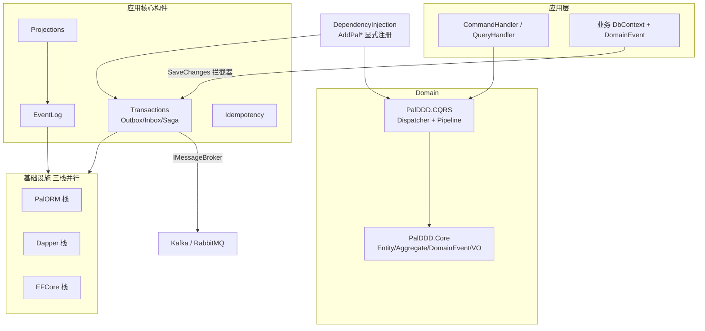

# Pal.DDD 技术审计报告（2026-09-21）

> 方法：只读审计。先系统映射仓库，再按架构/代码/安全/测试/性能/依赖/运维/文档八维取证。
> 标注：`[事实]` = 已打开 file:line 核实；`[判断]` = 基于证据的评估。
> 严重性：**严重** = 数据丢失/安全漏洞/发布错误；**高** = 核心功能失效或采用面阻断；**中** = 真实缺陷但有缓解或需特定条件；**低** = 卫生与一致性。
> 范围说明：仓库约 69k 行 C#（src+test，不含 obj）。深度审查 Core / CQRS / Transactions / DI / CI / 测试网 / 发布链 / 三栈契约；SourceGen 与方言 SQL 实现较浅（依赖既有 ArchitectureBoundaryTests / DialectProbeTests / 既有审计线索交叉验证）。
> 基线：HEAD 附近（`23f0357` 及之后工作区）。审计期间**未修改任何代码**。

---

## 一、执行摘要（≤10 句）

整体健康等级 **B+**。这是工程纪律极强的生产级 NuGet 框架库：37 个 src 项目依赖图无环、TreatWarningsAsErrors 全绿、机械守卫（源码扫描/门禁变异自证/AOT 实跑）密度罕见，且 2026-09-20 审计后的 22 项修复已大部分落地。失分不在防守体系，而在四处结构性负债：**① CI 对 .ai 门禁与若干本地守卫的“恒假分支”**（encoding/tech-debt/test-gate 等在 fresh checkout 永不运行）；**② 三栈持久化契约分叉 + Saga 反射特例**使“零反射 / AOT 一等公民”卖点存在可文档化的例外面；**③ 发布供应链未闭合**（长期 `NUGET_API_KEY`、无包签名/OIDC、无 `packages.lock.json`、NU19xx 全局静音）；**④ 公共 SQL 面“值参数化、标识符裸拼”与错误分类器×N**，使 CA2100“无注入”承诺过宽。前 3 风险：CI 门禁可被 `--no-verify` 与死分支绕过；采用面被 net11 RC 单目标与 AGPL 策略双重约束；PalORM 战略栈押在低采用度外部包上。前 3 机会：把本地门禁真正接入 CI；一天内清掉版本/许可/架构清单口径矛盾与 v3.0 Obsolete 缺口；用锁文件 + 包签名闭合发布链。**无严重级安全发现**（受跟踪文件零硬编码真实凭据；本地未跟踪配置含真实形态口令但已 ignore）。

---

## 二、仓库地图

### 2.1 定位

| 项 | 结论 |
|---|---|
| 用途 | DDD / CQRS / Event Sourcing 基础设施**框架库**（35 个自有 NuGet 包 + 依赖 PalORM 引擎 5 包） |
| 预期用户 | 构建 DDD 应用的 .NET 后端团队；非终端产品 |
| 成熟度 | **生产级库**：`v3.0.0` 已 tag（`Directory.Build.props:60`、CHANGELOG 头），24+ ADR，密集评审-修复循环 |
| 语言/运行时 | C# `latest`，**单目标 `net11.0`**，SDK 钉 `11.0.100-rc.1.26425.128` + `allowPrerelease` + `rollForward: latestMajor`（`global.json:3-5`） |
| 硬约束 | Native AOT 全链路、生产代码零反射（有声明例外）、`TreatWarningsAsErrors`、`AnalysisLevel=latest-all`、`JsonSerializerIsReflectionEnabledByDefault=false` |

### 2.2 技术栈

- 构建：.NET 11 RC1 SDK · Central Package Management（`Directory.Packages.props`）· `PalDDD.slnx`
- 测试：**TUnit + Microsoft.Testing.Platform**（非 xUnit）· FsCheck · Verify · Testcontainers（PG/MySQL/Kafka/Rabbit）· BenchmarkDotNet（bench，非门禁）
- 持久化三栈：EF Core 11 RC1 / Dapper 2.1.86+Dapper.AOT 1.1.0 / PalORM 5.5.1（外部包）
- 消息：Confluent.Kafka 2.15.1 · RabbitMQ.Client 7.2.2
- 序列化：MemoryPack 1.21.4 · STJ（关默认反射）· Evolution
- 诊断：ActivitySource + Metrics（`PalDiagnostics.cs`）· ZLogger
- 许可：**AGPL-3.0-or-later**（`Directory.Build.props:63`；2026-09-19 用户裁决维持社区策略）

### 2.3 架构草图

### 2.4 关键目录（一行描述）

| 目录 | 描述 |
|---|---|
| `src/PalDDD.Core` | 零项目引用领域内核（Entity/DomainEvent/VO/Spec/UoW） |
| `src/PalDDD.CQRS` | DIM 桥接分发器 + PipelineStateMachine（零 MakeGenericType） |
| `src/PalDDD.DependencyInjection` | `AddPalDDD` / `AddPalCommandHandler` 等显式 DI 入口 |
| `src/PalDDD.Transactions` | Outbox/Inbox/Saga 四车道编排（Saga.cs 963 行，复杂度热点） |
| `src/PalDDD.*.EFCore` | EF 适配（EventLog Hi/Lo、Outbox/Inbox/Saga Context、Repository UoW） |
| `src/PalDDD.Dapper*` | Dapper 统一持久化 + 三方言增强 |
| `src/PalDDD.PalORM*` | 战略 AOT 栈（源生成微 ORM）+ 三方言 |
| `src/PalDDD.Messaging*` | Broker 抽象 + Kafka/RabbitMQ |
| `src/PalDDD.Analyzers*` / `Core.SourceGen` | 38 条编译期诊断 + 强类型 ID/消息注册生成 |
| `scripts/`（32 个 file-based app） | 门禁/守卫/审计工具（secret-scan、gate-audit、vuln-scan…） |
| `.githooks/` | 7 道 pre-commit + pre-push gate-lite |
| `.github/workflows/` | ci（4 job）/ release / codeql |
| `test/`（16 测试 + 1 支持库） | TUnit，约 1358 `[Test]` + 201 `[Arguments]` |
| `docs/` | conventions/architecture/aot/testing/release + decisions(ADR) + review(审计史) |
| `samples/` | AotSample / PalOrmSample（CI AOT 载体）/ ECommerce / MinimalApi |
| `bench/` | BenchmarkDotNet（人工，不进 CI） |

### 2.5 令人惊讶之处

1. **防线密度高于部分产品模块**：`SourceCodeGuardTests` 用内联坏样本证明正则能红；`gate-audit.cs` 隔离式变异探针——“验证验证者”被工程化。
2. **“诚实声明替代修复”模式系统性存在**：Saga 反射、Outbox 原子性窗口、Rabbit at-most-once 等均以长注释声明而非消灭（注释质量极高，但形成豁免文化）。
3. **同一 Store 契约三栈语义分叉**：`SaveChangesAsync` EF=批量提交、Dapper/PalORM=no-op（`OutboxStore.cs:85-92`）；`MarkProcessed` fencing 三栈不一致（`OutboxStore.cs:15-57` Remarks 自认，原计划 v3.0 统一，后与退役解绑）。
4. **CI 存在恒假分支**：`.ai` 不入 git（`.gitignore:68`）⇒ `ci.yml` 中 `if [ -d .ai/scripts ]` 在 CI **恒假**，encoding-gate/tech-debt/test-gate/template-gate 从不自动跑（`ci.yml:132-138` F-04 已声明）。

### 2.6 惯例文化（推荐须对齐）

- 命名：`PalDDD.<能力>.<适配器>`；框架接口 `IPal*`；DI `AddPal*`；消息名 lowercase-kebab
- 默认 `sealed class`；值对象 `readonly record struct`
- 错误处理：入口 `ThrowIfNull*`；持久化失败 `FailureReason.Normalize`；次要失败挂 `ex.Data[...]` 不掩盖根因；CA1031 逐点 Justification
- 注释：声明式长注释 + ITM/ADR/PD 编号追溯
- 门禁：新增脚本须 `--selftest` + 变异可红 + gate-audit 归类（TOOL/UNWIRED-GATE）
- 提交：中文 `类型：描述`（修复/测试/文档/构建/决策/…）

---

## 三、审计报告

> 格式：**(a) 发现 (b) 位置 (c) 后果 (d) 严重性 (e) 类型**。按维度、严重性降序。

### 3.1 架构与设计

**A1 [高] Saga ChildSaga 路径运行时反射——与“零反射”红线及 README AOT 叙事冲突（已标注例外）**
(a) ChildSaga 编排经 `MakeGenericMethod` / `Activator.CreateInstance` / `MakeGenericType(ValueTask<>)` 完成动态派发与状态构造。
(b) `src/PalDDD.Transactions/Saga/Saga.cs:641-653`、`src/PalDDD.Transactions/Saga/DefaultSagaManager.cs:216-228`；项目层 `IsAotCompatible=false`（`PalDDD.Transactions.csproj:9`）。
(c) 使用 ChildSaga 的应用无法走完整 Native AOT；与 README“零反射命令分发 / AOT 一等公民”并列时，消费者容易误以为全特性 AOT 安全。`SourceCodeGuardTests` 对该点有豁免登记，故不会被机械门禁拦下。
(d) 高　(e) `[事实]`

**A2 [高] 三栈持久化契约语义分叉，姊妹维护成本是已发生现金流**
(a) 同一 `IPalOutboxStore` 下：`MarkProcessed` 对未租约消息三栈行为不一致（PalORM/Dapper 放行 vs InMemory 拒绝）；`SaveChangesAsync` 语义三栈不同（EF 提交 vs Dapper/PalORM no-op）。
(b) `src/PalDDD.Transactions/Outbox/OutboxStore.cs:15-57`（Remarks）、`:82-92`；`docs/decisions/020-persistence-stack-retirement-roadmap.md`（姊妹修复 40+ 轮）。
(c) 跨栈换实现时一致性语义静默变化；fencing 弱栈在并发下可能漏处理或重复处理；每次缺陷修复需三栈同步，回归面 ×3。
(d) 高　(e) `[事实]`（契约分叉）+ `[判断]`（并发后果依赖调用形状）

**A3 [中] `Saga.cs` 神对象：编排/重试/补偿/四车道/反射派发集中于单文件**
(a) 类型承担 When 注册、Normal/FanOut/ChildSaga/Interrupt/Dynamic 五类步骤、重试泳道、补偿键记录与 Manager 协作。
(b) `src/PalDDD.Transactions/Saga/Saga.cs`（963 行）；同目录 `SagaCompensation`/`FanOutStep`/`SagaTimeoutDetector` 已抽出但仍依赖本文件。
(c) 失败模式（如 Dynamic 补偿键、ChildSaga 反射）集中在同一处，评审成本高、变更风险高。
(d) 中　(e) `[事实]`（行数/职责）+ `[判断]`（神对象定性）

**A4 [中] `AddPalFullStack` 名不副实（自声明）**
(a) API 名暗示“全栈”，实现等价 `AddPalCoreStack`，不注册任何持久化/消息适配器。
(b) `src/PalDDD.DependencyInjection/ServiceRegistration.cs:70-76`（自声明“名不副实”）。
(c) 新用户按名选型会误判已接入 Outbox/Store；排障时“注册了 FullStack 却什么都没有”浪费时间。
(d) 中　(e) `[事实]`

**A5 [中] Handler 冻结依赖 `IHostedService`，裸 `BuildServiceProvider` 静默缺 handler**
(a) `HandlerRegistrar` 仅在 `IHost` 生命周期内把 marker 拷入 `Dispatcher` 并 `Freeze()`。
(b) `src/PalDDD.DependencyInjection/ServiceRegistration.cs:410-435`。
(c) 单测/脚本若直接 `BuildServiceProvider` 且未手动 Register/Freeze，运行期 `HandlerNotFound`——文档不足时像框架 bug。
(d) 中　(e) `[事实]`

**A6 [中] Outbox 与业务数据“同事务”存在已声明的原子性窗口**
(a) 领域事件在 `SavingChanges` 注入 Outbox 行；若外层 `Commit` 失败，事件可能已被 `ClearDomainEvents` 清掉。
(b) `src/PalDDD.Repository.EFCore/OutboxDomainEventInterceptor.cs:20-23,48-52`。
(c) 极端失败路径下领域事件丢失且无 Outbox 行——与“可靠 Outbox”叙事存在可测的不一致窗口。
(d) 中（有声明）　(e) `[事实]`

**A7 [低] 跨层 `InternalsVisibleTo` 弱化封装**
(a) Core/CQRS/Messaging → DI；EventLog/Idempotency → Dapper/PalORM/EFCore。
(b) 各 `*.csproj` InternalsVisibleTo 项。
(c) “internal 契约”对适配器全开，重构 internal 时影响面大于预期。
(d) 低　(e) `[事实]`

### 3.2 代码质量

**C1 [中] v3.0 兑现缺口：Obsolete 消息写“v3.0 移除”，但 3.0.0 已发布且类型仍在**
(a) `DomainCapabilityAttribute`、`AggregateNameAttribute`、`SqlServerOutboxDbContext` 标注 `[Obsolete("…——v3.0 移除…")]`，`VersionPrefix=3.0.0` 且 tag `v3.0.0` 已存在，类型仍可编译引用。
(b) `src/PalDDD.Core/Attributes.cs:93,128`；`src/PalDDD.Transactions.EFCore/SqlServerOutboxDbContext.cs:11`；`Directory.Build.props:60`；`CHANGELOG.md` 头（3.0.0 已发布）。
(c) 消费者信 Obsolete 文案会以为 v3.0 已无这些 API；要么 3.0.0 违背自己的废弃计划，要么文案过时——两者都伤可信度。`tech-debt.cs` 对 Obsolete 残留仅 WARN。
(d) 中　(e) `[事实]`

**C2 [中] 复杂度热点集中且可测性依赖巨型测试文件**
(a) `Saga.cs` 963、`IdentityGenerator.cs` 863、`PostgreSqlMultiHost.cs` 625、`ServiceRegistration.cs` 466；测试侧 `TransactionsTests.cs` 1845、`DapperStoreTests.cs` 1385、`ArchitectureBoundaryTests.cs` 1297。
(b) `src/PalDDD.Transactions/Saga/Saga.cs`；`src/PalDDD.Core.SourceGen/IdentityGenerator.cs`；`src/PalDDD.DependencyInjection/ServiceRegistration.cs`；`test/PalDDD.Transactions.Tests/TransactionsTests.cs` 等。
(c) 变更局部性差；巨型测试文件失败定位成本高；与 A3 叠加使 Saga 领域成为最高风险变更区。
(d) 中　(e) `[事实]`

**C3 [低] 生产代码同步阻塞异步（有文档豁免）**
(a) PalORM 三方言 DI 工厂与部分 Store 同步 API 用 `GetAwaiter().GetResult()` 包装异步 session。
(b) `src/PalDDD.PalORM.Sqlite/SqlitePalOrmExtensions.cs:76,160`；`PostgreSqlPalOrmExtensions.cs:65,148`；`MySqlPalOrmExtensions.cs:64,147`；`src/PalDDD.PalORM/Stores/PalOrmOutboxStore.cs:160,196-310`（多处）。
(c) 注释已写“仅 Scoped 解析/非热路径”；在同步上下文宿主或高并发 scoped 创建下仍有死锁/吞吐风险。`SourceCodeGuardTests` 对 PalORM 路径有白名单。
(d) 低–中　(e) `[事实]`

**C4 [中] `IsUniqueConstraintViolation` 同形分类器复制 6+ 份**
(a) 约 40 行的唯一约束冲突判定在多个 DbContext/Store/分类器中复制（Inbox/Idempotency/EventLog/ProjectionCheckpoint/EventLogPositionReserver + Dapper/PalORM SqlErrorClassifier）。
(b) `src/PalDDD.Transactions.EFCore/InboxDbContext.cs:277`、`src/PalDDD.Idempotency.EFCore/IdempotencyDbContext.cs:249`、`src/PalDDD.EventLog.EFCore/EventLogDbContext.cs:383`、`src/PalDDD.Projections.EFCore/ProjectionCheckpointDbContext.cs:353`、`src/PalDDD.EventLog.EFCore/EventLogPositionReserver.cs:296`、`src/PalDDD.Dapper/DapperSqlErrorClassifier.cs:22`、`src/PalDDD.PalORM/Stores/SqlErrorClassifier.cs:25`（ITM-796 注释自承五份同形）。
(c) 新方言错误码需 N 处同步；误分类会把数据错误变成无限并发重试（历史上已修过一次）。
(d) 中　(e) `[事实]`

**C5 [中] EventLog 批量追加 N+1 往返**
(a) `DapperEventLog` 批量 append 对每事件一次 INSERT；PalORM 侧 BulkInsert 因 GlobalPosition 保序限制无法直接替代。
(b) `src/PalDDD.Dapper/DapperEventLog.cs:116-147`；`src/PalDDD.PalORM/Stores/PalOrmEventLog.cs:97`。
(c) 事件溯源写路径延迟随批次线性增长，与“性能契约”叙事不符。
(d) 中　(e) `[事实]`

**C6 [中] HTTP 端点默认无限流/请求体上限**
(a) `MapCommand`/`MapQuery` 仅 null/JSON/校验异常 → 400；注释要求宿主自行配置限流与 body 限制。
(b) `src/PalDDD.Hosting.AspNetCore/EndpointExtensions.cs:16-18`。
(c) 样例被复制到生产即存在请求体 DoS 面。
(d) 中（库边界可接受）　(e) `[事实]` + `[判断]`

**C7 [低] 空 catch 大多有注释，无裸吞异常文化问题**
(a) 全仓空 catch 约 20+ 处，几乎全是清理/释放失败不掩盖根因的受控模式。
(b) 如 `src/PalDDD.Dapper.PostgreSql/PostgreSqlReadWriteRouter.cs:268`、`src/PalDDD.Transactions/PeriodicBackgroundProcessor.cs:85`。
(c) 当前可接受；无需专项清理。
(d) 低（优势面）　(e) `[事实]`

### 3.3 安全

**S1 [高] 发布凭据与供应链未闭合**
(a) 发布用长期 `NUGET_API_KEY`（job 级 env，覆盖 build/test 全步骤）；无 `dotnet nuget sign`、无 NuGet Trusted Publishing（OIDC）。`workflow_dispatch` 可跳过“CI success 前置检查”。
(b) `.github/workflows/release.yml:31-33,77-96,156-163`；`docs/release.md:384`（365 天 key）。
(c) 密钥泄露面大于发布步骤所需；包可被投毒/替换而无签名锚点；手动 dispatch 路径弱化“tag 即验证”。
(d) 高　(e) `[事实]`

**S2 [中] 全局抑制 NuGet 漏洞告警 NU1900–1904 + NU5104**
(a) `Directory.Build.props:45` 全局 NoWarn；补偿控制是 CI `scripts/vuln-scan.cs`（`ci.yml:57-61`）。
(b) `Directory.Build.props:41-42,45`。
(c) 构建器本地看不到漏洞告警；若 vuln-scan 规则集落后或被跳过，过时 CVE 依赖可静默进入。注释称“已手动审计”，不可机械复核。
(d) 中　(e) `[事实]`

**S3 [中] 许可证表达式与依赖组件不完全自洽（社区策略已裁决）**
(a) 主包 `AGPL-3.0-or-later`；PalORM.* nuspec 为 `AGPL-3.0-only`（历史审计核实）；`docs/design/palorm-architecture.md:1273,1429` 仍写 **MIT**。
(b) `Directory.Build.props:63`；`docs/design/palorm-architecture.md:1273`。
(c) 包元数据 “or-later” 对合并 “only” 组件承诺过宽；设计文档 MIT 与仓库 AGPL 矛盾，误导采用方合规判断。2026-09-19 已裁决维持 AGPL 社区策略——属**采用面约束**而非实现缺陷。
(d) 中（采用面）　(e) `[事实]` + `[判断]`（法律后果）

**S4 [低] 本地未跟踪文件含真实形态口令（卫生正确，风险在人为失误）**
(a) `appsettings.test.local.json` 含内网主机与 `Password=…` 形态值；已被 `.gitignore:97` 覆盖（`git check-ignore` 确认）。secret-scan 设计上不扫未跟踪文件。
(b) `appsettings.test.local.json`（磁盘）；`scripts/secret-scan.cs:51-82`；`.gitignore:97`。
(c) 一次 `git add -f` 或改错 ignore 规则即真实泄露。
(d) 低　(e) `[事实]`

**S5 [优势] 受跟踪文件零高置信硬编码凭据**
(a) secret-scan CI+pre-commit 双接线，selftest 16 例含负向对照；placeholder `guest/test` 按白名单放行。
(b) `scripts/secret-scan.cs`；`ci.yml:142-148`；`.githooks/pre-commit`。
(c) 无严重级密钥泄露发现。
(d) —　(e) `[事实]`

**S6 [中] 公共 SQL API 的标识符/子句拼接：值参数化、标识符不转义**
(a) `DapperBulkCopy` 用插值拼表名/列名/占位符；`PostgreSqlSoftDelete` 接受原始 `whereClause`/`indexedColumns`。值侧参数化；标识符侧无转义（对比 `PostgreSqlSoftDelete.Escape:110`）。当前仓内调用是硬编码表名，**低可利用性**，但作为公共 API 契约是经典注入脚枪。CA2100 全局抑制所称“无字符串拼接注入风险”**过宽**。
(b) `src/PalDDD.Dapper/DapperBulkCopy.cs:139,355`；`src/PalDDD.Dapper.PostgreSql/PostgreSqlSoftDelete.cs:37-48,86-92`；`Directory.Build.props:28`。
(c) 下游把用户配置/动态表名映射进 `tableName`/`whereClause` 即可形成 SQLi；与“零拼接注入”文档承诺矛盾。
(d) 中　(e) `[事实]` + `[判断]`（可利用性取决于调用方）

**S7 [中] MySQL Bulk 路径强制 `AllowLoadLocalInfile=True`**
(a) BulkCopy 性能路径要求客户端 LOCAL INFILE。
(b) `src/PalDDD.Dapper/DapperBulkCopy.cs:223-231`。
(c) LOCAL INFILE 协议可被恶意/被攻破的 MySQL 服务端索要**客户端本地文件**；对不可信 DB 端点扩大攻击面。
(d) 中　(e) `[事实]` + `[判断]`（威胁模型相关）

**S8 [优势] 注入面控制整体良好（有 S6 例外）**
(a) 值路径 SqlTemplates + `@params` / PalORM `FormattableString`；dispatch 输入 env 间接化；仓内无 `Process.Start`/`BinaryFormatter`。
(b) `src/PalDDD.Dapper/SqlTemplates.cs`；`src/PalDDD.PalORM/Stores/PalOrmOutboxStore.cs:195`；`release.yml:42-50`。
(d) —　(e) `[事实]`

### 3.4 测试

**T1 [高] 覆盖率门禁对“薄模块”几乎无约束力，关键适配器线覆盖率过低**
(a) 单模块基线：`PalDDD.Core.Abstractions.Tests` **1.32%**、`PalDDD.Repository.EFCore.Tests` **8.1%**、`DependencyInjection.Tests` **15.11%**、`Messaging.Tests` **21.79%**、`Core.Tests` **30.9%**（`coverage-baseline.json`）。全局阈值 0.70 是并集行率，可被大项目高覆盖稀释。
(b) `coverage-baseline.json` 全文；`scripts/ci-coverage.cs`（阈值 0.70 + 5pp 降幅）。
(c) 回归可发生在基线极低的模块且降幅门禁仍绿；“70% 覆盖”叙事对这些模块失真。注意：键是**测试项目插桩行率**，易被误读为产品模块覆盖率。
(d) 高　(e) `[事实]`

**T2 [中] `PalDDD.PalORM.Tests` 不在 coverage 降幅基线中**
(a) `coverage-baseline.json` 15 键缺 PalORM；文档承认无 Docker 时无 cobertura、降幅不受检。
(b) `coverage-baseline.json`；`docs/test-coverage-baseline.md`。
(c) 战略 AOT 栈的多方言 Store 无 5pp 棘轮保护——正是方言 SQL 最容易静默分叉的地方。
(d) 中　(e) `[事实]`

**T3 [中] 金字塔顶层缺失：无自动化 E2E / 压测 / 性能回归门禁**
(a) `docs/testing.md` 金字塔含 stress/Testcontainers/100K·1M，但仓内无 `*Stress*`/`*Load*` 用例；bench 不进 CI；无消费方契约测试。
(b) `docs/testing.md:36-64,360-384`；`bench/`；`ci.yml` 无 perf job。
(c) 性能退化与跨组件集成回归只靠人工 SOP；对“性能契约工程化”卖点缺机械证据链。
(d) 中　(e) `[事实]`

**T4 [中] 墙钟等待构成 flaky 主表面**
(a) `Task.Delay` 轮询/`WhenAny(..., Delay(3s))`/Broker 15–120s 切片等待。
(b) `test/.../OutboxProcessorTests.cs:84,153`；`SagaProcessorTests.cs:136,177`；`FanOutStepTests.cs:29,120`；`BrokerIntegrationTests.cs:353-396`。
(c) 慢 runner 上假红；已有 FakeTimeProvider、CTS 5s 上界、Skip.Test 缓解，但墙钟耦合仍在。
(d) 中　(e) `[事实]`

**T5 [中] 本地守卫可 `--no-verify` 绕过，且 test-change-guard 无 CI 双跑**
(a) pre-commit 7 门本地执行；CI 不跑 encoding-gate/tech-debt/test-gate（死 `.ai` 分支）；`git commit --no-verify` 合法跳过。
(b) `.githooks/pre-commit`；`ci.yml:132-138,167-193`；`AGENTS.md` §2。
(c) 单人仓库/紧急修复路径上，编码门禁与测试篡改门禁可被静默跳过且主干无补偿扫描。
(d) 中　(e) `[事实]`

**T6 [优势] 测试文化与守卫测试质量高**
(a) ~1358 `[Test]`；`ArchitectureBoundaryTests`、`SourceCodeGuardTests`（坏样本红测）、`AotContractTests`、`AssertionStrengthGateTests`、FsCheck/Verify、方言探针、AOT publish+run。
(b) `test/PalDDD.Core.Tests/SourceCodeGuardTests.cs`；`test/PalDDD.DependencyInjection.Tests/ArchitectureBoundaryTests.cs`；`ci.yml:204-248`。
(c) 防止“改测试刷绿”与架构漂移的能力显著高于同规模开源库。
(d) —　(e) `[事实]`

### 3.5 性能

**P1 [中] PalORM 同步包装异步（见 C3）**——DI 工厂与 Outbox Store 多点 `GetAwaiter().GetResult()`。热路径注释声称非热，但缺基准固化。
(b) `src/PalDDD.PalORM/Stores/PalOrmOutboxStore.cs:160-310` 等。
(d) 中　(e) `[事实]`

**P2 [低] `ISpecification.IsSatisfiedBy` 走 `Expression.Compile()`**
(a) 仅该成员非 AOT；`ToExpression` 路径安全。
(b) `src/PalDDD.Core/ISpecification.cs:55-57`（ITM-225 声明）。
(c) AOT 应用误用 `IsSatisfiedBy` 会在运行时失败。
(d) 低　(e) `[事实]`

**P3 [优势] 零分配/低分配设计有测试锚点**
(a) ValueTask 同步完成路径、`DomainEventEnumerable` ref struct、`PipelineStateMachine`、分配契约测试。
(b) README 性能节；`AllocationContractTests`；`docs/performance.md`。
(d) —　(e) `[事实]`

### 3.6 依赖

**D1 [中] 无 `packages.lock.json`，还原不可复现**
(a) 全仓无锁文件；`RestorePackagesWithLockFile`/`--locked-mode` 未启用。叠加 `rollForward: latestMajor` + `allowPrerelease`。
(b) 全仓搜索零命中；`global.json:3-5`。
(c) 同一 commit 在不同日期 restore 可能解析不同传递依赖；与 NU19xx 抑制叠加时漏洞面漂移不可见。
(d) 中　(e) `[事实]`

**D2 [中] 运行时/依赖预发布：net11 RC1 单目标是采用阻断（有意）**
(a) TFM 仅 `net11.0`；微软包 `11.0.0-rc.1.*`；NU5104 抑制“稳定包含预发布依赖”。
(b) `Directory.Build.props:5,42,45`；`Directory.Packages.props:3-27`；`global.json`。
(c) .NET 11 GA 前，外部 net8/net9/net10 项目无法直接引用。属战略选择（ADR-005/013），非缺陷，但是采用面事实。
(d) 中（采用面）　(e) `[事实]`

**D3 [中] 战略栈依赖低采用度外部包 PalORM.Core（AGPL-only）**
(a) PalORM 5.5.1 为外部 NuGet；主打“真 AOT”路径的正确性与演进受该包约束；仓内无 fork 预案。
(b) `Directory.Packages.props:43-47`；`docs/decisions/020-…`；历史审计 D2。
(c) 上游停更/破坏性变更会同时打穿战略栈与 AOT 卖点。
(d) 中–高　(e) `[事实]` + `[判断]`（采用度数字来自 nuget 页面，本次未实时抓取）

**D4 [优势] 中央包管理 + 传递钉扎 + dependabot + CodeQL + vuln-scan**
(a) `ManagePackageVersionsCentrally` + `CentralPackageTransitivePinningEnabled`；`.github/dependabot.yml`；`codeql.yml`；CI vuln-scan。
(b) `Directory.Packages.props:5-6` 等。
(d) —　(e) `[事实]`

### 3.7 开发体验与运维

**O1 [高] CI 上多道质量门禁恒假（F-04 已声明的设计取舍）**
(a) `.ai` 不被 git 跟踪 ⇒ CI `if [ -d .ai/scripts ]` 恒假 ⇒ `verify-ai` / `gate` / `encoding-gate` / `tech-debt` / `test-gate` / `template-gate` **从不在 CI 自动执行**。`doc-consistency` 已提出分支外（会跑）。
(b) `.github/workflows/ci.yml:122-201`；`.gitignore:68`。
(c) 防守叙事（“CI 跑 encoding/doc/tech-debt/test-gate”）与机械事实不一致；主干合并可携带本地未跑的违规（尤其 `--no-verify`）。
(d) 高　(e) `[事实]`

**O2 [中] 门禁工具自身可审计性不完整**
(a) `gate-audit` 为本地手动；`flaky-parse`/`changelog-check` 无 `--selftest` 且未接 CI；32 脚本中仅部分带 selftest。
(b) `scripts/gate-audit.cs`、`flaky-parse.cs`、`changelog-check.cs`；`AGENTS.md` §2 新增门禁规程。
(c) “新增门禁必须探针”的规程靠自觉；REVIEW/TOOL 桶漂移无人发现。
(d) 中　(e) `[事实]`

**O3 [中] DX 摩擦：MTP 多项目测试、Docker 必需、预发布 SDK**
(a) `dotnet test` 多项目触发 VSTest 握手 exit 5，CI/本地必须逐项目循环；PalORM/方言测试无 Docker 则失败或 skip；SDK 为 RC。
(b) `ci.yml:75-105`；`docs/development.md:39,44-45`；`global.json`。
(c) 贡献者首次跑通成本高；覆盖率工具需额外 `dotnet tool restore`。
(d) 中　(e) `[事实]`

**O4 [优势] 失败诊断与发布门禁质量高**
(a) `ci-failed-tests.cs` 输出 `::error` 注解；release 要求该 SHA `build-and-test=success`（tag 路径）+ 版本一致 + 35 包计数断言 + `skip-nuget` 显式退出。
(b) `scripts/ci-failed-tests.cs`；`release.yml:59-96,141-184`。
(d) —　(e) `[事实]`

### 3.8 文档

**L1 [中] 许可证文档自相矛盾**
(a) 仓库/README/LICENSE = AGPL-3.0-or-later；`docs/design/palorm-architecture.md` 称 Pal.DDD/PalORM 为 **MIT**。
(b) `README.md:11,919-925`；`docs/design/palorm-architecture.md:1273,1429`。
(c) 采用方与合规审查会读到互相排斥的许可事实。
(d) 中　(e) `[事实]`

**L2 [中] `docs/development.md` CI 模板与真实 `ci.yml` 不符**
(a) 模板使用独立 `integration-tests` job + `--filter "Category=Integration"`；真实 CI 无 `Category` 特性，测试在 `build-and-test` 内循环。
(b) `docs/development.md:92-111` vs `.github/workflows/ci.yml:34-105`。
(c) 新人按文档写下游 CI 会得到空过滤/错误并行模型。
(d) 中　(e) `[事实]`

**L3 [中] 双语/清单口径漂移（可快速清理）**
(a) 英文 README FAQ 仍写 “currently at version **v2.2.0**”；`architecture.md` 仍有“新增组件（**v0.1.0**）”小节且项目表缺 PalORM/Base/Extension/Shared、mermaid 缺 Infra-PalORM；`docs/release.md:6` 状态头仍以 “2.2.0 已发布” 开篇；包计数口径混用 35 包 / 36 csproj / 37 目录；`nupkgs/` 残留 1.1.0/5.1.0 旧产物。
(b) `README.en.md:914`；`docs/architecture.md:5,59-115,127-156`；`docs/release.md:6`；`nupkgs/`。
(c) 外部读者对照双语文档会得到不同版本事实；架构清单不完整影响新人地图。
(d) 中　(e) `[事实]`

**L4 [低] 架构/约定/ADR/CHANGELOG 主体准确且密度高**
(a) `docs/architecture.md` 分层原则与依赖方向正确；conventions 约 1000+ 行；24 份 ADR 含否决方案；CHANGELOG 遵守“转正先于 tag”（3.0.0 已修）；pitfalls SE2 已勘正。
(b) `docs/architecture.md`、`docs/conventions.md`、`docs/decisions/`、`CHANGELOG.md`、`docs/pitfalls.md`。
(c) 文档债务主要在旁路清单/双语 FAQ/旧小节标题，核心叙事可靠。
(d) 低（优势面）　(e) `[事实]`

### 3.9 丑陋部分（最高优先级关注）

1. **CI 门禁恒假分支 + `--no-verify` 无补偿**（O1/T5）——防守体系最大的结构性空洞。
2. **三栈契约分叉 + Saga 反射特例**（A1/A2）——正确性语义与 AOT 卖点的双缝。
3. **发布供应链未闭合**（S1/D1）——长期密钥、无签名、无锁文件、NU19xx 全局静音。
4. **薄模块覆盖率基线过低 + PalORM 无降幅保护**（T1/T2）——全局 0.70 掩盖局部空洞。
5. **公共 SQL 标识符拼接 / LOCAL INFILE / 分类器×N**（S6/S7/C4）——“无注入”承诺过宽，错误分类易碎。
6. **v3.0 废弃文案与现实不符 + 许可/版本双语口径矛盾**（C1/L1/L3）——可信度直接可见的破口。

### 3.10 优势（决定保留什么）

- 无环分层、显式 DI、无 `IRepository<T>` / 无装配扫描——抽象克制。
- 零反射红线的**机械**守卫（`SourceCodeGuardTests` 坏样本红测）+ 例外点显式 `RequiresDynamicCode`。
- `gate-audit` 隔离变异探针：见过仪器拒绝坏输入。
- AOT `PublishAot` + **运行二进制**（PalOrmSample + AotSample）进 CI。
- 错误处理文化：不掩盖根因、OCE 语义、终态写用 `CancellationToken.None`。
- 测试金字塔中层扎实：架构边界、公共 API 快照、分配契约、方言探针、FsCheck。
- 发布链已有 CI 前置、版本对齐、包数断言、dependabot、CodeQL。
- 文档/ADR/审计史完整，问题常“已声明”而非隐藏。

---

## 四、改进策略

### 主题 1：让“声明的防线”在 CI 成为机械事实
- **现状**：本地/pre-commit 与 CI 覆盖不一致；`.ai` 分支恒假；多个脚本仅人工。
- **目标**：所有**已宣称接线**的门禁在 PR/主干 CI 必跑；`--no-verify` 有 CI 补偿扫描；gate-audit 探针有定期任务。
- **原则**：门禁可信度 > 门禁数量；优先把已有 selftest 脚本接进 CI，而不是再写新工具。

### 主题 2：收敛持久化契约分叉与 AOT 例外面
- **现状**：三栈姊妹语义；Saga ChildSaga 反射；SaveChanges 语义不一致。
- **目标**：`IPalOutboxStore`/`IUnitOfWork` 跨栈行为规格化（表格 + 共享契约测试）；ChildSaga 提供 AOT 安全工厂路径或明确 “AOT = 无 ChildSaga” 的产品边界。
- **原则**：契约测试锁行为，再改实现；不在未测量前合并栈（ADR-020 已裁决三栈平等）。

### 主题 3：发布与依赖供应链闭合
- **现状**：长期 API key、无签名、无锁文件、NU19xx 抑制。
- **目标**：OIDC Trusted Publishing 或最小步骤密钥 + 包签名；`packages.lock.json` + CI `--locked-mode`；NU 抑制改为窄范围或规则化复审。
- **原则**：可复现构建与可验证产物优先于流程文档。

### 主题 4：把覆盖率从“全局好看”变成“关键路径可证”
- **现状**：全局 0.70；薄模块 1%–15%；PalORM 无降幅基线。
- **目标**：核心路径模块单独阈值；PalORM 入基线；失败路径表征测试（Dynamic/ChildSaga/中断）。
- **原则**：对并发/补偿/恢复路径断言行为，不断言“执行过”。

### 主题 5：采用面叙事诚实一致
- **现状**：AGPL 社区策略已裁决，但 design 文档写 MIT；Obsolete 文案过期；README AOT 与 Saga 例外需并排可见。
- **目标**：许可/TFM/例外面在 README 与 nuspec 单一真相；废弃计划要么兑现要么改期。
- **原则**：文档矛盾比缺失文档更伤信任。

### 明确不修 / 降优先（权衡）

| 不修或暂缓 | 理由 |
|---|---|
| 不引入 `IRepository<T>` / 装配扫描 | 产品哲学正确，已有显式 DI |
| 不合并三栈为单栈 | ADR-020 已裁决三栈平等；合并是产品决策非工程债 |
| 不补企业级可观测全家桶 | 库项目，现有 Activity/Metrics/RecordingLogger 够用 |
| 不强制 mutation testing（Stryker） | 与 TUnit 集成差；已有 AssertionStrength 棘轮 |
| 不追 100% 覆盖 | 投入产出比低；只锁关键路径与失败模式 |
| 不立刻多 TFM | 等 .NET 11 GA 后按 ADR-013 重评，避免双倍测试矩阵 |
| 不把 `.ai` 整包强行入库 | 需产品决策（见开放问题）；可先接无 `.ai` 依赖的 scripts 进 CI |

### “完成”定义（可衡量）

1. CI 在 `encoding-gate` / `tech-debt` / `test-gate` / `doc-consistency` 任一失败时红，且 fresh checkout 必跑（无目录条件）。
2. `dotnet restore --locked-mode` 在 CI 通过；故意改版本矩阵导致红。
3. 发布产物有签名或 OIDC 可信发布；`release.yml` 中无 job 级长期 key（或仅发布步骤注入）。
4. `IPalOutboxStore` 跨栈契约测试全绿，且三栈行为差异表进入 `docs/` 并被测试锁定。
5. `coverage-baseline.json` 含 PalORM；Core.Abstractions / Repository.EFCore 等薄模块基线 ≥ 目标值或显式标注“仅 smoke”。
6. Obsolete 承诺与 `VersionPrefix` 一致（移除或改文案并改 tech-debt 策略）。
7. README 许可/AOT 例外/TFM 三处与 nuspec、ADR 无矛盾。
8. `gate-audit --inventory` 无未归类 REVIEW，且 CI 定期跑探针（或 nightly）。

---

## 五、任务计划

### 里程碑 0 — 安全网（重构前）

| ID | 任务 | 影响文件/区域 | 验收标准 | 工作量 | 风险 | 依赖 |
|---|---|---|---|---|---|---|
| M0-1 | 把无 `.ai` 依赖的门禁接入 CI 分支外 | `ci.yml`、`scripts/encoding-gate.cs`/`tech-debt.cs`/`test-gate.cs` | fresh checkout 上三门禁必跑且可红；矩阵文档更新 | S–M | 低 | 无 |
| M0-2 | PalORM 纳入覆盖率降幅基线 | `coverage-baseline.json`、`ci-coverage.cs`、`docs/test-coverage-baseline.md` | 键存在且故意删测试可触发 5pp 红 | S | 低 | 无 |
| M0-3 | 跨栈 Outbox 契约测试骨架 | `test/`（新契约夹具 + 三栈实现） | 同一套断言跑 InMemory/Dapper/PalORM/EF 行为差异被显式记录 | M | 中 | 无 |
| M0-4 | 锁文件生成 + CI locked-mode | `Directory.Build.props`、各 `packages.lock.json`、`ci.yml` | restore `--locked-mode` 通过；篡改版本红 | M | 中（与 RC 浮动冲突时需钉策略） | 可与 M2-1 并行 |

### 里程碑 1 — 关键修复（安全与正确性）

| ID | 任务 | 影响 | 验收 | 工作量 | 风险 | 依赖 |
|---|---|---|---|---|---|---|
| M1-1 | NuGet 发布链：OIDC 或步骤级密钥 + 包签名评估 | `release.yml`、`docs/release.md` | 非 tag 演练成功；workflow 无 job 级长钥或文档声明残留风险 | M–L | 中 | 无 |
| M1-2 | ChildSaga AOT 路径：工厂注入替代 `Activator.CreateInstance` | `Saga.cs`、`DefaultSagaManager.cs`、公共 API | AOT 样例含 ChildSaga 可 publish+run，或文档/分析器强制“ChildSaga ⇒ 非 AOT” | L | 高（公共 API） | M0-3 |
| M1-3 | Outbox `MarkProcessed`/`SaveChangesAsync` 契约统一或规格化 | `OutboxStore.cs` + 三栈 + 测试 | 契约测试绿；若行为变更则进 CHANGELOG Breaking | L | 高 | M0-3 |
| M1-4 | 清理 v3.0 Obsolete 兑现或改期 | `Attributes.cs`、`SqlServerOutboxDbContext.cs`、`tech-debt.cs`、CHANGELOG | 文案与 VersionPrefix 一致；构建 0 警告 | S | 中（公共 API 删除需 major） | 无 |
| M1-5 | NU19xx 抑制收窄 + 审计记录机械复核 | `Directory.Build.props`、`vuln-scan.cs` | 抑制仅保留有跟踪审计 ID 的项 | S–M | 低 | 无 |

### 里程碑 2 — 高杠杆（让后续工作更容易）

| ID | 任务 | 影响 | 验收 | 工作量 | 风险 | 依赖 |
|---|---|---|---|---|---|---|
| M2-1 | 三栈契约测试扩到 Saga/Inbox/Idempotency | `test/` | 每接口一份行为矩阵测试 | L | 中 | M0-3 |
| M2-2 | 薄模块测试补强（Core.Abstractions / Repository.EFCore / Messaging） | 对应 test 项目 | 基线升到约定阈值或拆分“smoke-only”徽标 | M–L | 低 | M0-2 |
| M2-3 | CI 增补 gate-audit 探针（nightly 或 PR 抽样） | `ci.yml`、`gate-audit.cs` | 探针失败阻断或告警 | S–M | 低 | M0-1 |
| M2-4 | 发展文档 CI 模板与真实 ci.yml 对齐 | `docs/development.md` | 无 `Category=Integration` 幻想；命令可复制运行 | S | 低 | 无 |
| M2-5 | 许可证 + 版本口径单一真相（MIT/AGPL、README.en FAQ、architecture 清单、release 状态头、nupkgs 卫生） | README*.md、architecture.md、release.md、palorm-architecture.md、nupkgs/ | 全仓无冲突许可/版本表述；包计数口径统一 | S | 低 | 无 |
| M2-6 | SQL 标识符 API 加固（BulkCopy/SoftDelete 转义或收窄为 internal+校验） | `DapperBulkCopy.cs`、`PostgreSqlSoftDelete.cs` | 公共 API 不接受任意 SQL 片段或强制 Escape；测试覆盖 | M | 中（公共 API） | 无 |
| M2-7 | 合并 `IsUniqueConstraintViolation` 到共享分类器 | 各 DbContext + SqlErrorClassifier | 单一实现 + 契约测试；姊妹差异有表 | S–M | 中 | 无 |

### 里程碑 3 — 质量与润色

| ID | 任务 | 影响 | 验收 | 工作量 | 风险 | 依赖 |
|---|---|---|---|---|---|---|
| M3-1 | Outbox/Saga 测试去墙钟（FakeTime 注入全覆盖） | `test/Transactions*` | 无 `Task.Delay` 轮询或仅 Testcontainers 等待 | M | 中 | 无 |
| M3-2 | `Saga.cs` 拆分（步骤执行器策略化） | `src/PalDDD.Transactions/Saga/` | 文件 &lt; 400 行级；行为测试不变 | L | 中 | M0-3, M1-2 |
| M3-3 | `ServiceRegistration` 按注册域拆文件 | `DependencyInjection/` | 公共 API 不变 | M | 低 | 无 |
| M3-4 | 性能回归最小门禁（bench 关键指标阈值） | `bench/`、`ci.yml` 或 nightly | 指标回归 &gt;X% 告警 | M | 中 | 无 |
| M3-5 | flaky-parse / changelog-check 补 selftest 并接 SOP | `scripts/` | 有正负例；release SOP 引用可执行命令 | S | 低 | 无 |

### 快速获胜（高影响、S）

1. **M0-1** CI 提出 encoding/tech-debt/test-gate 恒假分支（半天内可验证）。
2. **M2-4** 修 development.md 假模板（1 小时）。
3. **M2-5** 修 palorm-architecture.md “MIT” + README.en FAQ v2.2.0 + release.md 状态头 + architecture v0.1.0 小节（1 小时内）。
4. **M1-4** Obsolete 文案与 3.0 现实对齐（1–2 小时，删除则评估 breaking）。
5. **M0-2** PalORM 进 coverage 基线（1 小时，需一次带 Docker 的本地更新基线）。
6. **M2-7** 抽取唯一约束冲突分类器（半天内可完成纯重构 + 测试）。

### 前 3 任务实现草图

**① M0-1 门禁接入 CI**
- 方法：在 `ci.yml` 的 always-run 段（secret-scan/doc-consistency 同级）增加 `encoding-gate` / `tech-debt` / `test-gate`，删除或改写恒假的 `if [ -d .ai/scripts ]` 对这三门的依赖；保留 `.ai` 特有门禁为 optional。
- 步骤：1) 确认脚本无 `.ai` 路径硬依赖；2) 仿 `doc-consistency` 的 `set -o pipefail` + tee + `ci-failed-tests` 注解；3) `gate-audit.cs` 更新 WIRED 矩阵；4) 对真实仓库跑变异（注释掉 encoding 判定应红）——遵守 AGENTS.md 两步验证。
- 陷阱：管道掩码退出码（ITM-648 五次教训）；`verify-conventions --quick` 与完整版差异；scripts 冷启动拖慢 CI——可放在独立 step 并继续复用 NuGet cache。

**② M0-3 三栈 Outbox 契约测试**
- 方法：定义 `OutboxStoreContractTests` 抽象夹具（租约、MarkProcessed 无租约、MarkDead、ReleaseForRetry、SaveChanges 语义、fencing 过期 token），InMemory/Dapper/Sqlite/PalORM/EF 各一个派生夹具。
- 步骤：1) 先写差异矩阵表（当前行为）；2) 对“期望统一”的条目在矩阵标注 `expected`；3) 失败条目转 Breaking 决策文档（V11）；4) 不改生产代码先锁现状。
- 陷阱：InMemory 与持久化天然异步性不同；SQLite 锁池导致的偶发；勿用墙钟测租约——注入 TimeProvider。

**③ M1-1 发布链加固**
- 方法：优先评估 NuGet Trusted Publishing（OIDC）；短期则把 `NUGET_API_KEY` 收窄到 push 步骤并评估 `dotnet nuget sign`。
- 步骤：1) 非生产包或 `skip-nuget` 演练；2) 权限加 `id-token: write`（若 OIDC）；3) `docs/release.md` §6.4 同步；4) 确认 `workflow_dispatch` 是否仍要跳过 CI 检查并记录例外。
- 陷阱：step-level env 不跨步骤（release.yml:31 已踩坑）；签发证书托管方式；公开预览包勿推生产 feed。

---

## 六、开放问题（需人类决定）

1. **`.ai` 是否纳入版本库？** 纳入则 F-04 恒假分支可复活并强制全量门禁；不纳入则应承认 CI 仅跑主仓 scripts，并降低对外叙事（产品决策）。
2. **Obsolete 类型删除窗口**：`DomainCapability`/`AggregateName`/`SqlServerOutboxDbContext` 是 3.0.0 漏删，还是顺延到 4.0？删除属 breaking。
3. **三栈 `MarkProcessed`/`SaveChangesAsync` 统一语义选型**：以哪一栈为规范（PalORM fencing 最强 vs Dapper 立即写）？影响 Breaking 面。
4. **ChildSaga 的 AOT 产品边界**：承诺“工厂 API 后 AOT 完整”，还是文档明确“ChildSaga 非 AOT 特性”？
5. **PalORM 上游风险预案**：是否维护 fork/镜像或增加适配层厚度？（成本高，需产品优先级）
6. **性能回归门禁的阈值与平台**（Linux CI 机噪声）——多大的回归值得红？
7. **.NET 11 GA 后**：是否清偿 NU 抑制、重评多 TFM、移除 `Microsoft.NETCore.Platforms` preview 钉扎？

---

## 七、浅审区域（诚实声明）

| 区域 | 深度 | 原因 |
|---|---|---|
| Dapper/PalORM 三方言 SQL 全文 | 浅 | 体量大，依赖 DialectProbeTests / 既有审计抽查 |
| Roslyn SourceGen/Analyzers 38 诊断实现 | 中浅 | 有测试网与 ArchitectureBoundary；本次未逐诊断审 |
| Kafka/Rabbit 运行时语义 | 中 | 有集成测试与 at-most-once 声明；未实测 broker |
| NuGet.org 上游包元数据/下载量 | 未实时抓取 | 依赖仓内文档与历史审计记录 |
| `.ai/` 150 文件质量体系 | 未纳入本报告主体 | 焦点是产品库；其 CI 恒假问题已单列 O1 |
| EF FromSqlRaw / 方言 SQL 正确性逐语句审 | 浅 | 依赖 DialectProbeTests 与既有审计；S6 脚枪已单列 |
